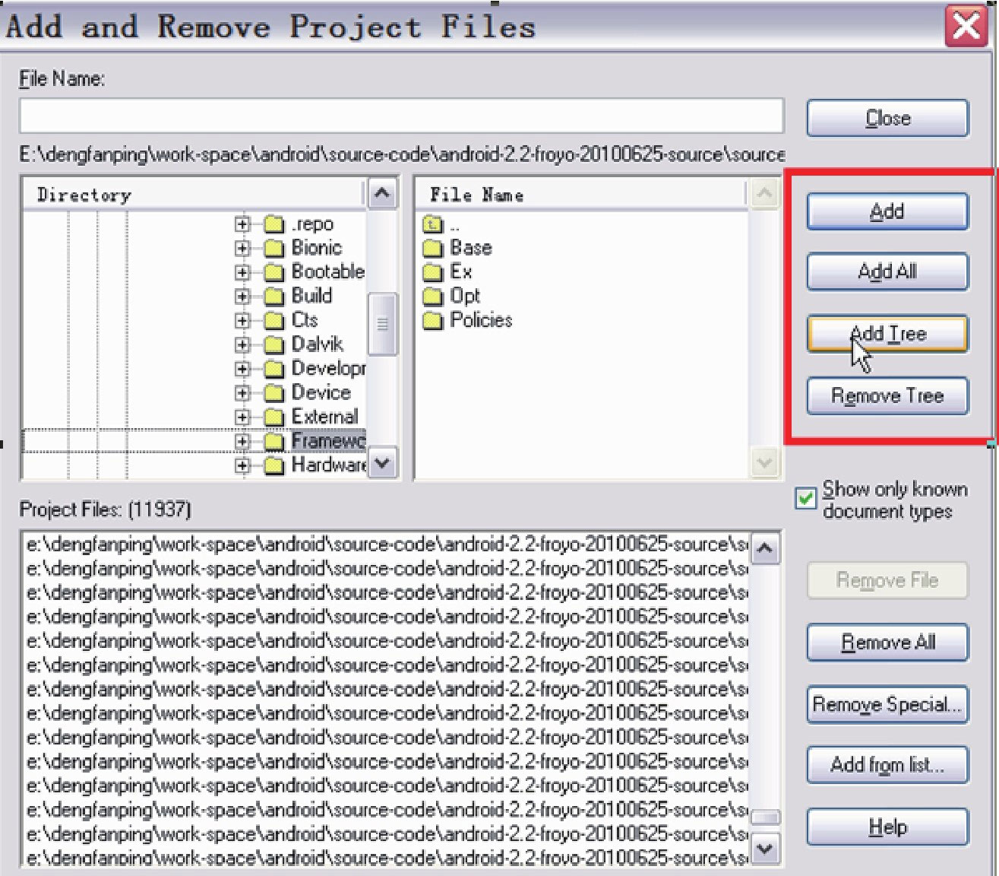
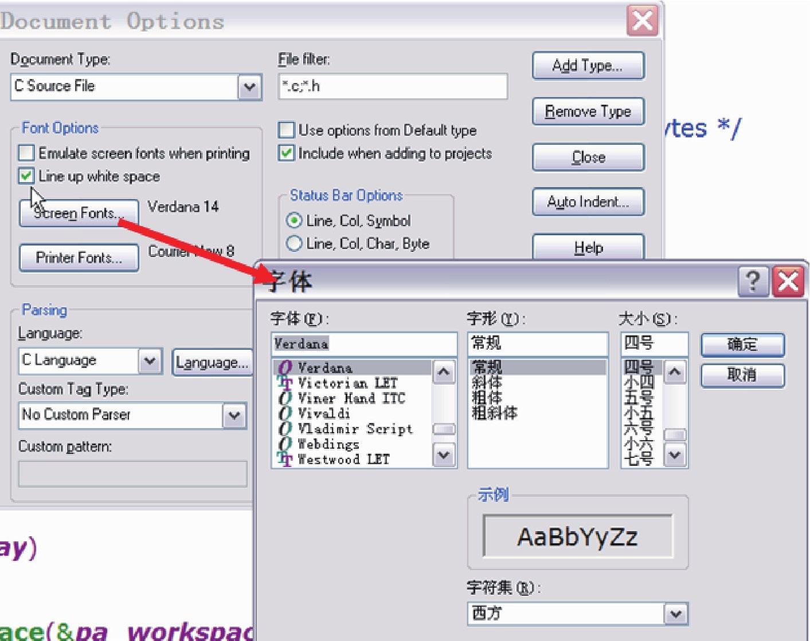
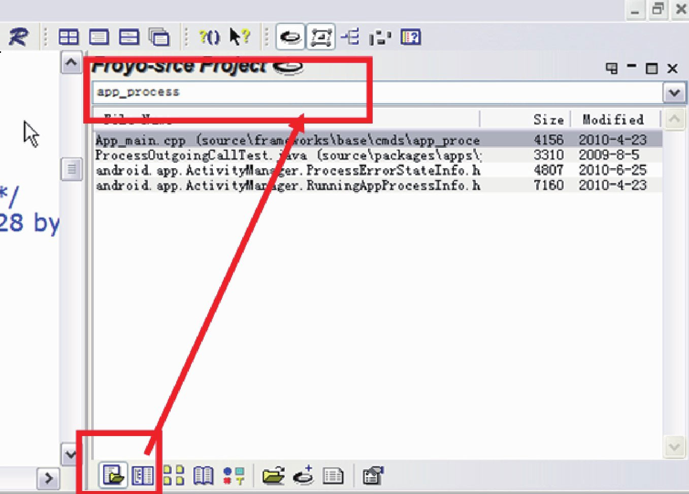

# 1.3.1 Source Insight介绍

SourceInsight是阅读源码的必备工具，它是Windows下的一个软件，在Linux平台上可通过wine安装。这里就不讲述如何安装SourceInsight了，相信读者都会。下面介绍一下SourceInsight的使用小技巧。

1.SourceInsight工作减负使用SourceInsight时，需要新建一个源码工程，通过菜单项Project→NewProject可指定源码的目录。在工作中发现，很多同事常一股脑把所有Android源代码都加到工程中，从而导致SourceInsight运行速度非常慢。实际上，只需要将当前分析的源码目录加到工程中即可。例如，新建一个SourceInsight工程后，只把源码/framework/base目录加进去。另外，当一个目录下的源码分析完后，可以通过Project→AddandRemoveProjectFiles选项把无须再分析的目录从工程中去掉。如图1-7所示：

图1-7添加或删除工程中的目录从图中的框线我们可以发现：SourceInsight支持动态添加或删除目录。通过这种方式可极大减少SourceInsight的工作负担。

注意一般是首先把framework/base下的目录加到工程中，以后如果有需要，再把其他目录加进来。

2.调节字体SourceInsight默认的字体比较小，看着很费眼。怎么办？

依次选择工具栏上的Options→Documentoptions菜单项，会弹出DocumentOptions对话框，其中左上部分有个ScreenFonts按钮，单击后会弹出一个字体对话框，在那里可选择大字体。如图1-8所示。

图1-9快速定位文件图1-8字体调节使用方法是：

3.快速定位文件（1）首先选择图1-8中左下角的那个按钮。

工程建立好后，需通过Project→RebuildP（ro2j）ec然t选后项在来左解上析角源那码个。输另入外框，中在输研入究源源码码文件名，例如app_process，最后结果栏中就会时常常会只记得源码文件名，而不记得是在哪把对应的文件列出。

个目录下。没关系，SourceInsight支持在源码中快速定位文件。使用方法如图1-9所示。
