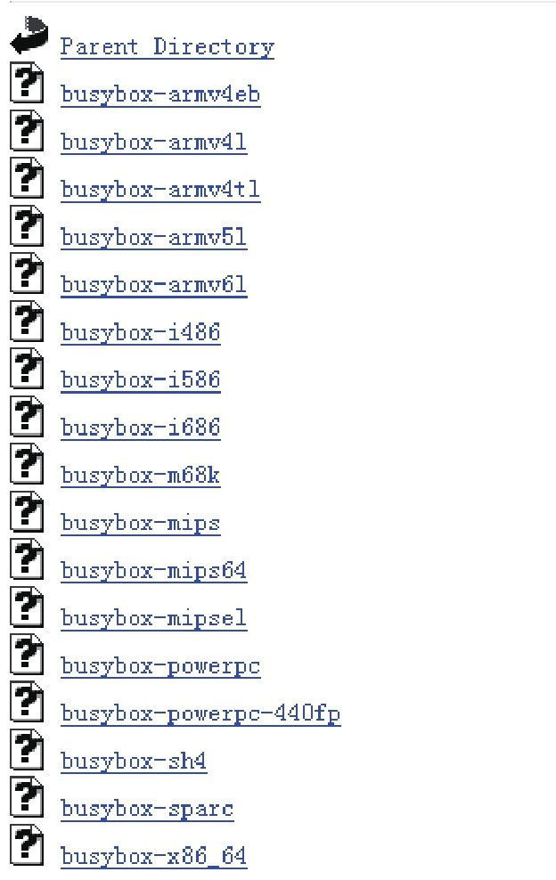
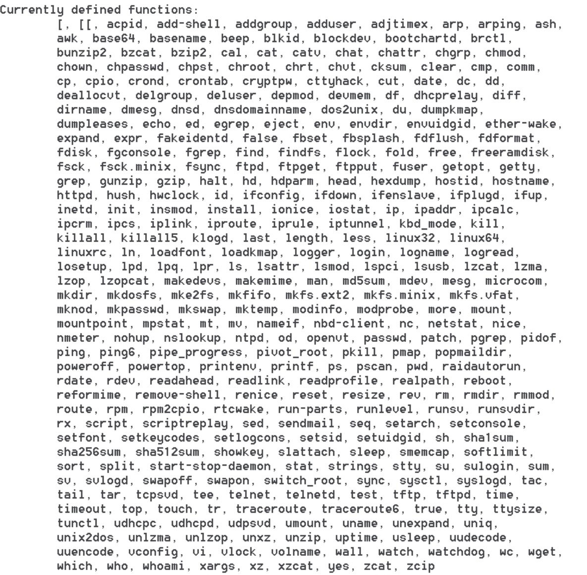

# 1.3.3 Busybox的使用


Busybox号称Linux平台上的“瑞士军刀”​，它提供了很多常用的工具，例如grep和find等。这些工具在标准Linux上都有，但Android系统却去掉了其中的大多数工具。这导致我们在调试程序和研究Android系统时十分不便，所以我们需要在手机上安装Busybox。

1.下载Busybox我们可从下面这个网站中下载已编译好的Busybox：

hp://www.busybox.net/downloas/binaries/1.18.4/图1-10显示了该网站已经根据不同平台编译好的Busybox，我们可根据自己的手机下载对应的文件。例如，HTCG7的CPU支持armv7l，所以我下载了最接近的busybox-armv6l。



图1-10Busybox下载小知识armv7表示的是ARM指令集为v7，目前ARMCortex-A8/A9系列的CPU支持该指令集。

2.安装和使用Busybox下载完Busybox后，需将它push到手机上，具体操作如下：

```
        adb push busybox /system/xbin #为了避免冲突，我push到了/system/xbin目录下了。
        cd /system/xbin        #进入对应目录
        chmod 755 busybox    #更改Busybox权限为可执行
        busybox --install    #安装Busybox
        grep  #执行Busybox提供的grep命令，或者busybox xxx执行xxx命令也行
```

Busybox安装完成后，如果执行busybox命令，就会打印如图1-11的输出。



图1-11Busybox提供的工具从上图中可看出，Busybox提供了不少的工具，这样我们在研究Android系统时就如虎添翼了。

注意给手机安装Busybox须有root权限。
