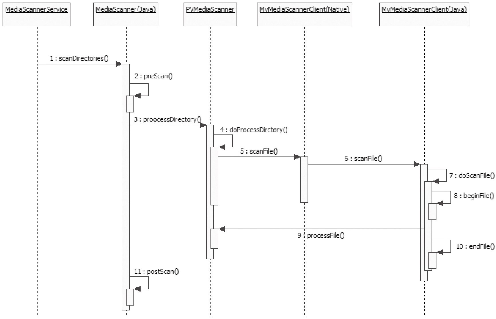

# 10.3.4 关于MediaScanner的总结


10.3.4关于MediaScanner的总结下面总结一下媒体扫描的工作流程，它并不复杂，就是有些绕，如图10-2所示。



图10-2MediaScanner扫描流程图通过上图可以发现，MS扫描的流程还是比较清晰的，就是四渡赤水这一招，让很多初学者摸不着头脑。不过读者千万不要像我当初那样，觉得这是垃圾代码的代表。实际上这是码农有意而为之，在MediaScanner.java中通过

```
        //前面还有一段话，读者可自行阅读。下面是流程的文件总结。
        ＊ In summary:
          ＊ Java MediaScannerService calls
          ＊ Java MediaScanner scanDirectories, which calls
          ＊ Java MediaScanner processDirectory (native method), which calls
          ＊ native MediaScanner processDirectory, which calls
          ＊ native MyMediaScannerClient scanFile, which calls
          ＊ Java MyMediaScannerClient scanFile, which calls
          ＊ Java MediaScannerClient doScanFile, which calls
          ＊ Java MediaScanner processFile (native method), which calls
          ＊ native MediaScanner processFile, which calls
          ＊ native parseMP3, parseMP4, parseMidi, parseOgg or parseWMA, which calls
          ＊ native MyMediaScanner handleStringTag, which calls
          ＊ Java MyMediaScanner handleStringTag.
          ＊ Once MediaScanner processFile returns, an entry is inserted in to the database.
```

一段比较详细的注释，对整个流程做了文字总结，这段总结非常简单，这里就不翻译了。

[--＞MediaScanner.java]看完这么详细的注释，想必你也会认为码农真是故意这么做的。但他们为什么要设计成这样呢？以后会不会改呢？注释中也说明了目前设计的流程是这样，估计以后有可能改。
