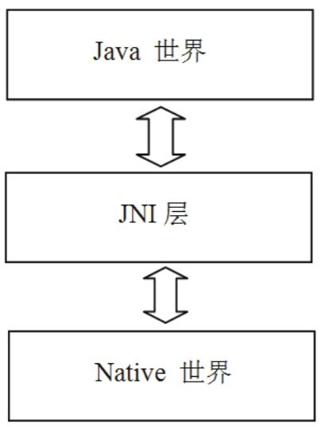

# 2.1 JNI概述

JNI是JavaNativeInterface的缩写，中文译为“Java本地调用”​。通俗地说，JNI是一种技术，通过这种技术可以做到以下两点：

Java程序中的函数可以调用Native语言写的函数，Native一般指的是C/C++编写的函数。

Native程序中的函数可以调用Java层的函数，也就是说在C/C++程序中可以调用Java的函数。

在平台无关的Java中，为什么要创建一个与Native相关的JNI技术呢？这岂不是破坏了Java的平台无关特性吗？JNI技术的推出有以下几个方面的考虑：

承载Java世界的虚拟机是用Native语言写的，而虚拟机又运行在具体的平台上，所以虚拟机本身无法做到平台无关。

然而，有了JNI技术后就可以对Java层屏蔽不同操作系统平台（如Windows和Linux）之间的差异了（例如同样是打开一个文件，Windows上的API使用OpenFile函数，而Linux上的API是open函数）​。这样，就能实现Java本身的平台无关特性。其实Java一直在使用JNI技术，只是我们平时较少用到罢了。

早在Java语言诞生前，很多程序都是用Native语言写的，它们遍布在软件世界的各个角落。Java出世后，它受到了追捧，并迅速得到发展，但仍无法将软件世界彻底改朝换代，于是才有了折中的办法。既然已经有Native模块实现了相关功能，那么在Java中通过JNI技术直接使用它们就行了，免得落下重复制造轮子的坏名声。另外，在一些要求效率和速度的场合还是需要Native语言参与的。

在Android平台上，JNI就是一座将Native世界和Java世界间的天堑变成通途的桥。来看图2-1，它展示了Android平台上JNI所处的位置：

图2-1Android平台中JNI的示意图由上图可知，JNI将Java世界和Native世界紧密地联系在了一起。在Android平台上尽情使用Java的程序员们不要忘了，如果没有JNI的支持，我们将寸步难行！

注意虽然JNI层的代码是用Native语言写的，但本书还是把与JNI相关的模块单独归类到JNI层了。

俗话说，百闻不如一见，下面就来见识一下JNI技术吧。

2.2学习JNI的实例：MediaScanner初次接触JNI，感觉最神奇的就是Java竟然能够调用Native的函数，可它是怎么做到的呢？由于Android大量使用了JNI技术，本章接下来的内容就将通过源码中的一处实例来讲解JNI相关的知识。

其中这个例子是和MediaScanner相关的，本书的最后一章会详细分析它的工作原理，这里先看与JNI相关的部分，如图2-2所示：
