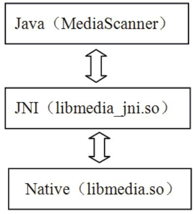

# 2.2 学习JNI的实例：MediaScanner




图2-2MediaScanner和它的JNI将图2-2与图2-1结合来看，可以知道：

Java世界对应的是MediaScanner，而这个MediaScanner类有一些函数需要由Native层来实现。

JNI层对应的是libmedia_jni.so。

media_jni是JNI库的名字，其中，下划线前的“media”是Native层库的名字，这里就是libmedia库。下划线后的“jni”表示它是一个JNI库。注意，JNI库的名字可以随便取，不过Android平台基本上都采用“lib模块名_jni.so”的命名方式。

Native层对应的是libmedia.so，这个库完成了实际的功能。

MediaScanner将通过JNI库libmedia_jni.so和Native层的libmedia.so交互。

从上面的分析中还可知道：JNI层必须实现为动态库的形式，这样Java虚拟机才能加载它并调用它的函数。

下面来看MediaScanner。

提示MediaScanner是Android平台中多媒体系统的重要组成部分，它的功能是扫描媒体文件，得到诸如歌曲时长、歌曲作者等媒体信息，并将它们存入到媒体数据库中，供其他应用程序使用。

```java
        public class MediaScanner
        {
            static { static语句
              /＊
                ①加载对应的JNI库，media_jni是JNI库的名字。在实际加载动态库的时候会将其拓展成
                libmedia_jni.so，在Windows平台上则拓展为media_jni.dll
              ＊/
              System.loadLibrary("media_jni");
              native_init();//调用native_init函数
            }
            .......
            //非native函数
            public void scanDirectories(String[] directories, String volumeName){
              ......
            }

            //②声明一个native函数。native为Java的关键字，表示它将由JNI层完成。
            private static native final void native_init();
            ......
            private native void processFile(String path, String mimeType,
                                              MediaScannerClient client);
            ......
        }
```

2.3Java层的MediaScanner分析先来看MediaScanner（简称MS）的源码，这里将提取出与JNI有关的部分，其代码如下所示：

[--＞MediaScanner.java]
