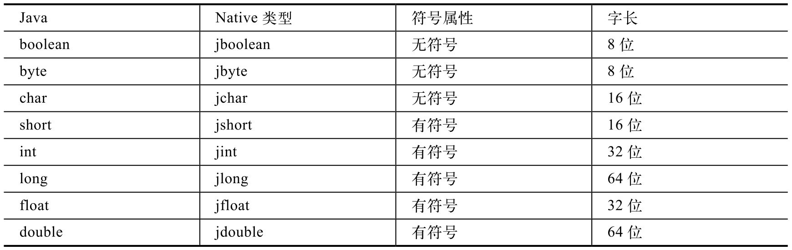
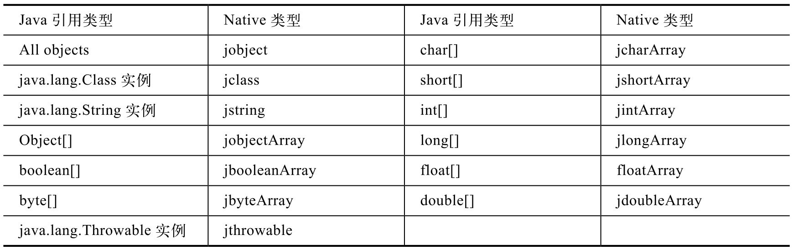

# 2.4.2 数据类型转换


前面的分析解决了JNI函数的注册问题，下面来研究数据类型转换的问题。

在Java中调用native函数传递的参数是Java数据类型，那么这些参数类型到了JNI层会变成什么呢？

Java数据类型分为基本数据类型和引用数据类型两种，JNI层也是区别对待这二者的。先来看基本数据类型的转换。

1.基本数据类型的转换基本数据类型的转换很简单，可用表2-1表示：

表2-1基本数据类型的转换关系表





上由面上列表出可了知J：av除a基了本Ja数va据中类基型本与数JN据I类层型数的据类数型组对、应Cl的as转s、换S关tr系ing，和非T常hr简ow单a。bl不e外过，，其务余必注所意有J转av换a对成象N的ati数ve据类类型型后在对JN应I中数都据用类job型je的ct字表长示。，例如jchar在Native语言中是16位，占两个字节，这和普通的char占一个字节的情况是这一点太让人惊讶了！看看processFile这个完全不一样的。

函数：

接下来看Java引用数据类型的转换。

```
        //Java层processFile有三个参数。
        processFile(String path, String mimeType,MediaScannerClient client);
        //JNI层对应的函数，最后三个参数与processFile的参数对应。
        android_media_MediaScanner_processFile(JNIEnv ＊env, jobject thiz,
                          jstring path, jstring mimeType, jobject client)
```

2.引用数据类型的转换引用数据类型的转换如表2-2所示：

表2-2Java引用数据类型的转换关系表

```
        /＊
        Java中的processFile只有三个参数，为什么JNI层对应的函数会有五个参数呢？第一个参数中的
        JNIEnv是什么？（稍后介绍。）第二个参数jobject代表Java层的MediaScanner对象，它表示是在哪个
        MediaScanner对象上调用的processFile。如果Java层是static函数，那么
        这个参数将是jclass，表示是在调用哪个Java Class的静态函数。
        ＊/
        android_media_MediaScanner_processFile(JNIEnv ＊env,
                            jobject thiz,
                            jstring path, jstring mimeType, jobject client)
```

从上面这段代码中可以发现：

Java的String类型在JNI层对应为jstring类型。

Java的MediaScannerClient类型在JNI层对应为jobject。

如果对象类型都用jobject表示，就好比是Native层的void*类型一样，对“码农”来说，它们是完全透明的。既然是透明的，那该如何使用和操作它们呢？在回答这个问题之前，再来仔细看看上面的android_media_MediaScanner_processFil上面的代码，引出了下面几个小节的主角e函数，代码如下：

JNIEnv。
