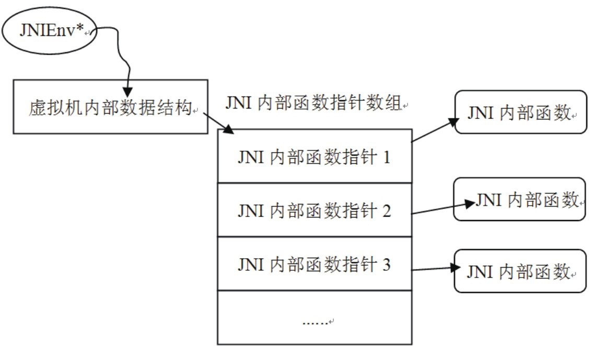

# 2.4.3 JNIEnv介绍


JNIEnv是一个与线程相关的代表JNI环境的结构体，图2-3展示了JNIEnv的内部结构：



图2-3JNIEnv内部结构简图从上图可知，JNIEnv实际上就是提供了一些JNI系统函数。通过这些函数可以做到：

调用Java的函数。

操作jobject对象等很多事情。

后面的小节中将具体介绍如何使用JNIEnv中的函数。这里，先介绍一个关于JNIEnv的重要知识点。

上面提到说JNIEnv是一个与线程相关的变量。也就是说，线程A有一个JNIEnv，线程B有一个JNIEnv。由于线程相关，所以不能在线程B中使用线程A的JNIEnv结构体。读者可能会问，JNIEnv不都是native函数转换成JNI层函数后由虚拟机传进来的吗？使用传进来的这个JNIEnv总不会错吧？是的，在这种情况下使用当然不会出错。只是当后台线程收到一个网络消息，而又需要由Native层函数主动回调Java层函数时，JNIEnv从何而来呢？根据前面的介绍可知，我们不能保存另外一个线程的JNIEnv结构体，然后把它放到后台线程中来用。这该如何是好？

还记得前面介绍的那个JNI_OnLoad函数吗？

它的第一个参数是JavaVM，它是虚拟机在JNI层的代表，代码如下所示：

```
        //全进程只有一个JavaVM对象，所以可以保存，并且在任何地方使用都没有问题。
        jint JNI_OnLoad(JavaVM＊ vm, void＊ reserved)
```

正如上面代码所说，不论进程中有多少个线程，JavaVM却是独此一份，所以在任何地方都可以使用它。那么，JavaVM和JNIEnv又有什么关系呢？答案如下：

调用JavaVM的AachCurrentThread函数，就可得到这个线程的JNIEnv结构体。这样就可以在后台线程中回调Java函数了。

另外，在后台线程退出前，需要调用JavaVM的DetachCurrentThread函数来释放对应的资源。

再来看JNIEnv的作用。
