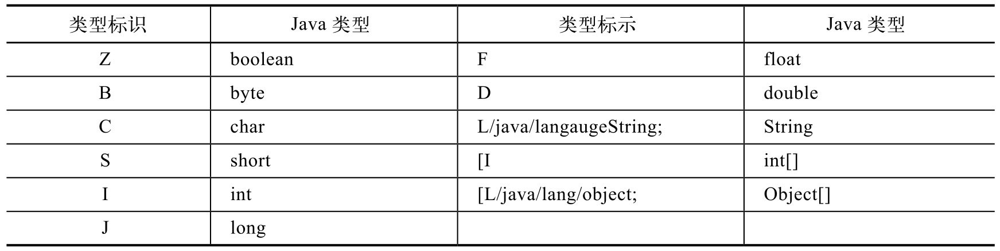
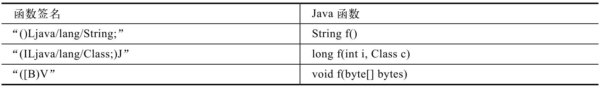

# 2.4.6 JNI类型签名介绍


先来看动态注册中的一段代码：

```
        tatic JNINativeMethod gMethods[] = {
            ......
        {
        "processFile"
        //processFile的签名信息，这么长的字符串，是什么意思？
        "(Ljava/lang/String;Ljava/lang/String;Landroid/media/MediaScannerClient;)V",
          (void ＊)android_media_MediaScanner_processFile
        },
          ......
        }
```

上面代码中的JNINativeMethod前面已经见过了，不过其中那个很长的字符

```
        (参数1类型标示参数2类型标示...参数n类型标示)返回值类型标示
```

串"（Ljava/lang/String;Ljava/lang/String;Landroid/media/MediaScannerClient;）

V"是什么意思呢？

根据前面的讲解可知，它是Java中对应函数的来看processFile的例子：

签名信息，由参数类型和返回值类型共同组

```
          Java中的函数定义为void processFile(String path, String mimeType)。
          对应的JNI函数签名就是
          (Ljava/lang/String;Ljava/lang/String;Landroid/media/MediaScannerClient;)V
          其中，括号内是参数类型的标识，最右边是返回值类型的标识，void类型对应的标识是V。
          当参数的类型是引用类型时，其格式是”L包名;”，其中包名中的”.”换成”/”。上面例子中的
            Ljava/lang/String;表示是一个Java String类型。
```

成。不过为什么需要这个签名信息呢？

这个问题的答案比较简单。因为Java支持函数重载，也就是说，可以定义同名但不同参数的函数。但仅仅根据函数名是没法找到具体函数的。为了解决这个问题，JNI技术中就将参数类型和返回值类型的组合作为了一个函数的签名信息，有了签名信息和函数名，就能很顺利地找到Java中的函数了。

JNI规范定义的函数签名信息看起来很别扭，不过习惯就好了。它的格式是：

函数签名不仅看起来麻烦，写起来更麻烦，稍微写错一个标点就会导致注册失败。所以，在具体编码时，读者可以定义字符串宏，这样改起来也方便。

表2-3是常见的类型标识：

表2-3类型标识示意表



上面列出了一些常用的类型标识。请注意，如果Java类型是数组，则标识中会有一个“​[​”​，另外，引用类型（除基本类型的数组外）的标识最后都有一个“;”​。

再来看一个小例子，如表2-4所示：

表2-4函数签名的小例子



请大家结合表2-3和表2-4左栏的内容写出对应的Java函数。

虽然函数签名信息很容易写错，但Java提供一个叫javap的工具能帮助生成函数或变量的签名信息，它的用法如下：

```
          javap -s -p xxx
```

其中xxx为编译后的class文件，s表示输出内部数据类型的签名信息，p表示打印所有函数和成员的签名信息，默认只会打印public成员和函数的签名信息。

有了javap，就不用死记硬背上面的类型标示了。
