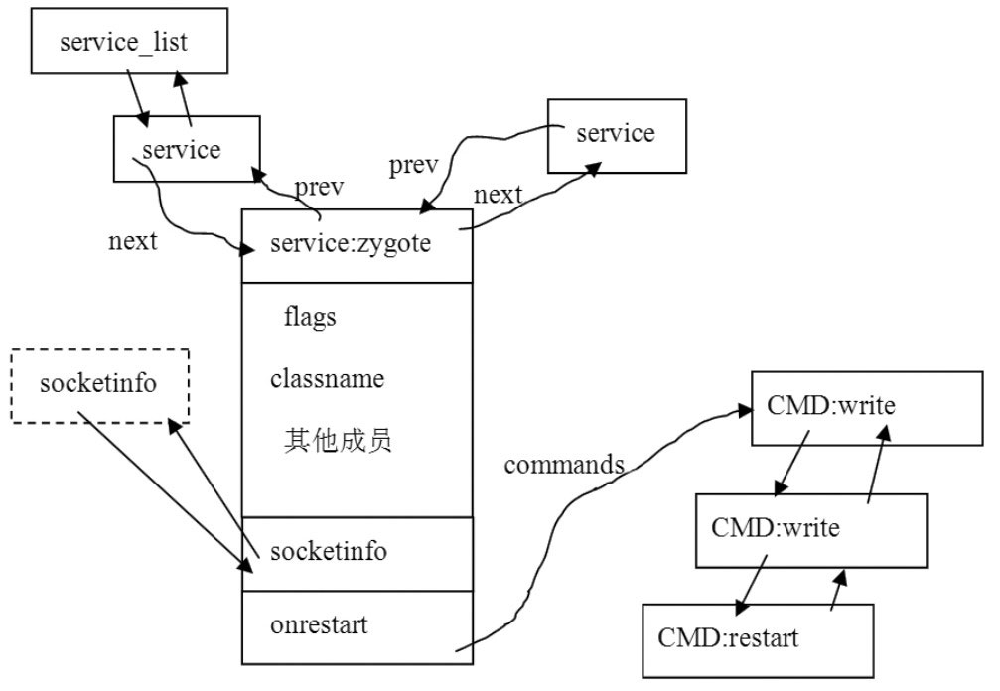

# 3.2.2 解析service


zygote对应的servicesection内容是：

[--＞init.rc::zygote]

```
        service zygote /system/bin/app_process -Xzygote /system/bin -zygote \
        --start-system-server
            socket zygote stream 666  #socket是OPTION。
            #下面的onrestart是OPTION，而write和restart是COMMAND。
            onrestart write /sys/android_power/request_state wake
            onrestart write /sys/power/state on
            onrestart restart media
```

解析section的入口函数是parse_new_section，它的代码如下所示：

```java
        void parse_new_section(struct parse_state ＊state, int kw,
                                int nargs, char ＊＊args)
        {
            switch(kw) {
            case K_service:  //用parse_service和parse_line_service解析service。
                state-＞context = parse_service(state, nargs, args);
                if (state-＞context) {
                    state-＞parse_line = parse_line_service;
                    return;
                }
                break;
            case K_on: //解析on section。
                ...... //读者可以自己研究。
                break;
            }
            state-＞parse_line = parse_line_no_op;
        }
```

[--＞parser.c]

```c
        struct service {
          //listnode是一个特殊的结构体，在内核代码中用得非常多，主要用来将结构体链接成一个
          //双向链表。init中有一个全局的service_list，专门用来保存解析配置文件后得到的service。
            struct listnode slist;
            const char ＊name;      //service的名字，与我们这个例子对应的就是"zygote"。
            const char ＊classname; //service所属class的名字，默认是"defult"。
            unsigned flags;         //service的属性
            pid_t pid;              //进程号
            time_t time_started;    //上一次启动的时间
            time_t time_crashed;    //上一次死亡的时间
            int nr_crashed;         //死亡次数
            uid_t uid;              //uid,gid相关
            gid_t gid;
            gid_t supp_gids[NR_SVC_SUPP_GIDS];
            size_t nr_supp_gids;
            /＊
            有些service需要使用socket，下面这个socketinfo用来描述socket的相关信息。
            我们的zygote也使用了socket，配置文件中的内容是socket zygote stream 666。
            它表示将创建一个AF_STREAM类型的socket（其实就是TCP socket），该socket的名为"zygote"，
            读写权限是666。
          ＊/
            struct socketinfo ＊sockets;
            //service一般运行在一个单独的进程中，envvars用来描述创建这个进程时所需的环境变量信息。
            struct svcenvinfo ＊envvars;
          /＊
          虽然关键字onrestart标识一个OPTION，可是这个OPTION后面一般跟着COMMAND，
          下面这个action结构体可用来存储command信息，马上就会分析到它。
          ＊/
            struct action onrestart;

            //与keychord相关的内容
            int ＊keycodes;
            int nkeycodes;
            int keychord_id;
            //io优先级设置
            int ioprio_class;
            int ioprio_pri;
            //参数个数
            int nargs;
            //用于存储参数
            char ＊args[1];
        };
```

其中，解析service时，用到了parse_service和parse_line_service这两个函数，在分别介绍它们之前，先看init是如何组织这个service的。

1.service结构体init中使用了一个叫service的结构体来保存与servicesection相关的信息，不妨来看看这个结构体，代码如下所示：

[--＞init.h::service结构体定义]

```c
        struct action {
        /＊
            一个action结构体可存放在三个双向链表中，其中alist用于存储所有的action，
            qlist用于链接那些等待执行的action，tlist用于链接那些待某些条件满足后
            就需要执行的action。
        ＊/
            struct listnode alist;
            struct listnode qlist;
            struct listnode tlist;

            unsigned hash;
            const char ＊name;

            //这个OPTION对应的是COMMAND链表，以zygote为例，它有三个onrestart option，所以
          //它对应会创建三个command结构体。
            struct listnode commands;
            struct command ＊current;
        };
```

我们现在已了解的service的结构体，相对来说还算是清晰易懂的。而zygote中的那三个onrestart该怎么表示呢？请看service中使用的这个action结构体：

[--＞init.h::action结构体定义]了解了上面的知识后，你是否能猜到

```c
        static void ＊parse_service(struct parse_state ＊state, int nargs, char ＊＊args)
        {
            struct service ＊svc; //声明一个service结构体。
            ......
            //init维护了一个全局的service链表，先判断是否已经有同名的service了。
            svc = service_find_by_name(args[1]);
            if (svc) {
                ......            //如果有同名的service，则不能继续后面的操作。
                return 0;
            }

            nargs -= 2;
            svc = calloc(1, sizeof(＊svc) + sizeof(char＊) ＊ nargs);
            ......
            svc-＞name = args[1];
            svc-＞classname = "default";//设置classname为"default"，这个很关键！
            memcpy(svc-＞args, args + 2, sizeof(char＊) ＊ nargs);
            svc-＞args[nargs] = 0;
            svc-＞nargs = nargs;
            svc-＞onrestart.name = "onrestart";

            list_init(&svc-＞onrestart.commands);
            //把zygote这个service加到全局链表service_list中。
            list_add_tail(&service_list, &svc-＞slist);
            return svc;
        }
```

parse_service和parse_line_service的作用了呢？马上就来看它们。

2.了解parse_serviceparse_service的代码如下所示：

[--＞parser.c]

```c
        static void parse_line_service(struct parse_state ＊state, int nargs,
                                            char ＊＊args)
        {
            struct service ＊svc = state-＞context;
            struct command ＊cmd;
            int i, kw, kw_nargs;
            ......
            svc-＞ioprio_class = IoSchedClass_NONE;
            //其实还是根据关键字来做各种处理。
            kw = lookup_keyword(args[0]);
            switch (kw) {
            case K_capability:
                break;
            case K_class:
                if (nargs != 2) {
                    ......
                } else {
                    svc-＞classname = args[1];
                }
                break;
            ......
            case K_oneshot:
                /＊
                  这是service的属性，它一共有五个属性，分别为：
                  SVC_DISABLED：不随class自动启动。下面将会看到class的作用。
                  SVC_ONESHOT：退出后不需要重启，也就是说这个service只启动一次就可以了。
                  SVC_RUNNING：正在运行，这是service的状态。
                  SVC_RESTARTING：等待重启，这也是service的状态。
                  SVC_CONSOLE：该service需要使用控制台。
                  SVC_CRITICAL：如果在规定时间内该service不断重启，则系统会重启并进入恢复模式。
                  zygote没有使用任何属性，这表明它会随着class的处理自动启动；
                  退出后会由init重启；不使用控制台；即使不断重启也不会导致系统进入恢复模式。
                ＊/
                svc-＞flags |= SVC_ONESHOT;
                break;
            case K_onrestart: //根据onrestart的内容，填充action结构体的内容。
                nargs--;
                args++;
                kw = lookup_keyword(args[0]);
                ......
                //创建command结构体。
                cmd = malloc(sizeof(＊cmd) + sizeof(char＊) ＊ nargs);
                cmd-＞func = kw_func(kw);
                cmd-＞nargs = nargs;
                memcpy(cmd-＞args, args, sizeof(char＊) ＊ nargs);
                //把新建的command加入到双向链表中。
                list_add_tail(&svc-＞onrestart.commands, &cmd-＞clist);
                break;
            ......
            case K_socket: { //创建socket相关信息。
                struct socketinfo ＊si;
                ......
                si = calloc(1, sizeof(＊si));
                if (!si) {
                    parse_error(state, "out of memory\n");
                    break;
                }
                si-＞name = args[1]; //socket的名字
                si-＞type = args[2]; //socket的类型
                si-＞perm = strtoul(args[3], 0, 8); //socket的读写权限
                if (nargs ＞ 4)
                    si-＞uid = decode_uid(args[4]);
                if (nargs ＞ 5)
                    si-＞gid = decode_uid(args[5]);
                si-＞next = svc-＞sockets;
                svc-＞sockets = si;
                break;
            }
            ......
            default:
                parse_error(state, "invalid option '%s'\n", args[0]);
            }
        }
```

parse_service函数只是搭建了一个service的架子，具体的内容尚需由后面的解析函数来填充。来看service的另外一个解析函数parse_line_service。

3.了解parse_line_serviceparse_line_service的代码如下所示：

[--＞parser.c]parse_line_service将根据配置文件的内容填充service结构体，那么，zygote解析完后会得到什么呢？图3-1表示了zygote解析后的结果：



图3-1zygote解析结果示意图从上图中可知：

service_list链表将解析后的service全部链接到了一起，并且是一个双向链表，前向节点用prev表示，后向节点用next表示。

socketinfo也是一个双向链表，因为zygote只有一个socket，所以画了一个虚框socket作为链表的示范。

onrestart通过commands指向一个commands链表，zygote有三个commands。

zygote这个service解析完了，现在就是“万事俱备，只欠东风”了。接下来要了解的是init如何控制service。
