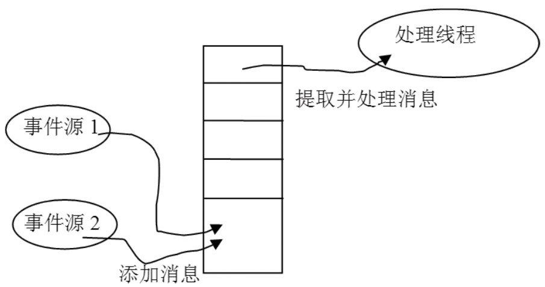

# 5.4 Looper和Handler类分析

就应用程序而言，Android系统中Java的应用程序和其他系统上相同，都是靠消息驱动来工作的，它们大致的工作原理如下：

有一个消息队列，可以往这个消息队列中投递消息。

有一个消息循环，不断从消息队列中取出消息，然后处理。

我们用图5-1来展示这个工作过程：

图5-1线程和消息处理的原理图从图中可以看出：

事件源把待处理的消息加入到消息队列中，一般是加至队列尾，一些优先级高的消息也可以加至队列头。事件源提交的消息可以是按键、触摸屏等物理事件产生的消息，也可以是系统或应用程序本身发出的请求消息。

处理线程不断从消息队列头中取出消息并处理，事件源可以把优先级高的消息放到队列头，这样，优先级高的消息就会首先被处理。

在Android系统中，这些工作主要由Looper和Handler来实现：

Looper类，用于封装消息循环，并且有一个消息队列。

Handler类，有点像辅助类，它封装了消息投递、消息处理等接口。

Looper类是其中的关键。先来看看它是怎么做的。
