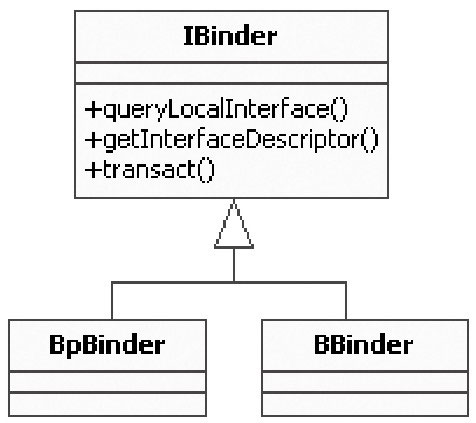

# 6.2.3 时空穿越魔术——defaultServiceManager


```
        sp＜IBinder＞ ProcessState::getContextObject(const sp＜IBinder＞& caller)
        {
            /＊
            caller的值为0！注意，该函数返回的是IBinder。它是什么？我们后面再说。
            supportsProcesses函数根据openDriver函数是否可成功打开设备来判断它是否支持process。
            真实设备肯定支持process。
            ＊/
          if (supportsProcesses()) {
            //真实设备上肯定是支持进程的，所以会调用下面这个函数。
                return getStrongProxyForHandle(0);
            } else {
                return getContextObject(String16("default"), caller);
            }
        }
```

哦，是调用了ProcessState的getContextObject函数！注意：传给它的参数是NULL，即0。既然是“庖丁解牛”​，就还要一层一层地往下切。下面再看getContextObject函数，如下所示：

[--＞ProcessState.cpp]getStrongProxyForHandle这个函数名怪怪的，可能会让人感到些许困惑。请注意，它的调用参数名叫handle，在Windows编程中经常使用这个名称，它是对资源的一种标识。说白了，其实就是有一个资源项，保存在一个资源数组（也可以是别的组织结构）中，handle的值正是该资源项在数组中的索引。

```cpp
        sp＜IBinder＞ ProcessState::getStrongProxyForHandle(int32_t handle)
        {
            sp＜IBinder＞ result;
            AutoMutex _l(mLock);
            /＊
            根据索引查找对应的资源。如果lookupHandleLocked发现没有对应的资源项，则会创建一个新的项并返回。
            这个新项的内容需要填充。
            ＊/
            handle_entry＊ e = lookupHandleLocked(handle);
            if (e != NULL) {
                IBinder＊ b = e-＞binder;
                if (b == NULL || !e-＞refs-＞attemptIncWeak(this)) {
                    //对于新创建的资源项，它的binder为空，所以走这个分支。注意，handle的值为0。
                    b = new BpBinder(handle); //创建一个BpBinder。
                    e-＞binder = b;           //填充entry的内容。
                    if (b) e-＞refs = b-＞getWeakRefs();
                    result = b;
                } else {
                    result.force_set(b);
                    e-＞refs-＞decWeak(this);
                }
            }
            return result;                    //返回BpBinder(handle)，注意，handle的值为0。
        }
```

[--＞ProcessState.cpp]2.魔术表演的道具——BpBinder众所周知，玩魔术时必须有道具。这个穿越魔术的道具就是BpBinder。BpBinder是什么呢？有必要先来介绍它的孪生兄弟BBinder。

BpBinder和BBinder都是Android中与Binder通信相关的代表，它们都是从IBinder类中派生而来，如图6-2所示：



图6-2Binder家族图谱从上图中可以看出：

BpBinder是客户端用来与Server交互的代理类，p即Proxy的意思。

BBinder则是与proxy相对的一端，它是proxy交互的目的端。如果说Proxy代表客户端，那么BBinder则代表服务端。

这里的BpBinder和BBinder是一一对应的，即某个BpBinder只能和对应的BBinder交互。我们当然不希望通过BpBinderA发送的请求，却由BBinderB来处理。

刚才我们在defaultServiceManager（​）函数中创建了这个BpBinder。这里有两个问题：

1）为什么创建的不是BBinder？

因为我们是ServiceManager的客户端，当然得使用代理端与ServiceManager进行交互。

2）前面说了，BpBinder和BBinder是一一对应的，那么BpBinder如何标识它所对应的BBinder端呢？

答案是Binder系统通过handler来标识对应的

```
        BpBinder::BpBinder(int32_t handle)
            : mHandle(handle)//handle是0。
            , mAlive(1)
            , mObitsSent(0)
            , mObituaries(NULL)
        {
            extendObjectLifetime(OBJECT_LIFETIME_WEAK);
            //另一个重要对象是IPCThreadState，我们稍后会详细讲解。
            IPCThreadState::self()-＞incWeakHandle(handle);
        }
```

BBinder。以后我们会确认这个Handle值的作用。

注意我们给BpBinder构造函数传的参数handle的值是0。这个0在整个Binder系统中有重要含义——因为0代表的就是ServiceManager所对应的BBinder。

BpBinder是如此重要，必须对它进行深入分析，其代码如下所示：

[--＞BpBinder.cpp]

```cpp
        gDefaultServiceManager = interface_cast＜IServiceManager＞(
                                              ProcessState::self()-＞getContextObject(NULL));
```

现在这个函数调用将变成如下所示的样子：

```
        gDefaultServiceManager = interface_cast＜IServiceManager＞(new BpBinder(0));
```

看上面的代码，会觉得BpBinder确实简单，不过再仔细查看，你或许会发现，BpBinder、BBinder这两个类没有任何地方操作ProcessState打开的那个/dev/binder设备，换言之，这两个Binder类没有和binder这里出现了一个interface_cast。它是什么？

设备直接交互。那为什么说BpBinder与通信其实是一个障眼法！下面就来具体分析它。

相关呢？注意本小节的标题，BpBinder只是3.障眼法——interface_cast道具嘛！所以它后面一定还另有机关。不必急着揭秘，还是先回顾一下道具出场的过程。

interface_cast、dynamic_cast和static_cast看起来是否非常眼熟？它们是指针类型转换的我们是从下面这个函数开始分析的：

意思吗？如果是，那又是如何将BpBinder*类型强制转化成IServiceManager*类型的呢？

BpBinder的家谱我们刚才也看了，它的“爸爸的爸爸的爸爸”这条线上没有任何一个与IServiceManager有任何关系。

谈到这里，我们得去看看interface_cast的具体实现，其代码如下所示：

[--＞IInterface.h]

```c
        template＜typename INTERFACE＞
        inline sp＜INTERFACE＞ interface_cast(const sp＜IBinder＞& obj)
        {
            return INTERFACE::asInterface(obj);
        }
```

哦，仅仅是一个模板函数，所以interface_cast＜IServiceManager＞（​）等价于：

```
        inline sp＜IServiceManager＞ interface_cast(const sp＜IBinder＞& obj)
        {
            return IServiceManager::asInterface(obj);
        }
```

又转移到IServiceManager对象中去了，这难道不是障眼法吗？既然找到了“真身”​，不妨就来见识见识它吧。

4.拨开浮云见月明——IServiceManager刚才提到，IBinder家族的BpBinder和BBinder是与通信业务相关的，那么业务层的逻辑又是如何巧妙地架构在Binder机制上的呢？关于这些问题，可以用一个绝好的例子来

```java
        class IServiceManager : public IInterface
        {
          public:
            //关键无比的宏！
            DECLARE_META_INTERFACE(ServiceManager);

            //下面是ServiceManager所提供的业务函数。
            virtual sp＜IBinder＞     getService( const String16& name) const = 0;
            virtual sp＜IBinder＞     checkService( const String16& name) const = 0;
            virtual status_t          addService( const String16& name,
                                                        const sp＜IBinder＞& service) = 0;
            virtual Vector＜String16＞     listServices() = 0;
            ......
        };
```

解释，它就是IServiceManager。

（1）定义业务逻辑先回答第一个问题：如何表述应用的业务层逻辑。可以先分析一下IServiceManager是怎么做的。IServiceManager定义了ServiceManager所提供的服务，看它的定义可知，其中有很多有趣的内容。

IServiceManager定义在IServiceManager.h中，代码如下所示：

[--＞IServiceManager.h]（2）业务与通信的挂钩Android巧妙地通过DECLARE_META_INTERFACE和IMPLENT宏，将业务和通信牢牢地钩在了一起。

DECLARE_META_INTERFACE和IMPLEMENT_META_INTERFACE这两个宏都

```c
        //定义一个描述字符串。
        static const android::String16 descriptor;

        //定义一个asInterface函数。
        static android::sp＜ IServiceManager ＞
        asInterface(const android::sp＜android::IBinder＞& obj)

        //定义一个getInterfaceDescriptor函数，估计就是返回descriptor字符串。
        virtual const android::String16& getInterfaceDescriptor() const;

        //定义IServiceManager的构造函数和析构函数。
        IServiceManager ();
        virtual ～IServiceManager();
```

定义在刚才的IInterface.h中。先看DECLARE_META_INTERFACE这个宏，如下所示：

将IServiceManager的DELCARE宏进行相应的替换后得到的代码如下所示：

[--＞IInterface.h::DECLARE_META_INTERFACE][---＞DECLARE_META_INTERFACE（IServiceManager）​]

```c
        #define DECLARE_META_INTERFACE(INTERFACE)                                        \
            static const android::String16 descriptor;                                 \
            static android::sp＜I##INTERFACE＞ asInterface(                             \
                    const android::sp＜android::IBinder＞& obj);                       \
            virtual const android::String16& getInterfaceDescriptor() const;     \
            I##INTERFACE();                                                                   \
            virtual ～I##INTERFACE();
```

DECLARE宏声明了一些函数和一个变量，那么，IMPLEMENT宏的作用肯定就是定义它们了。IMPLEMENT的定义在IInterface.h中，IServiceManager是如何使用这个宏的呢？只有一行代码，在IServiceManager.cpp中，如下所示：

```
        IMPLEMENT_META_INTERFACE(ServiceManager, "android.os.IServiceManager");
```

很简单，可直接将IServiceManager中

```
        const android::String16
        IServiceManager::descriptor("android.os.IServiceManager");
        //实现getInterfaceDescriptor函数。
        const android::String16& IServiceManager::getInterfaceDescriptor() const
          {
            //返回字符串descriptor，值是"android.os.IServiceManager"。
              return IServiceManager::descriptor;
          }
        //实现asInterface函数。
          android::sp＜IServiceManager＞
          IServiceManager::asInterface(const android::sp＜android::IBinder＞& obj)
        {
                android::sp＜IServiceManager＞ intr;
                if (obj != NULL) {
                    intr = static_cast＜IServiceManager ＊＞(
                        obj-＞queryLocalInterface(IServiceManager::descriptor).get());
                    if (intr == NULL) {
                      //obj是我们刚才创建的那个BpBinder(0)。
                        intr = new BpServiceManager(obj);
                    }
                }
                return intr;
        }
        //实现构造函数和析构函数。
        IServiceManager::IServiceManager () { }
        IServiceManager::～ IServiceManager() { }
```

IMPLEMENT宏的定义展开，如下所示：

```
        intr = new BpServiceManager(obj);
```

明白了！interface_cast不是指针的转换，而是利用BpBinder对象作为参数新建了一个BpServiceManager对象。我们已经知道BpBinder和BBinder与通信有关系，这里怎么突然冒出来一个BpServiceManager？它们之间又有什么关系呢？

（3）IServiceManager家族要搞清这个问题，必须先了解IServiceManager家族之间的关系，先来看图我们曾提出过疑问：interface_cast是如何把6-3，它展示了IServiceManager的家族图BpBinder指针转换成一个IServiceManager谱。

指针的呢？答案就在asInterface函数的这一行代码中，如下所示：


图6-3IServiceManager的家族图谱根据图6-3和相关的代码可知，这里有以下几个重要的点值得注意：

IServiceManager、BpServiceManager和BnServiceManager都与业务逻辑相关。

BnServiceManager同时从IServiceManagerBBinder派生，表示它可以直接参与Binder通信。

BpServiceManager虽然从BpInterface中派生，但是这条分支似乎与BpBinder没有关系。

BnServiceManager是一个虚类，它的业务函数最终需要子类来实现。

重要说明以上这些关系很复杂，但ServiceManager并没有使用错综复杂的派生关系，它直接打开Binder设备并与之交互。

后文还会详细分析它的实现代码。

图6-3中的BpServiceManager，既然不像它的兄弟BnServiceManager那样与Binder有直接的血缘关系，那么它又是如何与Binder交互的呢？简言之，BpRefBase中mRemote值就是BpBinder。如果你不相信，仔细看BpServiceManager左边派生分支树上的一系列代码，它们都在IServiceManager.cpp中，如下所示：

[--＞IServiceManager.cpp::BpServiceManager类]

```cpp
        //通过它的参数可得知，impl是IBinder类型，看来与Binder有间接关系，它实际上是BpBinder对象。
        BpServiceManager(const sp＜IBinder＞& impl)
            //调用基类BpInterface的构造函数。
            : BpInterface＜IServiceManager＞(impl)
        {
        }
```

BpInterface的实现代码如下所示：

```
        BpRefBase::BpRefBase(const sp＜IBinder＞& o)
          //mRemote最终等于那个new 出来的BpBinder(0)。
            : mRemote(o.get()), mRefs(NULL), mState(0)
        {
            extendObjectLifetime(OBJECT_LIFETIME_WEAK);

            if (mRemote) {
                mRemote-＞incStrong(this);
                mRefs = mRemote-＞createWeak(this);
            }
        }
```

[--＞IInterface.h::BpInterface类]

```c
        template＜typename INTERFACE＞
        inline BpInterface＜INTERFACE＞::BpInterface(const sp＜IBinder＞& remote)
            : BpRefBase(remote)//基类构造函数
        {
        }
```

BpRefBase（​）的实现代码如下所示：

[--＞Binder.cpp::BpRefBase类]原来，是BpServiceManager的一个变量mRemote指向了BpBinder。至此，我们的魔术表演结束，回想一下defaultServiceManager函数，可以得到以下两个关键对象：

有一个BpBinder对象，它的handle值是0。

有一个BpServiceManager对象，它的mRemote值是BpBinder。

BpServiceManager对象实现了IServiceManager的业务函数，现在又有BpBinder作为通信的代表，接下来的工作就简单了。下面，要通过分析MediaPlayerService的注册过程，进一步分析业务函数的内部是如何工作的。
