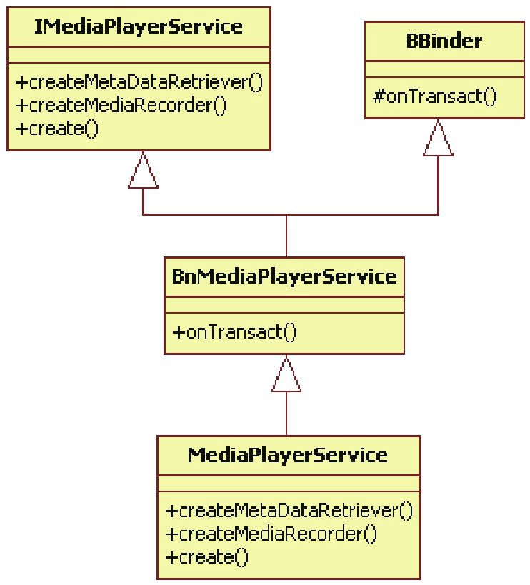

# 6.4.2 子承父业


根据前面的分析可知，MediaPlayerService驻留在MediaServer进程中，这个进程有两个线程在talkWithDriver。假设其中有一个线程收到了请求信息，它最终会通过executeCommand调用来处理这个请求，实现代码如下所示：

[--＞IPCThreadState.cpp]



图6-5MediaPlayerService家谱BnMediaPlayerService实现了onTransact函数，它将根据消息码调用对应的业务逻辑函数，这些业务逻辑函数由MediaPlayerService来实现。这一路的历BBinder和业务层有什么关系？还记得图6-3程，如下面的代码所示：

吗？我们以MediaPlayerService为例，来梳[--＞Binder.cpp]理一下其派生关系，如图6-5所示：

```cpp
        status_t BnMediaPlayerService::onTransact(uint32_t code, const Parcel& data,
                                                              Parcel＊ reply, uint32_t flags)
        {
            switch(code) {
                ......
                case CREATE_MEDIA_RECORDER: {
                    CHECK_INTERFACE(IMediaPlayerService, data, reply);
                    //从请求数据中解析对应的参数。
                    pid_t pid = data.readInt32();
                    //子类要实现createMediaRecorder函数。
                    sp＜IMediaRecorder＞ recorder = createMediaRecorder(pid);
                    reply-＞writeStrongBinder(recorder-＞asBinder());
                    return NO_ERROR;
                } break;
                case CREATE_METADATA_RETRIEVER: {
                    CHECK_INTERFACE(IMediaPlayerService, data, reply);
                    pid_t pid = data.readInt32();
                    //子类要实现createMetadataRetriever函数。
                    sp＜IMediaMetadataRetriever＞ retriever = createMetadataRetriever(pid);
                    reply-＞writeStrongBinder(retriever-＞asBinder());
                    return NO_ERROR;
                } break;
                default:
                    return BBinder::onTransact(code, data, reply, flags);
            }
        }
```

```cpp
        status_t BBinder::transact(
            uint32_t code, const Parcel& data, Parcel＊ reply, uint32_t flags)
        {
            data.setDataPosition(0);
            status_t err = NO_ERROR;
            switch (code) {
                case PING_TRANSACTION:
                    reply-＞writeInt32(pingBinder());
                    break;
                default:
                  //调用子类的onTransact，这是一个虚函数。
                    err = onTransact(code, data, reply, flags);
                    break;
            }
            if (reply != NULL) {
                reply-＞setDataPosition(0);
            }
            return err;
        }
```

[--＞IMediaPlayerService.cpp]通过上面的分析，我们是否能更清晰地理解了图6-3、图6-4和图6-5所表达的意义了呢？
