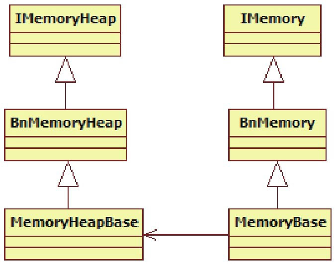

# 7.2.2 AudioTrack（Java空间）分析


```java
        public AudioTrack(int streamType, int sampleRateInHz, int channelConfig,
                    int audioFormat,int bufferSizeInBytes, int mode)
                    throws IllegalArgumentException {

                    mState = STATE_UNINITIALIZED;
                //检查参数是否合法。
                audioParamCheck(streamType, sampleRateInHz, channelConfig,
                                  audioFormat, mode);
                //bufferSizeInBytes是通过getMinBufferSize得到的，所以下面的检查肯定能通过。
                audioBuffSizeCheck(bufferSizeInBytes);

                /＊
                    调用native层的native_setup，构造一个WeakReference传进去。
                    不了解Java WeakReference的读者可以上网查一下，很简单。
                ＊/
                  int initResult = native_setup(new WeakReference＜AudioTrack＞(this),
                  mStreamType,             //这个值是AudioManager.STREAM_MUSIC。
                  mSampleRate,             //这个值是8000。
                  mChannels,               //这个值是2。
                  mAudioFormat,            //这个值是AudioFormat.ENCODING_PCM_16BIT。
                  mNativeBufferSizeInBytes,//这个值等于bufferSizeInBytes。
                  mDataLoadMode);          //DataLoadMode是MODE_STREAM。
                  ....
        }
```

AudioTrack构造函数的实现在AudioTrack.java中。来看这个函数：

[--＞AudioTrack.java]

```java
        static int
        android_media_AudioTrack_native_setup(JNIEnv ＊env, jobject thiz,
                          jobject weak_this,jint streamType,
                          jint sampleRateInHertz, jint channels,
                          jint audioFormat, jint buffSizeInBytes,
                          jint memoryMode)
        {
            int afSampleRate;
            int afFrameCount;
            //进行一些信息查询。
            AudioSystem::getOutputFrameCount(&afFrameCount, streamType)；
            AudioSystem::getOutputSamplingRate(&afSampleRate, streamType)；
            AudioSystem::isOutputChannel(channels)；
            //popCount用于统计一个整数中有多少位为1，有很多经典的算法。
            int nbChannels = AudioSystem::popCount(channels);
            //Java层的值和JNI层的值转换。
            if (streamType == javaAudioTrackFields.STREAM_MUSIC)
                  atStreamType = AudioSystem::MUSIC;

            int bytesPerSample = audioFormat == javaAudioTrackFields.PCM16 ? 2 : 1;
            int format = audioFormat == javaAudioTrackFields.PCM16 ?
                          AudioSystem::PCM_16_BIT : AudioSystem::PCM_8_BIT;

            //计算以帧为单位的缓冲大小。
            int frameCount = buffSizeInBytes / (nbChannels ＊ bytesPerSample);

              //① AudioTrackJniStorage对象，它保存了一些信息，后面将详细分析。
            AudioTrackJniStorage＊ lpJniStorage = new AudioTrackJniStorage();
              ......
              //②创建Native层的AudioTrack对象。
            AudioTrack＊ lpTrack = new AudioTrack();
                if (memoryMode == javaAudioTrackFields.MODE_STREAM) {
                    //③STREAM模式
                    lpTrack-＞set(
                        atStreamType,  //指定流类型。
                        sampleRateInHertz,
                        format,        // 采样点的精度，一般为PCM16或PCM8。
                        channels,
                        frameCount,
                        0,// flags
                        audioCallback, //该回调函数定义在android_media_AudioTrack.cpp中。
                        &(lpJniStorage-＞mCallbackData),
                        0,
                        0,             // 共享内存,STREAM模式下为空。实际使用的共享内存由AF创建。
                        true);         //内部线程可以调用JNI函数，还记得“zygote偷梁换柱”那一节吗？
                  } else if (memoryMode == javaAudioTrackFields.MODE_STATIC) {
                  //如果是static模式，需要先创建共享内存。
                  lpJniStorage-＞allocSharedMem(buffSizeInBytes);
                  lpTrack-＞set(
                    atStreamType,     // stream type
                    sampleRateInHertz,
                    format,           // word length, PCM
                    channels,
                    frameCount,
                    0,                // flags
                    audioCallback,
                    &(lpJniStorage-＞mCallbackData),
                    0,
                    lpJniStorage-＞mMemBase, //STATIC模式下，需要传递该共享内存。
                    true);
            }

            ......
            /＊
              把JNI层中new出来的AudioTrack对象指针保存到Java对象的一个变量中，
              这样就把JNI层的AudioTrack对象和Java层的AudioTrack对象关联起来了，
              这就是Android的常用技法。
          ＊/
            env-＞SetIntField(thiz,javaAudioTrackFields.nativeTrackInJavaObj,
                      (int)lpTrack);
          // lpJniStorage对象指针也保存到Java对象中。
            env-＞SetIntField(thiz, javaAudioTrackFields.jniData, (int)lpJniStorage);
          }
```

OK，native_setup对应的JNI层函数是android_media_AudioTrack_native_setup。一起来看看：

[--＞android_media_AudioTrack.cpp]上面的代码列出了三个要点（即①～③）​，这一节仅分析AudioTrackJniStorage这个类，其余的作为NativeAudioTrack部分放在后面进行分析。

2.AudioTrackJniStorage分析AudioTrackJniStorage是一个辅助类，其中有一些有关共享内存方面的较重要的知识，这里先简单介绍一下。

（1）共享内存介绍共享内存，作为进程间数据传递的一种手段，在AudioTrack和AudioFlinger中被大量使用。先简单了解一下有关共享内存的知识：

每个进程的内存空间是4GB，这个4GB是由指针长度决定的，如果指针长度为32位，那么地址的最大编号就是0xFFFFFFFF，为4GB。

上面说的内存空间是进程的虚拟地址空间。换言之，在应用程序中使用的指针其实是指向虚拟空间地址的。那么，如何通过这个虚拟地址找到存储在真实物理内存中的数据呢？

上面的问题引出了内存映射的概念。内存映射让虚拟空间中的内存地址和真实物理内存地址之间建立了一种对应关系。也就是说，进程中操作的0x12345678这块内存地址，在经过OS内存管理机制的转换后，它实际对应的物理地址可能会是0x87654321。当然，这一切对进程来说都是透明的，这些活都由操作系统悄悄地完成了。不过，这会和我们的共享内存有什么关系吗？

当然有，共享内存和内存映射有着重要关系。

来看图7-1“共享内存示意图”​：


图7-1共享内存示意图图7-1提出了一个关键性的问题，即真实内存中0x87654321标示的这块内存页（OS的内存管理机制将物理内存分成了一个个的内存页，一块内存页的大小一般是4KB）现在已经映射到了进程A中。可它能同时映射到进程B中吗？如果能，那么在进程A中对这块内存页所写的数据在进程B中就能看见了，这岂不就成了内存在两个进程间共享吗？

事实确实如此，否则我们的生活就不会像现在这么美好了。这个机制是由操作系统提供和实现的，原理很简单，实现起来却很复杂，这里就不深究了。

如何创建和共享内存呢？不同的系统会有不同的方法。Linux平台的一般做法是：

进程A创建并打开一个文件，得到一个文件描述符fd。

通过mmap调用将fd映射成内存映射文件。在mmap调用中指定特定的参数表示要创建进程间共享内存。

进程B打开同一个文件，也得到一个文件描述符，这样A和B就打开了同一个文件。

进程B也要用mmap调用指定参数表示想使用共享内存，并传递打开的fd。这样A和B就通过打开同一个文件并构造内存映射，实现了进程间的内存共享。

注意这个文件也可以是设备文件。一般来说，mmap函数的具体工作由参数中的那个文件描述符所对应的驱动或内核模块来完成。

```
        //下面这个结构就是保存一些变量，没有什么特别的作用。
        struct audiotrack_callback_cookie {
            jclass        audioTrack_class;
            jobject      audioTrack_ref;
          };
        class AudioTrackJniStorage {
            public:
                sp＜MemoryHeapBase＞       mMemHeap;//这两个Memory很重要。
                sp＜MemoryBase＞             mMemBase;

                audiotrack_callback_cookie mCallbackData;
                int                              mStreamType;

              bool allocSharedMem(int sizeInBytes) {
              /＊
              注意关于MemoryHeapBase和MemoryBase的用法。
              先new一个MemoryHeapBase，再以它为参数new一个MemoryBase。
            ＊/
            //① MemoryHeapBase
            mMemHeap = new MemoryHeapBase(sizeInBytes, 0, "AudioTrack Heap Base");
            //② MemoryBase
            mMemBase = new MemoryBase(mMemHeap, 0, sizeInBytes);

            return true;
            }
        };
```

除上述的一般方法外，Linux还有SystemV的共享内存创建方法，这里就不再介绍了。总之，AT和AF之间的数据传递，就是通过共享内存方式来完成的。这种方式对于跨进程的大数据量传输来说，是非常高效的。

（2）MemoryHeapBase和MemoryBase类介绍AudioTrackJniStorage用到了Android对共享内存机制所设置的封装类。所以我们有必要先看看AudioTrackJniStorage的内容。

[--＞android_media_AudioTrack.cpp::AudioTrackJniStorage相关]注意代码中标识①和②的地方，它们很好地展示了这两个Memory类的用法。在介绍它们之前，先来看图7-2中与这两个Memory有关的家谱。



图7-2MemoryHeapBase和MemoryBase的家谱MemoryHeapBase是一个基于Binder通信的类，根据前面所讲的Binder知识可知，BpMemoryHeapBase由客户端使用，而MemoryHeapBase完成BnMemoryHeapBase的业务工作。

从MemoryHeapBase开始分析。它的使用方法是：

```
        mMemHeap = new MemoryHeapBase(sizeInBytes, 0, "AudioTrack Heap Base");
```

它的代码在MemoryHeapBase.cpp中，如下所示。

[--＞MemoryHeapBase.cpp]

```cpp
        /＊
            MemoryHeapBase有两个构造函数，我们用的是第一个。
          size表示共享内存的大小，flags为0，name为"AudioTrack Heap Base"。
        ＊/
        MemoryHeapBase::MemoryHeapBase(size_t size, uint32_t flags,char const ＊ name)
            : mFD(-1), mSize(0), mBase(MAP_FAILED), mFlags(flags),
              mDevice(0), mNeedUnmap(false)
        {
            const size_t pagesize = getpagesize();//获取系统中的内存页大小，一般为4KB。
            size = ((size + pagesize-1) & ～(pagesize-1));
            /＊
              创建共享内存，ashmem_create_region函数由libcutils提供。
              在真实设备上将打开/dev/ashmem设备得到一个文件描述符,在模拟器上则创建一个tmp文件。
          ＊/
            int fd = ashmem_create_region(name == NULL ? "MemoryHeapBase" : name, size);
          //下面这个函数将通过mmap方式得到内存地址，这是Linux的标准做法，有兴趣的读者可以看看。
            mapfd(fd, size);
        }
```

MemoryHeapBase构造完后，得到了以下结果：

mBase变量指向共享内存的起始位置。

mSize是所要求分配的内存大小。

mFd是ashmem_create_region返回的文件描述符。

另外，MemoryHeapBase提供了以下几个函数，可以获取共享内存的大小和位置。由于这些函数都很简单，这里仅把它们的作用描述一下。

```
        MemoryHeapBase::getBaseID() //返回mFd，如果为负数，表明刚才创建共享内存失败了。
        MemoryHeapBase::getBase()   //共享内存起始地址。
        MemoryHeapBase::getSize()   //返回mSize，表示内存大小。
```

MemoryHeapBase确实比较简单，它通过ashmem_create_region得到一个文件描述符。

说明Android系统通过ashmem创建共享内存的原理，和Linux系统中通过打开文件创建共享内存的原理类似，但ashmem设备驱动在这方面做了较大的改进，例如增加

```java
        class MemoryBase : public BnMemory
        {
        public:
            MemoryBase(const sp＜IMemoryHeap＞& heap,ssize_t offset, size_t size);
            virtual sp＜IMemoryHeap＞ getMemory(ssize_t＊ offset, size_t＊ size) const;
        protected:
            size_t getSize() const { return mSize; }    //返回大小
            ssize_t getOffset() const { return mOffset;}//返回偏移量
            //返回MemoryHeapBase对象
            const sp＜IMemoryHeap＞& getHeap() const { return mHeap;}
        };
        //MemoryBase的构造函数
        MemoryBase::MemoryBase(const sp＜IMemoryHeap＞& heap,ssize_t offset, size_t size)
            : mSize(size), mOffset(offset), mHeap(heap)
        {
        }
```

了引用计数、延时分配物理内存的机制（即真正使用的时候才去分配内存）等。这些内容，感兴趣的读者可以自行研究。

那么，MemoryBase是何物？它又有什么作用？

MemoryBase也是一个基于Binder通信的类，它比起MemoryHeapBase来就更显得简单了，看起来更像是一个辅助类。它的声明在MemoryBase.h中。一起来看：

[--＞MemoryBase.h::MemoryBase声明]MemoryHeapBase和MemoryBase都够简单吧？总结起来不过是：

分配了一块共享内存，这样两个进程可以共享这块内存。

基于Binder通信，这样使用这两个类的进程就可以交互了。

这两个类在后续的讲解过程中会频繁碰到，但不必对它们做深入分析，只需把它当成普通的共享内存看待即可。

提醒这两个类没有提供同步对象来保护这块共享内存，所以后续在使用这块内存时，必然需要一个跨进程的同步对象来保护它。

这一点，是我在AT中第一次见到它们时想到的，不知道你是否注意过这个问题。

3.play和write分析还记得用例中的③和④关键代码行吗？

```c
        static void
        android_media_AudioTrack_start(JNIEnv ＊env, jobject thiz)
        {
        /＊
          从Java的AudioTrack对象中获取对应Native层的AudioTrack对象指针。
          从int类型直接转换成指针，不过要是以后ARM平台支持64位指针了，代码就得大修改了。
        ＊/
            AudioTrack ＊lpTrack = (AudioTrack ＊)env-＞GetIntField(
                    thiz, javaAudioTrackFields.nativeTrackInJavaObj);
            lpTrack-＞start(); //很简单的调用。
        }
```

```c
        //③ 开始播放
        trackplayer.play() ;
        //④ 调用write写数据
        trackplayer.write(bytes_pkg, 0, bytes_pkg.length) ;//往track中写数据
```

现在就来分析它们。我们要直接转向JNI层来进行分析。相信你现在已有能力从Java层直接跳转至JNI层了。

（1）play分析先看看play函数对应的JNI层函数，它是play函数太简单了，至于它调用的start，等android_media_AudioTrack_start。

到Native层进行AudioTrack分析时，我们再去观[-察-＞。android_media_AudioTrack.cpp]（2）write分析

```cpp
        static jint android_media_AudioTrack_native_write_short(
                    JNIEnv ＊env,   jobject thiz,
                    jshortArray javaAudioData,jint offsetInShorts,
                    jint sizeInShorts,jint javaAudioFormat) {

            return (android_media_AudioTrack_native_write(
                    env, thiz,(jbyteArray)javaAudioData,offsetInShorts＊2,
                    sizeInShorts＊2,javaAudioFormat) / 2);
        }
```

```cpp
        jint writeToTrack(AudioTrack＊ pTrack, jint audioFormat,
                    jbyte＊ data,jint offsetInBytes, jint sizeInBytes) {

            ssize_t written = 0;
          /＊
              如果是STATIC模式，sharedBuffer()返回不为空。
              如果是STREAM模式，sharedBuffer()返回空。
          ＊/
                if (pTrack-＞sharedBuffer() == 0) {
                  //我们的用例是STREAM模式，调用write函数写数据。
                  written = pTrack-＞write(data + offsetInBytes, sizeInBytes);
            } else {
                  if (audioFormat == javaAudioTrackFields.PCM16) {
                      if ((size_t)sizeInBytes ＞ pTrack-＞sharedBuffer()-＞size()) {
                          sizeInBytes = pTrack-＞sharedBuffer()-＞size();
                      }
                  //在STATIC模式下，直接把数据memcpy到共享内存，记住在这种模式下要先调用write，
                  //后调用play。
                    memcpy(pTrack-＞sharedBuffer()-＞pointer(),
                            data + offsetInBytes, sizeInBytes);
                      written = sizeInBytes;
                  } else if (audioFormat == javaAudioTrackFields.PCM8) {
                    //如果是PCM8数据，则先转换成PCM16数据再拷贝。
                      ......
            }
            return written;
        }
```

Java层的write函数有两个：

一个是用来写PCM16数据的，它对应的一个采样点的数据量是两个字节。

另外一个是用来写PCM8数据的，它对应的一个采样点的数据量是一个字节。

我们的用例中采用的是PCM16数据。它对应无论PCM16还是PCM8数据，最终都会调用的JNI层函数是writeToTrack函数。代码如下所示：

android_media_AudioTrack_native_write_short，一起来看：

[--＞android_media_AudioTrack.cpp]看上去play和write这两个函数还真是比较简单，须知，大部分工作还都是由Native的AudioTrack来完成的。继续Java层的分析。

4.release分析如果数据都write完了，则需要调用stop停止播放，或者直接调用release来释放相关资源。由于release和stop有一定的相关性，这里只分析release调用。代码如下所示：

```cpp
        static void android_media_AudioTrack_native_finalize(JNIEnv ＊env, jobject thiz) {
            AudioTrack ＊lpTrack = (AudioTrack ＊)env-＞GetIntField(
                                    thiz, javaAudioTrackFields.nativeTrackInJavaObj);
            if (lpTrack) {
                lpTrack-＞stop();//调用stop
                delete lpTrack;  //调用AudioTrack的析构函数
            }
            ......
        }
```

[--＞android_media_AudioTrack.cpp]

```cpp
        static void android_media_AudioTrack_native_release(JNIEnv ＊env,   jobject thiz) {

            //调用android_media_AudioTrack_native_finalize真正释放资源。
            android_media_AudioTrack_native_finalize(env, thiz);
            //之前保存在Java对象中的指针变量此时都要设置为零。
            env-＞SetIntField(thiz, javaAudioTrackFields.nativeTrackInJavaObj, 0);
            env-＞SetIntField(thiz, javaAudioTrackFields.jniData, 0);
        }
```

扫尾工作也很简单，没什么需要特别注意的。

至此，在Java空间的分析工作就完成了。但在进入Native空间的分析之前，要总结一下Java空间使用Native的AudioTrack的流程，[--＞android_media_AudioTrack.cpp]只有这样，在进行Native空间分析时才能有章可循。

5.AudioTrack（Java空间）的分析总结AudioTrack在JNI层使用了Native的AudioTrack对象，总结一下调用Native对象的流程：

new一个AudioTrack，使用无参的构造函数。

调用set函数，把Java层的参数传进去，另外还设置了一个audiocaback回调函数。

调用AudioTrack的start函数。

调用AudioTrack的write函数。

工作完毕后，调用stop。

最后就是Native对象的delete。

说明为什么要总结流程呢？

第一：控制了流程，就把握了系统工作的命脉，这一点至关重要。

第二：有些功能的实现纵跨Java/Native层，横跨两个进程，这中间有很多封装、很多的特殊处理，但是其基本流程是不变的。

通过精简流程，我们才能把注意力集中在关键点上。
