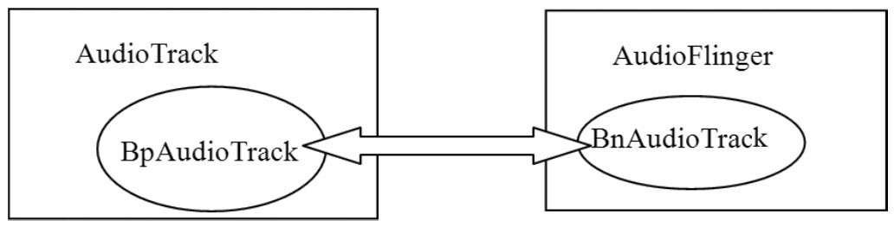

# 7.2.3 AudioTrack（Native空间）分析


7.2.3AudioTrack（Native空间）分析1.newAudioTrack和set分析Native的AudioTrack代码在AudioTrack.cpp中。这一节将分析它的构造函数和set调用。

[--＞AudioTrack.cpp]

```cpp
        AudioTrack::AudioTrack()//我们使用无参构造函数。
            : mStatus(NO_INIT)
        {
          //把状态初始化成NO_INIT。Android的很多类都采用了这种状态控制。
        }
```

再看看set调用，这个函数有很多内容。代码

```
        /＊
            还记得我们传入的参数吗？
          streamType=STREAM_MUSIC,sampleRate=8000,format=PCM_16
          channels=2，frameCount由计算得来，可以假设一个值，例如1024，不影响分析。
          flags=0, cbf=audiocallback, user为cbf的参数，notificationFrames=0
          因为是流模式，所以sharedBuffer=0。threadCanCallJava 为true。
        ＊/
        status_t AudioTrack::set(int streamType, uint32_t sampleRate,int format,
                int channels,int frameCount,uint32_t flags,callback_t cbf,void＊ user,
                int notificationFrames,const sp＜IMemory＞& sharedBuffer,
                bool threadCanCallJava)
        {
            //前面有一些判断，都是和AudioSystem有关的，以后再分析。
            ......
          /＊
              audio_io_handle_t是一个int类型，通过typedef定义，这个值的来历非常复杂，
              涉及AudioFlinger和AudioPolicyService，后面会试着将其解释清楚。
              这个值主要被AudioFlinger使用，用来表示内部的工作线程索引号。AudioFlinger会根据
              情况创建几个工作线程，下面的AudioSystem::getOutput会根据流类型等其他参数最终选
              取一个合适的工作线程，并返回它在AF中的索引号。
              而AudioTrack一般使用混音线程（Mixer Thread）。
        ＊/
            audio_io_handle_t output = AudioSystem::getOutput(
                          (AudioSystem::stream_type)streamType,
                                  sampleRate, format, channels,
                          (AudioSystem::output_flags)flags);
            //调用creatTrack
            status_t status = createTrack(streamType, sampleRate, format, channelCount,
                                            frameCount, flags, sharedBuffer, output);

        //cbf是JNI层传入的回调函数audioCallback，如果用户设置了回调函数，则启动一个线程。
          if (cbf != 0) {
                mAudioTrackThread = new AudioTrackThread(＊this, threadCanCallJava);
            }
            return NO_ERROR;
        }
```

如下所示：

[--＞AudioTrack.cpp]再来看createTrack函数，代码如下所示：

```cpp
        status_t AudioTrack::createTrack(int streamType,uint32_t sampleRate,
                int format,int channelCount,int frameCount, uint32_t flags,
                const sp＜IMemory＞& sharedBuffer, audio_io_handle_t output)
        {
            status_t status;

          /＊
            得到AudioFlinger的Binder代理端BpAudioFlinger。
            关于这部分内容，我们已经很熟悉了，以后的讲解会跨过Binder，直接分析Bn端的实现。
          ＊/
          const sp＜IAudioFlinger＞& audioFlinger = AudioSystem::get_audio_flinger();
          /＊
              向AudioFinger发送createTrack请求。注意其中的几个参数，
              在STREAM模式下sharedBuffer为空。
              output为AudioSystem::getOutput得到一个值，代表AF中的线程索引号。
              该函数返回IAudioTrack（实际类型是BpAudioTrack）对象，后续AF和AT的交互就是
              围绕IAudioTrack进行的。
        ＊/
              sp＜IAudioTrack＞ track = audioFlinger-＞createTrack(getpid(),
                  streamType,sampleRate,format,channelCount,frameCount,
                  ((uint16_t)flags) ＜＜ 16,sharedBuffer,output,&status);

            /＊
              在STREAM模式下，没有在AT端创建共享内存，但前面提到了AT和AF的数据交互是
              通过共享内存完成的，这块共享内存最终由AF的createTrack创建。我们以后分析AF时
              再做介绍。下面这个调用会取出AF创建的共享内存。
        ＊/
              sp＜IMemory＞ cblk = track-＞getCblk();
              mAudioTrack.clear();//sp的clear
              mAudioTrack = track;
              mCblkMemory.clear();
              mCblkMemory = cblk;//cblk是control block的简写。
            /＊
              IMemory的pointer在此处将返回共享内存的首地址，类型为void＊，
              static_cast直接把这个void＊类型转成audio_track_cblk_t，表明这块内存的首部中存在
              audio_track_cblk_t这个对象。
            ＊/
              mCblk = static_cast＜audio_track_cblk_t＊＞(cblk-＞pointer());
              mCblk-＞out = 1;   //out为1表示输出，out为0表示输入。
              mFrameCount = mCblk-＞frameCount;
              if (sharedBuffer == 0) {
                //buffers指向数据空间，它的起始位置是共享内存的首部加上audio_track_cblk_t的大小。
                mCblk-＞buffers = (char＊)mCblk + sizeof(audio_track_cblk_t);
            } else {
                //STATIC模式下的处理
                  mCblk-＞buffers = sharedBuffer-＞pointer();
                  mCblk-＞stepUser(mFrameCount);//更新数据位置，后面要分析stepUser的作用。
              }
              return NO_ERROR;
        }
```

[--＞AudioTrack.cpp]（1）IAudioTrack和AT、AF的关系上面的createTrack函数中突然冒出来一个新面孔，叫IAudioTrack。关于它和AT及AF的关系，我们用图7-3来表示：



图7-3IAudioTrack和AT、AF的关系从图7-3中可以发现：

IAudioTrack是联系AT和AF的关键纽带。

至于IAudioTrack在AF端到底是什么，在分析AF时会有详细解释。

（2）共享内存及其ControlBlock通过前面的代码分析，我们发现IAudioTrack中有一块共享内存，其头部是一个audio_track_cblk_t（简称CB）对象，在该对象之后才是数据缓冲。这个CB对象有什么作用呢？

```
        struct audio_track_cblk_t
        {

                Mutex         lock;
                Condition    cv;//这是两个同步变量，初始化的时候会设置为支持跨进程共享。
          /＊
            一块数据缓冲同时被生产者和消费者使用，最重要的就是维护它的读写位置了。
            下面定义的这些变量就和读写的位置有关，虽然它们的名字并不是那么直观。
            另外，这里提一个扩展问题，读者可以思考一下：
            volatile支持跨进程吗？要回答这个问题需要理解volatile、CPU Cache机制和共享内存的本质。
          ＊/
            volatile     uint32_t     user;     //当前写位置（即生产者已经写到什么位置了）
            volatile     uint32_t     server;   //当前读位置
          /＊
            userBase与serverBase要和user及server结合起来用。
            CB巧妙地通过上面几个变量把一块线性缓冲当作环形缓冲来使用，以后将单独分析这个问题。
          ＊/
                        uint32_t     userBase;   //
                        uint32_t     serverBase;
            void＊        buffers;    //指向数据缓冲的首地址。
            uint32_t     frameCount;  //数据缓冲的总大小，以Frame为单位。
            uint32_t     loopStart;   //设置打点播放（即设置播放的起点和终点）。
            uint32_t     loopEnd;
              int           loopCount;//循环播放的次数。

            volatile     union {
                            uint16_t     volume[2];
                            uint32_t     volumeLR;
                        }; //和音量有关系，可以不管它。
              uint32_t     sampleRate;//采样率
              uint32_t     frameSize; //一单位Frame的数据大小。
              uint8_t      channels;  //声道数
              uint8_t      flowControlFlag;//控制标志，见下文分析。
              uint8_t      out;       // AudioTrack为1，AudioRecord为0。
              uint8_t      forceReady;
              uint16_t     bufferTimeoutMs;
              uint16_t     waitTimeMs;
                //下面这几个函数很重要，后续会详细介绍它们。
              uint32_t     stepUser(uint32_t frameCount);   //更新写位置。
              bool          stepServer(uint32_t frameCount);//更新读位置。
              void＊        buffer(uint32_t offset) const;  //返回可写空间的起始位置。
              uint32_t     framesAvailable();               //还剩多少空间可写。
              uint32_t     framesAvailable_l();
              uint32_t     framesReady();                   //是否有可读数据。
        }
```

还记得前面提到的那个深层次思考的问题吗？

即MemoryHeapBase和MemoryBase都没有提供同步对象，那么，AT和AF作为典型的数据生产者和消费者，如何正确协调二者生产和消费的步调呢？

Android为顺应民意，便创造出了这个CB对象，其主要目的就是协调和管理AT和AF二者数据生产和消费的步伐。先来看CB都管理些什么内容。它的声明在AudioTrackShared.h中，而定义却在AudioTrack.cpp中。

[--＞AudioTrackShared.h::audio_track_cblk_t声明]关于CB对象，这里要专门讲解一下其中flowControlFlag的意思：

对于音频输出来说，flowControlFlag对应着underrun状态，underrun状态是指生产者提供数据的速度跟不上消费者使用数据的速度。这里的消费者指的是音频输出设备。由于音频输出设备采用环形缓冲方式管理，当生产者没有及时提供新数据时，输出设备就会循环使用缓冲中的数据，这样就会听到一段重复的声音。这种现象一般被称作“machinegun”​。对于这种情况，一般的处理方法是暂停输出，等数据准备好后再恢复输出。

对于音频输入来说，flowControlFlag对应着overrun状态，它的意思和underrun一样，只是这里的生产者变成了音频输入设备，而消费者则变成了Audio系统的AudioRecord。

说明目前这个参数并不直接和音频输入输出设备的状态有关系。它在AT和AF中的作用必须结合具体情况才能分析。

图7-4表示CB对象和它所驻留的共享内存间的关系：


图7-4共享内存和CB的关系注意CB实际是按照环形缓冲来处理数据的读写的，所以user和server的真实作用还需要结合userBase和serverBase来看。图7-4只是一个示意图。

另外，关于CB，还有一个神秘的问题。先看下面这行代码：

```
        mCblk = static_cast＜audio_track_cblk_t＊＞(cblk-＞pointer());
```

这看起来很简单，但仔细琢磨会发现其中有一个很难解释的问题：

cblk-＞pointer返回的是共享内存的首地址，怎么把audio_track_cblk_t对象塞到这块内存中呢？

这个问题将通过对AudioFlinger的分析得到答案。

说明关于audio_track_cblk_t的使用方式，后文会有详细分析。

（3）数据的PushorPu在JNI层的代码中可以发现，在构造AudioTrack时，传入了一个回调函数audioCaback。由于它的存在，导致了Native的AudioTrack还将创建另一个线程AudioTrackThread。它有什么用呢？

这个线程与外界数据的输入方式有关系，AudioTrack支持两种数据输入方式：

Push方式：用户主动调用write写数据，这相当于数据被push到

```
        enum event_type {
                EVENT_MORE_DATA = 0, //表示AudioTrack需要更多数据。
                EVENT_UNDERRUN = 1,  //这是Audio的一个术语，表示Audio硬件处于低负荷状态。
                //AT可以设置打点播放，即设置播放的起点和终点,LOOP_END表示已经到达播放终点。
                EVENT_LOOP_END = 2,
            /＊
              数据使用警戒通知。该值可通过setMarkerPosition ()设置。
              当数据的使用超过这个值时，AT会且仅通知一次，有点像Water Marker。
              这里所说的数据使用，是针对消费者AF消费的数据量而言的。
            ＊/
                EVENT_MARKER = 3,
            /＊
              数据使用进度通知。进度通知值由setPositionUpdatePeriod()设置，
              例如每使用500帧通知一次。
            ＊/
                EVENT_NEW_POS = 4,
                EVENT_BUFFER_END = 5  //数据全部被消耗
            };
```

AudioTrack。MediaPlayerService一般使用这种这方式提供数据。

Pu方式：AudioTrackThread将利用这个回调函数，以EVENT_MORE_DATA为参数主动从用户那pu数据。

ToneGenerator则使用这种方式为AudioTrack提供数据。

这两种方式都可以使用，不过回调函数除了EVENT_MORE_DATA外，还能表达其他许多意图，这是通过回调函数的第一个参数来表明的。一起来看：

[--＞AudioTrack.h::event_type]

```c
        bool AudioTrack::processAudioBuffer(const sp＜AudioTrackThread＞& thread)
        {
            Buffer audioBuffer;
            uint32_t frames;
            size_t writtenSize;

            //处理underun的情况。
            if (mActive && (mCblk-＞framesReady() == 0)) {
                if (mCblk-＞flowControlFlag == 0) {
                    mCbf(EVENT_UNDERRUN, mUserData, 0);//under run 通知
                    if (mCblk-＞server == mCblk-＞frameCount) {
                    /＊
                      server是读位置，frameCount是buffer中的数据总和。
                      当读位置等于数据总和时，表示数据都已经使用完了。
                    ＊/
                        mCbf(EVENT_BUFFER_END, mUserData, 0);
                    }
                    mCblk-＞flowControlFlag = 1;
                    if (mSharedBuffer != 0) return false;
                }
            }

            // 循环播放通知
            while (mLoopCount ＞ mCblk-＞loopCount) {
                int loopCount = -1;
                mLoopCount--;
                if (mLoopCount ＞= 0) loopCount = mLoopCount;
                //一次循环播放完毕，loopCount表示还剩多少次。
                mCbf(EVENT_LOOP_END, mUserData, (void ＊)&loopCount);
            }

              if (!mMarkerReached && (mMarkerPosition ＞ 0)) {
                if (mCblk-＞server ＞= mMarkerPosition) {
                  //如果数据的使用超过警戒值，则通知用户。
                    mCbf(EVENT_MARKER, mUserData, (void ＊)&mMarkerPosition);
                    //只通知一次，因为该值被设为true。
                      mMarkerReached = true;
                }
            }

            if (mUpdatePeriod ＞ 0) {
                while (mCblk-＞server ＞= mNewPosition) {
                /＊
                  进度通知，但它不是以时间为基准的，而是以帧数为基准的。
                  例如设置每500帧通知一次，假设消费者一次就读了1500帧，那么这个循环会连续通知3次。
                ＊/
                      mCbf(EVENT_NEW_POS, mUserData, (void ＊)&mNewPosition);
                      mNewPosition += mUpdatePeriod;
                }
            }

            if (mSharedBuffer != 0) {
                frames = 0;
            } else {
                frames = mRemainingFrames;
            }

            do {

                audioBuffer.frameCount = frames;
                //得到一块可写的缓冲
                status_t err = obtainBuffer(&audioBuffer, 1);
                ......

                //从用户那pull数据
                mCbf(EVENT_MORE_DATA, mUserData, &audioBuffer);
                writtenSize = audioBuffer.size;

                ......
                if (writtenSize ＞ reqSize) writtenSize = reqSize;
                //PCM8数据转PCM16
                .......

                audioBuffer.size = writtenSize;
                audioBuffer.frameCount = writtenSize/mCblk-＞frameSize;

                frames -= audioBuffer.frameCount;

                releaseBuffer(&audioBuffer);//写完毕，释放这块缓冲
            }
            while (frames);
            ......
            return true;
        }
```

请看AudioTrackThread的线程函数threadLoop。代码如下所示：

[--＞AudioTrack.cpp]

```cpp
        bool AudioTrack::AudioTrackThread::threadLoop()
        {
          //mReceiver就是创建该线程的AudioTrack。
          return mReceiver.processAudioBuffer(this);
        }
```

[--＞AudioTrack.cpp]关于obtainBuer和releaseBuer，后面再分析。这里有一个问题值得思考：

用例会调用write函数写数据，AudioTrackThread的回调函数也让我们提供数据。难道我们同时在使用Push和Pu模式？

这太奇怪了！来查看这个回调函数的实现，了解一下究竟是怎么回事。该回调函数是通过set调用传入的，对应的函数是audioCaback。代码如下所示：

[--＞android_media_AudioTrack.cpp]

```cpp
        static void audioCallback(int event, void＊ user, void ＊info) {
            if (event == AudioTrack::EVENT_MORE_DATA) {
                  //很好，没有提供数据，也就是说，虽然AudioTrackThread通知了EVENT_MORE_DATA，
                //但是我们并没有提供数据给它。
                AudioTrack::Buffer＊ pBuff = (AudioTrack::Buffer＊)info;
                pBuff-＞size = 0;
              }
            ......
```

悬着的心终于放下来了，还是老老实实地看Push模式下的数据输入吧。

2.write输入数据write函数涉及Audio系统中最重要的问题，即数据是如何传输的，在分析它的时候，不妨先思考一下它会怎么做。回顾一下我们已了解的信息：

有一块共享内存。

有一个控制结构，里面有一些支持跨进程的同步变量。

有了这些东西，write的工作方式就非常简单了：

通过共享内存传递数据。

通过控制结构协调生产者和消费者的步调。

```
        ssize_t AudioTrack::write(const void＊ buffer, size_t userSize)
        {
          if (mSharedBuffer != 0) return INVALID_OPERATION;

            if (ssize_t(userSize) ＜ 0) {
                return BAD_VALUE;
            }
            ssize_t written = 0;
            const int8_t ＊src = (const int8_t ＊)buffer;
            Buffer audioBuffer; // Buffer是一个辅助性的结构。

        do {
                //以帧为单位
                audioBuffer.frameCount = userSize/frameSize();
                //obtainBuffer从共享内存中得到一块空闲的数据块。
                status_t err = obtainBuffer(&audioBuffer, -1);
                ......

                size_t toWrite;

                if (mFormat == AudioSystem::PCM_8_BIT &&
                                  !(mFlags & AudioSystem::OUTPUT_FLAG_DIRECT)) {
                      //PCM8数据转成PCM16。
                } else {
                    //空闲数据缓冲的大小是audioBuffer.size。
                  //地址在audioBuffer.i8中，数据传递通过memcpy完成。
                    toWrite = audioBuffer.size;
                    memcpy(audioBuffer.i8, src, toWrite);
                    src += toWrite;
                }
                userSize -= toWrite;
                written += toWrite;
                //releaseBuffer更新写位置，同时会触发消费者。
                releaseBuffer(&audioBuffer);
            } while (userSize);

            return written;
        }
```

重点强调带着问题和思考来分析代码相当于“智取”​，它比一上来就直接扎入源码的“强攻”要高明得多。希望我们能掌握这种思路和方法。

好了，现在开始分析write，看看它的实现是不是如我们所想的那样。

[--＞AudioTrack.cpp]通过write函数，会发现数据的传递其实是很简单的memcpy，但消费者和生产者的协调，则是通过obtainBuer与releaseBuer来完成的。现在来看这两个函数。

3.obtainBuer和releaseBuer

```cpp
        status_t AudioTrack::obtainBuffer(Buffer＊ audioBuffer, int32_t waitCount)
        {
            int active;
            status_t result;
            audio_track_cblk_t＊ cblk = mCblk;
            ......
            //①调用framesAvailable，得到当前可写的空间大小。
            uint32_t framesAvail = cblk-＞framesAvailable();

            if (framesAvail == 0) {
                ......
                //如果没有可写空间，则要等待一段时间。
                result = cblk-＞cv.waitRelative(cblk-＞lock,milliseconds(waitTimeMs));
                  ......
            }

            cblk-＞waitTimeMs = 0;

            if (framesReq ＞ framesAvail) {
                framesReq = framesAvail;
            }

            //user为可写空间的起始地址。
            uint32_t u = cblk-＞user;
          uint32_t bufferEnd = cblk-＞userBase + cblk-＞frameCount;

            if (u + framesReq ＞ bufferEnd) {
                framesReq = bufferEnd - u;
            }

            ......
            //②调用buffer，得到可写空间的首地址。
            audioBuffer-＞raw = (int8_t ＊)cblk-＞buffer(u);
            active = mActive;
            return active ? status_t(NO_ERROR) : status_t(STOPPED);
        }
```

这两个函数展示了作为生产者的AT和CB对象的交互方法。先简单看看，然后把它们之间交互的流程记录下来，以后在CB对象的单独分析部分，我们再来做详细介绍。

[--＞AudioTrack.cpp]obtainBuer的功能，就是从CB管理的数据缓冲中得到一块可写空间，而releaseBuer，则是在使用完这块空间后更新写指针的位置。

[--＞AudioTrack.cpp]

```cpp
        void AudioTrack::releaseBuffer(Buffer＊ audioBuffer)
        {
            audio_track_cblk_t＊ cblk = mCblk;
            cblk-＞stepUser(audioBuffer-＞frameCount);// ③调用stepUser更新写位置。
        }
```

obtainBuer和releaseBuer与CB交互，一共会有三个函数调用，如下所示：

framesAvailable判断是否有可写空间。

buer得到写空间的起始地址。

stepUser更新写位置。

请记住这些流程，以后在分析CB时会发现它们有重要作用。

4.deleteAudioTrack到这里，AudioTrack的使命就进入倒计时阶段了。来看它在生命的最后还会做一些什么工作。代码如下所示：

```
        void AudioTrack::stop()
        {
            sp＜AudioTrackThread＞ t = mAudioTrackThread;
            if (t != 0) {
                t-＞mLock.lock();
            }

            if (android_atomic_and(～1, &mActive) == 1) {
                mCblk-＞cv.signal();
              /＊
                mAudioTrack是IAudioTrack类型，其stop的最终处理在AudioFlinger端。
              ＊/
                mAudioTrack-＞stop();
                //清空循环播放设置。
                  setLoop(0, 0, 0);
                  mMarkerReached = false;

                if (mSharedBuffer != 0) {
                    flush();
                }
                if (t != 0) {
                    t-＞requestExit();//请求退出AudioTrackThread。
                } else {
                    setpriority(PRIO_PROCESS, 0, ANDROID_PRIORITY_NORMAL);
                }
            }

            if (t != 0) {
                t-＞mLock.unlock();
            }
        }
```

如果[--不＞A调u用diosTtorapc，k.c析pp构]函数也会先调用stop，这个做法很周到。代码如下所示：

```
        AudioTrack::～AudioTrack()
        {
            if (mStatus == NO_ERROR) {
                stop();//调用stop。
                if (mAudioTrackThread != 0) {
                    //通知AudioTrackThread退出。
                    mAudioTrackThread-＞requestExitAndWait();
                    mAudioTrackThread.clear();
                }
                mAudioTrack.clear();
              //将残留在IPCThreadState 发送缓冲区的信息发送出去。
                IPCThreadState::self()-＞flushCommands();
            }
        }
```

[--＞AudioTrack.cpp]stop的工作比较简单，就是调用IAudioTrack的stop，并且还要求退出回调线程。要重点关注IAudioTrack的stop函数，这个将作为AT和AF交互流程中的一个步骤来分析。
