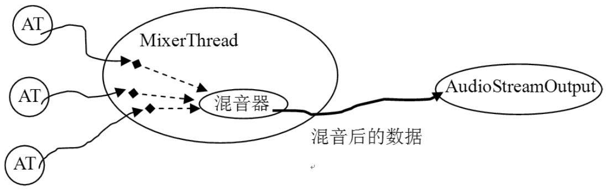
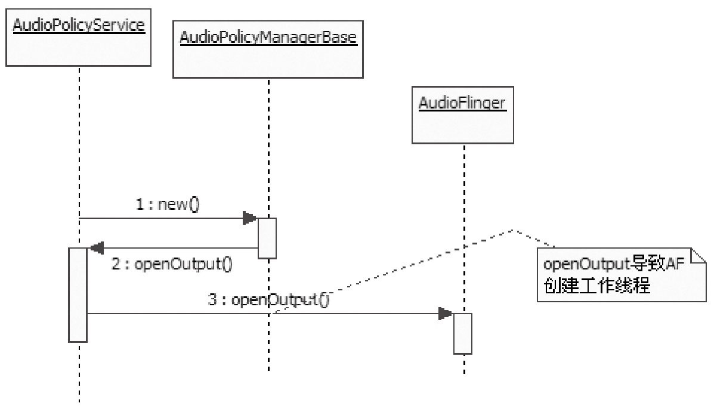

# 7.3.2 通过流程分析AudioFlinger


7.3.2通过流程分析AudioFlinger图7-5中说明的AT和AF交互流程，对于分析AF来说非常重要。先来回顾一下图7-5的流程：

AT调用createTrack，得到一个IAudioTrack对象。

AT调用IAudioTrack对象的start，表示准备写数据了。

AT通过write写数据，这个过程和audio_track_cblk_t有着密切关系。

最后AT调用IAudioTrack的stop或deleteIAudioTrack结束工作。

```
        sp＜IAudioTrack＞ AudioFlinger::createTrack(
                pid_t pid,          //AT的pid号
                int streamType,     //流类型，用例中是MUSIC类型
                uint32_t sampleRate,//8000 采样率
                int format,//PCM_16类型
                int channelCount,   //2，双声道
                int frameCount,     //需要创建的缓冲大小，以帧为单位。
                uint32_t flags,
                const sp＜IMemory＞& sharedBuffer,//AT传入的共享buffer，这里为空。
                int output,         //这个值前面提到过，是AF中的工作线程索引号。
                status_t ＊status)
        {
            sp＜PlaybackThread::Track＞ track;
            sp＜TrackHandle＞ trackHandle;
            sp＜Client＞ client;
            wp＜Client＞ wclient;
            status_t lStatus;
            {
                  Mutex::Autolock _l(mLock);
                  //output代表索引号，这里根据索引号找到一个工作线程，它是一个PlaybackThread。
                  PlaybackThread ＊thread = checkPlaybackThread_l(output);
                //看看这个进程是否已经是AF的Client，AF根据进程pid来标识不同的Client。
                  wclient = mClients.valueFor(pid);
                  if (wclient != NULL) {
                } else {
                      //如果还没有这个Client信息，则创建一个，并加入到mClients中去。
                      client = new Client(this, pid);
                      mClients.add(pid, client);
                  }

                //在找到的工作线程对象中创建一个Track,注意它的类型是Track。
                  track = thread-＞createTrack_l(client, streamType, sampleRate, format,
                          channelCount, frameCount, sharedBuffer, &lStatus);
              }
            /＊
              TrackHandle是Track对象的Proxy，它支持Binder通信，而Track不支持Binder。
              TrackHandle所接收的请求最终会由Track处理，这是典型的Proxy模式。
            ＊/
            trackHandle = new TrackHandle(track);
            return trackHandle;
        }
```

至此，上面的每一步都很清楚了。根据Binder知识可知，AT调用的这些函数最终都会在AF端得到实现，所以可直接从AF端开始。

1.createTrack分析按照前面的流程步骤来看，第一个被调用的函数会是createTrack，请注意在用例中传的参数。代码如下所示：

[--＞AudioFlinger.cpp]这个函数相当复杂，主要原因之一，是其中出现了几个我们没接触过的类。我刚接触这个函数的时候，大脑也曾因为看到这些眼生的东西而“死机”！不过暂时先不用去理会它们，等了解了这个函数后，再回过头来收拾它们。先进入checkPlaybackThread_l看看。

（1）选择工作线程checkPlaybackThread_l的代码如下所示：

[--＞AudioFlinger.cpp]

```cpp
        AudioFlinger::PlaybackThread ＊
                    AudioFlinger::checkPlaybackThread_l(int output) const
        {
            PlaybackThread ＊thread = NULL;
            //根据output的值找到对应的thread。
            if (mPlaybackThreads.indexOfKey(output) ＞= 0) {
                thread = (PlaybackThread ＊)mPlaybackThreads.valueFor(output).get();
            }
            return thread;
        }
```

上面函数中传入的output，就是之前在分析

```
        // Android的很多代码都采用了内部类的方式进行封装，看习惯就好了。
        sp＜AudioFlinger::PlaybackThread::Track＞
              AudioFlinger::PlaybackThread::createTrack_l(
                const sp＜AudioFlinger::Client＞& client,int streamType,
                uint32_t sampleRate,int format,int channelCount,int frameCount,
                const sp＜IMemory＞& sharedBuffer,//注意这个参数，从AT中传入，为0。
                status_t ＊status)
        {
            sp＜Track＞ track;
            status_t lStatus;
            {
                Mutex::Autolock _l(mLock);
              //创建Track对象。
              track = new Track(this, client, streamType, sampleRate, format,
                                channelCount, frameCount, sharedBuffer);
              //将新创建的Track加入到内部数组mTracks中。
                mTracks.add(track);
            }
            lStatus = NO_ERROR;
            return track;
        }
```

AT时提到的工作线程索引号。看到这里，是否感觉有点困惑？困惑的原因可能有二：

目前的流程中尚没有见到创建线程的地方，但在这里确实能找到一个线程。

Output的含义到底是什么？为什么它会作为index来找线程呢？

关于这两个问题，待会儿再做解释。现在只需知道AudioFlinger会创建几个工作线程，AT会找到对应的工作线程即可。

（2）createTrack_l分析找到工作线程后，会执行createTrack_l函数，请看这个函数的作用：

[--＞AudioFlinger.cpp]

```cpp
        AudioFlinger::PlaybackThread::Track::Track( const wp＜ThreadBase＞& thread,
                    const sp＜Client＞& client,int streamType,uint32_t sampleRate,
                    int format,int channelCount,int frameCount,
                      const sp＜IMemory＞& sharedBuffer)
        :    TrackBase(thread, client, sampleRate, format, channelCount,
            frameCount, 0, sharedBuffer),//sharedBuffer仍然为空。
            mMute(false), mSharedBuffer(sharedBuffer), mName(-1)
        {
            // mCblk !=NULL? 什么时候创建的呢？只能看基类TrackBase的构造函数了。
            if (mCblk != NULL) {
                mVolume[0] = 1.0f;
                mVolume[1] = 1.0f;
                mStreamType = streamType;
                mCblk-＞frameSize = AudioSystem::isLinearPCM(format) ?
                                        channelCount ＊ sizeof(int16_t) : sizeof(int8_t);
            }
        }
```

上面的函数调用传入的sharedBuer为空，那共享内存又是在哪里创建的呢？可以注意到Track构造函数中关于sharedBuer这个参数的类型是一个引用，莫非是构造函数创建的？

（3）Track创建共享内存和TrackHandle在createTrack_l中，会new出来一个Track，请看它的代码：

[--＞AudioFlinger.cpp]

```cpp
        AudioFlinger::ThreadBase::TrackBase::TrackBase(
                    const wp＜ThreadBase＞& thread,const sp＜Client＞& client,
                    uint32_t sampleRate,int format,int channelCount,int frameCount,
                    uint32_t flags,const sp＜IMemory＞& sharedBuffer)
            :    RefBase(), mThread(thread),mClient(client), mCblk(0),
                mFrameCount(0),mState(IDLE),mClientTid(-1),mFormat(format),
                mFlags(flags & ～SYSTEM_FLAGS_MASK)
        {
            size_t size = sizeof(audio_track_cblk_t);//得到CB对象的大小。
            //计算数据缓冲的大小。
            size_t bufferSize = frameCount＊channelCount＊sizeof(int16_t);
            if (sharedBuffer == 0) {
            //还记得图7-4吗？共享内存的最前面一部分是audio_track_cblk_t，后面才是数据空间。
              size += bufferSize;
            }
            //根据size创建一块共享内存。
            mCblkMemory = client-＞heap()-＞allocate(size);
            /＊
              pointer()返回共享内存的首地址，并强制转换void＊类型为audio_track_cblk_t＊类型。
              其实把它强制转换成任何类型都可以，但是这块内存中会有CB对象吗？
            ＊/
              mCblk = static_cast＜audio_track_cblk_t ＊＞(mCblkMemory-＞pointer());
            //①下面这句代码看起来很独特。什么意思？？？
              new(mCblk) audio_track_cblk_t();

              mCblk-＞frameCount = frameCount;
              mCblk-＞sampleRate = sampleRate;
              mCblk-＞channels = (uint8_t)channelCount;
              if (sharedBuffer == 0) {
                //清空数据区
                mBuffer = (char＊)mCblk + sizeof(audio_track_cblk_t);
                memset(mBuffer, 0, frameCount＊channelCount＊sizeof(int16_t));
              // flowControlFlag初始值为1。
                mCblk-＞flowControlFlag = 1;
              }
                ......
        }
```

对于这种重重继承，我们只能步步深入分析，一定要找到共享内存创建的地方，继续看代码：

[--＞AudioFlinger.cpp]这里需要重点讲解下面这句话的意思。

```cpp
        new(mCblk) audio_track_cblk_t();
```

注意它的用法，new后面的括号里是内存，紧接其后的是一个类的构造函数。

重点说明这个语句就是C++语言中的placementnew。其含义是在括号里指定的内存中创建一个对象。我们知道，普通的new只能在堆上创建对象，堆的地址由系统分配。这里采用placementnew将使audio_track_cblk_t创建在共享内存上，它

```
        sp＜IAudioTrack＞ AudioFlinger::createTrack（......）
        {
            sp＜TrackHandle＞ trackHandle;
              ......
            track = thread-＞createTrack_l(client, streamType, sampleRate,
                            format,channelCount, frameCount, sharedBuffer, &lStatus);

            trackHandle = new TrackHandle(track);
            return trackHandle; //① 这个trackHandle对象竟然没有在AF中保存！
          }
```

就自然而然地能被多个进程看见并使用了。

关于placementnew较详细的知识，还请读者自己搜索一下。

通过上面的分析可以知道：

Track创建了共享内存。

CB对象通过placementnew方法创建于这块共享内存中。

AF的createTrack函数返回的是一个IAudioTrack类型的对象，可现在碰到的Track对象是IAudioTrack类型的吗？来看代原来，createTrack返回的是TrackHandle对码：

象，它以Track为参数构造。这二者之间又是什么关系呢？

[--＞AudioFlinger.cpp]Android在这里使用了Proxy模式，即TrackHandle是Track的代理，TrackHandle代理的内容是什么呢？分析TrackHandle的定义可以知道：

Track没有基于Binder通信，它不能接收来自远端进程的请求。

TrackHandle能基于Binder通信，它可以接收来自远端进程的请求，并且能调用Track对应的函数。这就是Proxy模式的意思。

讨论Android为什么不直接让Track从IBinder派生，直接支持Binder通信呢？关于这个问题，在看到后面的Track家族图谱后，我们或许就明白了。

另外，注意代码中的注释①：

trackHandle被new出来后直接返回，而AF中并没有保存它，这岂不是成了令人闻之色变的野指针？

说明关于这个问题的答案，请读者自己思考并回答。提示，可从Binder和RefBase入手。

分析完createTrack后，估计有些人会晕头转向的。确实，这个createTrack比较复杂。仅仅是对象类型就层出不穷。到底它有多少种对象，它们之间又有怎样的关系呢？下面就来解决这几个问题。

2.到底有多少种对象？

现在不妨把AudioFlinger中出现的对象总结一下，以了解它们的作用和相互之间的关系。

（1）AudioFlinger对象


```java
        class Client : public RefBase {
            public:
                Client(const sp＜AudioFlinger＞& audioFlinger, pid_t pid);
                virtual                ～Client();
                const sp＜MemoryDealer＞&      heap() const;
                pid_t                   pid() const { return mPid; }
                sp＜AudioFlinger＞     audioFlinger() { return mAudioFlinger; }

            private:
                                      Client(const Client&);
                                      Client& operator = (const Client&);
                sp＜AudioFlinger＞     mAudioFlinger;
                sp＜MemoryDealer＞     mMemoryDealer;//内存分配器
                pid_t                       mPid;
            };
```

作为Audio系统的核心引擎，首先要介绍AudioFlinger。它的继承关系很简单：

```java
        class AudioFlinger : public BnAudioFlinger, public IBinder::DeathRecipient
```

图7-7AF中的所有类AudioFlinger的主要工作由其定义的许多内看，AF够复杂吧？要不是使用了Visual部类来完成，我们用图7-7来表示。图中大括Studio的代码段折叠功能，我画这个图，也号所指向的类为外部类，大括号所包含的为该会颇费周折的。

外部类所定义的内部类。例如，（2）Client对象DuplicatingThread、RecordThread和DirectOutputThread都包括在一个大括号Client是AudioFlinger对客户端的封装，凡是中，这个大括号指向AudioFlinger，所以它使用了AudioTrack和AudioRecord的进程，们三个都是AudioFlinger的内部类，而都被会当作是AF的Client，并且Client用它的AudioFlinger则是它们三个的外部类：

进程pid作为标识。代码如下所示：

Client对象比较简单，因此就不做过多的分析了。

注意一个Client进程可以创建多个AudioTrack，这些AudioTrack都属于同一个Client。

（3）工作线程介绍AudioFlinger中有几种不同类型的工作线程，它们之间的关系如图7-8所示：


图7-8AF中的工作线程家谱下面来解释图7-8中各种类型工作线程的作用：

PlaybackThread：回放线程，用于音频输出。它有一个成员变量mOutput，为AudioStreamOutput*类型，这表明PlaybackThread直接和Audio音频输出设备建立了联系。

RecordThread：录音线程，用于音频输入，它的关系比较单纯。它有一个成员变量mInput，为AudioStreamInput*类型，这表明RecordThread直接和Audio音频输入设备建立了联系。

从PlaybackThread的派生关系上可看出，手机上的音频回放应该比较复杂，否则也不会派生出三个子类了。其中：

MixerThread：混音线程，它将来自多个源的音频数据混音后再输出。

DirectOutputThread：直接输出线程，它会选择一路音频流后将数据直接输出，由于没有混音的操作，这样可以减少很多延时。

DuplicatingThread：多路输出线程，它从MixerThread派生，意味着它也能够混音。它最终会把混音后的数据写到多个输出中，也就是一份数据会有多个接收者。这就是Duplicate的含义。目前在蓝牙A2DP设备输出中使用。

另外从图7-8中还可以看出：

PlaybackThread维护两个Track数组，一个是mActiveTracks，表示当前活跃的Track；另一个是mTracks，表示这个线程创建的所有Track。

DuplicatingThread还维护了一个mOutputTracks，表示多路输出的目的端。后面分析DuplicatingThread时再对此进行讲解。

说明大部分常见音频输出使用的是MixerThread，后文会对此进行详细分析。

另外，在拓展内容中，也将深入分析DuplicatingThread的实现。

（4）PlaybackThread和AudioStreamOutput从图7-8中，可以发现PlaybackThread有一个AudioStreamOutput类型的对象，这个对象提供了音频数据的输出功能。可以用图7-9来表示音频数据的流动轨迹。该图以PlaybackThread最常用的子类MixerThread作为代表。



图7-9音频数据的流动轨迹根据图7-9，就能明白MixerThread的大致工作流程了：

接收来自AT的数据。

对这些数据进行混音。

把混音的结果写到AudioStreamOut中，这样就完成了音频数据的输出。

（5）Track对象前面所说的工作线程，其工作就是围绕Track展开的，图7-10展示了Track的家族：


图7-10Track家族注意这里把RecordTrack也统称为Track。

从图7-10中可看出，TrackHandle和RecordHandle是基于Binder通信的，它作为Proxy，用于接收请求并派发给对应的Track和RecordTrack。

说明从图7-10也能看出，之所以不让Track继承Binder框架，是因为Track本身的继承关系和它所承担的工作已经很复杂了，如再让它掺合Binder，只会乱上添乱。

Track类作为工作线程的内部类来实现，其中：

TrackBase定义于ThreadBase中。

Track定义于PlaybackThread中，RecordTrack定义于RecordThread中。

OutputTrack定义于DuplicatingThread中。

根据前面的介绍可知，音频输出数据最后由Playback线程来处理，用例所对应的Playback线程实际上是一个MixerThread，

```
        AudioFlinger::PlaybackThread ＊
            AudioFlinger::checkPlaybackThread_l(int output) const
        {
          PlaybackThread ＊thread = NULL;
          //根据output的值找到对应的thread
            if (mPlaybackThreads.indexOfKey(output) ＞= 0) {
                thread = (PlaybackThread ＊)mPlaybackThreads.valueFor(output).get();
          }
            return thread;
        }
```

那么它是如何工作的呢？一起来分析。

3.MixerThread分析MixerThread是Audio系统中负担最重的一个工作线程。先来了解一下它的来历。

（1）MixerThread的来历上面这个函数的意思很明确：就是根据前面，在checkplaybackThread_l中，有一个output值找到对应的回放线程。

地方一直没来得及解释。回顾一下它的代码：

但在前面的流程分析中，并没有见到创建线程[--＞AudioFlinger.cpp]的地方，那这个线程又是如何得来的？它又是何时、怎样创建的呢？

答案在AudioPolicyService中。提前看看AudioPolicyService，分析一下它为什么和这个线程有关系。

AudioPolicyService和AudioFlinger一样，

```cpp
        AudioPolicyService::AudioPolicyService()
            : BnAudioPolicyService() , mpPolicyManager(NULL)
        {
            char value[PROPERTY_VALUE_MAX];

            // Tone音播放线程。
            mTonePlaybackThread = new AudioCommandThread(String8(""));
            // 命令处理线程。
            mAudioCommandThread = new AudioCommandThread(String8("ApmCommandThread"));

        #if (defined GENERIC_AUDIO) || (defined AUDIO_POLICY_TEST)
            //这里属于Generic的情况，所以构造AudioPolicyManagerBase，注意构造函数的参数。
            mpPolicyManager = new AudioPolicyManagerBase(this);
        #else
        ......
            //创建和硬件厂商相关的AudioPolicyManager。
        #endif
            ......
        }
```

```cpp
        AudioPolicyManagerBase::AudioPolicyManagerBase(
              AudioPolicyClientInterface ＊clientInterface)
            : mPhoneState(AudioSystem::MODE_NORMAL), mRingerMode(0),
              mMusicStopTime(0), mLimitRingtoneVolume(false)
        {
            mpClientInterface = clientInterface;
            // 先把不相关的内容去掉。
            ......
          /＊
              返回来调用mpClientInterface的openOutput，实际就是AudioPolicyService。
              注意openOutput函数是在AP的创建过程中调用的。
          ＊/
            mHardwareOutput = mpClientInterface-＞openOutput(&outputDesc-＞mDevice,
                                              &outputDesc-＞mSamplingRate,
                                              &outputDesc-＞mFormat,
                                              &outputDesc-＞mChannels,
                                              &outputDesc-＞mLatency,
                                              outputDesc-＞mFlags);
            ......
        }
```

都驻留在MediaServer中，直接看它的构造函数：

[--＞AudioPolicyService.cpp]看AudioPolicyManagerBase的构造函数，注意传给它的参数是this，即把AudioPolicyService对象传进去了。代码如下所示：

[--＞AudioPolicyManagerBase.cpp]

```cpp
        audio_io_handle_t AudioPolicyService::openOutput(uint32_t ＊pDevices,
                                          uint32_t ＊pSamplingRate,
                                          uint32_t ＊pFormat,
                                          uint32_t ＊pChannels,
                                          uint32_t ＊pLatencyMs,
                                          AudioSystem::output_flags flags)
        {
          sp＜IAudioFlinger＞ af = AudioSystem::get_audio_flinger();
          //下面会调用AudioFlinger的openOutput，这个时候AF已经启动了。
            return af-＞openOutput(pDevices, pSamplingRate, (uint32_t ＊)pFormat,
                          pChannels, pLatencyMs, flags);
        }
```

真是山不转水转！咱们还得回到AudioPolicyService中去看看：

[--＞AudioPolicyService.cpp]

```cpp
        int AudioFlinger::openOutput(
        uint32_t ＊pDevices,uint32_t ＊pSamplingRate,uint32_t ＊pFormat,
                uint32_t ＊pChannels,uint32_t ＊pLatencyMs,uint32_t flags)
        {
            ......
            Mutex::Autolock _l(mLock);
            //创建Audio HAL的音频输出对象，和音频输出扯上了关系。
              AudioStreamOut ＊output = mAudioHardware-＞openOutputStream(＊pDevices,
                                                                        (int ＊)&format,
                                                                        &channels,
                                                                        &samplingRate,
                                                                        &status);
              mHardwareStatus = AUDIO_HW_IDLE;
              if (output != 0) {
                  if ((flags & AudioSystem::OUTPUT_FLAG_DIRECT) ||
                      (format != AudioSystem::PCM_16_BIT) ||
                      (channels != AudioSystem::CHANNEL_OUT_STEREO)) {
                      //如果标志为OUTPUT_FLAG_DIRECT,则创建DirectOutputThread。
                      thread = new DirectOutputThread(this, output, ++mNextThreadId);
                    } else {
                  //一般创建的都是MixerThread，注意代表AudioStreamOut对象的output也传进去了。
                    thread = new MixerThread(this, output, ++mNextThreadId);
                  }
                  //把新创建的线程加入线程组mPlaybackThreads中保存, mNextThreadId是它的索引号。
                  mPlaybackThreads.add(mNextThreadId, thread);
                  ......
                return mNextThreadId;//返回该线程的索引号。
              }
              return 0;
        }
```

真是曲折啊，又得到AF去看看：

[--＞AudioFlinger.cpp]



图7-11MixerThread的曲折来历示意图图7-11表明：

AF中工作线程的创建，受到了AudioPolicyService的控制。从AudioPolicyService的角度出发，这也明白了吗？是否感觉有点绕？可用一个简单的是应该的，因为APS控制着整个音频系示意图来观察三者的交互流程，如图7-11所统，而AF只是管理音频的输入和输出。

示：

另外，注意这个线程是在AP的创建过程中产生的。也就是说，AP一旦创建完Audio系统，就已经准备好要工作了。

```
        AudioFlinger::MixerThread::MixerThread(
            const sp＜AudioFlinger＞& audioFlinger,
            AudioStreamOut＊ output, // AudioStreamOut为音频输出设备的HAL抽象。
            int id)
              :    PlaybackThread(audioFlinger, output, id),mAudioMixer(0)
        {
            mType = PlaybackThread::MIXER;
          //混音器对象，这个对象比较复杂，它完成多路音频数据的混合工作。
            mAudioMixer = new AudioMixer(mFrameCount, mSampleRate);
        }
```

```cpp
        AudioFlinger::PlaybackThread::PlaybackThread(const sp＜AudioFlinger＞&
                audioFlinger, AudioStreamOut＊ output, int id)
            :    ThreadBase(audioFlinger, id),
            mMixBuffer(0), mSuspended(0), mBytesWritten(0),
            mOutput(output), mLastWriteTime(0), mNumWrites(0),
            mNumDelayedWrites(0), mInWrite(false)
        {
            //获取音频输出HAL对象的一些信息，包括硬件中音频缓冲区的大小（以帧为单位）。
            readOutputParameters();
            mMasterVolume = mAudioFlinger-＞masterVolume();
            mMasterMute = mAudioFlinger-＞masterMute();
          //设置不同类型音频流的音量及静音情况。
            for (int stream = 0; stream ＜ AudioSystem::NUM_STREAM_TYPES; stream++)
            {
                mStreamTypes[stream].volume =
                              mAudioFlinger-＞streamVolumeInternal(stream);
                mStreamTypes[stream].mute = mAudioFlinger-＞streamMute(stream);
            }
          //发送一个通知消息给监听者，这部分内容较简单，读者可自行研究。
          sendConfigEvent(AudioSystem::OUTPUT_OPENED);
          }
```

关于AF和AP的恩恩怨怨，在后面APS的分析过程中再去探讨。目前，读者只需了解系统中第一个MixerThread的来历即可。下面来分析这个来之不易的MixerThread。

（2）MixerThread的构造和线程启动再来看MixerThread的基类PlaybackThread的构造函数：

[--＞AudioFlinger.cpp]

```cpp
        void AudioFlinger::PlaybackThread::onFirstRef()
        {
            const size_t SIZE = 256;
            char buffer[SIZE];

            snprintf(buffer, SIZE,“Playback Thread %p”, this);
            //下面的run就真正创建了线程并开始执行threadLoop。
            run(buffer, ANDROID_PRIORITY_URGENT_AUDIO);
        }
```

此时，线程对象已经创建完毕。根据对Thread的分析可知，应该调用它的run函数才能真正创建新线程。在首次创建sp时调用了run，这里利用了RefBase的onFirstRef函数。根据MixerThread的派生关系来看，该函数最终由父类PlaybackThread的onFirstRef实现：

[--＞AudioFlinger.cpp]

```cpp
        status_t AudioFlinger::PlaybackThread::Track::start()
        {
            status_t status = NO_ERROR;
            sp＜ThreadBase＞ thread = mThread.promote();
          //该Thread是用例中的MixerThread。
            if (thread != 0) {
                Mutex::Autolock _l(thread-＞mLock);
                int state = mState;
                  if (mState == PAUSED) {
                    mState = TrackBase::RESUMING;
                    } else {
                    mState = TrackBase::ACTIVE;//设置Track的状态
                }
                PlaybackThread ＊playbackThread = (PlaybackThread ＊)thread.get();
                //addTrack_l把这个track加入到mActiveTracks数组中。
                playbackThread-＞addTrack_l(this);
            return status;
        }
```

好，线程已经run起来了。继续按流程分析，下一个轮到的调用函数是start。

4.start分析AT调用的是IAudioTrack的start函数，由于TrackHandle的代理作用，这个函数的处理实际会由Track对象来完成。

[--＞AudioFlinger.cpp]看看这个addTrack_l函数，代码如下所示：

```cpp
        status_t AudioFlinger::PlaybackThread::addTrack_l(const sp＜Track＞& track)
        {
            status_t status = ALREADY_EXISTS;
            //①mRetryCount：设置重试次数，kMaxTrackStartupRetries值为50。
            track-＞mRetryCount = kMaxTrackStartupRetries;
          if (mActiveTracks.indexOf(track) ＜ 0) {
              //②mFillingUpStatus：缓冲状态。
              track-＞mFillingUpStatus = Track::FS_FILLING;
              //原来是把调用start的这个track加入到活跃的Track数组中了。
              mActiveTracks.add(track);
              status = NO_ERROR;
          }
          //广播一个事件，一定会触发MixerThread线程，通知它有活跃数组加入，需要开工干活。
            mWaitWorkCV.broadcast();
            return status;
        }
```

[--＞AudioFlinger.cpp]start函数把这个Track加入到活跃数组后，将触发一个同步事件，这个事件会让工作线程动起来。虽然这个函数很简单，但有两个关键点必须指出，这两个关键点其实指出了两个问题的处理办法：

mRetryCount表示重试次数，它针对的是这样一个问题：如果一个Track调用了start却没有write数据，该怎么办？如果MixerThread尝试了mRetryCount次后还没有可读数据，工作线程就会把该Track从激活队列中去掉了。

mFillingUpStatus能解决这样的问题：假设分配了1MB的数据缓冲，那么至少需要写多少数据的工作线程才会让Track觉得AT是真的需要它工作呢？难道AT写一个字节就需要工作线程兴师动众吗？其实，这个状态最初为Track::FS_FILLING，表示正在填充数据缓冲。在这种状态下，除非AT设置了强制读数据标志（CB对象中的forceReady变量）​，否则工作线程是不会读取该Track的数据的。该状态还有其他的值，读者可以自行研究。

说明我们在介绍大流程的同时也把一些细节问题指出来，希望这些细节问题能激发读者深入研究的欲望。

Track加入工作线程的活跃数组后，又触发了

```cpp
        bool AudioFlinger::MixerThread::threadLoop()
        {
            int16_t＊ curBuf = mMixBuffer;
            Vector＜ sp＜Track＞ ＞ tracksToRemove;
            uint32_t mixerStatus = MIXER_IDLE;
            nsecs_t standbyTime = systemTime();
            ......
            uint32_t sleepTime = idleSleepTime;

            while (!exitPending())
            {
              //① 处理一些请求和通知消息，如之前在构造函数中发出的OUTPUT_OPEN消息等。
              processConfigEvents();

                mixerStatus = MIXER_IDLE;
                { // scope for mLock

                    Mutex::Autolock _l(mLock);
                    //检查配置参数，如有需要则重新设置内部参数值。
                    if (checkForNewParameters_l()) {
                        mixBufferSize = mFrameCount ＊ mFrameSize;
                        maxPeriod = seconds(mFrameCount) / mSampleRate ＊ 3;
                        ......
                    }
                    //获得当前的已激活track数组。
                    const SortedVector＜ wp＜Track＞ ＞& activeTracks = mActiveTracks;
                      ......
                    /＊
                      ② prepareTracks_l将检查mActiveTracks数组，判断是否有AT的数据需要处理。
                      例如有些AudioTrack虽然调用了start，但是没有及时write数据，这时就无须
                      进行混音工作。我们待会再分析prepareTracks_l函数。
                    ＊/
                    mixerStatus = prepareTracks_l(activeTracks, &tracksToRemove);
                }
                // MIXER_TRACKS_READY表示AT已经把数据准备好了。
                if (LIKELY(mixerStatus == MIXER_TRACKS_READY)) {
                    //③ 由混音对象进行混音工作，混音的结果放在curBuf中。
                    mAudioMixer-＞process(curBuf);
                    sleepTime = 0;//等待时间设置为零，表示需要马上输出到Audio HAL中。
                    standbyTime = systemTime() + kStandbyTimeInNsecs;
                }
                    .......

                if (sleepTime == 0) {
                    ......
                    //④ 往Audio HAL的OutputStream中write混音后的数据，这是音频数据的最终归宿。
                    int bytesWritten = (int)mOutput-＞write(curBuf, mixBufferSize);

                    if (bytesWritten ＜ 0) mBytesWritten -= mixBufferSize;
                      ......
                    mStandby = false;
                } else {
                    usleep(sleepTime);
                }
                tracksToRemove.clear();
            }

            if (!mStandby) {
                mOutput-＞standby();
            }
            return false;
        }
```

一个同步事件，MixerThread是否真的动起来了呢？一起来看。

（1）MixerThread动起来Thread类的线程工作都是在threadLoop中完成的，那么MixerThread的线程又会做什么呢？

[--＞AudioFlinger.cpp]从上面的分析可以看出，MixerThread的线程函数大致工作流程是：

如果有通知信息或配置请求，则先完成这些工作。比如向监听者通知AF的一些信息，或者根据配置请求进行音量控制、声音设备切换等。

调用prepareTracks_l函数，检查活跃的Tracks是否有数据已准备好。

调用混音器对象mAudioMixer的process，并且传入一个存储结果数据的缓冲，混音后的结果就存储在这个缓冲中。

调用代表音频输出设备的AudioOutputStream对象的write，把结果数据写入设备。

其中，配置请求处理的工作将在AudioPolicyService的分析中以一个耳机插入处理实例进行讲解。这里主要分析代码中的②③两个步骤。

（2）prepareTracks_l和process分析prepareTracks_l函数检查激活的Track数组，看看其中是否有数据等待使用，代码如下所示：

```cpp
        uint32_t AudioFlinger::MixerThread::prepareTracks_l(
                          const SortedVector＜wp＜Track＞＞& activeTracks,
                          Vector＜sp＜Track＞＞ ＊tracksToRemove)
        {

            uint32_t mixerStatus = MIXER_IDLE;
            //激活Track的个数。
            size_t count = activeTracks.size();

            float masterVolume = mMasterVolume;
            bool   masterMute = mMasterMute;

          //依次查询这些Track的情况。
            for (size_t i=0 ; i＜count ; i++) {
                sp＜Track＞ t = activeTracks[i].promote();
                if (t == 0) continue;

                Track＊ const track = t.get();
              //怎么查？通过audio_track_cblk_t对象。
                audio_track_cblk_t＊ cblk = track-＞cblk();
            /＊
              一个混音器可支持32个Track，它内部有一个32元素的数组，name函数返回的就是Track在
              这个数组中的索引。混音器每次通过setActiveTrack设置一个活跃Track，
              后续所有操作都会针对当前设置的这个活跃Track。
            ＊/
                mAudioMixer-＞setActiveTrack(track-＞name());

              //下面这个判断语句决定了什么情况下Track数据可用。
            if (cblk-＞framesReady() && (track-＞isReady() || track-＞isStopped())
                      && !track-＞isPaused() && !track-＞isTerminated())
                {
                    ......
                    /＊
                      设置活跃Track的数据提供者为Track本身，因为Track从AudioBufferProvider
                      派生。混音器工作时，需从Track得到待混音的数据，也就是AT写入的数据由混音
                      器取出并消费。
                  ＊/
                    mAudioMixer-＞setBufferProvider(track);
                  //设置对应Track的混音标志。
                    mAudioMixer-＞enable(AudioMixer::MIXING);
                    ......
                    //设置该Track的音量等信息，这在以后的混音操作中会使用。
                    mAudioMixer-＞setParameter(param, AudioMixer::VOLUME0, left);
                    mAudioMixer-＞setParameter(param, AudioMixer::VOLUME1, right);
                    mAudioMixer-＞setParameter(
                        AudioMixer::TRACK,
                        AudioMixer::FORMAT, track-＞format());

                      ......
                      mixerStatus = MIXER_TRACKS_READY;
                } else {//如果不满足上面的条件，则走else分支。
                    if (track-＞isStopped()) {
                        track-＞reset();//reset会清零读写位置，表示没有可读数据。
                    }
                    //如果处于这三种状态之一，则加入移除队列。
                    if (track-＞isTerminated() || track-＞isStopped()
                            || track-＞isPaused()) {
                        tracksToRemove-＞add(track);
                        mAudioMixer-＞disable(AudioMixer::MIXING);
                    } else {
                      //不处于上面三种状态时，表示暂时没有可读数据，则重试mRetryCount次。
                      if (--(track-＞mRetryCount) ＜= 0) {
                          tracksToRemove-＞add(track);
                        } else if (mixerStatus != MIXER_TRACKS_READY) {
                            mixerStatus = MIXER_TRACKS_ENABLED;
                        }
                      //禁止这个Track的混音。
                        mAudioMixer-＞disable(AudioMixer::MIXING);
                    ......
                  }
                }
            }
            //对那些被移除的Track做最后的处理。
          ......
            return mixerStatus;
        }
```

[--＞AudioFlinger.cpp]如果所有Track都准备就绪了，最重要的工作就是混音了。混音对象的process也就派上了用场。来看这个process函数，代码如下所示：

[--＞AudioMixer.cpp]

```cpp
        void AudioMixer::process(void＊ output)
        {
            mState.hook(&mState, output);//hook？这是一个函数指针
        }
```

hook是函数指针，它根据Track的个数和它的音频数据格式（采样率等）等情况，使用不同的处理函数。为了进一步了解混音器是如何工作的，需要先分析AudioMixer对象。

```
        AudioMixer::AudioMixer(size_t frameCount, uint32_t sampleRate)
            :    mActiveTrack(0), mTrackNames(0), mSampleRate(sampleRate)
        {
            mState.enabledTracks= 0;
            mState.needsChanged = 0;

            mState.frameCount    = frameCount;//这个值等于音频输出对象的缓冲大小。

            mState.outputTemp    = 0;
            mState.resampleTemp = 0;
            //hook初始化的时候为process__nop，这个函数什么都不会做。
            mState.hook = process__nop;

            track_t＊ t = mState.tracks;      //track_t是和Track相对应的一个结构。

            //最大支持32路混音，也很不错了。
            for (int i=0 ; i＜32 ; i++) {
                ......
                t-＞channelCount = 2;
                t-＞enabled = 0;
                t-＞format = 16;
                t-＞buffer.raw = 0;

                t-＞bufferProvider = 0;       // bufferProvider为这一路Track的数据提供者。
                t-＞hook = 0;                 //每一个Track也有一个hook函数。
                ......
            }
            int                mActiveTrack;
            uint32_t          mTrackNames;
            const uint32_t   mSampleRate;
            state_t           mState

        }
```

（3）AudioMixer对象分析AudioMixer实现在AudioMixer.cpp中，先看构造函数：

[--＞AudioMixer.cpp]

```cpp
        struct state_t {
                uint32_t          enabledTracks;
                uint32_t          needsChanged;
                size_t             frameCount;
                mix_t              hook;
                int32_t           ＊outputTemp;
                int32_t           ＊resampleTemp;
                int32_t           reserved[2];
          /＊
            aligned表示32字节对齐，由于source insight不认识这个标志，导致
            state_t不能被解析。在看代码时，可以注释掉后面的attribute，这样source insight
              就可以识别state_t结构了。
          ＊/
                  track_t           tracks[32]; __attribute__((aligned(32)));
            };
```

其中，mState是在AudioMixer类中定义的一个数据结构。

AudioMixer为hook准备了多个实现函数，来看：

process__validate：根据Track的格式、数量等信息选择其他的处理函数。

process__nop：什么都不做。

process__genericNoResampling：

普通无需重采样。

process__genericResampling：普通需重采样。

process__OneTrack16BitsStereoNoResampling：一路音频流，双声道，PCM16格式，无需重采样。

process__TwoTracks16BitsStereoNoResampling：两路音频流，双声道，PCM16格式，无需重采样。

hook最初的值为process__nop，这一定不会是混音中最终使用的处理函数，难道有动态赋值的地方？是的。一起来看——

```
        status_t AudioMixer::enable(int name)
        {
            switch (name) {
                case MIXING: {
                    if (mState.tracks[ mActiveTrack ].enabled != 1) {
                        mState.tracks[ mActiveTrack ].enabled = 1;
                        //注意这个invalidateState调用。
                        invalidateState(1＜＜mActiveTrack);
                    }
                } break;
                default:
                    return NAME_NOT_FOUND;
            }
            return NO_ERROR;
        }
```

```cpp
        void AudioMixer::invalidateState(uint32_t mask)
          {
            if (mask) {
                mState.needsChanged |= mask;
                mState.hook = process__validate;//将hook设置为process_validate。
            }
          }
```

（4）杀鸡不用宰牛刀——根据情况选择处理函数在AF的prepare_l中，会为每一个准备好的Track使能混音标志：

```
        mAudioMixer-＞setBufferProvider(track);
        mAudioMixer-＞enable(AudioMixer::MIXING);//使能混音
```

请看enable的实现：

[--＞AudioMixer.cpp]

```cpp
        void AudioMixer::process__validate(state_t＊ state, void＊ output)
        {
            uint32_t changed = state-＞needsChanged;
            state-＞needsChanged = 0;

            uint32_t enabled = 0;
            uint32_t disabled = 0;
            ......
            if (countActiveTracks) {
                if (resampling) {
                    ......
                  //如果需要重采样，则选择process__genericResampling。
                    state-＞hook = process__genericResampling;
                } else {
                    ......
                    state-＞hook = process__genericNoResampling;
                    if (all16BitsStereoNoResample && !volumeRamp) {
                        if (countActiveTracks == 1) {
                      //如果只有一个Track，则使用process__OneTrack16BitsStereoNoResampling。
                            state-＞hook = process__OneTrack16BitsStereoNoResampling;
                        }
                    }
                }
            }
          state-＞hook(state, output);
          ......
        }
```

process_validate会根据当前Track的情况选择不同的处理函数，所以不会出现杀鸡却用宰牛刀的情况。

[--＞AudioMixer.cpp]假设用例运行时，系统只有这么一个Track，那么hook函数使用的就是process__OneTrack16BitsStereoNoResampling处理。process_XXX函数会涉及很多数字音频处理的专业知识，先不用去讨论它。数据缓冲的消费工作是在这个函数中完成的，因此应重点关注它是如何通过CB对象使用数据缓冲的。

说明这个数据消费和之前破解AT的过程中所讲的数据生产是对应的，先来提炼AT和AF在生产和消费这两个环节上与CB交互的流程。

（5）怎么消费数据在AudioTrack中，曾讲到数据的生产流程：

```cpp
        void AudioMixer::process__OneTrack16BitsStereoNoResampling(
            state_t＊ state, void＊ output)
        {
            //找到被激活的Track，此时只能有一个Track，否则就不会选择这个process函数了。
            const int i = 31- __builtin_clz(state-＞enabledTracks);
            const track_t& t = state-＞tracks[i];

            AudioBufferProvider::Buffer& b(t.buffer);

            ......
            while (numFrames) {
                b.frameCount = numFrames;
                //BufferProvider就是Track对象，调用它的getNextBuffer获得可读数据缓冲。
                t.bufferProvider-＞getNextBuffer(&b);
                int16_t const ＊in = b.i16;
                ......
                  size_t outFrames = b.frameCount;
                    do {//数据处理，也即混音。
                          uint32_t rl = ＊reinterpret_cast＜uint32_t const ＊＞(in);
                          in += 2;
                          int32_t l = mulRL(1, rl, vrl) ＞＞ 12;
                          int32_t r = mulRL(0, rl, vrl) ＞＞ 12;
                        //把数据复制给out缓冲。
                          ＊out++ = (r＜＜16) | (l & 0xFFFF);
                      } while (--outFrames);
                  }
                  numFrames -= b.frameCount;
                //调用Track的releaseBuffer释放缓冲。
                  t.bufferProvider-＞releaseBuffer(&b);
            }
        }
```

ObtainBuer得到一块数据缓冲。

memcpy数据到该缓冲。

releaseBuer释放这个缓冲。

那么作为消费者，AudioFlinger是怎么获得这些数据的呢？

[--＞AudioMixer.cpp]buerProvider就是Track对象，总结一下它使用数据缓冲的调用流程：

调用Track的getNextBuer，得到可读数据缓冲。

调用Track的releaseBuer，释放数据缓冲。

现在来分析上面这两个函数：getNextBuer

```cpp
        status_t AudioFlinger::PlaybackThread::Track::getNextBuffer(
                          AudioBufferProvider::Buffer＊ buffer)
        {
              audio_track_cblk_t＊ cblk = this-＞cblk();//通过CB对象完成
              uint32_t framesReady;
              //frameCount为AudioOutput音频输出对象的缓冲区大小
              uint32_t framesReq = buffer-＞frameCount;

              ......
              //根据CB的读写指针计算有多少帧数据可读。
              framesReady = cblk-＞framesReady();

              if (LIKELY(framesReady)) {
                uint32_t s = cblk-＞server; //当前读位置
                //可读的最大位置，为当前读位置加上frameCount。
                  uint32_t bufferEnd = cblk-＞serverBase + cblk-＞frameCount;
                //AT可以通过setLooping设置播放的起点和终点，如果有终点的话，需要以loopEnd
                //作为数据缓冲的末尾。
                bufferEnd = (cblk-＞loopEnd ＜ bufferEnd) ? cblk-＞loopEnd : bufferEnd;
                if (framesReq ＞ framesReady) {
                  //如果要求的读取帧数大于可读帧数，则只能选择实际可读的帧数。
                    framesReq = framesReady;
                }
              //如果可读帧数的最后位置超过了AT设置的末端点，则需要重新计算可读帧数。
                if (s + framesReq ＞ bufferEnd) {
                    framesReq = bufferEnd - s;
                }
                //根据读起始位置得到数据缓冲的起始地址，framesReq参数用来做内部检查，防止出错。
                buffer-＞raw = getBuffer(s, framesReq);
                if (buffer-＞raw == 0) goto getNextBuffer_exit;

                buffer-＞frameCount = framesReq;
                return NO_ERROR;
            }

        getNextBuffer_exit:
            buffer-＞raw = 0;
            buffer-＞frameCount = 0;
            return NOT_ENOUGH_DATA;
        }
```

和releaseBuer。

（6）getNextBuer和releaseBuer分析先看getNextBuer。它从数据缓冲中得到一块可读空间，代码如下所示：

[--＞AudioFlinger.cpp]getNextBuer非常简单，不过就是根据CB记录的读写位置等计算可读的缓冲位置。下面来看releaseBuer的操作。代码如下所示：

[--＞AudioFlinger.cpp]

```cpp
        void AudioFlinger::ThreadBase::TrackBase::releaseBuffer(
                    AudioBufferProvider::Buffer＊ buffer)
        {
            buffer-＞raw = 0;
            mFrameCount = buffer-＞frameCount;//frameCount为getNextBuffer中分配的可读帧数。
            step();//调用step函数
            buffer-＞frameCount = 0;
        }
```

[--＞AudioFlinger.cpp]

```cpp
        bool AudioFlinger::ThreadBase::TrackBase::step() {
            bool result;
            audio_track_cblk_t＊ cblk = this-＞cblk();
          //调用stepServer更新读位置。
            result = cblk-＞stepServer(mFrameCount);
            if (!result) {
                mFlags |= STEPSERVER_FAILED;
            }
            return result;
        }
```

getNextBuer和releaseBuer这两个函数相对比较简单。把它和CB交互的流程总结一下，为后面进行CB对象的分析做铺垫：

getNextBuer通过frameReady得到可读帧数。

```
        void AudioFlinger::PlaybackThread::Track::stop()
        {
            sp＜ThreadBase＞ thread = mThread.promote();
            if (thread != 0) {
                Mutex::Autolock _l(thread-＞mLock);
                int state = mState;  //保存旧的状态。
                if (mState ＞ STOPPED) {
                    mState = STOPPED;//设置新状态为STOPPED。
                    PlaybackThread ＊playbackThread = (PlaybackThread ＊)thread.get();
                    if (playbackThread-＞mActiveTracks.indexOf(this) ＜ 0) {
                        reset();     //如果该线程的活跃数组中没有Track，则重置读写位置。
                    }
                }
                //和APS相关，我们不在这里讨论，它不直接影响AudioFlinger。
                if (!isOutputTrack() && (state == ACTIVE || state == RESUMING)) {
                    thread-＞mLock.unlock();
                    AudioSystem::stopOutput(thread-＞id(),
                        (AudioSystem::stream_type)mStreamType);
                    thread-＞mLock.lock();
                }
            }
        }
```

getBuer函数将根据可读帧数等信息得到可读空间的首地址。

releaseBuer通过stepServer更新读位置。

5.stop分析（1）TrackHandle和Track的回收来自AT的stop请求最终会通过TrackHandle这个Proxy交给Track的stop处理。请直接看Track的stop，代码如下所示：

[--＞AudioFlinger.cpp]如果Track最初处于活跃数组中，那么这个stop函数无非是把mState设置为STOPPED了，但播放该怎么停止呢？请再回头看prepareTrack_l中的那个判断：

```cpp
        if (cblk-＞framesReady() && (track-＞isReady() || track-＞isStopped())
          && !track-＞isPaused() && !track-＞isTerminated())
```

假设AT写数据快，而AF消耗数据慢，那么上面这个判断语句在一定时间内是成立的，换言之，如果仅仅调用了stop，还是会听到声音，该怎么办？在一般情况下，AT端stop后会很快被delete，这将导致AF端的TrackHandle也被delete。

说明在介绍Track和TrackHandle的一节中，曾在最后提到了那个野指针问题。相信读者这时候会知道那个问题的答案了，是吗？

看TrackHandle的析构函数，代码如下所示：

[--＞AudioFlinger.cpp]

```cpp
        AudioFlinger::TrackHandle::～TrackHandle() {
            mTrack-＞destroy();
        }
```

```cpp
        void AudioFlinger::PlaybackThread::Track::destroy()
        {
            sp＜Track＞ keep(this);
            {
                sp＜ThreadBase＞ thread = mThread.promote();
                if (thread != 0) {
                    if (!isOutputTrack()) {
                        //和AudioSystem相关，以后再分析
                        if (mState == ACTIVE || mState == RESUMING) {
                            AudioSystem::stopOutput(thread-＞id(),
                          (AudioSystem::stream_type)mStreamType);
                        }
                        AudioSystem::releaseOutput(thread-＞id());
                    }
                    Mutex::Autolock _l(thread-＞mLock);
                    PlaybackThread ＊playbackThread = (PlaybackThread ＊)thread.get();
                    //调用回放线程对象的destroyTrack_l。
                    playbackThread-＞destroyTrack_l(this);
                }
            }
        }
```

[--＞AudioFlinger.cpp]

```cpp
        void AudioFlinger::PlaybackThread::destroyTrack_l(const sp＜Track＞& track)
        {
            track-＞mState = TrackBase::TERMINATED;//设置状态为TERMINATED。
            if (mActiveTracks.indexOf(track) ＜ 0) {
                mTracks.remove(track);             //如果不在mActiveTracks数组中，则把它从mTracks中去掉。
                //由PlaybackThread的子类实现，一般就是做回收一些资源等工作。
                deleteTrackName_l(track-＞name());
            }
        }
```

```cpp
        AudioFlinger::ThreadBase::TrackBase::～TrackBase()
        {
        if (mCblk) {
              //placement new出来的对象需要显示调用的析构函数。
                mCblk-＞～audio_track_cblk_t();
                if (mClient == NULL) {
                    delete mCblk;//先调用析构，再释放内存，这是placement new的用法。
                }
            }
            mCblkMemory.clear();
            if (mClient != NULL) {
                Mutex::Autolock _l(mClient-＞audioFlinger()-＞mLock);
                mClient.clear();//如果mClient的强弱引用计数都为0，则会导致该Client被delete。
            }
        }
```

TrackHandle的delete最后会导致它所代理的Track对象也被删除，那么Client对象什么时[--＞AudioFlinger.cpp]候被回收呢？

（2）Client的回收直接看TrackBase的析构，因为Track的析构会导致它的基类TrackBase析构函数被调用，代码如下所示：

[--＞AudioFlinger.cpp]资源回收的工作相对比较简单，这里就不做过多的讨论了，读者可自行分析研究。

说明其实，要找到TrackHandle是什么时候被delete会更有难度。
