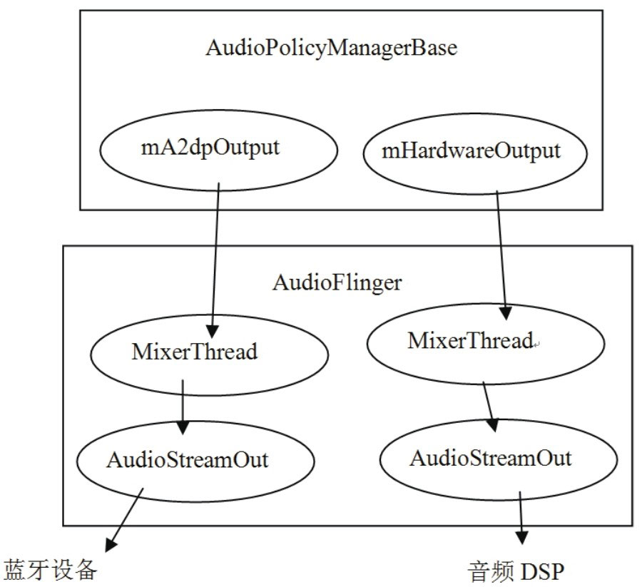

# 7.4.1 AudioPolicyService的创建


```
        AudioPolicyService::AudioPolicyService()
                    : BnAudioPolicyService() ,
        //mpPolicyManager是Audio系统中的另一种HAL对象，它的类型是AudioPolicyInterface。
                    mpPolicyManager(NULL)
        {
              char value[PROPERTY_VALUE_MAX];
            //TonePlayback 用于播放Tone音，Tone包括按键音等。
            mTonePlaybackThread = new AudioCommandThread(String8(""));
            //用于处理控制命令，例如路由切换、音量调节等。
            mAudioCommandThread = new AudioCommandThread(String8("ApmCommandThread"));

        #if (defined GENERIC_AUDIO) || (defined AUDIO_POLICY_TEST)
            //注意AudioPolicyManagerBase的构造函数，把this传进去了。
              mpPolicyManager = new AudioPolicyManagerBase(this);

        #else
        ...
            //使用硬件厂商实现的AudioPolicyInterface。
            mpPolicyManager = createAudioPolicyManager(this);
        #endif
          //根据系统属性来判断照相机拍照时是否强制发声。为了防止偷拍，强制按快门的时候必须发出声音。
            property_get("ro.camera.sound.forced", value, "0");
            mpPolicyManager-＞setSystemProperty("ro.camera.sound.forced", value);
        }
```

7.4.1AudioPolicyService的创建AudioPolicyService和AudioFlinger都驻留于一个进程，之前在“MixerThread的来历”一节中，曾简单介绍过APS的创建，现在需要仔细观察其中的内容。

1.创建AudioPolicyServiceAudioPolicyService的代码如下所示：

[--＞AudioPolicyService.cpp]和AudioFlinger中的AudioHardwareInterface一样，在APS中可以见到另外一个HAL层对象AudioPolicyInterface，为什么在APS中也会存在HAL对象呢？

如前所述，APS主要是用来控制Audio系统的，由于各个硬件厂商的控制策略不可能完全一致，所以Android把这些内容抽象成一个HAL对象。下面来看这个

```cpp
        class AudioPolicyInterface
        {

        public:
        ......
              //设置设备的连接状态，这些设备包括耳机、蓝牙等。
            virtual status_t setDeviceConnectionState(
                                  AudioSystem::audio_devices device,
                                  AudioSystem::device_connection_state state,
                                  const char ＊device_address) = 0;
            //设置系统Phone状态，这些状态包括通话状态、来电状态等。
            virtual void setPhoneState(int state) = 0;
            //设置force_use的config策略，例如通话中强制使用扬声器。
            virtual void setForceUse(AudioSystem::force_use usage,
                              AudioSystem::forced_config config) = 0;

              /＊
                audio_io_handle_t是int类型。这个函数的目的是根据传入的参数类型
                找到合适的输出句柄。这个句柄，在目前的Audio系统代表AF中的某个工作线程。
                还记得创建AudioTrack的时候传入的那个output值吗？它就是通过这个函数得到的。
                关于这个问题，马上会分析到。
            ＊/
            virtual audio_io_handle_t getOutput(
                    AudioSystem::stream_type stream,
                              uint32_t samplingRate = 0,
                              uint32_t format = AudioSystem::FORMAT_DEFAULT,
                              uint32_t channels = 0,
                              AudioSystem::output_flags flags =
                              AudioSystem::OUTPUT_FLAG_INDIRECT) = 0;

            //下面两个函数以后会介绍。它们的第二个参数表示使用的是音频流类型。
          virtual status_t startOutput(audio_io_handle_t output,
                                AudioSystem::stream_type stream) = 0;

          virtual status_t stopOutput(audio_io_handle_t output,
                              AudioSystem::stream_type stream) = 0;
            ......

            //音量控制：设置不同音频流的音量级别范围，例如MUSIC有15个级别的音量。
            virtual void initStreamVolume(AudioSystem::stream_type stream,
                                            int indexMin,
                                            int indexMax) = 0;
            //设置某个音频流类型的音量级，例如觉得music声音太小时，可以调用这个函数提高音量级。
          virtual status_t setStreamVolumeIndex(AudioSystem::stream_type stream,
                                          int index) = 0;
        }
```

AudioPolicyInterface。

2.AudioPolicyInterface分析AudioPolicyInterface比AudioHardwareInterface简单直接。这里，只需看几个重点函数即可，代码如下所示：

[--＞AudioPolicyInterface.h]从上面的分析可知，AudioPolicyInterface主要提供了一些设备切换管理和音量控制的接口。每个厂商都有各自的实现方式。目前，Audio系统提供了一个通用的实现类AudioPolicyManagerBase，以前这个类是放在hardware目录下的，现在放到framework目录中了。图7-12展示了AP和HAL类之间的关系：


图7-12AudioPolicy和AudioPolicyInterface的关系其中：

AudioPolicyService有一个AudioPolicyInterface类型的对象。

AudioPolicyManagerBase有一个

```
        enum stream_type {
                DEFAULT             =-1,//默认
                VOICE_CALL         = 0, //通话声
                SYSTEM             = 1, //系统声，例如开关机提示
                RING                = 2,//来电铃声
                MUSIC               = 3,//媒体播放声
                ALARM               = 4,//闹钟等的警告声
                NOTIFICATION      = 5,  //短信等的提示声
                BLUETOOTH_SCO     = 6,  //蓝牙SCO
                ENFORCED_AUDIBLE = 7,   //强制发声，照相机的快门声就属于这个类型
                DTMF                = 8,//DTMF,拨号盘的按键声
                TTS                 = 9,//文本转语音，Text to Speech
                NUM_STREAM_TYPES
            };
```

AudioPolicyClientInterface的对象。

AudioPolicyInterface中的一些函数在后面会分析到，这些函数中有很多参数都是以AudioSystem::xxx方式出现的，那么AudioSystem又是什么呢？

3.AudioSystem介绍AudioSystem是一个Native类，这个类在Java层有对应的Java类，其中定义了一些重要的类型，比如音频流流程、音频设备等，这些都在AudioSystem.h中。下面来看其中的一些定义。

（1）streamtype（音频流类型）

音频流类型，我们已在AudioTrack中见识过了，其完整定义如下：

音频流类型有什么用呢？为什么要做这种区分呢？它主要与两项内容有关：

设备选择：例如，之前在创建AudioTrack时，传入的音频流类型是MUSIC，当插上耳机时，这种类型的声音只会从耳机中出来，但如果音频流类型是RING，则会从耳机和扬声器中同时传出来。

音量控制：不同流类型音量级的个数不同，例如，MUSIC类型有15个级别可供用户调节，而有些类型只有7个级别的音量。

（2）audiomode（声音模式）

audiomode和电话的状态有直接关系。先看它的定义：

```
        enum audio_mode {
                MODE_INVALID = -2,
                MODE_CURRENT = -1,
                MODE_NORMAL = 0, //正常，既不打电话，也没有来电
                MODE_RINGTONE,   //有来电
                MODE_IN_CALL,    //通话状态
                NUM_MODES
        };
```

为什么Audio需要特别强调Phone的状态呢？

这必须和智能手机的硬件架构联系上。先看智能手机的硬件架构，如图7-13所示：


图7-13智能手机的硬件架构图从图7-13中看出了什么？

系统有一个音频DSP，声音的输入输出都要经过它（不考虑蓝牙的情况）​。但它处理完的数字信号，需通过D/A（数/模）转换后输出到最终的设备上，这些设备包括扬声器、听筒、耳机等。

注意所谓的设备切换，是指诸如扬声器切换到听筒的情况，而前面常提到的音频输出设备，应该指的是DSP。

系统有两个核心处理器，一个是应用处理的核心，叫AP（ApplicationProcessor）​，可把它当做台式机上的CPU，在这上面可以运行操作系统。另一个和手机通信相关，一般叫BP（BasebandProcessor基带处理器）​，可把它当做台式机上的“猫”​。

AP和BP都能向音频DSP发送数据，它们在硬件的通路上互不干扰。于是就出现了一个问题，即如果两个P同时往DSP发送数据，而互相之间没有协调，那么就可能出现通话声和音乐声混杂的情况。谁还会用这样的手机？所以打电话时，将由AP上的Phone程序主动设置Audio系统的mode，在这种mode下，Audio系统会做一些处理，例如把music音量调小等。

注意图中的蓝牙了吗？它没有像AP那样直接和音频DSP相连，所以音频数据需要单独发给蓝牙设备。如果某种声音要同时从蓝牙和扬声器发出，亦即一份数据要往两个地方发送，便满足了AudioFlinger中DuplicatingThread出现的现实要求。

注意蓝牙设备实际上会建立两条数据通路：SCO和A2DP。A2DP和高质量立体声有关，且必须由AudioFlinger向它发送数据。所以“音频数据需要单独发送给蓝牙设备”​，其中这个设备实际上是指蓝牙的A2DP设备。蓝牙技术很复杂，有兴趣的读者可以自行研究。

（3）forceuse和config（强制使用及配置）

```
            enum forced_config {
                    FORCE_NONE,
                    FORCE_SPEAKER,   //强制使用扬声器
                    FORCE_HEADPHONES,
                    FORCE_BT_SCO,
                    FORCE_BT_A2DP,
                    FORCE_WIRED_ACCESSORY,
                    FORCE_BT_CAR_DOCK,
                    FORCE_BT_DESK_DOCK,
                    NUM_FORCE_CONFIG,
                    FORCE_DEFAULT = FORCE_NONE
            }
```

大家知道，手机通话时可以选择扬声器输出，这就是强制使用的案例。Audio系统对此有很好的支持。它涉及两个方面：

强制使用何种设备，例如使用扬声器、听筒、耳机等。它由forced_config控制，代码如下所示：

```
        enum audio_devices {
                // output devices
                DEVICE_OUT_EARPIECE = 0x1,         //听筒
                DEVICE_OUT_SPEAKER = 0x2,          //扬声器
                DEVICE_OUT_WIRED_HEADSET = 0x4,    //耳机
                DEVICE_OUT_WIRED_HEADPHONE = 0x8,  //另外一种耳机
                DEVICE_OUT_BLUETOOTH_SCO = 0x10,   //蓝牙相关，SCO用于通话的语音传输。
                DEVICE_OUT_BLUETOOTH_SCO_HEADSET = 0x20,
                DEVICE_OUT_BLUETOOTH_SCO_CARKIT = 0x40,
                DEVICE_OUT_BLUETOOTH_A2DP = 0x80,  //蓝牙相关，A2DP用于立体声传输。
                DEVICE_OUT_BLUETOOTH_A2DP_HEADPHONES = 0x100,
                DEVICE_OUT_BLUETOOTH_A2DP_SPEAKER = 0x200,
                DEVICE_OUT_AUX_DIGITAL = 0x400,
                DEVICE_OUT_DEFAULT = 0x8000,
                ......
        }
```

```cpp
        virtual void setForceUse(AudioSystem::force_use usage,//什么情况
                          AudioSystem::forced_config config   //什么设备
                          ) = 0;
```

在什么情况下需要强制使用，是通话的强制使用，还是听音乐的强制使用？这须由force_use控制，代码如下所示：

```
            enum force_use {
                FOR_COMMUNICATION,//通话情况，注意前缀是FOR_XXX。
                FOR_MEDIA,        //听音乐等媒体相关的情况。
                FOR_RECORD,
                FOR_DOCK,
                NUM_FORCE_USE
        }
```

（4）输出设备的定义前面曾反复提到输出设备。这些设备在软件中是怎么表示的呢？Audio定义了很多输出设备，来看其中几个：

所以，AudioPolicyInterface的setForceUse函数，就是设置在什么情况下强制使用什么设备：

至此，AudioSystem中常用的定义都已见过了，现在要回到APS的创建上了。对于这个例

```
        AudioPolicyManagerBase::AudioPolicyManagerBase(
                                    AudioPolicyClientInterface ＊clientInterface)
                                  :mPhoneState(AudioSystem::MODE_NORMAL), mRingerMode(0),
                                    mMusicStopTime(0),mLimitRingtoneVolume(false)
        {
            //APS实现了AudioPolicyClientInterface接口。
            mpClientInterface = clientInterface;//这个clientInterface就是APS对象。

              //清空强制使用配置。
              for (int i = 0; i ＜ AudioSystem::NUM_FORCE_USE; i++) {
                  mForceUse[i] = AudioSystem::FORCE_NONE;
              }

              //输出设备有听筒和扬声器。
              mAvailableOutputDevices = AudioSystem::DEVICE_OUT_EARPIECE |
                                  AudioSystem::DEVICE_OUT_SPEAKER;
            //输入设备是内置的麦克（学名叫传声器）。
              mAvailableInputDevices = AudioSystem::DEVICE_IN_BUILTIN_MIC;

        #ifdef WITH_A2DP                        //和蓝牙立体声有关。
              mA2dpOutput = 0;
              mDuplicatedOutput = 0;
              mA2dpDeviceAddress = String8("");
        #endif
              mScoDeviceAddress = String8("");  //SCO主要用于通话。
          /＊
              ①创建一个AudioOutputDescriptor对象，这个对象用来记录并维护与
              输出设备（相当于硬件的音频DSP）相关的信息，例如使用该设备的流个数、各个流的音量、
              该设备所支持的采样率、采样精度等。其中，有一个成员mDevice用来表示目前使用的输出设备，
              例如耳机、听筒、扬声器等。
          ＊/
              AudioOutputDescriptor ＊outputDesc = new AudioOutputDescriptor();
              outputDesc-＞mDevice = (uint32_t)AudioSystem::DEVICE_OUT_SPEAKER;

          /＊
              ②还记得MixerThread的来历吗？openOutput导致AF创建了一个工作线程。
              该函数返回的是一个工作线程索引号。
          ＊/
              mHardwareOutput = mpClientInterface-＞openOutput(&outputDesc-＞mDevice,
                                              &outputDesc-＞mSamplingRate,
                                              &outputDesc-＞mFormat,
                                              &outputDesc-＞mChannels,
                                              &outputDesc-＞mLatency,
                                              outputDesc-＞mFlags);

              ......
              //AMB维护了一个与设备相关的key/value集合，下面将对应的信息加到该集合中。
              addOutput(mHardwareOutput, outputDesc);
              //③设置输出设备，就是设置DSP的数据流到底从什么设备出去，这里设置的是从扬声器出去。
              setOutputDevice(mHardwareOutput,
                              (uint32_t)AudioSystem::DEVICE_OUT_SPEAKER, true);
              }
            //④更新不同策略使用的设备。
              updateDeviceForStrategy();
          }
```

子，将使用Generic的设备，所以会直接创建AudioPolicyManagerBase对象，这个对象实现了AudioPolicyInterface的所有功能。一起来看。

说明实际上很多硬件厂商实现的AudioPolicyInterface，基本上是直接使用这个AudioPolicyManagerBase的。

4.AudioPolicyManagerBase分析AudioPolicyManagerBase类在AudioPolicyManagerBase.cpp中实现，先来看它的构造函数：

[--＞AudioPolicyManagerBase.cpp]关于AMB这个小小的构造函数，有几个重要点需要介绍：

（1）AudioOutputDescriptor和openOutputAudioOutputDescriptor对象，是AMB用来控制和管理音频输出设备的，从硬件上看，它代表的是DSP设备。关于这一点已在注释中做出了说明，这里就不再赘述。

另一个重要点是openOutput函数。该函数的实现由APS来完成。之前曾分析过，它最终会在AF中创建一个混音线程（不考虑DirectOutput的情况）​，该函数返回的是该线程在AF中的索引号，亦即：

```cpp
        mHardwareOutput = mpClientInterface-＞openOutput(......)
```

mHardwareOutput表示的是AF中一个混音线程的索引号。这里涉及一个非常重要的设计问题：AudioFlinger到底会创建多少个MixerThread？有两种设计方案：

一种是一个MixerThread对应一个Track。如果这样，AMB仅使用一个mHardwareOutput恐怕不够用。

另一种是用一个MixerThread支持32路的Track数据，多路数据通过AudioMixer混音对象在软件层面进行混音。

这里用的是第二种方案，当初设计时为何不用一个MixerThread支持一路Track，然后把混音的工作交给硬件来完成呢？我觉得原因之一是如果采用一个线程一个Track的方式，会非常难管理和控制，另一个原因是多线程比较浪费资源。

采用第二种方法（也就是现有的方案）​，极大地简化了AMB的工作量。图7-14展示了AMB和AF及MixerThread之间的关系：



图7-14AF、AMB及MixerThread之间的关系图7-14表明：

AMB中除了mHardwareOutput外，还有一个mA2dpOutput，它对应的MixerThread专往代表蓝牙A2DP设备的AudioStreamOut上发送数据。关于这个问题，在后面分析DuplicatingThread时可以见到。

注意使用mA2dpOutput需要蓝牙设备连接上才会有意义。

除了蓝牙外，系统中一般也就只有图7-14右边的这么一个MixerThread了，所以AMB通过mHardwareOutput就能控制整个系统的声音，这真是一劳永逸。

说明关于这一点，现在通过setOutputDevice来分析。

（2）setOutputDevice现在要分析的调用是setOutputDevice，目的是为DSP选择一个合适的输出设备。注意它的

```
        void AudioPolicyManagerBase::setOutputDevice(audio_io_handle_t output,
                                      uint32_t device, bool force, int delayMs)
        {
            AudioOutputDescriptor ＊outputDesc = mOutputs.valueFor(output);
            //判断是否是Duplicate输出，和蓝牙A2DP有关，后面再做分析。
            if (outputDesc-＞isDuplicated()) {
                setOutputDevice(outputDesc-＞mOutput1-＞mId, device, force, delayMs);
                setOutputDevice(outputDesc-＞mOutput2-＞mId, device, force, delayMs);
                return;
          }
          // 初始设置的输出设备为听筒和扬声器。
            uint32_t prevDevice = (uint32_t)outputDesc-＞device();
            if ((device == 0 || device == prevDevice) && !force) {
                return;
            }
          //现在设置新的输出设备为扬声器，注意这是软件层面上的设置。
            outputDesc-＞mDevice = device;
              ......
          /＊
            还需要硬件也做相应的设置，主要是告诉DSP把它的输出切换到某个设备上，根据之前的分析可知，
            这个请求要发送到AF中的MixerThread上，因为只有它拥有代表输出设备的AudioStreamOut
            对象。
          ＊/
            AudioParameter param = AudioParameter();
            param.addInt(String8(AudioParameter::keyRouting), (int)device);
          /＊
          上面的配置参数将投递到APS的消息队列，而APS中创建的AudioCommandThread
          会取出这个配置参数，再投递给AF中对应的MixerThread，最终由MixerThread处理。
          这个流程，将在耳机插拔事件处理中进行分析。
        ＊/
            mpClientInterface-＞setParameters(mHardwareOutput,
                                                    param.toString(),delayMs);
            ......
        }
```

第一个参数是传入的mHardwareOutput，它最终会找到代表DSP的AudioStreamOut对象，第二个参数是一个设备号，代码如下所示：

[--＞AudioPolicyManagerBase.cpp]setOutputDevice要实现的目的已经很明确，只是实现的过程比较烦琐而已。其间没有太多复杂之处，读者可自行研究，以加深对Audio系统的了解。

（3）AudioStrategy现调用的函数是updateDeviceForStrategy，这里会引出一个strategy的概念。先看updataDeviceForStrategy函数：

[--＞AudioPolicyManagerBase.cpp]

```cpp
        void AudioPolicyManagerBase::updateDeviceForStrategy()
        {
            for (int i = 0; i ＜ NUM_STRATEGIES; i++) {
                mDeviceForStrategy[i] =
                                      getDeviceForStrategy((routing_strategy)i, false);
            }
        }
```

关于getDeviceForStrategy，在耳机插拔事件中再做分析，现在先看routing_strategy的定义，代码如下所示：

[--＞getDeviceForStrategy.h::routing_strategy]

```c
        //routing_strategy:路由策略
        enum routing_strategy {
                    STRATEGY_MEDIA,
                    STRATEGY_PHONE,
                    STRATEGY_SONIFICATION,
                    STRATEGY_DTMF,
                    NUM_STRATEGIES
                }
```

它是在AudioPolicyManagerBase.h中定义的，一般的应用程序不会使用这个头文件。这个routing_strategy有什么用处呢？从名字上看，似乎和路由的选择有关系，但

```
        AudioPolicyManagerBase::getStrategy(AudioSystem::stream_type stream)
        {
            switch (stream) {
            case AudioSystem::VOICE_CALL:
            case AudioSystem::BLUETOOTH_SCO:
                return STRATEGY_PHONE;        //PHONE路由策略
            case AudioSystem::RING:
            case AudioSystem::NOTIFICATION:
            case AudioSystem::ALARM:
            case AudioSystem::ENFORCED_AUDIBLE:
                return STRATEGY_SONIFICATION; //SONIFICATION路由策略
            case AudioSystem::DTMF:
                return STRATEGY_DTMF;         //DTMF路由策略
            default:
                LOGE("unknown stream type");
            case AudioSystem::SYSTEM:
            case AudioSystem::TTS:
            case AudioSystem::MUSIC:
                return STRATEGY_MEDIA;        //media 路由策略
            }
        }
```

AudioSystem定义的是streamtype，这两者之间会有什么关系吗？有，而且还很紧密。这个关系通过AMB的getStrategy就可以看出来。它会从指定的流类型得到对应的路由策略，代码如下所示：

[--＞AudioPolicyManagerBase.cpp]从这个函数中可看出，AudioSystem使用的流类型并不是和路由直接相关的，AMB或AudioPolicy内部是使用routing_strategy来控制路由策略的。

5.小结这一节涉及不少新东西，但本人觉得最重要的还是图7-13和图7-14。其中：

图7-13展示了智能手机的硬件架构，通过和Audio相关的架构设计，我们能理解Audio系统的设计缘由。

图7-14展示了APS和AF内部联系的纽带，后续APS的控制无非就是找到对应的MixerThread，给它发送控制消息，最终由MixerThread将控制信息传给对应的代表音频输出设备的HAL对象。
