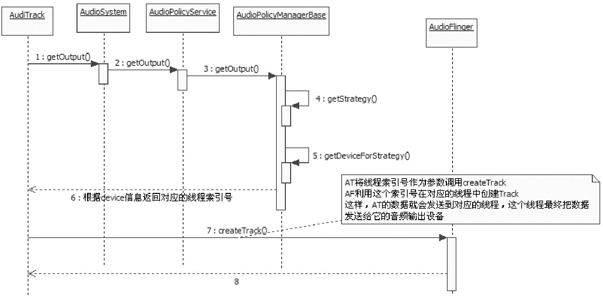

# 7.4.2 重回AudioTrack


从前文所介绍的内容可知，AudioTrack在调用createTrack时，会传入一个audio_handle_t，这个值表示AF中某个工作线程的索引号，而它又是从APS中得到的。那么，这中间又有哪些曲折的经历呢？

先回顾一下AudioTrack的set函数。

1.重回set先来看相应的代码，如下所示：

[---＞AudioTrack.cpp]

```cpp
        audio_io_handle_t AudioSystem::getOutput(stream_type stream,
                                              uint32_t samplingRate,
                                              uint32_t format,
                                              uint32_t channels,
                                              output_flags flags)
        {
            audio_io_handle_t output = 0;
            ......
            if (output == 0) {
                const sp＜IAudioPolicyService＞& aps =
                                              AudioSystem::get_audio_policy_service();
                if (aps == 0) return 0;
                //调用AP的getOutput函数。
                output = aps-＞getOutput(stream, samplingRate, format, channels, flags);
                if ((flags & AudioSystem::OUTPUT_FLAG_DIRECT) == 0) {
                    Mutex::Autolock _l(gLock);
                  //把这个stream和output的对应关系保存到map中。
                    AudioSystem::gStreamOutputMap.add(stream, output);
                }
            }
            return output;
        }
```

再看AudioSystem是如何实现getOutput的，代码如下所示：

[--＞AudioSystem.cpp]这里调用了AP的getOutput，来看：

[--＞AudioPolicyService.cpp]

```cpp
        audio_io_handle_t AudioPolicyManagerBase::getOutput(
                              AudioSystem::stream_type stream, uint32_t samplingRate,
                              uint32_t format,uint32_t channels,
                              AudioSystem::output_flags flags)
        {
            audio_io_handle_t output = 0;
            uint32_t latency = 0;
            //根据流类型得到对应的路由策略，这个我们已经见过了，MUSIC类型返回MUSIC策略。
            routing_strategy strategy = getStrategy((AudioSystem::stream_type)stream);
          //根据策略得到使用这个策略的输出设备（指扬声器之类的），以后再看这个函数。
            uint32_t device = getDeviceForStrategy(strategy);
        ......
            //看这个设备是不是与蓝牙的A2DP相关。
            uint32_t a2dpDevice = device & AudioSystem::DEVICE_OUT_ALL_A2DP;
            if (AudioSystem::popCount((AudioSystem::audio_devices)device) == 2) {
        #ifdef WITH_A2DP
              //对于有A2DP支持的，a2dpUsedForSonification函数直接返回true。
          if (a2dpUsedForSonification() && a2dpDevice != 0) {
              //和DuplicatingThread相关，以后再看。
                output = mDuplicatedOutput;
          } else
        #endif
                {
                  output = mHardwareOutput; //使用非蓝牙的混音输出线程。
                }
            } else {
        #ifdef WITH_A2DP
                if (a2dpDevice != 0) {
                    //使用蓝牙的混音输出线程。
                    output = mA2dpOutput;
                } else
        #endif
                {
                    output = mHardwareOutput;
                }
            }
          return output;
        }
```

```cpp
        audio_io_handle_t AudioPolicyService::getOutput(
                                    AudioSystem::stream_type stream, uint32_t samplingRate,
                                    uint32_t format,uint32_t channels,
                                    AudioSystem::output_flags flags)
        {
            //和硬件厂商的实现相关，所以交给AudioPolicyInterface处理。
            //这里将由AudioPolicyManagerBase处理。
              Mutex::Autolock _l(mLock);
              return mpPolicyManager-＞getOutput(stream, samplingRate, format, channels,
                                                        flags);
        }
```

[-＞AudioPolicyManagerBase.cpp]终于明白了！原来，AudioSystem的getOutput就是想找到AF中的一个工作线程。为什么这个线程号会由AP返回呢？是因为Audio系统需要：

根据流类型找到对应的路由策略。

根据该策略找到合适的输出device（指扬声器、听筒之类的）​。

根据device选择AF中合适的工作线程，例如是蓝牙的MixerThread，还是DSP的MixerThread，或者是DuplicatingThread。

AT根据得到的工作线程索引号，最终将在对应的工作线程中创建一个Track。

之后，AT的数据将由该线程负责处理。

下面用图7-15来回顾一下上面AT、AF、AP之间的交互关系。



图7-15Audio三巨头的交互关系图7-15充分展示了AT、AF和AP之间复杂微妙的关系。关系虽复杂，但目的却单纯。读者在分析时一定要明确目的。下面从目的开始，反推该流程：

AT的目的是把数据发送给对应的设备，例如蓝牙、DSP等。

代表输出设备的HAL对象由MixerThread线程持有，所以要找到对应的MixerThread。

AP维护流类型和输出设备（耳机、蓝牙耳机、听筒等）之间的关系，不同的输出设备使用不同的混音线程。

AT根据自己的流类型向AudioSystem查询，希望得到对应的混音线程号。

这样，三者精妙配合，便达到了预期目的。

2.重回start

```
        status_t AudioFlinger::PlaybackThread::Track::start()
        {
            status_t status = NO_ERROR;
              sp＜ThreadBase＞ thread = mThread.promote();
              ......
                if (!isOutputTrack() && state != ACTIVE && state != RESUMING) {
                    thread-＞mLock.unlock();
                  //调用AudioSystem的startOutput。
                    status = AudioSystem::startOutput(thread-＞id(),
                                            (AudioSystem::stream_type)mStreamType);
                      thread-＞mLock.lock();
                }
                PlaybackThread ＊playbackThread = (PlaybackThread ＊)thread.get();
                playbackThread-＞addTrack_l(this);//把这个Track加入到活跃的Track数组中。
            return status;
        }
```

```cpp
        status_t AudioSystem::startOutput(audio_io_handle_t output,
                                                  AudioSystem::stream_type stream)
        {
            const sp＜IAudioPolicyService＞& aps =
                                                AudioSystem::get_audio_policy_service();
          if (aps == 0) return PERMISSION_DENIED;
            //调用AP的startOutput，最终由AMB完成实际功能。
            return aps-＞startOutput(output, stream);
        }
```

现在要分析的就是start函数。AT的start虽没有直接与AP交互，但在AF的start中却和AP有着交互关系。其代码如下所示：

[--＞AudioFlinger.cpp]下面来看AudioSystem的startOutput，代码如下所示：

[--＞AudioSystem.cpp]

```cpp
        status_t AudioPolicyManagerBase::startOutput(audio_io_handle_t output,
                                                  AudioSystem::stream_type stream)
        {
            //根据output找到对应的AudioOutputDescriptor。
            ssize_t index = mOutputs.indexOfKey(output);
            AudioOutputDescriptor ＊outputDesc = mOutputs.valueAt(index);

            //找到对应流使用的路由策略。
            routing_strategy strategy = getStrategy((AudioSystem::stream_type)stream);

            //增加outputDesc中该流的使用计数，1表示增加1。
            outputDesc-＞changeRefCount(stream, 1);
            //getNewDevice将得到一个设备，setOutputDevice将使用这个设备进行路由切换。
            //至于setOutputDevice，我们在分析耳机插入事件时再来讲解。
            setOutputDevice(output, getNewDevice(output));
            //设置音量，读者可自行分析。
            checkAndSetVolume(stream, mStreams[stream].mIndexCur, output,
                                  outputDesc-＞device());

          return NO_ERROR;
        }
```

[--＞AudioPolicyManagerBase.cpp]

```cpp
        uint32_t AudioPolicyManagerBase::getNewDevice(audio_io_handle_t output,
                                                                  bool fromCache)
        {
            uint32_t device = 0;

            AudioOutputDescriptor ＊outputDesc = mOutputs.valueFor(output);
          /＊
            isUsedByStrategy判断某个策略是否正在被使用，之前曾通过changeRefCount为
            MUSIC流使用计数增加了1，所以使用MUSIC策略的个数至少为1，这表明，此设备正在使用该策略。
            一旦得到当前outputDesc使用的策略，便可根据该策略找到对应的设备。
            注意if和else的顺序，它代表了系统优先使用的策略,以第一个判断为例，
            假设系统已经插上耳机，并且处于通话状态中，而且强制使用了扬声器，那么声音都从扬声器出。
            这时，如果想听音乐的话，则应首先使用STRATEGY_PHONE的对应设备，此时就是扬声器。
            所以音乐将从扬声器出来，而不是耳机。上面仅是举例，具体的情况还要综合考虑Audio
            系统中的其他信息。另外如果fromCache为true，将直接从内部保存的旧信息中得到设备，
            关于这个问题，在后面的耳机插入事件处理中再做分析。
            ＊/
            if (mPhoneState == AudioSystem::MODE_IN_CALL ||
                outputDesc-＞isUsedByStrategy(STRATEGY_PHONE)) {
                device = getDeviceForStrategy(STRATEGY_PHONE, fromCache);
            } else if (outputDesc-＞isUsedByStrategy(STRATEGY_SONIFICATION)) {
                device = getDeviceForStrategy(STRATEGY_SONIFICATION, fromCache);
            } else if (outputDesc-＞isUsedByStrategy(STRATEGY_MEDIA)) {
                device = getDeviceForStrategy(STRATEGY_MEDIA, fromCache);
            } else if (outputDesc-＞isUsedByStrategy(STRATEGY_DTMF)) {
                device = getDeviceForStrategy(STRATEGY_DTMF, fromCache);
            }
            return device;
        }
```

再看getNewDevice，它和音频流的使用计数有关系：

[--＞AudioPolicyManagerBase.cpp]这里，有一个问题需要关注：

为什么startOutput函数会和设备切换有关系呢？

仅举一个例子，帮助理解这一问题。

AudioTrack创建时可设置音频流类型，假设第一个AT创建时使用的是MUSIC类型，那么它将使用耳机出声（假设耳机已经连接上）​。

这时第二个AT创建了，它使用的是RING类型，它对应的策略应是SONIFACATION，这个策略的优先级比MUSIC要高（因为getNewDevice的判断语句首先会判断isUsedByStrategy（STRATEGY_SONIFICATION）​）​，所以这时需要把设备切换为耳机加扬声器（假设这种类型的声音需要从耳机和扬声器同时输出）​。

startOutput的最终结果，是这两路的Track声音都将从耳机和扬声器中听到。当第二路AT调用stop时，对应音频流类型使用计数会减一，这会导致新的路由切换，并重新回到只有耳机的情况，这时第一路AT的声音会恢复为只从耳机输出。

提醒读者可自行分析stop的处理方式，基本上是start的逆向处理过程。

3.小结这一节主要讲解了AudioTrack和AP之间的交互，总结为以下两点：

AT通过AP获取AF中的工作线程索引号，这决定了数据传输的最终目标是谁，比如是音频DSP还是蓝牙。

AT的start和stop会影响Audio系统的路由切换。

读完这一节，读者可能只会对与工作线程索引有关的内容印象较深刻，毕竟这个决定了数据传输的目的地。至于与路由切换有关的知识，可能就不太了解了。下面通过分析一个应用场景来启发、加深对路由切换相关知识的理解。
