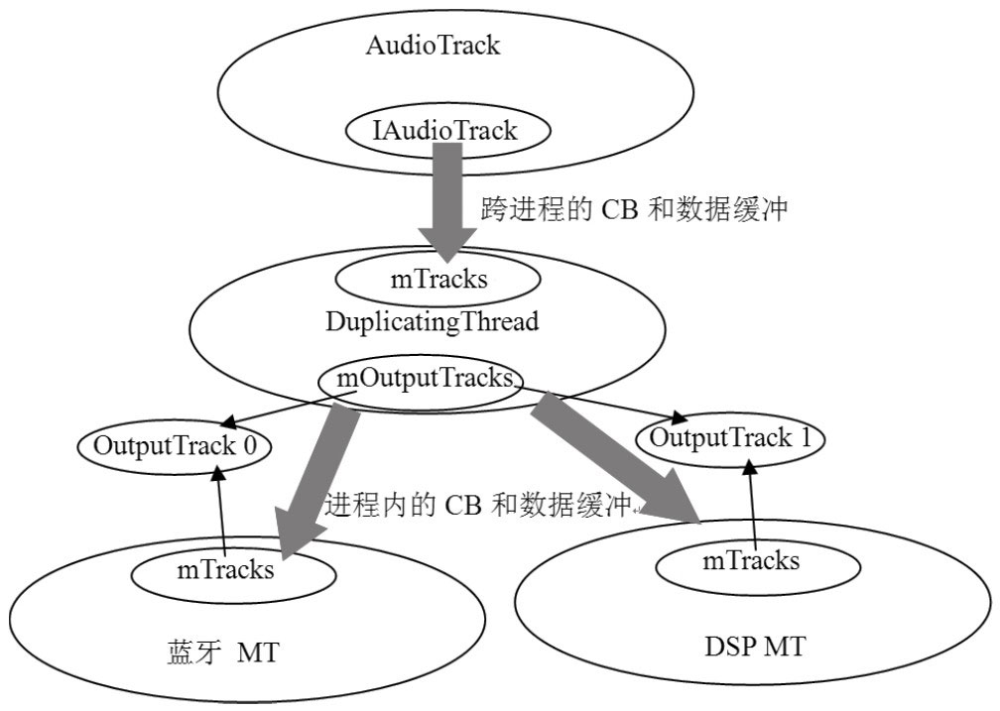

# 7.5 拓展思考


7.5.1DuplicatingThread破解DuplicatingThread需要与蓝牙结合起来使用，它的存在与Audio硬件结构息息相关。读者可参考图7-12“智能手机硬件架构图”来理解。当一份数据同时需要发送给DSP和蓝牙A2DP设备时，DuplicatingThread就派上用场了。在分析DuplicatingThread前，还是应该了解一下它的来龙去脉。

1.DuplicatingThread的来历DuplicatingThread和蓝牙的A2DP设备有关系。可先假设有一个蓝牙立体声耳机已经连接上了，接着从setDeviceConnectionState开始分析，代码如下所示：

```
        status_t AudioPolicyManagerBase::setDeviceConnectionState(
                              AudioSystem::audio_devices device,
                              AudioSystem::device_connection_state state,
                              const char ＊device_address)
        {
                ......
                switch (state)
                {
                  case AudioSystem::DEVICE_STATE_AVAILABLE:

                    mAvailableOutputDevices |= device;

        #ifdef WITH_A2DP
                    if (AudioSystem::isA2dpDevice(device)) {
                          //专门处理A2DP设备的连接。
                        status_t status = handleA2dpConnection(device, device_address);
                  }
        #endif
                  ......
        }
```

```
        status_t AudioPolicyManagerBase::handleA2dpConnection(
                                                  AudioSystem::audio_devices device,
                                                  const char ＊device_address)
        {
            AudioOutputDescriptor ＊outputDesc = new AudioOutputDescriptor();
            outputDesc-＞mDevice = device;
            //先为mA2dpOutput创建一个MixerThread，这个和mHardwareOutput一样。
            mA2dpOutput = mpClientInterface-＞openOutput(&outputDesc-＞mDevice,
                                                      &outputDesc-＞mSamplingRate,
                                                      &outputDesc-＞mFormat,
                                                      &outputDesc-＞mChannels,
                                                      &outputDesc-＞mLatency,
                                                      outputDesc-＞mFlags);
            if (mA2dpOutput) {
            /＊
            a2dpUsedForSonification永远返回true，表示属于SONIFCATION策略的音频流声音需要
            同时从蓝牙和DSP中传出。至于SONIFCATION策略的音频流类型可查看前面关于getStrategy的
            分析，来电铃声、短信通知等属于这一类。
            ＊/
                if (a2dpUsedForSonification()) {
                    /＊
                    创建一个DuplicateOutput，注意它的参数,第一个是蓝牙MixerThread，
                    第二个是DSP MixerThread。
                  ＊/
                    mDuplicatedOutput = mpClientInterface-＞openDuplicateOutput(
                                                            mA2dpOutput, mHardwareOutput);
                }
                if (mDuplicatedOutput != 0 ||
                    !a2dpUsedForSonification()) {
                    if (a2dpUsedForSonification()) {
                          //创建一个AudioOutputDescriptor对象。
                          AudioOutputDescriptor ＊dupOutputDesc = newAudioOutputDescriptor();
                        dupOutputDesc-＞mOutput1 = mOutputs.valueFor(mHardwareOutput);
                        dupOutputDesc-＞mOutput2 = mOutputs.valueFor(mA2dpOutput);
                        ......
                        //保存mDuplicatedOutput和dupOutputDesc键值对。
                        addOutput(mDuplicatedOutput, dupOutputDesc);
                        ......
                    }
                }
        }
        ......
        }
```

[--＞AudioPolicyManagerBase.cpp]对于A2DP设备，有专门的函数handleA2dpConnection处理，代码如下所示：

[--＞AudioPolicyManagerBase.cpp]

```cpp
        int AudioFlinger::openDuplicateOutput(int output1, int output2)
        {
            Mutex::Autolock _l(mLock);
            //output1对应蓝牙的MixerThread。
            MixerThread ＊thread1 = checkMixerThread_l(output1);
            //output2对应DSP的MixerThread。
            MixerThread ＊thread2 = checkMixerThread_l(output2);
            //①创建DuplicatingThread，注意它第二个参数使用的是代表蓝牙的MixerThread。
              DuplicatingThread ＊thread = new DuplicatingThread(this,
                                                                thread1, ++mNextThreadId);
            //②加入代表DSP的MixerThread。
            thread-＞addOutputTrack(thread2);
            mPlaybackThreads.add(mNextThreadId, thread);
            return mNextThreadId;//返回DuplicatingThread的索引。
        }
```

这里最重要的函数是openDuplicateOutput。它和openOutput一样，最终的处理都是在AF中。去那里看看，代码如下所示：

[--＞AudioFlinger.cpp]

```cpp
        AudioFlinger::DuplicatingThread::DuplicatingThread(const sp＜AudioFlinger＞&
                        audioFlinger, AudioFlinger::MixerThread＊ mainThread,int id)
                        :    MixerThread(audioFlinger, mainThread-＞getOutput(), id),
                            mWaitTimeMs(UINT_MAX)
        {
        //DT是MT的派生类，所以先要完成基类的构造，还记得MT的构造吗？它会创建一个AudioMixer对象。
          mType = PlaybackThread::DUPLICATING;
        //把代表DSP的MT加入进来，咱们看看。
            addOutputTrack(mainThread);
        }
```

```cpp
        void AudioFlinger::DuplicatingThread::addOutputTrack(MixerThread ＊thread)
        {
            int frameCount = (3 ＊ mFrameCount ＊ mSampleRate) / thread-＞sampleRate();
            //构造一个OutputTrack，它的第一个参数是MT。
            OutputTrack ＊outputTrack = new OutputTrack((ThreadBase ＊)thread,
                                                      this, mSampleRate, mFormat,
                                                      mChannelCount,frameCount);
            if (outputTrack-＞cblk() != NULL) {
                thread-＞setStreamVolume(AudioSystem::NUM_STREAM_TYPES, 1.0f);
                //把这个outputTrack加入到mOutputTracks数组保存。
                mOutputTracks.add(outputTrack);
                updateWaitTime();
            }
        }
```

从现在起，MixerThread要简写为MT，而DuplicatingThread则简写为DT。

这里面有两个重要的函数调用，一起来看。

2.DuplicatingThread和OutputTrack先看DT的构造函数，代码如下所示：

[--＞AudioFlinger.cpp]此时，当下面两句代码执行完：

```cpp
        DuplicatingThread ＊thread = new DuplicatingThread(this,thread1, ++mNextThreadId);
        thread-＞addOutputTrack(thread2);
```

DT则分别构造了两个OutputTrack，一个对

```
        AudioFlinger::PlaybackThread::OutputTrack::OutputTrack(
                const wp＜ThreadBase＞& thread, DuplicatingThread ＊sourceThread,
                uint32_t sampleRate, int format,int channelCount,int frameCount)
                :Track(thread, NULL, AudioSystem::NUM_STREAM_TYPES, sampleRate,
                        format, channelCount, frameCount, NULL),//最后这个参数为NULL。
                  mActive(false), mSourceThread(sourceThread)
        {
              /＊
                OutputTrack从Track派生，所以需要先调用基类的构造，还记得Track构造函数
                中的事情吗？它会创建一块内存，至于是不是共享内存，由Track构造函数的最后一个参数决定。
                如果该值为NULL，表示没有客户端参与，则会在本进程内创建一块内存，这块内存的结构如
                图7-4所示，前面为CB对象，后面为数据缓冲。
              ＊/
            //下面的这个thread对象为MT。
            PlaybackThread ＊playbackThread = (PlaybackThread ＊)thread.unsafe_get();
            if (mCblk != NULL) {
                mCblk-＞out = 1;//表示DT将往MT中写数据。
              //和前面所分析的AT、AF中的处理何其相似！
                mCblk-＞buffers = (char＊)mCblk + sizeof(audio_track_cblk_t);
                mCblk-＞volume[0] = mCblk-＞volume[1] = 0x1000;
                mOutBuffer.frameCount = 0;
              //把这个Track加到MT的Track中。
                playbackThread-＞mTracks.add(this);
            }
        }
```

应蓝牙的MT，另一个对应DSP的MT。现在来看OutputTrack为何方神圣，代码如下所示：

[--＞AudioFlinger.cpp]明白了吗？图7-16表示的是openDuplicateOutput的结果：


图7-16openDuplicateOutput的结果示意图图7-16说明（以蓝牙MT为例）​：

蓝牙MT的Track中有一个成员为OutputTrack0。

DT的mOutputTracks也有一个成员指



向OutputTrack0。这就好像DT是MT的客户端一样，它和前面分析的AT是AF的客户端类似。

灰色部分代表数据传递用的缓冲。

3.DT的客户端AT图7-17有AT的DT全景图DT是从MT中派生的，根据AP和AT的交互流图7-17把DT的工作方式表达得非常清晰了。

程可知，当AT创建的流类型对应策略为一个DT配合两个OutputTrack中的进程内缓SONIFACATION时，它会从AP中得到代表DT冲，把来自AT的数据原封不动地发给蓝牙MT的线程索引号。由于DT没有重载和DSPMT，这简直就是个数据中继器。不过createTrack_l，所以这个过程也会创建一个俗话说得好，道理虽简单，实现却复杂。来看Track对象（和MT创建Track对象一样）​。此DT是如何完成这一复杂而艰巨的任务的吧。

时的结果，将导致图7-16变成图7-17。

4.DT的线程函数DT的线程函数代码如下所示：

[--＞AudioFlinger.cpp]

```cpp
        bool AudioFlinger::DuplicatingThread::threadLoop()
        {
            int16_t＊ curBuf = mMixBuffer;
            Vector＜ sp＜Track＞ ＞ tracksToRemove;
            uint32_t mixerStatus = MIXER_IDLE;
            nsecs_t standbyTime = systemTime();
            size_t mixBufferSize = mFrameCount＊mFrameSize;
            SortedVector＜ sp＜OutputTrack＞ ＞ outputTracks;
            while (!exitPending())
            {
                processConfigEvents();

                mixerStatus = MIXER_IDLE;
                {
                      ......
                    //处理配置请求，和MT处理一样。
                    const SortedVector＜ wp＜Track＞ ＞& activeTracks = mActiveTracks;

                    for (size_t i = 0; i ＜ mOutputTracks.size(); i++) {
                        outputTracks.add(mOutputTracks[i]);
                    }
                  //如果AT的Track停止了，则需要停止和MT共享的OutputTrack。
            if UNLIKELY((!activeTracks.size() && systemTime() ＞ standbyTime)
                        || mSuspended) {
                        if (!mStandby) {
                            for (size_t i = 0; i ＜ outputTracks.size(); i++) {
                                  outputTracks[i]-＞stop();
                            }
                            mStandby = true;
                            mBytesWritten = 0;
                        }
                      ......
                    //DT从MT派生，天然具有混音的功能，所以这部分功能和MT一致。
                    mixerStatus = prepareTracks_l(activeTracks, &tracksToRemove);
                }

                if (LIKELY(mixerStatus == MIXER_TRACKS_READY)) {
                    //outputsReady将检查OutputTracks对应的MT状态。
                    if (outputsReady(outputTracks)) {
                        mAudioMixer-＞process(curBuf);//使用AudioMixer对象混音。
                    } else {
                        memset(curBuf, 0, mixBufferSize);
                    }
                    sleepTime = 0;
                    writeFrames = mFrameCount;
                }
                      ......
                    if (sleepTime == 0) {
                        standbyTime = systemTime() + kStandbyTimeInNsecs;
                    for (size_t i = 0; i ＜ outputTracks.size(); i++) {
                        //将混音后的数据写到outputTrack中。
                        outputTracks[i]-＞write(curBuf, writeFrames);
                    }
                    mStandby = false;
                    mBytesWritten += mixBufferSize;
                } else {
                    usleep(sleepTime);
                }
                tracksToRemove.clear();
                outputTracks.clear();
            }

            return false;
        }
```

现在，来自远端进程AT的数据已得到了混音，这一份混音后的数据还将通过调用

```
        bool AudioFlinger::PlaybackThread::OutputTrack::write(int16_t＊ data,
                                                                uint32_t frames)
        {
            //注意，此处的OutputTrack是DT和MT共享的。
            Buffer ＊pInBuffer;
            Buffer inBuffer;
            uint32_t channels = mCblk-＞channels;
            bool outputBufferFull = false;
            inBuffer.frameCount = frames;
            inBuffer.i16 = data;

            uint32_t waitTimeLeftMs = mSourceThread-＞waitTimeMs();

          if (!mActive && frames != 0) {
              //如果此Track没有活跃，则调用start激活。
                start();
                ......
            }
              /＊
                现在，AF中的数据传递有三个线程：一个DT，两个MT。MT作为DT的二级消费者，
                可能由于某种原因来不及消费数据，所以DT中提供了一个缓冲队列mBufferQueue，
                把MT来不及消费的数据保存在这个缓冲队列中。注意这个缓冲队列容纳的临时缓冲
                个数是有限制的，其限制值由kMaxOverFlowBuffers控制，初始化为10个。
          ＊/
            while (waitTimeLeftMs) {
                //先消耗保存在缓冲队列的数据。
                if (mBufferQueue.size()) {
                    pInBuffer = mBufferQueue.itemAt(0);
                } else {
                    pInBuffer = &inBuffer;
                }
                ......
                //获取可写缓冲，下面这句代码是否和AT中对应的代码很相似？
                if (obtainBuffer(&mOutBuffer, waitTimeLeftMs) ==
                                        (status_t)AudioTrack::NO_MORE_BUFFERS) {
                        ......
                        break;
                  }

                uint32_t outFrames = pInBuffer-＞frameCount ＞ mOutBuffer.frameCount ?
                                        mOutBuffer.frameCount : pInBuffer-＞frameCount;
                //将数据拷贝到DT和MT共享的那块缓冲中去。
                memcpy(mOutBuffer.raw, pInBuffer-＞raw,
                          outFrames ＊ channels ＊ sizeof(int16_t));
                //更新写位置
                mCblk-＞stepUser(outFrames);
                pInBuffer-＞frameCount -= outFrames;
                pInBuffer-＞i16 += outFrames ＊ channels;
                mOutBuffer.frameCount -= outFrames;
                mOutBuffer.i16 += outFrames ＊ channels;
                ......
              }//while 结束

                if (inBuffer.frameCount) {
                sp＜ThreadBase＞ thread = mThread.promote();
                if (thread != 0 && !thread-＞standby()) {
                    if (mBufferQueue.size() ＜ kMaxOverFlowBuffers) {
                        pInBuffer = new Buffer;
                        pInBuffer-＞mBuffer = new int16_t[inBuffer.frameCount ＊ channels];
                        pInBuffer-＞frameCount = inBuffer.frameCount;
                        pInBuffer-＞i16 = pInBuffer-＞mBuffer;
                        //拷贝旧数据到新的临时缓冲。
                        memcpy(pInBuffer-＞raw, inBuffer.raw,
                                inBuffer.frameCount ＊ channels ＊ sizeof(int16_t));
                        //保存这个临时缓冲。
                        mBufferQueue.add(pInBuffer);
                    }
                }
        }
                //如果数据全部写完
                if (pInBuffer-＞frameCount == 0) {
                    if (mBufferQueue.size()) {
                        mBufferQueue.removeAt(0);
                        delete [] pInBuffer-＞mBuffer;
                        delete pInBuffer;//释放缓冲队列对应的数据缓冲。
                    } else {
                        break;
                    }
                }
            }
            ......
            return outputBufferFull;
        }
```

OutputTrack的write完成DT到其他两个MT的传输。注意，这里除了AT使用的Track外，还有DT和两个MT共享的OutputTrack。AT调用的start，将导致DT的Track加入到活跃数组中，但另外两个OutputTrack还没调用start。这些操作又是在哪里做的呢？来看write函数，代码如下所示：

[--＞AudioFlinger.cpp]数据就这样通过DT的帮助，从AT传输到蓝牙的MT和DSP的MT中了。这种方式的数据传输比直接使用MT传输要缓慢。

到这里，对DT的讲解就告一段落了。本人觉得，DT的实现是AF代码中最美妙的地方，多学习这些优秀代码，有助于提高学习者的水平。

说明DT还有别的一些细节本书中没有涉及，读者可以结合自己的情况进行分析和理解。
