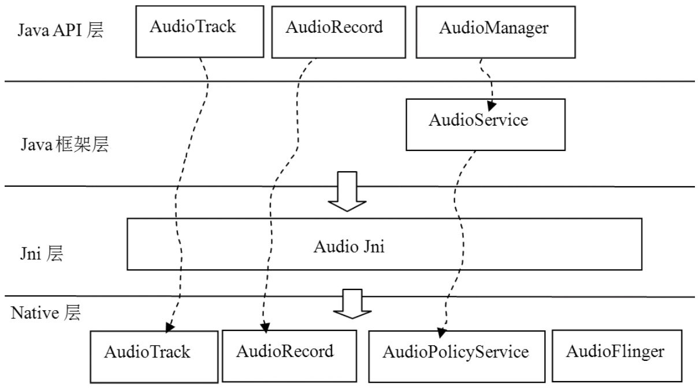

# 7.6 本章小结

Audio是本书碰到的第一个复杂系统，这个系统的整体示意图如图7-18所示：

图7-18Audio系统大家族从图7-18中可以看出：

音频数据的输入输出不论是Java层还是Native层，都是通过AudioTrack和AudioRecord类完成的。事实上，Audio系统提供的I/O接口就是AudioTrack和AudioRecord类。音频I/O是Audio系统最重要的部分。建议读者反复阅读，加深理解。

AudioManager用来做音量调节、audio模式的选择、设备连接控制等。这些都会和Native的AP交互。从我个人博客和其他技术论坛的统计来看，较少有人关注AudioPolicy，毕竟在这一块Android已提供了一个足够好用的AudioPolicyManagerBase类。不过作为Audio系统不可或缺的一部分，AudioPolicy的重要性是不言而喻的。

建议无论怎么说，数据I/O毕竟是Audio系统中的关键之关键，所以请读者一定要仔细阅读，体会其中的精妙之所在。

Audio系统中还有其他部分（例如AudioRecord、Java层的AudioSystem，AudioService等）​，本书没有涉及，读者可结合个人需要自行分析。在现有的基础上，要学习并掌握这些内容都不会太难。
