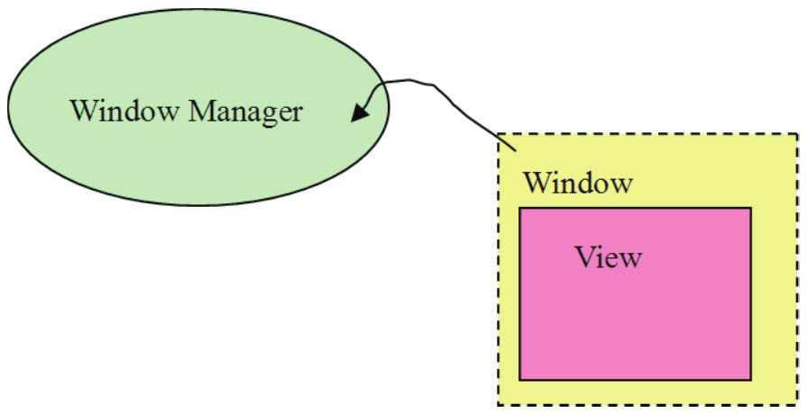
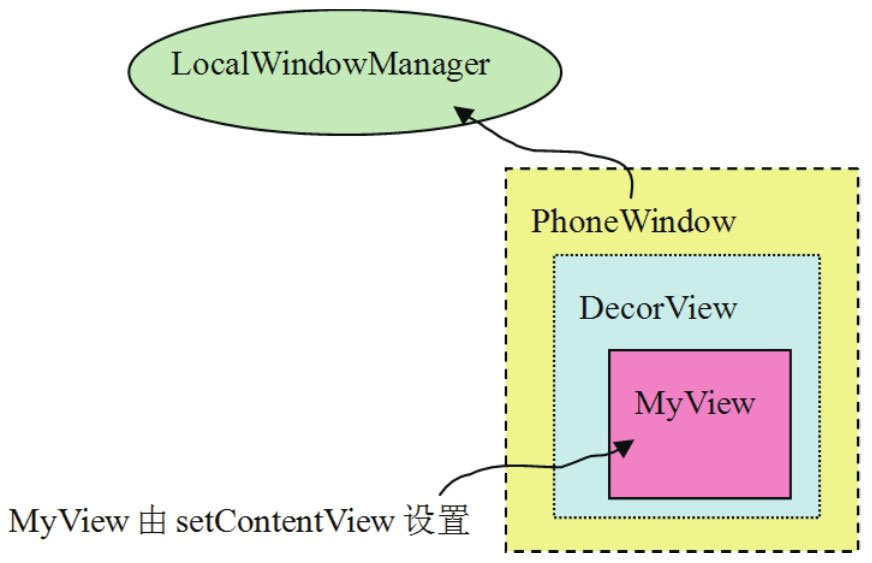
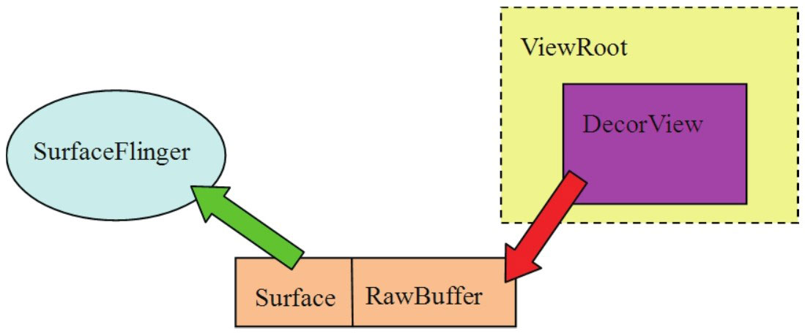
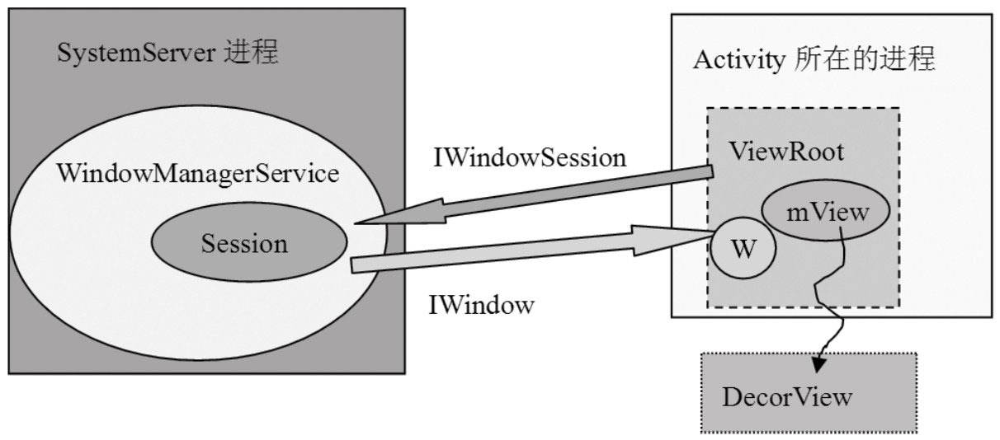

# 8.2.1 Activity的创建


我们已经知道了Activity的生命周期，如onCreate表示创建、onDestroy表示销毁等，但大家是否考虑过这样一个问题：

如果没有创建Activity，那么onCreate和onDestroy就没有任何意义了，可这个Activity究竟是在哪里创建的呢？

第4章中的“zygote分裂”一节已讲过，zygote在响应请求后会fork一个子进程，这个子进程是App对应的进程，它的入口函数是ActivityThread类的main函数。

ActivityThread类中有一个handleLaunchActivity函数，它就是创建Activity的地方。一起来看这个函数，代码如下所示：

[--＞ActivityThread.java]

```java
        private final void handleLaunchActivity(ActivityRecord r, Intent customIntent) {
                //① performLaunchActivity返回一个Activity
                Activity a = performLaunchActivity(r, customIntent);

                if (a != null) {
                    r.createdConfig = new Configuration(mConfiguration);
                    Bundle oldState = r.state;
                    //②调用handleResumeActivity
                    handleResumeActivity(r.token, false, r.isForward);
            }
                ......
        }
```

handleLaunchActivity函数中列出了两个关

```java
        private final Activity performLaunchActivity(ActivityRecord r,
        Intent customIntent) {

                ActivityInfo aInfo = r.activityInfo;
                ......//完成一些准备工作。
                //Activity定义在Activity.java中。
                Activity activity = null;
                try {
                    java.lang.ClassLoader cl = r.packageInfo.getClassLoader();
              /＊
              mInstrumentation为Instrumentation类型，源文件为Instrumentation.java。
              它在newActivity函数中根据Activity的类名通过Java反射机制来创建对应的Activity，
              这个函数比较复杂，待会我们再分析它。
              ＊/
                    activity = mInstrumentation.newActivity(
                            cl, component.getClassName(), r.intent);
                    r.intent.setExtrasClassLoader(cl);
                    if (r.state != null) {
                        r.state.setClassLoader(cl);
                    }
                } catch (Exception e) {
                      ......
                }

                try {
                    Application app =
                      r.packageInfo.makeApplication(false, mInstrumentation);

                      if (activity != null) {
                        //在Activity中getContext函数返回的就是这个ContextImpl类型的对象。
                        ContextImpl appContext = new ContextImpl();
                        ......
                        //下面这个函数会调用Activity的onCreate函数。
                        mInstrumentation.callActivityOnCreate(activity, r.state);
                        ......
                return activity;
        }
```

键点（即①和②）​，下面对其分别进行介绍。

1.创建Activity第一个关键函数performLaunchActivity返回一个Activity，这个Activity就是App中的那个Activity（仅考虑App中只有一个Activity的情况）​，它是怎么创建的呢？其代码如下所示：

[--＞ActivityThread.java]好了，performLaunchActivity函数的作用明白了吧？

根据类名以Java反射的方法创建一个Activity。

调用Activity的onCreate函数，开始在SDK中大书特书Activity的生命周期。

那么，在onCreate函数中，我们一般会做什么呢？在这个函数中，和UI相关的重要工作就是调用setContentView来设置UI的外观。接下去，需要看handleLaunchActivity中的第二个关键函数handleResumeActivity。

2.handleResumeActivity分析上面已创建好了一个Activity，再来看handleResumeActivity。它的代码如下所示：

[--＞ActivityThread.java]

```java
        final void handleResumeActivity(IBinder token, boolean clearHide,
        boolean isForward) {
        boolean willBeVisible = !a.mStartedActivity;

        if (r.window == null && !a.mFinished && willBeVisible) {
              r.window = r.activity.getWindow();
              //①获得一个View对象。
              View decor = r.window.getDecorView();
              decor.setVisibility(View.INVISIBLE);
              //②获得ViewManager对象。
              ViewManager wm = a.getWindowManager();
                ......
        //③把刚才的decor对象加入到ViewManager中。
          wm.addView(decor, l);
    }
            ......//其他处理
  }
```

上面有三个关键点（即①～③）​。这些关键点似乎已经和UI部分（如View、Window）有联系了。那么这些联系是在什么时候建立的呢？在分析上面代码中的三个关键点之前，请大家想想在前面的过程中，哪些地方会和UI挂上钩呢？

答案是就在onCreate函数中，Activity一般都在这个函数中通过setContentView设置UI界面。

看来，必须先分析setContentView，才能继续后面的征程了。

3.setContentView分析setContentView有好几个同名函数，现在只看其中的一个就可以了。代码如下所示：

[--＞Activity.java]

```java
        public void setContentView(View view) {
        //getWindow返回的是什么呢？一起来看看。
          getWindow().setContentView(view);
        }

        public Window getWindow() {
          return mWindow; //返回一个类型为Window的mWindow，它是什么？
        }
```

上面出现了两个和UI有关系的类：View和Window。来看SDK文档是怎么描述这两个类的。这里先给出原文描述，然后进行对应的解释：

Window：abstractbaseclassforatop-levelwindowlookandbehaviorpolicy.Aninstanceofthisclassshouldbeusedasthetop-levelviewaddedtothewindowmanager.ItprovidesstandardUIpoliciessuchasabackground,titlearea,defaultkeyprocessing,etc.中文的意思是：Window是一个抽象基类，用于控制顶层窗口的外观和行为。作为顶层窗口它有什么特殊的职能呢？即绘制背景和标题栏、默认的按键处理等。

这里面有一句比较关键的话：它将作为一个顶层的view加入到WindowManager中。

View：Thisclassrepresentsthebasicbuildingblockforuserinterfacecomponents.AViewoccupiesarectangularareaonthescreenandisresponsiblefordrawingandeventhandling.View的概念就比较简单了，它是一个基本的UI单元，占据屏幕的一块矩形区域，可用于绘制，并能处理事件。

根据上面对View和Window的描述，再加上setContentView的代码，我们可以想象一下这三者的关系，如图8-2所示：



图8-2Window/View的假想关系图看了上面的介绍，大家可能会产生两个疑问：

Window是一个抽象类，它实际的对象到底是什么类型？

WindowManager究竟是什么？

如果能有这样的疑问，就说明我们非常细心了。下面来试着解决这两个问题。

（1）Activity的Window据上文的讲解可知，Window是一个抽象类。

它实际的对象到底属于什么类型？先回到Activity创建的地方去看看。下面正是创建Activity时的代码，可当时没有深入地分析。

```
        activity = mInstrumentation.newActivity(
                            cl, component.getClassName(), r.intent);
```

```java
        public Activity newActivity(Class＜?＞ clazz, Context context,
                    IBinder token, Application application, Intent intent,
                    ActivityInfo info, CharSequence title, Activity parent,
        String id,Object lastNonConfigurationInstance)
        throws InstantiationException, IllegalAccessException {

        Activity activity = (Activity)clazz.newInstance();
                ActivityThread aThread = null;
                //关键函数attach!!
                activity.attach(context, aThread, this, token, application, intent,
                info, title,parent, id, lastNonConfigurationInstance,
                new Configuration());
                return activity;
            }
```

代码中调用了Instrumentation的newActivity，再去那里看看，如下所示：

[--＞Instrumentation.java]

```java
        final void attach(Context context, ActivityThread aThread,
                    Instrumentation instr, IBinder token, int ident,
                    Application application, Intent intent, ActivityInfo info,
                    CharSequence title, Activity parent, String id,
                    Object lastNonConfigurationInstance,
                    HashMap＜String,Object＞ lastNonConfigurationChildInstances,
                    Configuration config) {
                ......
                //利用PolicyManager来创建Window对象。
                mWindow = PolicyManager.makeNewWindow(this);
                mWindow.setCallback(this);
                ......
                //创建WindowManager对象。
                mWindow.setWindowManager(null, mToken, mComponent.flattenToString());
                if (mParent != null) {
                    mWindow.setContainer(mParent.getWindow());
                }
                //保存这个WindowManager对象。
                mWindowManager = mWindow.getWindowManager();
                mCurrentConfig = config;
        }
```

看到关键函数aach了吧？Window的真相马上就要揭晓了，让我们用咆哮体来表达内心的激动之情吧！！！！

[--＞Activity.java]此刻又有一点失望吧？这里冒出了个PolicyManager类，Window是由它的makeNewWindow函数所创建的，因此还必须再去看看这个PolicyManager。

（2）水面下的冰山————PolicyManagerPolicyManager定义于PolicyManager.java文件，该文件在一个非常独立的目录下，现将其单独列出来：

frameworks/policies/base/phone/com/android/internal/policy/impl注意上面路径中的灰色目录phone是针对

```java
        public final class PolicyManager {
            private static final String POLICY_IMPL_CLASS_NAME =
                "com.android.internal.policy.impl.Policy";
            private static final IPolicy sPolicy;

            static {
                //
                try {
                    Class policyClass = Class.forName(POLICY_IMPL_CLASS_NAME);
                    //创建Policy对象。
                    sPolicy = (IPolicy)policyClass.newInstance();
                } catch (ClassNotFoundException ex) {
                      ......
                }

              private PolicyManager() {}

            //通过Policy对象的makeNewWindow创建一个Window。
            public static Window makeNewWindow(Context context) {
                return sPolicy.makeNewWindow(context);
            }
          ......
        }
```

智能手机这种小屏幕的；另外还有一个平级的目录叫mid，是针对Mid设备的。mid目录的代码比较少，可能目前还没有开发完毕。

下面来看这个PolicyManager，它比较简单，代码如下所示：

[--＞PolicyManager.java]这里有一个单例的sPolicy对象，它是Policy类型，请看它的定义。

```java
        public class Policy implements IPolicy {
            private static final String TAG =“PhonePolicy”;

            private static final String[] preload_classes = {
                “com.android.internal.policy.impl.PhoneLayoutInflater”,
                “com.android.internal.policy.impl.PhoneWindow”,
                “com.android.internal.policy.impl.PhoneWindow$1”,
                “com.android.internal.policy.impl.PhoneWindow$ContextMenuCallback”,
                “com.android.internal.policy.impl.PhoneWindow$DecorView”,
                “com.android.internal.policy.impl.PhoneWindow$PanelFeatureState”,
        “com.android.internal.policy.impl.PhoneWindow$PanelFeatureState$SavedState”,
            };

            static {
                //加载所有的类。
                for (String s : preload_classes) {
                    try {
                        Class.forName(s);
                    } catch (ClassNotFoundException ex) {
                        ......
                    }
                }
            }

        public PhoneWindow makeNewWindow(Context context) {
                //makeNewWindow返回的是PhoneWindow对象。
                return new PhoneWindow(context);
            }

            ......
        }
```

（3）真正的WindowPolicy类型的定义代码如下所示：

[--＞Policy.java]至此，终于知道了代码：

```java
        mWindow = PolicyManager.makeNewWindow(this);
```

返回的Window，原来是一个PhoneWindow对象。它的定义在PhoneWindow.java中。

mWindow的真实身份搞清楚了，还剩下个WindowManager。现在就来揭示其真面目。

（4）真正的WindowManager先看WindowManager创建的代码，如下所示：

```java
        public void setWindowManager(WindowManager wm,IBinder appToken, String appName)
        {       //注意，传入的wm值为null。
                mAppToken = appToken;
                mAppName = appName;
                if (wm == null) {
                    //如果wm为空的话，则创建WindowManagerImpl对象。
                    wm = WindowManagerImpl.getDefault();
                }
                //mWindowManager是一个LocalWindowManager。
                mWindowManager = new LocalWindowManager(wm);
            }
```

```java
        public class PhoneWindow extends Window implements MenuBuilder.Callback
```

[--＞Activity.java]

```java
            ......//创建mWindow对象。
            //调用mWindow的setWindowManager函数。
            mWindow.setWindowManager(null, mToken, mComponent.flattenToString());
            .....
```

前面调用的setWindowManager函数，其实是由PhoneWindow的父类Window类来实现的，来看其代码，如下所示：

[--＞Window.java]上面的函数设置了PhoneWindow的WindowManager，不过第一个参数是nu，这是什么意思？在回答此问题之前，先来看PhoneWindow的定义，它是从Window类派生的。

[--＞PhoneWindow.java::PhoneWindow定义]

```java
        private class LocalWindowManager implements WindowManager {
                LocalWindowManager(WindowManager wm) {
                    mWindowManager = wm;//还好，只是简单地保存了传入的wm参数。
                    mDefaultDisplay = mContext.getResources().getDefaultDisplay(
                            mWindowManager.getDefaultDisplay());
                }
            ......
```

```java
        public class WindowManagerImpl implements WindowManager {
        ......

        public static WindowManagerImpl getDefault()
        {
              return mWindowManager; //返回的就是WindowManagerImpl对象。
        }
        private static WindowManagerImpl mWindowManager = new WindowManagerImpl();
        }
```

如上面代码所示，LocalWindowManager将LocalWindowManager是在Window中定义保存一个WindowManager类型的对象，这的内部类，请看它的构造函数，其定义如下所个对象的实际类型是示：

WindowManagerImpl。而WindowManagerImpl又是什么呢？来看它[--＞的代码，如下所示：

Window.java::LocalWindowManager定义][--＞WindowManagerImpl.java]看到这里是否有点头晕眼花？很多朋友读了我所写的与此相关的一篇博客后，普遍也有此反应。所以，我试着配制了一剂治晕药方，如图8-3所示：


图8-3Window和WindowManager的家族图谱根据上图可得出以下结论：

Activity的mWindow成员变量其真实类型是PhoneWindow，而mWindowManager成员变量的真实类型是LocalWindowManager。

LocalWindowManager和WindowManagerImpl都实现了WindowManager接口。这里采用的是Proxy模式，表明LocalWindowManager将把它的工作委托给WindowManagerImpl来完成。

（5）关于setContentView的总结了解了上述知识后，重新回到setContentView函数。这次希望能分析得更深入些。代码如下所示：

```java
        public void setContentView(View view) {
            //调用另一个setContentView。
            setContentView(view,
            new ViewGroup.LayoutParams(MATCH_PARENT, MATCH_PARENT));
        }

        public void setContentView(View view, ViewGroup.LayoutParams params) {
            //mContentParent为ViewGroup类型，它的初值为null。
              if (mContentParent == null) {
                    installDecor();
              } else {
                    mContentParent.removeAllViews();
              }
            //把view加入到ViewGroup中。
              mContentParent.addView(view, params);
              ......
        }
```

[--＞Activity.java]

```java
        public void setContentView(View view) {
                getWindow().setContentView(view);//getWindow返回的是PhoneWindow。
        }
```

一起来看PhoneWindow的setContentView函数，代码如下所示：

[--＞PhoneWindow]mContentParent是一个ViewGroup类型，它从View中派生，所以也是一个UI单元。从它名字“Group”中所表达的意思来看，它应该还可以包含其他的View元素。这又是什么意思呢？

```java
        private void installDecor() {
            if (mDecor == null) {
              //创建mDecor，它为DecorView类型，从FrameLayout派生。
              mDecor = generateDecor();
                    ......
            }
          if (mContentParent == null) {
              //得到这个mContentParent。
        mContentParent = generateLayout(mDecor);
        //创建标题栏。
        mTitleView = (TextView)findViewById(com.android.internal.R.id.title);
        ......
        }
```

```java
        protected ViewGroup generateLayout(DecorView decor){
          ......
          int layoutResource;
          int features = getLocalFeatures();
          if ((features & ((1 ＜＜ FEATURE_LEFT_ICON) |(1 ＜＜ FEATURE_RIGHT_ICON))) != 0) {
              if (mIsFloating) {
              //根据情况取得对应标题栏的资源id。
              layoutResource =   com.android.internal.R.layout.dialog_title_icons;
              }
                ......
        }

          mDecor.startChanging();

          View in = mLayoutInflater.inflate(layoutResource, null);
          //加入标题栏
          decor.addView(in, new ViewGroup.LayoutParams(MATCH_PARENT, MATCH_PARENT));
            /＊
            ID_ANDROID_CONTENT的值为”com.android.internal.R.id.content”，
            这个contentParent由findViewById返回，实际上就是mDecorView的一部分。
            ＊/
            ViewGroup contentParent = (ViewGroup)findViewById(ID_ANDROID_CONTENT);
            ......
            mDecor.finishChanging();
            return contentParent;
        }
```

也就是说，在绘制一个ViewGroup时，它不仅需要把自己的样子画出来，还需要把它包含的View元素的样子也画出来。读者可将它想象成一个容器，容器中的元素就是View。

注意这里采用的是23种设计模式中的Composite模式，它是UI编程中常用的模式之一。

再来看instaDecor函数，其代码如下所示：

generateLayout函数的输入参数为mDecor，输出为mContentParent，代码如[--＞PhoneWindow.java]下所示：

[--＞PhoneWindow]下面看findViewById是如何实现的。它定义在Window.java中，代码如下所示：

[--＞Window.java]

```java
        public View findViewById(int id) {
            //getDecorView将返回mDecorView,所以contentParent确实是DecorView的一部分。
            return getDecorView().findViewById(id);
          }
```

大家还记得图8-2吗？介绍完上面的知识后，可在图8-2的基础上绘制出更细致的图8-4：



图8-4一个Activity中的UI组件从上图中可看出，在Activity的onCreate函数中，通过setContentView设置的View，其实只是DecorView的子View。DecorView还处理了标题栏显示等一系列的工作。

注意这里使用了设计模式中的Decorator（装饰）模式，它也是UI编程中常用的模式之一。

```java
        final void handleResumeActivity(IBinder token, boolean clearHide,
        boolean isForward) {
          boolean willBeVisible = !a.mStartedActivity;
        ......
        if (r.window == null && !a.mFinished && willBeVisible) {
              r.window = r.activity.getWindow();
            //①获得一个View对象。现在知道这个view就是DecorView了。
            View decor = r.window.getDecorView();
            decor.setVisibility(View.INVISIBLE);
          //②获得ViewManager对象,这个wm就是LocalWindowManager。
          ViewManager wm = a.getWindowManager();
          WindowManager.LayoutParams l = r.window.getAttributes();
          a.mDecor = decor;
          l.type = WindowManager.LayoutParams.TYPE_BASE_APPLICATION;
          if (a.mVisibleFromClient) {
                a.mWindowAdded = true;
                //③把刚才的decor对象加入到ViewManager中。
                wm.addView(decor, l);
            }
        ......//其他处理
        }
```

4.重回handleResumeActivity看完setContentView的分析后，不知大家是否还记得我们为什么要分析这个setContentView函数？在继续前行之前，先来回顾一下被setContentView打断的流程。

当时，我们正在分析handleResumeActivity，代码如下所示：

[--＞ActivityThread.java]在上面的代码中，由于出现了多个之前不熟悉的东西，如View、ViewManager等，而这些东西的来源又和setContentView有关，所以我们才转而去分析setContentView了。想起来了吧？

注意由于代码比较长，跳转关系也很多，在分析代码时，请读者把握流程，在大脑中建立一个代码分析的堆栈。

下面就从addView的分析开始。如前面所介绍的，它的调用方法是：

```java
        wm.addView(decor, l);//wm类型实际是LocalWindowManager。
```

来看这个addView函数，它的代码如下所示：

[--＞Window.javaLocalWindowManager]

```java
        public final void addView(View view, ViewGroup.LayoutParams params) {

          WindowManager.LayoutParams wp = (WindowManager.LayoutParams)params;
          CharSequence curTitle = wp.getTitle();
          ...... //做一些操作，可以不管它。
        //还记得前面提到过的Proxy模式吗？mWindowManager对象实际上是WindowManagerImpl类型。
        mWindowManager.addView(view, params);
        }
```

看来，要搞清楚这个addView函数还是比较

```java
        private void addView(View view, ViewGroup.LayoutParams params, boolean nest)
        {
          ViewRoot root; //ViewRoot，幕后的主角终于登场了！
          synchronized (this) {
          //①创建ViewRoot
          root = new ViewRoot(view.getContext());
          root.mAddNesting = 1;
          view.setLayoutParams(wparams);

          if (mViews == null) {
              index = 1;
              mViews = new View[1];
              mRoots = new ViewRoot[1];
              mParams = new WindowManager.LayoutParams[1];
            } else {
              ......
            }
            index--;
            mViews[index] = view;
            mRoots[index] = root;//保存这个root
            mParams[index] = wparams;

        //②setView，其中view是刚才我们介绍的DecorView。
          root.setView(view, wparams, panelParentView);//
        }
```

麻烦的，因此现在必须到WindowManagerImpl中去看看。它的代码如下所示：

[--＞WindowManagerImpl.java]“ViewRoot，ViewRoot……”​，主角终于出场了！即使没介绍它的真实身份，不禁也想欢呼几声。为了避免高兴得过早，还是先冷静地分析一下它吧！代码中列出了ViewRoot的两个重要关键点（即①和②）​。

```java
        public final class ViewRoot extends Handler implements ViewParent,
                View.AttachInfo.Callbacks //从Handler类派生。
        {
        private final Surface mSurface = new Surface();//这里创建了一个Surface对象。
        final W mWindow;  //这个是什么？
        View mView;
        }
```

（1）ViewRoot是什么？

ViewRoot是什么？看起来好像和View有些许关系，至少名字非常像。事实上，它的确和View有关系，因为它实现了ViewParent接口。SDK的文档中有关于ViewParent的介绍。但它和Android基本绘图单元中的View却不太一样，比如：ViewParent不处理绘画，因为它没有onDraw函数。

如上所述，ViewParent和绘画没有关系，那么，它的作用是什么？先来看它的代码，如下所示：

[--＞ViewRoot.java::ViewRoot定义]上面这段代码传达出了一些重要信息：

ViewRoot继承了Handler类，看来它能处理消息。ViewRoot果真重写了handleMessage函数。稍后再来看它。

ViewRoot有一个成员变量叫mSurface，它是Surface类型。

ViewRoot还有一个W类型的mWindow和一个View类型的mView变量。

其中，W是ViewRoot定义的一个静态内部类：

```java
        static class W extends IWindow.Stub
```

这个类将参与Binder的通信，以后再对此做讲解，先来介绍Surface类。

（2）Android是神笔马良吗？

这里冒出来一个Surface类。它是什么？在回答此问题之前，先来考虑这样一个问题：

前文介绍的View、DecorView等都是UI单元，这些UI单元的绘画工作都在onDraw函数中完成。如果把onDraw想象成画图过程，那么画布是什么？



Android肯定不是“马良”​，它也没有那支可以在任何物体上作画的“神笔”​，所以我们需要一块实实在在的画布，这块画布就是Surface。SDK文档对Surface类的说明是：

图8-5马良的神笔工作原理Handleontoarawbuerthatisbeing结合之前所讲的知识来看图8-5可知其清晰地managedbythescreencompositor。这句传达了如下几条信息：

话的意思是：

ViewRoot有一个成员变量有一块Rawbuer，至于是内存还是mSurface，它是Surface类型，它和一显存，不必管它。

块RawBuer有关联。

Surface操作这块Rawbuer。

ViewRoot是一个ViewParent，它的Screencompositor（其实就是子View的绘画操作，是在画布Surface上SurfaceFlinger）管理这块Rawbuer。

展开的。

Surface和SF、ViewRoot有什么关系呢？相Surface和SurfaceFlinger有交互，这信聪明的你此时已经有些明白了，这里用图8-非常类似AudioTrack和AudioFlinger之5描绘一下心中的想法：

间的交互。

```java
        public ViewRoot(Context context) {
                super();
                ....
                // getWindowSession？我们进去看看。
                getWindowSession(context.getMainLooper());
              ......//ViewRoot的mWindow是一个W类型，注意它不是Window类型，而是IWindow类型。
                mWindow = new W(this, context);
        }
```

```java
        ublic static IWindowSession getWindowSession(Looper mainLooper) {
        synchronized (mStaticInit) {
          if (!mInitialized) {
            try {
              InputMethodManager imm =
                  InputMethodManager.getInstance(mainLooper);
              //下面这个函数先得到WindowManagerService的Binder代理，然后调用它的openSession。
              sWindowSession = IWindowManager.Stub.asInterface(
                            ServiceManager.getService("window"))
                          .openSession(imm.getClient(), imm.getInputContext());
                            mInitialized = true;
                        } catch (RemoteException e) {
                        }
                    }
                    return sWindowSession;
                }
            }
```

既然本章题目为“深入理解Surface系统”​，那么就需要重点关注Surface和SurfaceFlinger间的关系。建立这个关系需要ViewRoot的参与，所以应先来分析ViewRoot的创建和它的setView函数。

getWindowsession函数，将建立Activity的（3）ViewRoot的创建和对setView的分析ViewRoot和WindowManagerService的关系。代码如下所示：

来分析ViewRoot的构造。它所包含内容的代码如下所示：

[--＞ViewRoot.java]WindowSession？

WindowManagerService？第一次看到这些东西时，我快疯了。复杂，太复杂，无比复杂！要攻克这些难题，应先来回顾一下与zygote相关的知识：

WindowManagerService（以后简称WMS）由System_Server进程启动，SurfaceFlinger服务也在这个进程中。

看来，Activity的显示还不单纯是它自己的事，还需要和WMS建立联系才行。继续往下看，先看setView的处理。这个函数很复杂，注意其中关键的几句。

注意openSession的操作是一个使用Binder通信的跨进程调用，暂且记住这个函数，在精简流程之后再来分析。

代码如下所示：

[--＞ViewRoot.java]

```java
        public void setView(View view, WindowManager.LayoutParams attrs,
                                  View panelParentView) {//第一个参数view是DecorView。
                ......
                mView = view;//保存这个view。
                synchronized (this) {
                    requestLayout(); //待会先看看这个。
                        try {
                            //调用IWindowSession的add函数，第一个参数是mWindow。
                            res = sWindowSession.add(mWindow, mWindowAttributes,
                                      getHostVisibility(), mAttachInfo.mContentInsets);
                        }
                  ......
        }
```

ViewRoot的setView函数做了三件事：

保存传入的view参数为mView，这个mView指向PhoneWindow的DecorView。

调用requestLayout。

调用IWindowSession的add函数，这是一个跨进程的Binder通信，第一个参数是mWindow，它是W类型，从IWindow.stub派生。

先来看这个requestLayout函数，它非常简单，就是往handler中发送了一个消息。注意，ViewRoot是从handler派生的，所以这个消息最后会由ViewRoot自己处理，代码如下所示：

[--＞ViewRoot.java]

```java
        public void requestLayout() {
                checkThread();
                mLayoutRequested = true;
                scheduleTraversals();
        }
        public void scheduleTraversals() {
                if (!mTraversalScheduled) {
                    mTraversalScheduled = true;
                    sendEmptyMessage(DO_TRAVERSAL); //发送DO_TRAVERSAL消息
                }
        }
```

那么requestLayout就分析完毕了。

从上面的代码可发现，ViewRoot和远端进程SystemServer的WMS有交互，先来总结一下它和WMS的交互流程：

ViewRoot调用openSession，得到一个IWindowSession对象。

调用WindowSession对象的add函数，把一个W类型的mWindow对象作为参数传入。

5.ViewRoot和WMS的关系上面总结了ViewRoot和WMS的交互流程，其中一共有两个跨进程的调用，一起去看看。

（1）调用流程分析WMS的代码在WindowManagerService.java中，如下所示：

[--＞WindowManagerService.java]

```java
        public int add(IWindow window, WindowManager.LayoutParams attrs,
                        int viewVisibility, Rect outContentInsets) {
            //调用外部类对象的addWindow，也就是WMS的addWindow。
            return addWindow(this, window, attrs, viewVisibility,
                                          outContentInsets);
        }
```

```java
        public int addWindow(Session session, IWindow client,
                    WindowManager.LayoutParams attrs, int viewVisibility,
                    Rect outContentInsets) {
                    ......
                    //创建一个WindowState。
                    win = new WindowState(session, client, token,
                            attachedWindow, attrs, viewVisibility);
                  ......
                  //调用attach函数。
                    win.attach();
                    ......
                    return res;
        }
```

```java
        public IWindowSession openSession(IInputMethodClient client,
                                                  IInputContext inputContext) {
                ......
        return new Session(client, inputContext);
        }
```

[--＞WindowManagerService.java]Session是WMS定义的内部类。它支持Binder通信，并且属于Bn端，即响应请求的服务端。

再来看它的add函数。代码如下所示：

[--＞WindowManagerService.java::Session]

```java
        void windowAddedLocked() {
          if (mSurfaceSession == null) {
                ......
                //创建一个SurfaceSession对象。
                mSurfaceSession = new SurfaceSession();
                ......
              }
              mNumWindow++;
        }
```

WindowState类也是在WMS中定义的内部类，直接看它的aach函数，代码如下所示：

[--＞WMS.java::WindowState]

```java
        void attach() {
              //mSession就是Session对象，调用它的windowAddedLocked函数。
              mSession.windowAddedLocked();
        }
```

这里出现了另外一个重要的对象SurfaceSession。在讲解它之前，急需理清一下现有的知识点，否则可能会头晕。

（2）ViewRoot和WMS的关系梳理ViewRoot和WMS之间的关系，可用图8-6来表示：

[--＞WMS.java::Session]



图8-6ViewRoot和WMS的关系总结一下图8-6中的知识点：

ViewRoot通过IWindowSession和WMS进程进行跨进程通信。

IWindowSession定义在IWindowSession.aidl文件中。这个文件在编译时由aidl工具处理，最后会生成类似于NativeBinder中Bn端和Bp端的代码，后文会介绍它。

ViewRoot内部有一个W类型的对象，它也是一个基于Binder通信的类，W是IWindow的Bn端，用于响应请求。

IWindow定义在另一个aidl文件IWindow.aidl中。为什么需要这两个特殊的类呢？下面简单介绍一下。

首先，来看IWindowSession.aidl对自己的描述：

Systemprivateper-applicationinterfacetothewindowmanager：也就是说每个App进程都会和WMS建立一个IWindowSession会话。这个会话被App进程用于和WMS通信。后面会介绍它的requestLayout函数。

再看对IWindow.adil的描述：

APIbacktoaclientwindowthattheWindowManagerusestoinformitofinterestingthingshappening：这句话的大意是IWindow是WMS用来进行事件通知的。

每当发生一些事情时，WMS就会把这些事情告诉某个IWindow。可以把IWindow想象成一个回调函数。

IWindow的描述表达了什么意思呢？不妨看看它的内容，代码如下所示：

[--＞IWindow.aidl定义]

```java
        void dispatchKey(in KeyEvent event);
        void dispatchPointer(in MotionEvent event, long eventTime,
        boolean callWhenDone);
        void dispatchTrackball(in MotionEvent event, long eventTime,
        boolean callWhenDone);
```

明白了？这里的事件指的就是按键、触屏等事件。那么，一个按键事件是如何被分发的呢？

下面是它大致的流程：

WMS所在的SystemServer进程接收到按键事件。

WMS找到UI位于屏幕顶端的进程所对应的IWindow对象，这是一个Bp端对象。

调用这个IWindow对象的dispatchKey。IWindow对象的Bn端位于ViewRoot中，ViewRoot再根据内部View的位置信息找到真正处理这个事件的View，最后调用dispatchKey函数完成按键的处理。

其实这些按键事件的分发机制可以拿Windows的UI编程来做类比，在Windows中应用程序的按键处理流程是：

每一个按键事件都会转化成一个消息，这个消息将由系统加入到对应进程的消息队列中。该进程的消息在派发处理时，会根据消息的句柄找到对应的Window（窗口）​，继而该消息就由这个Window处理了。

注意上面的描述实际上大大简化了真实的处理流程，读者可在大体了解相关知识后进行更深入的研究。

上面介绍的是ViewRoot和WMS的交互，但是我们最关心的Surface还没有正式介绍，不过在此之前，还是要先介绍Activity的流程。

```java
        public void handleMessage(Message msg) {
                switch (msg.what) {
                ......
                case DO_TRAVERSAL:
                    ......
                    performTraversals();//调用performTraversals函数。
                    ......
                    break;
                ......
            }
        }
```
