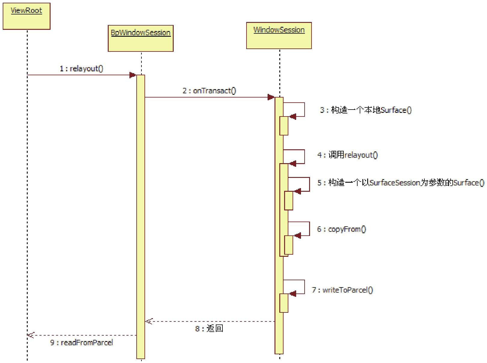

# 8.3.2 Surface之乾坤大挪移


1.乾坤大挪移的表象relayout的函数是一个跨进程的调用，由WMS完成实际处理。先到ViewRoot中看看调用方的用法，代码如下所示：

[--＞ViewRoot.java]

```java
        public int relayout(IWindow window, WindowManager.LayoutParams attrs,
                        int requestedWidth, int requestedHeight, int viewFlags,
                        boolean insetsPending, Rect outFrame, Rect outContentInsets,
                        Rect outVisibleInsets, Configuration outConfig,
                        Surface outSurface) {
                        //注意最后这个参数的名字，叫outSurface。

            //调用外部类对象的relayoutWindow。
            return relayoutWindow(this, window, attrs,
                            requestedWidth, requestedHeight, viewFlags, insetsPending,
                            outFrame, outContentInsets, outVisibleInsets, outConfig,
                            outSurface);
        }
```

再看接收方的处理。它在WMS的Session中，代码如下所示：

[--＞WindowManagerService.java::Session][--＞WindowManagerService.java]

```java
        public int relayoutWindow(Session session, IWindow client,
                    WindowManager.LayoutParams attrs, int requestedWidth,
                    int requestedHeight, int viewVisibility, boolean insetsPending,
                    Rect outFrame, Rect outContentInsets, Rect outVisibleInsets,
                    Configuration outConfig, Surface outSurface){
            .....
          try {
                  //win就是WinState，这里将创建一个本地的Surface对象。
                  Surface surface = win.createSurfaceLocked();
                  if (surface != null) {
                    //先创建一个本地surface，然后在outSurface的对象上调用copyFrom。
                    //将本地Surface的信息拷贝到outSurface中，为什么要这么麻烦呢？
                    outSurface.copyFrom(surface);
                  }
          }
            ......
        }
```

```java
        Surface createSurfaceLocked() {
              ......
            try {
              //mSurfaceSession就是在Session上创建的SurfaceSession对象。
              //这里以它为参数，构造一个新的Surface对象。
                  mSurface = new Surface(
                          mSession.mSurfaceSession, mSession.mPid,
                          mAttrs.getTitle().toString(),
                          0, w, h, mAttrs.format, flags);
              }
                  Surface.openTransaction();//打开一个事务处理。
                  ......
                  Surface.closeTransaction();//关闭一个事务处理。关于事务处理以后再分析。
                  ......
        }
```

[--＞WindowManagerService.java::WindowState]


图8-7复杂的Surface创建流程根据图8-7可知：

WMS中的Surface是“乾坤”中的“乾”​，它的构造使用了带上面的代码段好像有点混乱。用图8-7来表示SurfaceSession参数的构造函数。

一下这个流程：

ViewRoot中的Surface是“乾坤”中的“坤”​，它的构造使用了无参构造函数。

copyFrom就是挪移，它将乾中的

```java
        interface IWindowSession {
            ......
          int relayout(IWindow window, in WindowManager.LayoutParams attrs,
                    int requestedWidth, int requestedHeight, int viewVisibility,
                    boolean insetsPending, out Rect outFrame, out Rect outContentInsets,
                    out Rect outVisibleInsets, out Configuration outConfig,
                    out Surface outSurface);
```

```java
        在命令行下可以输入：
        aidl  -Ie:\froyo\source\frameworks\base\core\java\  -Ie:\froyo\source\frameworks\
        base\Graphics\java  e:\froyo\source\frameworks\base\core\java\android\view\
        IWindowSession.aidl test.java
        新生成的Java文件叫test.java。其中，-I参数指定include目录，这是因为aidl文件中可能使用了别
        的Java文件中的类，所以需要指定这些Java文件所在的目录。
```

Surface信息，拷贝到坤中的Surface即outSurface里。

要是觉得乾坤大挪移就是这两三下，未免就太小看它了。为了彻底揭示这期间的复杂过程，我们将使用必杀技——aidl工具。

2.揭秘Surface的乾坤大挪移下面，拿必杀技aidl来编译一下这个aidl文aidl可以把XXX.aidl文件转换成对应的Java文件，使用方法如下：

件。刚才所说的乾坤大挪移发生在ViewRoot调用IWindowSession的relayout函数中，它在IWindowSession.adil中的定义如下：

[--＞IWindowSesson.aidl]

```java
        public int relayout(android.view.IWindow window,
                          android.view.WindowManager.LayoutParams attrs,
                          int requestedWidth, int requestedHeight,
                          int viewVisibility, boolean insetsPending,
                          android.graphics.Rect outFrame,
                          android.graphics.Rect outContentInsets,
                          android.graphics.Rect outVisibleInsets,
                          android.content.res.Configuration outConfig,
                          android.view.Surface outSurface)//outSurface是第11个参数。
                                          throws android.os.RemoteException
        {
            android.os.Parcel _data = android.os.Parcel.obtain();
            android.os.Parcel _reply = android.os.Parcel.obtain();
            int _result;
            try {
              _data.writeInterfaceToken(DESCRIPTOR);
              _data.writeStrongBinder((((window!=null))?(window.asBinder()):(null)));
              if ((attrs!=null)) {
                _data.writeInt(1);
                attrs.writeToParcel(_data, 0);
              }
            else {
            _data.writeInt(0);
            }
          _data.writeInt(requestedWidth);
          _data.writeInt(requestedHeight);
          _data.writeInt(viewVisibility);
          _data.writeInt(((insetsPending)?(1):(0)));
          //奇怪，outSurface的信息没有写到请求包_data中，就直接发送请求消息了。
          mRemote.transact(Stub.TRANSACTION_relayout, _data, _reply, 0);
          _reply.readException();
          _result = _reply.readInt();
          if ((0!=_reply.readInt())) {
            outFrame.readFromParcel(_reply);
          }
          ......
          if ((0!=_reply.readInt())) {
              outSurface.readFromParcel(_reply); //从Parcel中读取信息来填充outSurface。
            }
          }
          ......
          return _result;
        }
```

先看ViewRoot这个客户端生成的代码，如下所示：

[--＞test.java::Bp端::relayout]

```java
        public boolean onTransact(int code, android.os.Parcel data,
                                        android.os.Parcel reply, int flags)
                            throws android.os.RemoteException
        {
          switch (code)
          {
            case TRANSACTION_relayout:
            {
              data.enforceInterface(DESCRIPTOR);
              android.view.IWindow _arg0;
              android.view.Surface _arg10;
              //刚才讲了，Surface信息并没有传过来，那么在relayOut中看到的outSurface是怎么
              //出来的呢？看下面这句话便可知，原来在服务端这边竟然new了一个新的Surface!!!
              _arg10 = new android.view.Surface();
              int _result = this.relayout(_arg0, _arg1, _arg2, _arg3, _arg4,
              _arg5, _arg6, _arg7, _arg8, _arg9, _arg10);
              reply.writeNoException();
              reply.writeInt(_result);
              //_arg10就是调用copyFrom的那个outSurface，那怎么传到客户端呢？
              if ((_arg10!=null)) {
                    reply.writeInt(1);
                    //调用Surface的writeToParcel，把信息写到reply包中。
                    //注意最后一个参数为PARCELABLE_WRITE_RETURN_VALUE。
                    _arg10.writeToParcel(reply,
                          android.os.Parcelable.PARCELABLE_WRITE_RETURN_VALUE);
                }
            }
            ......
            return true;
        }
```

奇怪！ViewRoot调用requestlayout竟然没有把outSurface信息传进去，这么说，服务端收到的Surface对象应该就是空吧？那怎么能调用copyFrom呢？还是来看服务端的处理，首先看收到消息的onTransact函数，代码如下所示：

[--＞test.java::Bn端::onTransact]看完这个你是否会觉得大吃一惊？我最开始一直在JNI文件中寻找大挪移的踪迹，但是有几个关键点始终不能明白，万不得已就使用了这个aidl必杀技，终于揭露了真相。

3.乾坤大挪移的真相这里总结一下乾坤大挪移的整个过程，如图8-8表示：



图8-8乾坤大挪移的真面目上图非常清晰地列出了乾坤大挪移的过程，我们可结合代码来加深理解。

注意这里将BpWindowSession作为了IWindowSessionBinder在客户端的代表。
