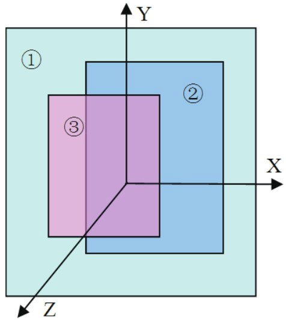
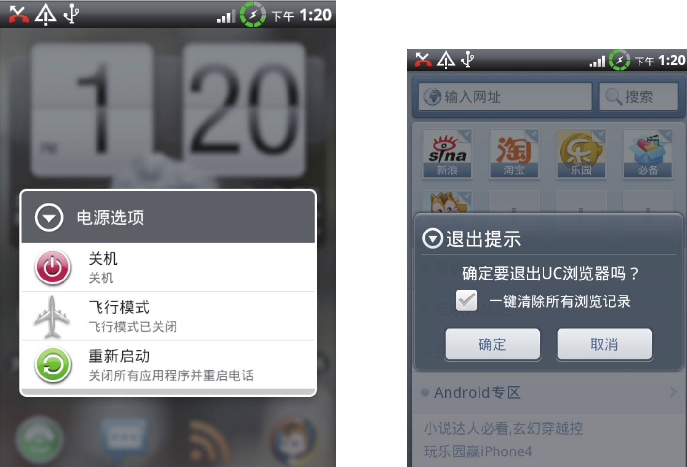
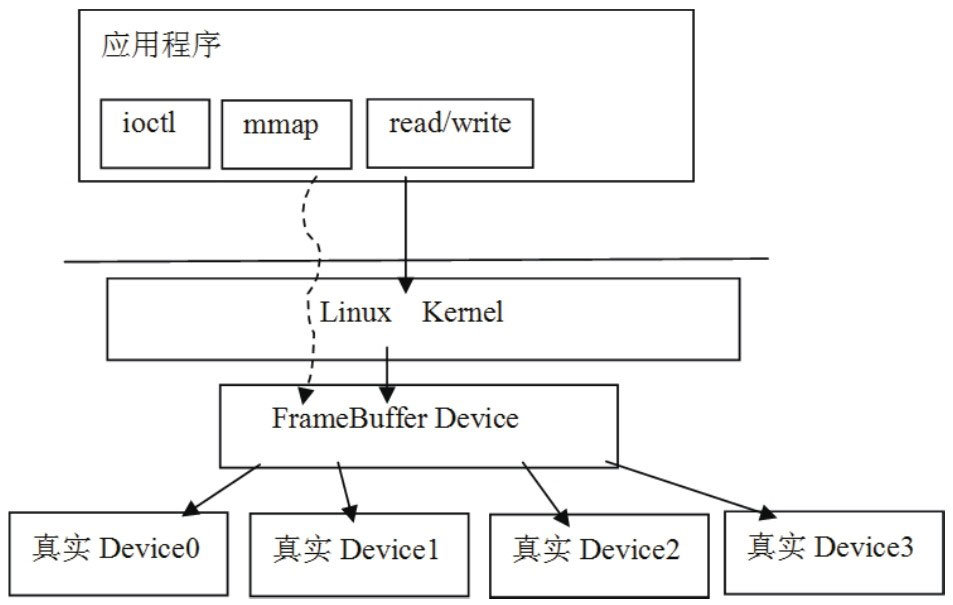

# 8.4.1 与Surface相关的基础知识介绍


8.4.1与Surface相关的基础知识介绍1.显示层（Layer）和屏幕组成你了解屏幕显示的漂亮界面是如何组织的吗？

来看图8-10所展示的屏幕组成示意图。



图8-10屏幕组成示意图从图8-10中可以看出：

屏幕位于一个三维坐标系中，其中Z轴从屏幕内指向屏幕外。

编号为①②③的矩形块叫显示层（Layer）​。每一层有自己的属性，例如颜色、透明度、所处屏幕的位置、宽、高等。除了属性之外，每一层还有自己对应的显示内容，也就是需要显示的图像。

在Android中，Surface系统工作时，会由SurfaceFlinger对这些按照Z轴排好序的显示层进行图像混合，混合后的图像就是在屏幕上看到的美妙画面了。这种按Z轴排序的方式符合我们在日常生活中的体验，例如前面的物体会遮挡住后面的物体。

注意Surface系统中定义了一个名为Layer类型的类，为了区分广义概念上的Layer和代码中的Layer，这里称广义层的Layer为显示层，以免混淆。

Surface系统提供了三种属性，一共四种不同的显示层。简单介绍一下：

第一种属性是eFXSurfaceNormal属性，大多数的UI界面使用的就是这种属性。它有两种模式：

1）Normal模式，这种模式的数据，是通过前面的mView.draw（canvas）画上去的。这也是绝大多数UI所采用的方式。

2）PushBuer模式，这种模式对应于视频播放、摄像机摄录/预览等应用场景。以摄像机为例，当摄像机运行时，来自Camera的预览数据将直接push到Buer中，无须应用层自己再去draw了。

第二种属性是eFXSurfaceBlur属性，这种属性的UI有点朦胧美，看起来很像隔着一层毛玻璃。

第三种属性是eFXSurfaceDim属性，这种属性的UI看起来有点暗，好像隔了一层深色玻璃。从视觉上讲，虽然它的UI看起来有点暗，但并不模糊。而eFXSurfaceBlur不仅暗，还有些模糊。

图8-11展示了最后两种类型的视觉效果图，其中左边的是Blur模式，右边的是Dim模式。



图8-11Blur和Dim效果图注意关于Surface系统的显示层属性定义，读者可参考ISurfaceComposer.h。

本章将重点分析第一种属性的两类显示层的工作原理。

2.FrameBuer和PageFlipping我们知道，在Audio系统中音频数据传输的过程是：

由客户端把数据写到共享内存中。

然后由AudioFlinger从共享内存中取出数据再往AudioHAL中发送。

根据以上介绍可知，在音频数据传输的过程中，共享内存起到了数据承载的重要作用。无独有偶，Surface系统中的数据传输也存在同样的过程，但承载图像数据的是鼎鼎大名的FrameBuer（简称FB）​。下面先来介绍FrameBuer，然后再介绍Surface的数据传输过程。

（1）FrameBuer介绍FrameBuer的中文名叫帧缓冲，它实际上包括两个不同的方面：

Frame：帧，就是指一幅图像。在屏幕上看到的那幅图像就是一帧。

Buer：缓冲，就是一段存储区域，不过这个区域存储的是帧。

FrameBuer的概念很清晰，它就是一个存储图形/图像帧数据的缓冲。这个缓冲来自哪里？理解这个问题，需要简单介绍一下Linux平台的虚拟显示设备FrameBuerDevice（简称FBD）​。FBD是Linux系统中的一个虚拟设备，设备文件对应为/dev/fb%d（比如/dev/fb0）​。这个虚拟设备将不同硬件厂商实现的真实设备统一在一个框架下，这样应用层就可以通过标准的接口进行图形/图像的输入和输出了。图8-12展示了FBD示意图：



图8-12Linux系统中的FBD示意图从上图中可以看出，应用层通过标准的ioctl或mmap等系统调用，就可以操作显示设备了，用起来非常方便。这里把mmap的调用列出来，相信大部分读者都知道它的作用了。

FrameBuer中的Buer，就是通过mmap把设备中的显存映射到用户空间的，在这块缓冲上写数据，就相当于在屏幕上绘画。

注意上面所说的框架将引出另外一个概念LinuxFrameBuer（简称LFB）​。LFB是Linux平台提供的一种可直接操作FB的机制，依托这个机制，应用层通过标准的系统调用，就可以操作显示设备了。从使用的角度来看，它和LinuxAudio中的OSS有些类似。

```java
        struct fbinfo {//定义一个结构体。
            unsigned int version;
            unsigned int bpp;
            unsigned int size;
            unsigned int width;
            unsigned int height;
            unsigned int red_offset;
            unsigned int red_length;
            unsigned int blue_offset;
            unsigned int blue_length;
            unsigned int green_offset;
            unsigned int green_length;
            unsigned int alpha_offset;
            unsigned int alpha_length;
        } __attribute__((packed));
        //fd是一个文件的描述符，这个函数的目的，是把当前屏幕的内容写到一个文件中。
        void framebuffer_service(int fd, void ＊cookie)
        {
            struct fb_var_screeninfo vinfo;
            int fb, offset;
            char x[256];

            struct fbinfo fbinfo;
            unsigned i, bytespp;
            //Android系统上的fb设备路径在/dev/graphics目录下。
            fb = open("/dev/graphics/fb0", O_RDONLY);
            if(fb ＜ 0) goto done;
            //取出屏幕的属性。
            if(ioctl(fb, FBIOGET_VSCREENINFO, &vinfo) ＜ 0) goto done;
            fcntl(fb, F_SETFD, FD_CLOEXEC);

            bytespp = vinfo.bits_per_pixel / 8;
            //根据屏幕的属性填充fbinfo结构，这个结构要写到输出文件的头部。
            fbinfo.version = DDMS_RAWIMAGE_VERSION;
            fbinfo.bpp = vinfo.bits_per_pixel;
            fbinfo.size = vinfo.xres ＊ vinfo.yres ＊ bytespp;
            fbinfo.width = vinfo.xres;
            fbinfo.height = vinfo.yres;
        /＊
        下面几个变量和颜色格式有关，以RGB565为例简单介绍一下。
        RGB565表示一个像素点中的R分量为5位，G分量为6位，B分量为5位，并且没有Alpha分量。
        这样一个像素点的大小为16位，占两个字节，比RGB888格式的一个像素少一个字节（它一个像素是三个字节）。
        x_length的值为x分量的位数，例如，RGB565中R分量就是5位。
        x_offset的值代表x分量在内存中的位置。如RGB565一个像素占两个字节，那么x_offeset
        表示x分量在这两个字节内存区域中的起始位置，但这个顺序是反的，也就是B分量在前，
        R在最后。所以red_offset的值就是11，而blue_offset的值是0，green_offset的值是6。
        这些信息在做格式转换时（例如从RGB565转到RGB888的时候）有用。
        ＊/
            fbinfo.red_offset = vinfo.red.offset;
            fbinfo.red_length = vinfo.red.length;
            fbinfo.green_offset = vinfo.green.offset;
            fbinfo.green_length = vinfo.green.length;
            fbinfo.blue_offset = vinfo.blue.offset;
            fbinfo.blue_length = vinfo.blue.length;
            fbinfo.alpha_offset = vinfo.transp.offset;
            fbinfo.alpha_length = vinfo.transp.length;

            offset = vinfo.xoffset ＊ bytespp;

            offset += vinfo.xres ＊ vinfo.yoffset ＊ bytespp;
            //将fb信息写到文件头部。
            if(writex(fd, &fbinfo, sizeof(fbinfo))) goto done;

            lseek(fb, offset, SEEK_SET);
            for(i = 0; i ＜ fbinfo.size; i += 256) {
              if(readx(fb, &x, 256)) goto done;//读取FBD中的数据。
              if(writex(fd, &x, 256)) goto done;//将数据写到文件中。
            }

            if(readx(fb, &x, fbinfo.size % 256)) goto done;
            if(writex(fd, &x, fbinfo.size % 256)) goto done;

        done:
            if(fb ＞= 0) close(fb);
            close(fd);
        }
```

为了加深读者对此节内容的理解，这里给出一个小例子，就是在DDMS工具中实现屏幕截图功能，其代码在framebuer_service.c中，如下所示：

[--＞framebuer_service.c]上面函数的目的就是截屏，这个例子可加深我们对FB的直观感受，相信读者下次再碰到FB时就不会犯怵了。

注意我们可根据这段代码，写一个简单的Native可执行程序，然后adbpush到设备上运行。注意上面写到文件中的是RGB565格式的原始数据，如想在台式机上看到这幅图片，可将它转换成BMP格式。我的个人博客上提供一个RGB565转BMP的程序，读者可以下载或自己另写一个，这样或许有助于更深入地理解图形/图像方面的知识。

在继续分析前，先来问一个问题：

前面在Audio系统中讲过，CB对象通过读写指针来协调生产者/消费者的步调，那么Surface系统中的数据传输过程，是否也需通过读写指针来控制呢？

答案是肯定的，但不像Audio中的CB那样复杂。

（2）PageFlipping图形/图像数据和音频数据不太一样，我们一般把音频数据叫音频流，它是没有边界的,而图形/图像数据是一帧一帧的，是有边界的。

这一点非常类似UDP和TCP之间的区别。所以在图形/图像数据的生产/消费过程中，人们使用了一种叫PageFlipping的技术。

PageFlipping的中文名叫画面交换，其操作过程如下所示：

分配一个能容纳两帧数据的缓冲，前面一个缓冲叫FrontBuer，后面一个缓冲叫BackBuer。

消费者使用FrontBuer中的旧数据，而生产者用新数据填充BackBuer，二者互不干扰。

当需要更新显示时，BackBuer变成FrontBuer，FrontBuer变成BackBuer。如此循环，这样就总能显示最新的内容了。这个过程很像我们平常的翻书动作，所以它被形象地称为PageFlipping。

说明说白了，PageFlipping其实就是使用了一个只有两个成员的帧缓冲队列，以后在分析数据传输的时候还会见到诸如dequeue和queue的操作。

3.图像混合我们知道，在AudioFlinger中有混音线程，它能将来自多个数据源的数据混合后输出，那么，SurfaceFlinger是不是也具有同样的功能呢？

答案是肯定的，否则它就不会叫Flinger了。

Surface系统支持软硬两个层面的图像混合：

软件层面的混合：例如使用copyBlt进行源数据和目标数据的混合。

硬件层面的混合：使用Overlay系统提供的接口。

无论是硬件还是软件层面，都需将源数据和目标数据进行混合，混合需考虑很多内容，例如源的颜色和目标的颜色叠加后所产生的颜色。

关于这方面的知识，读者可以学习计算机图形/图像学。这里只简单介绍一下copyBlt和Overlay。

copyBlt，从名字上看是数据拷贝，它也可以由硬件实现，例如现在很多的2D图形加速就是将copyBlt改由硬件来实现，以提高速度的。但不必关心这些，我们只需关心如何调用copyBlt相关的函数进行数据混合即可。

Overlay方法必须有硬件支持才可以，它主要用于视频的输出，例如视频播放、摄像机摄像等，因为视频的内容往往变化很快，所以如改用硬件进行混合效率会更高。

总体来说，Surface是一个比较庞大的系统，由于篇幅和精力所限，本章后面的内容将重点关注Surface系统的框架和工作流程。在掌握框架和流程后，读者就可以在大的脉络中迅速定位到自己感兴趣的地方，然后展开更深入的研究了。

下面通过图8-9所示的精简流程，深入分析Android的Surface系统。

```c
        static void SurfaceSession_init(JNIEnv＊ env, jobject clazz)
        {
          //new 一个SurfaceComposerClient对象。
        sp＜SurfaceComposerClient＞ client = new SurfaceComposerClient;
        //sp的使用也有让人烦恼的地方，有时需要显式地增加强弱引用计数，要是忘记可就麻烦了。
        client-＞incStrong(clazz);
        env-＞SetIntField(clazz, sso.client, (int)client.get());
        }
```

8.4.2SurfaceComposerClient分析SurfaceComposerClient的出现是因为：

Java层SurfaceSession对象的构造函数会调用Native的SurfaceSession_init函数，而该函数的主要目的就是创建SurfaceComposerClient。

先回顾一下SurfaceSession_init函数，代码如下所示：

[--＞android_view_Surface.cpp]
