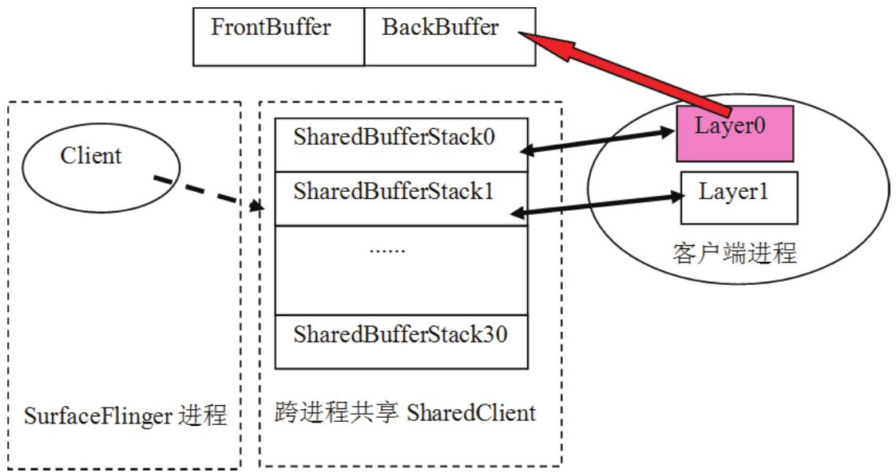
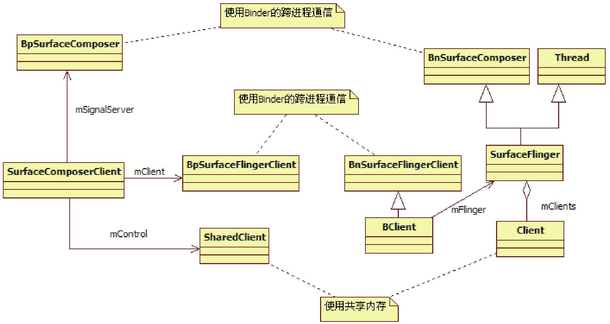

# 8.4.2 SurfaceComposerClient分析


上面代码中，显式地构造了一个SurfaceComposerClient对象。接下来看它是何方神圣。

1.创建SurfaceComposerClientSurfaceComposerClient这个名字隐含的意思是：

这个对象会和SurfaceFlinger进行交互，因为SurfaceFlinger派生于SurfaceComposer。

通过它的构造函数来看是否是这样的。代码如下所示：

[--＞SurfaceComposerClient.cpp]

```cpp
        SurfaceComposerClient::SurfaceComposerClient()
        {
          //getComposerService()将返回SF的Binder代理端的BpSurfaceFlinger对象。
          sp＜ISurfaceComposer＞ sm(getComposerService());
        //先调用SF的createConnection，再调用_init。
            _init(sm, sm-＞createConnection());

            if (mClient != 0) {
                Mutex::Autolock _l(gLock);
                //gActiveConnections是全局变量，把刚才创建的client保存到这个map中去。
                gActiveConnections.add(mClient-＞asBinder(), this);
            }
        }
```

```cpp
        sp＜ISurfaceFlingerClient＞ SurfaceFlinger::createConnection()
        {
            Mutex::Autolock _l(mStateLock);
            uint32_t token = mTokens.acquire();
            //先创建一个Client。
            sp＜Client＞ client = new Client(token, this);
            //把这个Client对象保存到mClientsMap中，token是它的标识。
            status_t err = mClientsMap.add(token, client);
            /＊
            创建一个用于Binder通信的BClient，BClient派生于ISurfaceFlingerClient，
            它的作用是接受客户端的请求，然后把处理提交给SF，注意，并不是提交给Client。
            Client会创建一块共享内存，该内存由getControlBlockMemory函数返回。
            ＊/
            sp＜BClient＞ bclient =
                new BClient(this, token, client-＞getControlBlockMemory());
            return bclient;
        }
```

果然如此，SurfaceComposerClient建立了和SF的交互通道，下面直接转到SF的createConnection函数去观察。

（1）createConnection分析直接看代码，如下所示：

[--＞SurfaceFlinger.cpp]上面代码中提到，Client会创建一块共享内存。熟悉Audio的读者或许会想到，这可能是Surface的ControlBlock对象！确实是的。CB

```cpp
        Client::Client(ClientID clientID, const sp＜SurfaceFlinger＞& flinger)
            : ctrlblk(0), cid(clientID), mPid(0), mBitmap(0), mFlinger(flinger)
        {
            const int pgsize = getpagesize();
            //下面这个操作会使cblksize为页的大小，目前是4096字节。
            const int cblksize = ((sizeof(SharedClient)+(pgsize-1))&～(pgsize-1));
            //MemoryHeapBase是我们的老朋友了，不熟悉的读者可以回顾Audio系统中所介绍的内容。
            mCblkHeap = new MemoryHeapBase(cblksize, 0,
                          "SurfaceFlinger Client control-block");

            ctrlblk = static_cast＜SharedClient ＊＞(mCblkHeap-＞getBase());
            if (ctrlblk) {
                new(ctrlblk) SharedClient; //再一次觉得眼熟吧？使用了placement new。
            }
        }
```

```cpp
        class SharedClient
        {
        public:
            SharedClient();
            ～SharedClient();
            status_t validate(size_t token) const;
            uint32_t getIdentity(size_t token) const;//取出标识本Client的token。

        private:
            Mutex lock;
        Condition cv; //支持跨进程的同步对象。
            //NUM_LAYERS_MAX为31，SharedBufferStack是什么？
            SharedBufferStack surfaces[ NUM_LAYERS_MAX ];
        };
        //SharedClient的构造函数，没什么新意，不如Audio的CB对象复杂。
        SharedClient::SharedClient()
            : lock(Mutex::SHARED), cv(Condition::SHARED)
        {
        }
```

对象在协调生产/消费步调时，起到了决定性的控制作用，所以非常重要，下面来看：

[--＞SurfaceFlinger.cpp]原来，Surface的CB对象就是在共享内存中创建的这个SharedClient对象。先来认识一下这个SharedClient。

（2）SharedClient分析SharedClient定义了一些成员变量，代码如下所示：

SharedClient的定义似乎简单到极致了，不过不要高兴得过早，在这个SharedClient的定义中，没有发现和读写控制相关的变量，那怎么控制读写呢？

答案就在看起来很别扭的SharedBuerStack数组中，它有31个元素。关于它的作用就不必卖关子了，答案是：

一个Client最多支持31个显示层。每一个显示层的生产/消费步调都由会对应的SharedBuerStack来控制。而它内部就是用几个成员变量来控制读写位置的。

认识一下SharedBuerStack的这几个控制变量，如下所示：

[--＞SharedBuerStack.h]

```cpp
        class   SharedBufferStack{
              ......
            //Buffer是按块使用的，每个Buffer都有自己的编号，其实就是数组中的索引号。
            volatile int32_t head;      //FrontBuffer的编号。
            volatile int32_t available; //空闲Buffer的个数。
            volatile int32_t queued;    //脏Buffer的个数，有脏Buffer表示有新数据的Buffer。
            volatile int32_t inUse;     //SF当前正在使用的Buffer的编号。
            volatile status_t status;   //状态码
              ......
          }
```

注意，上面定义的SharedBuerStack是一个通用的控制结构，而不仅是针对于只有两个Buer的情况。根据前面介绍的PageFlipping知识可知，如果只有两个FB，那么，SharedBuerStack的控制就比较简单了：

要么SF读1号Buer，客户端写0号Buer，要么SF读0号Buer，客户端写1号Buer。

图8-13是展示了SharedClient的示意图：



图8-13SharedClient的示意图从上图可知：

SF的一个Client分配一个跨进程共享的SharedClient对象。这个对象有31个SharedBuerStack元素，每一个SharedBuerStack对应于一个显示层。

一个显示层将创建两个Buer，后续的PageFlipping就是基于这两个Buer展开的。

另外，每一个显示层中，其数据的生产和消费并不是直接使用SharedClient对象来进行具体控制的，而是基于SharedBuerServer和SharedBuerClient两个结构，由这两个结构来对该显示层使用的SharedBuerStack进行操作，这些内容在以后的分析中还会碰到。

注意这里的显示层指的是Normal类型的显示层。

来接着分析后面的_init函数。

（3）_init函数分析

```
        void SurfaceComposerClient::_init(
                const sp＜ISurfaceComposer＞& sm, const sp＜ISurfaceFlingerClient＞& conn)
        {
            mPrebuiltLayerState = 0;
            mTransactionOpen = 0;
            mStatus = NO_ERROR;
            mControl = 0;

            mClient = conn;    //mClient就是BClient的客户端
            mControlMemory = mClient-＞getControlBlock();
            mSignalServer = sm;// mSignalServer就是BpSurfaceFlinger。
            //mControl就是那个创建于共享内存之中的SharedClient。
            mControl = static_cast＜SharedClient ＊＞(mControlMemory-＞getBase());
        }
```

先回顾一下之前的调用，代码如下所示：

[--＞SurfaceComposerClient.cpp]

```cpp
        SurfaceComposerClient::SurfaceComposerClient()
        {
            ......
            _init(sm, sm-＞createConnection());
            ......
        }
```

来看这个_init函数，代码如下所示：

[--＞SurfaceComposerClient.cpp]_init函数的作用，就是初始化SurfaceComposerClient中的一些成员变量。最重要的是得到了三个成员：

mSignalServer，它其实是SurfaceFlinger在客户端的代理BpSurfaceFlinger，它的主要作用是，在客户端更新完BackBuer后（也就是刷新了界面后）​，通知SF进行PageFlipping和输出等工作。

mControl，它是跨进程共享的SharedClient，是Surface系统的ControlBlock对象。

mClient，它是BClient在客户端的对应物。

2.到底有多少种对象？

这一节出现了好几种类型的对象，通过图8-14来看看它们：



图8-14类之间关系的展示图从上图中可以看出：

SurfaceFlinger是从Thread派生的，所以它会有一个单独运行的工作线程。

BClient和SF之间采用了Proxy模式，BClient支持Binder通信，它接收客户端的请求，并派发给SF执行。

SharedClient构建于一块共享内存中，SurfaceComposerClient和Client对象均持有这块共享内存。

在精简流程中，关于SurfaceComposerClient就分析到这里，下面分析第二个步骤中的SurfaceControl对象。
