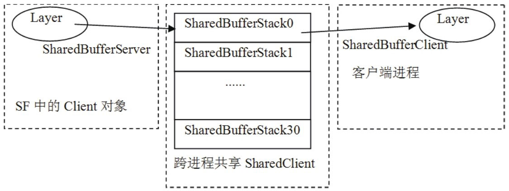
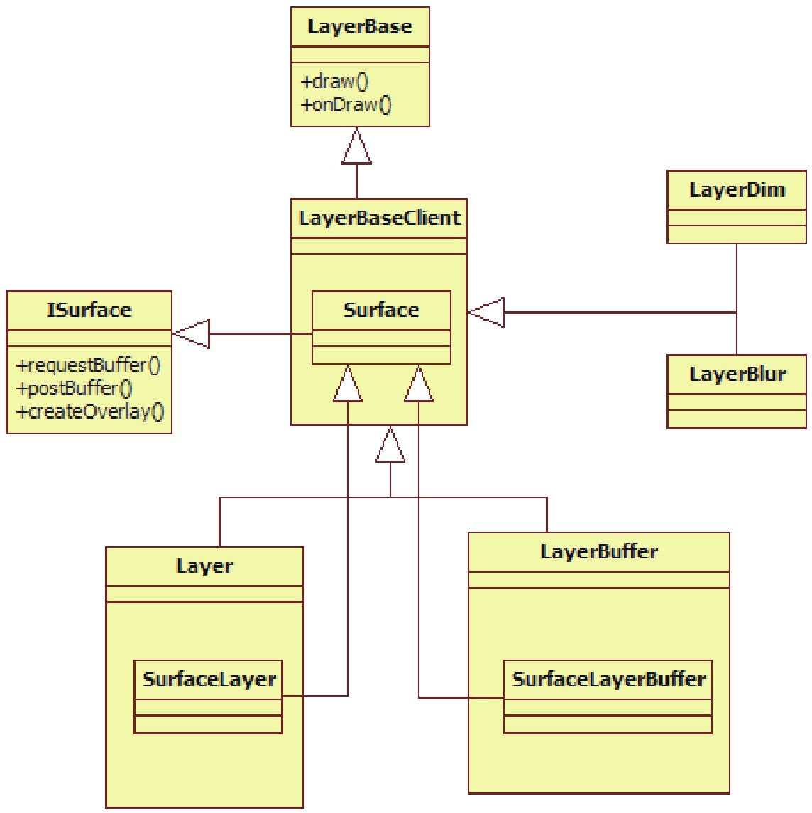
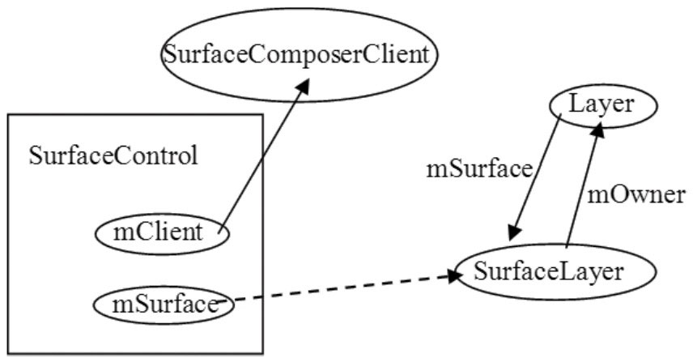

# 8.4.3 SurfaceControl分析


1.SurfaceControl的来历根据精简的流程可知，这一节要分析的是SurfaceControl对象。先回顾一下这个对象的创建过程，代码如下所示：

[--＞android_view_Surface.cpp]通过上面的代码可知，SurfaceControl对象由createSurface得来，下面看看这个函数。

注意此时，读者或许会被代码中随意起的变量名搞糊涂，而我的处理方法是碰到了容

```cpp
        sp＜SurfaceControl＞ SurfaceComposerClient::createSurface(
                int pid,
                DisplayID display,//DisplayID是什么意思？
                uint32_t w,
                uint32_t h,
                PixelFormat format,
                uint32_t flags)
        {
            String8 name;
            const size_t SIZE = 128;
            char buffer[SIZE];
            snprintf(buffer, SIZE, "＜pid_%d＞", getpid());
            name.append(buffer);
            //调用另外一个createSurface，多一个name参数。
            return SurfaceComposerClient::createSurface(pid, name, display,
                    w, h, format, flags);

        }
```

易混淆的地方，尽量以对象类型来表示这个对象。

（1）createSurface的请求端分析在createSurface内部会使用Binder通信将请求发给SF，所以它分为请求和响应两端，先看请求端，代码如下所示：

[--＞SurfaceComposerClient.cpp]在分析另外一个createSurface之前，应先介绍一下DisplayID的含义：

```cpp
        typedef int32_t     DisplayID;
```

DisplayID是一个int整型，它的意义是屏幕编号，例如双屏手机就有内屏和外屏两块屏幕。

```
        sp＜SurfaceControl＞ SurfaceComposerClient::createSurface(
                int pid,const String8& name,DisplayID display,uint32_t w,
                uint32_t h,PixelFormat format,uint32_t flags)
        {
            sp＜SurfaceControl＞ result;
            if (mStatus == NO_ERROR) {
                ISurfaceFlingerClient::surface_data_t data;
                //调用BpSurfaceFlingerClient的createSurface函数
                sp＜ISurface＞ surface = mClient-＞createSurface(&data, pid, name,
                                            display, w, h, format, flags);
                if (surface != 0) {
                    if (uint32_t(data.token) ＜ NUM_LAYERS_MAX) {
                        //以返回的ISurface对象创建一个SurfaceControl对象。
                        result = new SurfaceControl(this, surface, data, w, h,
                                                      format, flags);
                    }
                }
        }
            return result;//返回的是SurfaceControl对象。
        }
```

由于目前Android的Surface系统只支持一块屏幕，所以这个变量的取值都是0。

再分析另外一个createSurface函数，它的代码如下所示：

[--＞SurfaceComposerClient.cpp]请求端的处理比较简单：

调用跨进程的createSurface函数，得到一个ISurface对象，根据第6章的Binder相关知识可知，这个对象的真实类型是BpSurface。不过以后统称为ISurface。

以这个ISurface对象为参数，构造一个SurfaceControl对象。

createSurface函数的响应端在SurfaceFlinger进程中，下面去看这个函数。

注意在Surface系统定义了很多类型，咱们也中途休息一下，不妨来看看和字符串“Surface”有关的类有多少个，权当小小的娱乐：

Native层有Surface、ISurface、SurfaceControl、SurfaceComposerClient。

```cpp
        sp＜ISurface＞ BClient::createSurface(
                ISurfaceFlingerClient::surface_data_t＊ params, int pid,
                const String8& name,
                DisplayID display, uint32_t w, uint32_t h, PixelFormat format,
                uint32_t flags)
        {
          //果然是交给SF处理，以后我们将跳过BClient这个代理。
        return mFlinger-＞createSurface(mId, pid, name, params, display, w, h,
                    format, flags);
        }
```

Java层有Surface、SurfaceSession。

上面还只列出了一部分，后面还有呢！

*&@&*%￥*（2）createSurface的响应端分析前面讲过，可把BClient看作是SF的Proxy，它会把来自客户端的请求派发给SF处理，通过代码来看看是不是这样的。如下所示：

[--＞SurfaceFlinger.cpp]

```cpp
        sp＜ISurface＞ SurfaceFlinger::createSurface(ClientID clientId, int pid,
                const String8& name, ISurfaceFlingerClient::surface_data_t＊ params,
                DisplayID d, uint32_t w, uint32_t h, PixelFormat format,
                uint32_t flags)
        {
        sp＜LayerBaseClient＞ layer;//LayerBaseClient是Layer家族的基类。
        //这里又冒出一个LayerBaseClient的内部类，它也叫Surface，是不是有点头晕了？
        sp＜LayerBaseClient::Surface＞ surfaceHandle;

        Mutex::Autolock _l(mStateLock);
        //根据clientId找到createConnection时加入的那个Client对象。
        sp＜Client＞ client = mClientsMap.valueFor(clientId);
            ......
            //注意这个id，它的值表示Client创建的是第几个显示层，根据图8-14可以看出，这个id

            //同时也表示将使用SharedBufferStatck数组的第id个元素。
            int32_t id = client-＞generateId(pid);
            //一个Client不能创建多于NUM_LAYERS_MAX个的Layer。
            if (uint32_t(id) ＞= NUM_LAYERS_MAX) {
                return surfaceHandle;
            }
            //根据flags参数来创建不同类型的显示层，我们在8.4.1节介绍过相关知识。
            switch (flags & eFXSurfaceMask) {
                case eFXSurfaceNormal:
                    if (UNLIKELY(flags & ePushBuffers)) {
                      //创建PushBuffer类型的显示层，我们将在本章的拓展思考部分分析它。
                      layer = createPushBuffersSurfaceLocked(client, d, id,
                                  w, h, flags);
                    } else {
                        //①创建Normal类型的显示层，我们待会儿分析这个。
                        layer = createNormalSurfaceLocked(client, d, id,
                                w, h, flags, format);
                    }
                    break;
                case eFXSurfaceBlur:
                    //创建Blur类型的显示层。
                    layer = createBlurSurfaceLocked(client, d, id, w, h, flags);
                    break;
                case eFXSurfaceDim:
                    //创建Dim类型的显示层。
                    layer = createDimSurfaceLocked(client, d, id, w, h, flags);
                    break;
            }

            if (layer != 0) {
                layer-＞setName(name);
                setTransactionFlags(eTransactionNeeded);
                //从显示层对象中取出一个ISurface对象赋值给SurfaceHandle。
                surfaceHandle = layer-＞getSurface();
                if (surfaceHandle != 0) {
                    params-＞token = surfaceHandle-＞getToken();
                    params-＞identity = surfaceHandle-＞getIdentity();
                    params-＞width = w;
                    params-＞height = h;
                    params-＞format = format;
                }
            }
            return surfaceHandle;//ISurface的Bn端就是这个对象。
        }
```

来看createSurface函数，它的目的就是创建一个ISurface对象，不过这中间的玄机还挺多，代码如下所示：

[--＞SurfaceFlinger.cpp]上面代码中的函数倒是很简单，只是代码里面冒出来的几个新类型和它们的名字让人有点头晕。先用文字总结一下：

```cpp
        sp＜LayerBaseClient＞ SurfaceFlinger::createNormalSurfaceLocked(
                const sp＜Client＞& client, DisplayID display,
                int32_t id, uint32_t w, uint32_t h, uint32_t flags,
                PixelFormat& format)
        {
            switch (format) { //一些图像方面的参数设置，可以不去管它。
            case PIXEL_FORMAT_TRANSPARENT:
            case PIXEL_FORMAT_TRANSLUCENT:
                format = PIXEL_FORMAT_RGBA_8888;
                break;
            case PIXEL_FORMAT_OPAQUE:
                format = PIXEL_FORMAT_RGB_565;
                break;
            }
            //①创建一个Layer类型的对象。
            sp＜Layer＞ layer = new Layer(this, display, client, id);
            //②设置Buffer。
            status_t err = layer-＞setBuffers(w, h, format, flags);
            if (LIKELY(err == NO_ERROR)) {
                  //初始化这个新layer的一些状态。
                layer-＞initStates(w, h, flags);
                //③ 还记得在图8-10中提到的Z轴吗？下面这个函数把这个layer加入到Z轴大军中。
                addLayer_l(layer);
        }
        ......
            return layer;
        }
```

LayerBaseClient：前面提到的显示层在代码中的对应物就是这个LayerBaseClient，不过这是一个大家族，不同类型的显示层将创建不同类型的LayerBaseClient。

LayerBaseClient中有一个内部类，名字叫Surface，这是一个支持Binder通信的类，它派生于ISurface。

关于Layer的故事，后面会有单独的章节来介绍。这里先继续分析createNormalSurfaceLocked函数。它的代码如下所示：

[--＞SurfaceFlinger.cpp]createNormalSurfaceLocked函数有三个关键点，它们是：

构造一个Layer对象。

调用Layer对象的setBuers函数。

调用SF的addLayer_l函数。

```cpp
        SurfaceControl::SurfaceControl(
                const sp＜SurfaceComposerClient＞& client,
                const sp＜ISurface＞& surface,
                const ISurfaceFlingerClient::surface_data_t& data,
                uint32_t w, uint32_t h, PixelFormat format, uint32_t flags)
            //mClient为SurfaceComposerClient，而mSurface指向跨进程createSurface调用
            //返回的ISurface对象。
            : mClient(client), mSurface(surface),
              mToken(data.token), mIdentity(data.identity),
              mWidth(data.width), mHeight(data.height), mFormat(data.format),
              mFlags(flags)
        {
        }
```

暂且记住这三个关键点，后面有单独的章节分析它们。先继续分析SurfaceControl的流程。

（3）创建SurfaceControl对象当跨进程的createSurface调用返回一个ISurface对象时，将通过下面的代码创建一个SurfaceControl对象：

```
        result = new SurfaceControl(this, surface, data, w, h,format, flags);
```

下面来看这个SurfaceControl对象为何物。

它的代码如下所示：

[--＞SurfaceControl.cpp]

```cpp
        Layer::Layer(SurfaceFlinger＊ flinger, DisplayID display,
                const sp＜Client＞& c, int32_t i)//这个i表示SharedBufferStack数组的索引。
            :    LayerBaseClient(flinger, display, c, i),//先调用基类构造函数。
                mSecure(false),
                mNoEGLImageForSwBuffers(false),
                mNeedsBlending(true),
                mNeedsDithering(false)
        {
              //getFrontBuffer实际取出的是FrontBuffer的位置。
            mFrontBufferIndex = lcblk-＞getFrontBuffer();
        }
```

SurfaceControl类可以看作是一个wrapper类：

它封装了一些函数，通过这些函数可以方便地调用mClient或ISurface提供的函数。

在分析SurfaceControl的过程中，还遗留了和Layer相关的部分，下面就来解决它们。

2.Layer和它的家族我们在createSurface中创建的是Normal的Layer，下面先看这个Layer的构造函数。

（1）Layer的构造Layer是从LayerBaseClient派生的，其代码如下所示：

再来看基类LayerBaseClient的构造函数，代[--＞Layer.cpp]码如下所示：

[--＞LayerBaseClient.cpp]

```cpp
        LayerBaseClient::LayerBaseClient(SurfaceFlinger＊ flinger, DisplayID display,
                const sp＜Client＞& client, int32_t i)
            : LayerBase(flinger, display), lcblk(NULL), client(client), mIndex(i),
              mIdentity(uint32_t(android_atomic_inc(&sIdentity)))
        {
            /＊
            创建一个SharedBufferServer对象，注意它使用了SharedClient对象，
            并且传入了表示SharedBufferStack数组索引的i和一个常量NUM_BUFFERS。
        ＊/
        lcblk = new SharedBufferServer(
                    client-＞ctrlblk, i, NUM_BUFFERS,//该值为常量2，在Layer.h中定义
                    mIdentity);
        }
```

SharedBuerServer是什么？它和SharedClient有什么关系？

其实，之前在介绍SharedClient时曾提过与此相关的内容，这里再来认识一下，先看图8-15：



图8-15ShardBuerServer的示意图根据上图并结合前面的介绍，可以得出以下结论：

在SF进程中，Client的一个Layer将使用SharedBuerStack数组中的一个成员，并通过SharedBuerServer结构来控制这个成员，我们知道SF是消费者，所以可由SharedBuerServer来控制数据的读取。

与之相对应的是，客户端的进程也会有一个对象来使用这个SharedBuerStatck，可它是通过另外一个叫SharedBuerClient的结构来控制的。客户端为SF提供数据，所以可由SharedBuerClient控制数据的写入。在后文的分析中还会碰到SharedBuerClient。

注意在本章的拓展思考部分，会有单独小节来分析生产/消费过程中的读写控制。

通过前面的代码可知，Layer对象被new出来后，传给了一个sp对象，读者还记得sp中的onFirstRef函数吗？Layer家族在这个函数中还有一些处理。但这个函数是由基类LayerBaseClient实现的，一起去看看。

[--＞LayerBase.cpp]

```cpp
        void LayerBaseClient::onFirstRef()
        {
            sp＜Client＞ client(this-＞client.promote());
        if (client != 0) {
        //把自己加入到client对象的mLayers数组中,这部分内容比较简单，读者可以自行研究。
                client-＞bindLayer(this, mIndex);
            }
        }
```

Layer创建完毕，下面来看第二个重要的函数

```javascript
        status_t Layer::setBuffers( uint32_t w, uint32_t h,
                                      PixelFormat format, uint32_t flags)
        {
            PixelFormatInfo info;
            status_t err = getPixelFormatInfo(format, &info);
            if (err) return err;

            //DisplayHardware是代表显示设备的HAL对象，0代表第一块屏幕的显示设备。
            //这里将从HAL中取出一些和显示相关的信息。
            const DisplayHardware& hw(graphicPlane(0).displayHardware());
            uint32_t const maxSurfaceDims = min(
                    hw.getMaxTextureSize(), hw.getMaxViewportDims());

            PixelFormatInfo displayInfo;
            getPixelFormatInfo(hw.getFormat(), &displayInfo);
            const uint32_t hwFlags = hw.getFlags();

            ......

        /＊
        创建Buffer，这里将创建两个GraphicBuffer。这两个GraphicBuffer就是我们前面
        所说的FrontBuffer和BackBuffer。
        ＊/
        for (size_t i=0 ; i＜NUM_BUFFERS ; i++) {
            //注意，这里调用的是GraphicBuffer的无参构造函数,mBuffers是一个二元数组。
            mBuffers[i] = new GraphicBuffer();
        }
            //又冒出来一个SurfaceLayer类型，#￥%……&＊！@
            mSurface = new SurfaceLayer(mFlinger, clientIndex(), this);
            return NO_ERROR;
        }
```

setBuers。

（2）setBuers分析setBuers、Layer类以及Layer的基类都有实现。由于创建的是Layer类型的对象，所以请读者直接到Layer.cpp中寻找setBuers函数。这个函数的目的就是创建用于PageFlipping的FrontBuer和BackBuer。

一起来看，代码如下所示：

[--＞Layer.cpp]setBuers函数的工作内容比较简单，就是：

创建一个GraphicBuer缓冲数组，元素个数为2，即FrontBuer和BackBuer。

创建一个SurfaceLayer，关于它的身世我们后面再介绍。

注意GraphicBuer是Android提供的显示内存管理的类，关于它的故事将在8.4.7节中介绍。我们暂把它当作普通的Buer即可。

setBuers中出现的SurfaceLayer类是什么？

读者可能对此感觉有些晕乎。待把最后一个关键函数addLayer_l介绍完，或许就不太晕了。

（3）addLayer_l分析addLayer_l把这个新创建的layer加入到自己的Z轴大军，下面来看：

[--＞SurfaceFlinger.cpp]

```cpp
        status_t SurfaceFlinger::addLayer_l(const sp＜LayerBase＞& layer)
        {
            /＊
            mCurrentState是SurfaceFlinger定义的一个结构，它有一个成员变量叫
            layersSortedByZ，其实就是一个排序数组。下面这个add函数将把这个新的layer按照
            它在Z轴的位置加入到排序数组中。mCurrentState保存了所有的显示层。
            ＊/
            ssize_t i = mCurrentState.layersSortedByZ.add(
                                        layer, &LayerBase::compareCurrentStateZ);
            sp＜LayerBaseClient＞ lbc =
                            LayerBase::dynamicCast＜ LayerBaseClient＊ ＞(layer.get());
            if (lbc != 0) {
                mLayerMap.add(lbc-＞serverIndex(), lbc);
            }
            return NO_ERROR;
        }
```

对Layer的三个关键函数都已分析过了，下面正式介绍Layer家族。

（4）Layer家族介绍前面的内容确让人头晕眼花，现在应该帮大家恢复清晰的头脑。先来“一剂猛药”​，见图8-16：



图8-16Layer家族通过上图可知：

LayerBaseClient从LayerBase类派生。

LayerBaseClient还有四个派生类，分别是Layer、LayerBuer、LayerDim和LayerBlur。

LayerBaseClient定义了一个内部类Surface，这个Surface从ISurface类派生，它支持Binder通信。

针对不同的类型，Layer和LayerBuer分别有一个内部类SurfaceLayer和SurfaceLayerBuer，它们继承了LayerBaseClient的Surface类。所以对于Normal类型的显示层来说，getSurface返回的ISurface对象的真正类型是SurfaceLayer。

LayerDim和LayerBlur类没有定义自己的内部类，所以对于这两种类型的显示层来说，它们直接使用了LayerBaseClient的Surface。

ISurface接口提供了非常简单的函数，如requestBuer、postBuer等。

这里大量使用了内部类。我们知道，内部类最终都会把请求派发给外部类对象来处理，既然如此，在以后的分析中，如果没有特殊情况，就会直接跳到外部类的处理函数中。

注意强烈建议Google把Surface相关的代码好好整理一下，至少让类型名取得更直观些，现在这样确实有点让人头晕。好了，咱们来小小娱乐一下。之前介绍的和“Surface”有关的名字为：

Native层有Surface、ISurface、SurfaceControl、SurfaceComposerClient。

Java层有Surface、SurfaceSession。

在介绍完Layer家族后，看看与它相关的名字又多了几个，它们是：

LayerBaseClient::Surface、Layer::SurfaceLayer、LayerBuer::SurfaceLayerBuer。

3.关于SurfaceControl的总结SurfaceControl创建后得到了什么呢？可用图8-17来表示：



图8-17SurfaceControl创建后的结果图通过上图可以知道：

mClient成员变量指向SurfaceComposerClient。

mSurface的Binder通信响应端为SurfaceLayer。

SurfaceLayer有一个变量mOwner指向它的外部类Layer，而Layer有一个成员变量mSurface指向SurfaceLayer。这个SurfaceLayer对象由getSurface函数返回。

注意mOwner变量由SurfaceLayer的基类Surface（LayBaseClient的内部类）定义。

接下来就是writeToParcel分析和NativeSurface对象的创建了。注意，这个Native的Surface可不是LayBaseClient的内部类Surface。

8.4.4writeToParcel和Surface对象的创建从乾坤大挪移的知识可知，前面创建的所有对象都在WindowManagerService所在的进程system_server中，而writeToParcel则需要把一些信息打包到Parcel后，发送到Activity所在的进程中。到底哪些内容需要回传给Activity所在的进程呢？

注意后文将Activity所在的进程简称为Activity端。

1.writeToParcel分析writeToParcel比较简单，就是把一些信息写到Parcel中去。代码如下所示：
