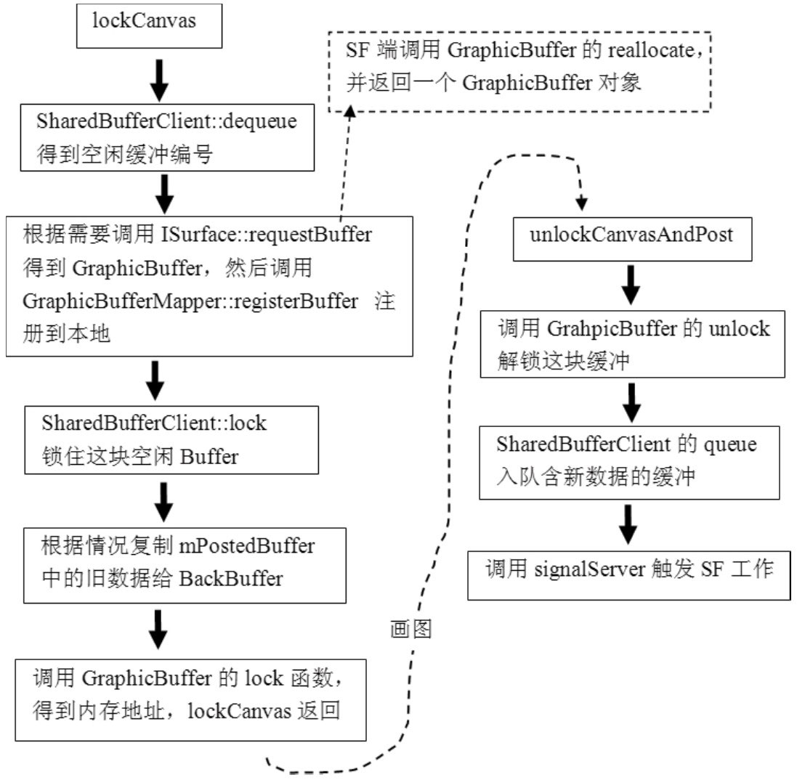

# 8.4.5 lockCanvas和unlockCanvasAndPost分析


在上面的代码中，列出了三个关键点：

调用dequeueBuer得到一个空闲缓冲，也可以叫空闲缓冲出队。

```
        status_t Surface::dequeueBuffer(sp＜GraphicBuffer＞＊ buffer) {
            android_native_buffer_t＊ out;
            status_t err = dequeueBuffer(&out);//调用另外一个dequeueBuffer。
            if (err == NO_ERROR) {
                ＊buffer = GraphicBuffer::getSelf(out);
            }
            return err;
        }
```

```
        int Surface::dequeueBuffer(android_native_buffer_t＊＊ buffer)
        {
        sp＜SurfaceComposerClient＞ client(getClient());
        //①调用SharedBufferClient的dequeue函数，它返回当前空闲的缓冲号。
          ssize_t bufIdx = mSharedBufferClient-＞dequeue();
        const uint32_t usage(getUsage());
        /＊
        mBuffers就是我们前面在Surface创建中介绍的那个二元sp＜GraphicBuffer＞数组。
        这里定义的backBuffer是一个引用类型，也就是说如果修改backBuffer的信息，
        就相当于修改了mBuffers[bufIdx]。
        ＊/
        const sp＜GraphicBuffer＞& backBuffer(mBuffers[bufIdx]);
        //mBuffers定义的GraphicBuffer使用的也是无参构造函数，所以此时还没有真实的存储被创建。
            if (backBuffer == 0 || //第一次进来满足backBuffer为空这个条件。
              ((uint32_t(backBuffer-＞usage) & usage) != usage) ||
                mSharedBufferClient-＞needNewBuffer(bufIdx))
        {
            //调用getBufferLocked，需要进去看看。
                err = getBufferLocked(bufIdx, usage);
                if (err == NO_ERROR) {
                    mWidth   = uint32_t(backBuffer-＞width);
                    mHeight = uint32_t(backBuffer-＞height);
                }
            }
        ......
        }
```

调用lockBuer。

调用copyBlt函数，把frontBuer数据拷贝到backBuer中，这是为什么？

这其中又调用了另外一个dequeueBuer函来分析这三个关键点。

数。它的代码如下所示：

（1）dequeueBuer分析[--＞Surface.cpp]dequeueBuer的目的很简单，就是选取一个空闲的GraphicBuer，其代码如下所示：

[--＞Surface.cpp]

```cpp
        tatus_t Surface::getBufferLocked(int index, int usage)
        {
            sp＜ISurface＞ s(mSurface);
            status_t err = NO_MEMORY;
            //注意这个currentBuffer也被定义为引用类型。
            sp＜GraphicBuffer＞& currentBuffer(mBuffers[index]);
            //终于用上了ISurface对象,调用它的requestBuffer得到指定索引index的Buffer。
            sp＜GraphicBuffer＞ buffer = s-＞requestBuffer(index, usage);
            if (buffer != 0) {
                err = mSharedBufferClient-＞getStatus();
                if (!err && buffer-＞handle != NULL) {
                    //getBufferMapper返回GraphicBufferMapper对象。
                    //调用它的registerBuffer干什么？这个问题我们在8.4.7节回答。
                    err = getBufferMapper().registerBuffer(buffer-＞handle);
                    if (err == NO_ERROR) {
                  //把requestBuffer得到的值赋给currentBuffer，由于currentBuffer是引用类型，
                  //实际上相当于mBuffers[index]=buffer。
                        currentBuffer = buffer;
                        //设置currentBuffer的编号。
                        currentBuffer-＞setIndex(index);
                        mNeedFullUpdate = true;
                    }
                } else {
                    err = err＜0 ? err : NO_MEMORY;
                }
                return err;
        }
```

上面列出了一个关键点，就是SharedBuerClient的dequeue函数，暂且记住这个调用，后面会有单独的章节分析生产/消费步调控制。先看getBuerLocked函数，其代码如下所示：

[--＞Surface.cpp]至此，getBuerLocked的目的已比较清晰了：

调用ISurface的requestBuer得到一个GraphicBuer对象，这个GraphicBuer对象被设置到本地的mBuers数组中。看来

```cpp
        sp＜GraphicBuffer＞ Layer::requestBuffer(int index, int usage)
        {
            sp＜GraphicBuffer＞ buffer;

            sp＜Client＞ ourClient(client.promote());
          //lcblk就是那个SharedBufferServer对象，下面这个调用确保index号GraphicBuffer
          //没有被SF当做FrontBuffer使用。
            status_t err = lcblk-＞assertReallocate(index);
            ......
            if (err != NO_ERROR) {
                  return buffer;
            }

            uint32_t w, h;
            {
                Mutex::Autolock _l(mLock);
                w = mWidth;
                h = mHeight;
            /＊
            mBuffers是SF端创建的一个二元数组，这里取出第index个元素，之前说过，
            mBuffers使用的也是GraphicBuffer的无参构造函数，所以此时也没有真实存储被创建。
            ＊/
                buffer = mBuffers[index];
                mBuffers[index].clear();
            }

            const uint32_t effectiveUsage = getEffectiveUsage(usage);
            if (buffer!=0 && buffer-＞getStrongCount() == 1) {
                //①分配物理存储，后面会分析这个。
                err = buffer-＞reallocate(w, h, mFormat, effectiveUsage);
            } else {
                buffer.clear();
                //使用GraphicBuffer的有参构造，这也使得物理存储被分配。
                buffer = new GraphicBuffer(w, h, mFormat, effectiveUsage);
                err = buffer-＞initCheck();
            }

            ......

            if (err == NO_ERROR && buffer-＞handle != 0) {
                Mutex::Autolock _l(mLock);
                if (mWidth && mHeight) {
                    mBuffers[index] = buffer;
                    mTextures[index].dirty = true;
                } else {
                      buffer.clear();
                }
            }
            return buffer;//返回
        }
```

Surface定义的这两个GraphicBuer和Layer定义的两个GraphicBuer是有联系的，所以图8-18中只画了两个GraphicBuer。

我们已经知道，ISurface的Bn端实际上是定义在Layer类中的SurfaceLayer，下面来看它实现的requestBuer。由于SurfaceLayer是Layer的内部类，它的工作最终都会交给Layer来处理，所以这里可直接看Layer的requestBuer函数：

[--＞Layer.cpp]不管怎样，此时跨进程的这个requestBuer返回的GraphicBuer，已经和一块物理存储绑定到一起了。所以dequeueBuer顺利返回了它所需的东西。接下来则需调用lockBuer。

（2）lockBuer分析

```cpp
        template ＜typename T＞ //这是一个模板函数。
        status_t SharedBufferBase::waitForCondition(T condition)
        {
            const SharedBufferStack& stack( ＊mSharedStack );
            SharedClient& client( ＊mSharedClient );
            const nsecs_t TIMEOUT = s2ns(1);
            Mutex::Autolock _l(client.lock);
            while ((condition()==false) && //注意这个condition()的用法。
                    (stack.identity == mIdentity) &&
                    (stack.status == NO_ERROR))
            {
                status_t err = client.cv.waitRelative(client.lock, TIMEOUT);
                if (CC_UNLIKELY(err != NO_ERROR)) {
                    if (err == TIMED_OUT) {
                        if (condition()) {//注意这个：condition()，condition是一个对象。
                            break;
                        } else {
                        }
                    } else {
                        return err;
                    }
                }
            }
            return (stack.identity != mIdentity) ? status_t(BAD_INDEX) : stack.status;
        }
```

```cpp
        status_t SharedBufferClient::lock(int buf)
        {
            LockCondition condition(this, buf);//这个buf是BackBuffer的索引号。
            status_t err = waitForCondition(condition);
            return err;
        }
```

lockBuer的代码如下所示：

[--＞Surface.cpp]

```cpp
        int Surface::lockBuffer(android_native_buffer_t＊ buffer)
        {
            sp＜SurfaceComposerClient＞ client(getClient());
            status_t err = validate();
            int32_t bufIdx = GraphicBuffer::getSelf(buffer)-＞getIndex();
            err = mSharedBufferClient-＞lock(bufIdx); //调用SharedBufferClient的lock。
              return err;
        }
```

注意，给waitForCondition函数传递的是一个LockCondition类型的对象，前面所说的函数对象的作用将在这里见识到，先看waitForCondition函数，代码如下所示：

[--＞SharedBuerStack.h]来看这个lock函数，代码如下所示：

[--＞SharedBuerStack.cpp]waitForCondition函数比较简单，就是等待一个条件为真，这个条件是否满足由condition（​）这条语句来判断。但这个condition不是一个函数，而是一个对象，这又是怎么回事？

说明这就是FuncitionObject（函数对象）的概念。函数对象的本质是一个对象，不过是重载了操作符（​）​，这和重载操作符+、-等没什么区别。可以把它当作是一个函数来看待。

```c
        status_t Surface::lock(SurfaceInfo＊ other, Region＊ dirtyIn, bool blocking)
        {
            ......
            const sp＜GraphicBuffer＞& frontBuffer(mPostedBuffer);
            if (frontBuffer !=0 &&
                backBuffer-＞width   == frontBuffer-＞width &&
                backBuffer-＞height == frontBuffer-＞height &&
                !(mFlags & ISurfaceComposer::eDestroyBackbuffer))
            {
                const Region copyback(mOldDirtyRegion.subtract(newDirtyRegion));
                if (!copyback.isEmpty() && frontBuffer!=0) {
                //③把frontBuffer中的数据拷贝到BackBuffer中，这是为什么？
                copyBlt(backBuffer, frontBuffer, copyback);
                }
            }
          ......
          }
```

S为ha什re么dB需u要e函rS数ta对ck象的呢读？写因控为制对比象A可ud以io保中存的环信形息缓，冲所看以起调来用要这简个对单象，的实（​）际上函它数却就比可较以复杂利。用本这章个会对在象扩的展信内息容了中。进行分析。这里给读者准备一个问题，也是我之前百思不得其解的来看condition对象的（​）函数。刚才传进来问题：

的是LockCondition，它的（​）定义如下：

既然已经调用dequeue得到了一个空闲缓[--＞SharedBuerStack.cpp]冲，为什么这里还要lock呢？

```cpp
        bool SharedBufferClient::LockCondition::operator()() {
            //stack、buf等都是这个对象的内部成员，这个对象的目的就是根据读写位置判断这个buffer是
            //否空闲。
            return (buf != stack.head ||
                    (stack.queued ＞ 0 && stack.inUse != buf));
        }
```

（3）拷贝旧数据在第三个关键点中，可看到这样的代码：

[--＞Surface.cpp]上面这段代码所解决的，其实是下面这个问题：

在大部分情况下，UI只有一小部分会发生变化（例如一个按钮被按下去，导致颜色发生变化）​，这一小部分UI只对应整个GraphicBuer中的一小块存储（就是在前面代码中见到的dirtyRegion）​，如果整块存储都更新，则会极大地浪费资源。怎么办？

这就需要将变化的图像和没有发生变化的图像进行叠加了。上一次绘制的信息保存在mPostedBuer中，而这个mPostedBuer则要在unLockAndPost函数中设置。这里将根据需要，把mPostedBuer中的旧数据拷贝到BackBuer中。后续的绘画只要更新脏区域就可以了，这会节约不少资源。

lockCanvas返回后，应用层将在这块画布上尽情作画。假设现在已经在BackBuer上绘制好了图像，下面就要通过

```cpp
        status_t Surface::unlockAndPost()
        {
            //调用GraphicBuffer的unlock函数。
            status_t err = mLockedBuffer-＞unlock();
            //get返回这个GraphicBuffer的编号，queueBuffer将含有新数据的缓冲加入队中。
            err = queueBuffer(mLockedBuffer.get());
            mPostedBuffer = mLockedBuffer; //保存这个BackBuffer为mPostedBuffer。
            mLockedBuffer = 0;
            return err;
        }
```

```cpp
        int Surface::queueBuffer(android_native_buffer_t＊ buffer)
        {
            sp＜SurfaceComposerClient＞ client(getClient());

            int32_t bufIdx = GraphicBuffer::getSelf(buffer)-＞getIndex();
            //设置脏Region。
            mSharedBufferClient-＞setDirtyRegion(bufIdx, mDirtyRegion);
            //更新写位置。
            err = mSharedBufferClient-＞queue(bufIdx);
              if (err == NO_ERROR) {
              //client是BpSurfaceFlinger，调用它的signalServer，这样SF就知道新数据准备好了。
                client-＞signalServer();
            }
            return err;
        }
```

unlockCanvasAndPost进行后续工作了,一起来看。

2.unlockCanvasAndPost分析进入精简流程的最后一步，就是unlockCanvasAndPost函数，它的代码如下来看queueBuer调用，代码如下所示：

所示：

[--＞Surface.cpp]

```cpp
        status_t SharedBufferClient::queue(int buf)
        {
            //QueueUpdate也是一个函数对象。
            QueueUpdate update(this);
            //调用updateCondition函数。
            status_t err = updateCondition( update );
            SharedBufferStack& stack( ＊mSharedStack );
            const nsecs_t now = systemTime(SYSTEM_TIME_THREAD);
            stack.stats.totalTime = ns2us(now - mDequeueTime[buf]);
            return err;
        }
```

```cpp
        template ＜typename T＞
        status_t SharedBufferBase::updateCondition(T update) {
            SharedClient& client( ＊mSharedClient );
            Mutex::Autolock _l(client.lock);
            ssize_t result = update();//调用update对象的()函数。
            client.cv.broadcast(); //触发同步对象。
            return result;
        }
```

这里与读写控制有关的是queue函数，其代码这个updateCondition函数的代码如下所如下所示：

示：

[--＞SharedBuerStack.cpp][--＞SharedBuerStack.h]



updateCondition函数和前面介绍的waitForCondition函数一样，使用的都是函数对象。queue操作使用的是QueueUpdate图8-20lockCanvas和类，关于它的故事，将在本章拓展内容中讨unlockCanvasAndPost的流程总结论。

3.关于lockCanvas和unlockCanvasAndPost的总结总结一下lockCanvas和unlockCanvasAndPost这两个函数的工作流程，用图8-20表示：
