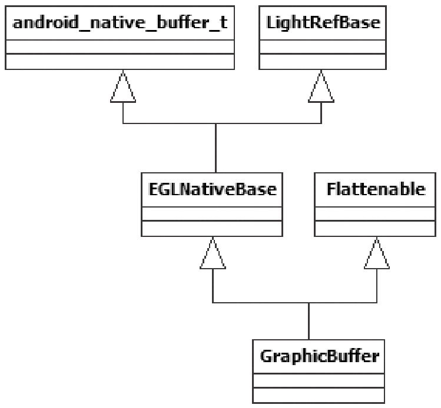

# 8.4.6 GraphicBuffer介绍


8.4.6GraphicBuer介绍GraphicBuer是Surface系统中一个高层次的显示内存管理类，它封装了和硬件相关的一些细节，简化了应用层的处理逻辑。先来认识一下它。

1.初识GraphicBuerGraphicBuer的代码如下所示：

[--＞GraphicBuer.h]

```c
        class GraphicBuffer
            : public EGLNativeBase＜android_native_buffer_t,
                        GraphicBuffer,LightRefBase＜GraphicBuffer＞ ＞,
        public Flattenable
```

其中，EGLNativeBase是一个模板类。它的定义代码如下所示：

[--＞Android_natives.h]

```c
        template ＜typename NATIVE_TYPE, typename TYPE, typename REF＞
        class EGLNativeBase : public NATIVE_TYPE, public REF
```

通过替换，可得到GraphicBuer的派生关系，如图8-21所示：



图8-21GraphicBuer派生关系的示意图从图中可以看出：

从LightRefBase派生使GraphicBuer支持轻量级的引用计数控制。

从Flaenable派生使GraphicBuer支持序列化，它的flaen和unflaen函数用于序列化和反序列化，这样，GraphicBuer的信息就可以存储到

```
        typedef struct android_native_buffer_t
        {
        #ifdef __cplusplus
            android_native_buffer_t() {
                common.magic = ANDROID_NATIVE_BUFFER_MAGIC;
                common.version = sizeof(android_native_buffer_t);
                memset(common.reserved, 0, sizeof(common.reserved));
            }
        #endif
            //这个android_native_base_t是struct的第一个成员，根据C/C++编译的特性可知，这个成员
            //在它的派生类对象所占有的内存中也是排第一个。
            struct android_native_base_t common;
            int width;
            int height;
            int stride;
            int format;
            int usage;
            void＊ reserved[2];
            //这是一个关键成员，保存一些和显示内存分配/管理相关的内容。
            buffer_handle_t handle;

            void＊ reserved_proc[8];
        } android_native_buffer_t;
```

Parcel包中并被Binder传输了。

另外，图中的android_native_buer_t是GraphicBuer的父类，它是一个struct结构体。可以将C++语言中的struct和class当作同一个东西，所以GraphicBuer能从它派生出来。其代码如下所示：

[--＞android_native_buer.h]GraphicBuer和显示内存分配相关的部分主要集中在buer_handle_t这个变量上，它实际上是一个指针，定义如下：

[--＞graoc.h]

```c
        typedef const native_handle＊ buffer_handle_t;
```

native_handle的定义如下：

[--＞native_handle.h]

```c
        typedef struct
        {
            int version;          /＊ version值为sizeof(native_handle_t) ＊/
            int numFds;
            int numInts;
            int data[0];          /＊ data是数据存储空间的首地址 ＊/
        } native_handle_t;
        typedef native_handle_t native_handle;
```

```c
        GraphicBuffer::GraphicBuffer()
            : BASE(), mOwner(ownData), mBufferMapper(GraphicBufferMapper::get()),
              mInitCheck(NO_ERROR),   mVStride(0), mIndex(-1)
        {
            /＊
            其中mBufferMapper为GraphicBufferMapper类型，它的创建采用的是单例模式，也就是每个
            进程只有一个GraphicBufferMapper对象，读者可以去看看get的实现。
            ＊/
              width   =
              height =
              stride =
              format =
              usage   = 0;
              handle = NULL; //handle为空
        }
```

读者可能要问，一个小小的GraphicBuer为什么这么复杂？要回答这个问题，应先对GraphicBuer有比较全面的了解。按照图8-20中的流程来看GraphicBuer。

2.GraphicBuer和存储的分配GraphicBuer的构造函数最有可能分配存储了。注意，流程中使用的是无参构造函数，所以应先看无参构造函数。

（1）无参构造函数分析代码如下所示：

[--＞GraphicBuer.cpp]在无参构造函数中没有发现和存储分配有关的操作。那么，根据流程来看，下一个有可能的地方就是reaocate函数了。

```cpp
        status_t GraphicBuffer::reallocate(uint32_t w, uint32_t h, PixelFormat f,
                uint32_t reqUsage)
        {
            if (mOwner != ownData)
                return INVALID_OPERATION;

            if (handle) {//handle值在无参构造函数中初始化为空，所以不满足if的条件。
                GraphicBufferAllocator& allocator(GraphicBufferAllocator::get());
                allocator.free(handle);
                handle = 0;
            }
            return initSize(w, h, f, reqUsage);//调用initSize函数。
        }
```

```cpp
        status_t GraphicBuffer::initSize(uint32_t w, uint32_t h, PixelFormat format,
                uint32_t reqUsage)
        {
            if (format == PIXEL_FORMAT_RGBX_8888)
                format = PIXEL_FORMAT_RGBA_8888;
            /＊
            GraphicBufferAllocator才是真正的存储分配的管理类，它的创建也是采用的单例模式，
            也就是说每个进程只有一个GraphicBufferAllocator对象。
            ＊/
            GraphicBufferAllocator& allocator = GraphicBufferAllocator::get();
            //调用GraphicBufferAllocator的alloc来分配存储，注意handle作为指针
            //被传了进去，看来handle的值会被修改。
            status_t err = allocator.alloc(w, h, format, reqUsage, &handle, &stride);
            if (err == NO_ERROR) {
                this-＞width   = w;
                this-＞height = h;
                this-＞format = format;
                this-＞usage   = reqUsage;
                mVStride = 0;
            }
            return err;
        }
```

（2）reaocate分析Reaocate的代码如下所示：

InitSize函数的代码如下所示：

[--＞GraphicBuer.cpp]（3）GraphicBuerAocator介绍从上面的代码中可以发现，GraphicBuer的存储分配和GraphicBuerAocator有关。一个小小的存储分配为什么需要经过这么多道工序呢？还是先来看GraphicBuerAocator吧，代码如下所示：

[--＞GraphicBuerAocator.cpp]

```cpp
        GraphicBufferAllocator::GraphicBufferAllocator()
            : mAllocDev(0)
        {
            hw_module_t const＊ module;
            //调用hw_get_module，得到hw_module_t
            int err = hw_get_module(GRALLOC_HARDWARE_MODULE_ID, &module);
            if (err == 0) {
            //调用gralloc_open函数，注意我们把module参数传了进去。
                gralloc_open(module, &mAllocDev);
            }
        }
```

GraphicBuerAocator在创建时，首先会调用hw_get_module取出一个hw_module_t类型的对象。从名字上看，它和硬件平台有关系。它会加载一个叫“libgraoc.硬件平台名.so”的动态库。比如，我的HTCG7手机上加载的库是/system/lib/hw/libgraooc.qsd-8k.so。

这个库的源代码在hardware/msm7k/libgraoc-qsd8k目录下。

这个库有什么用呢？简言之，就是为了分配一块用于显示的内存，但为什么需要这种层层封装呢？答案很简单：

封装的目的就是为了屏蔽不同硬件平台的差别。

说明读者可通过执行adbgetpropro.board.platform命令，得到具体手机上硬件平台的名字。图8-22总结了GraphicBuerAocator分配内存的途径。

这部分代码读者可参考hardware/libhardware/hardware.c和hardware/msm7k/libgraoc-qsd8k/graoc.cpp，后文将不再深入探讨和硬件平台有关的知识。

注意这里是以G7的libgraoc.qsk-8k.so为示例的。其中pmem设备用来创建一块连续的内存，因为有些硬件设备（例如Camera）工作时需要使用一块连续的内存，对于这种情况，一般就会使用pmem设备来分配内存了。

```cpp
        status_t  GraphicBufferAllocator::alloc(uint32_t  w,  uint32_t  h,  PixelFormat
        format,int usage, buffer_handle_t＊ handle, int32_t＊ stride)
        {
            //根据前面的定义可知buffer_handle_t为native_handle_t＊类型。
            status_t err;

            if (usage & GRALLOC_USAGE_HW_MASK) {
            err = mAllocDev-＞alloc(mAllocDev, w, h, format, usage, handle, stride);
        } else {
              //SW分配，可以做到和HW无关了。
              err = sw_gralloc_handle_t::alloc(w, h, format, usage, handle, stride);
            }
        ......
            return err;
        }
```

这里仅讨论图8-22中与硬件无关的分配方式。在这种情况下，将使用ashmem分配共享内存。下面看GraphicBuerAocator的aoc函数，其代码如下所示：


图8-22GraphicBuerAocator内存的分配途径[--＞GraphicBuerAocator.cpp]下面，来看软件分配的方式，代码如下所示：

[--＞GraphicBuerAocator.cpp]

```cpp
        status_t sw_gralloc_handle_t::alloc(uint32_t w, uint32_t h, int format,
                int usage, buffer_handle_t＊ pHandle, int32_t＊ pStride)
        {
            int align = 4;
            int bpp = 0;
            ...... //格式转换
            size_t bpr = (w＊bpp + (align-1)) & ～(align-1);
            size_t size = bpr ＊ h;
            size_t stride = bpr / bpp;
            size = (size + (PAGE_SIZE-1)) & ～(PAGE_SIZE-1);
            //直接使用了ashmem创建共享内存。
            int fd = ashmem_create_region("sw-gralloc-buffer", size);

          ......
            //进行内存映射，得到共享内存的起始地址。
            void＊ base = mmap(0, size, prot, MAP_SHARED, fd, 0);

            sw_gralloc_handle_t＊ hnd = new sw_gralloc_handle_t();
            hnd-＞fd = fd;              //保存文件描述符。
            hnd-＞size = size;          //保存共享内存的大小。
            hnd-＞base = intptr_t(base);//intptr_t将void＊类型转换成int＊类型。
            hnd-＞prot = prot;          //保存属性。
            ＊pStride = stride;
            ＊pHandle = hnd;            //pHandle就是传入的那个handle变量的指针，这里对它进行赋值。

            return NO_ERROR;
        }
```

我们知道，调用GraphicBuer的reaocate函数后，会导致物理存储被分配。前面曾说过，Layer会创建两个GraphicBuer，而NativeSurface端也会创建两个

```
        //requestBuffer的响应端
        status_t BnSurface::onTransact(
            uint32_t code, const Parcel& data, Parcel＊ reply, uint32_t flags)
        {
            switch(code) {
              case REQUEST_BUFFER: {
                    CHECK_INTERFACE(ISurface, data, reply);
                    int bufferIdx = data.readInt32();
                    int usage = data.readInt32();
                    sp＜GraphicBuffer＞ buffer(requestBuffer(bufferIdx, usage));
                    ......
                    /＊
                    requestBuffer的返回值被写到Parcel包中，由于GraphicBuffer从
                    Flattenable类派生，这将导致它的flatten函数被调用。
                    ＊/
                    return reply-＞write(＊buffer);
                }
              .......
        }
        //再来看请求端的处理，在BpSurface中。
        virtual sp＜GraphicBuffer＞ requestBuffer(int bufferIdx, int usage)
        {
            Parcel data, reply;
            data.writeInterfaceToken(ISurface::getInterfaceDescriptor());
            data.writeInt32(bufferIdx);
            data.writeInt32(usage);
            remote()-＞transact(REQUEST_BUFFER, data, &reply);
            sp＜GraphicBuffer＞ buffer = new GraphicBuffer();
            reply.read(＊buffer);//Parcel调用unflatten函数把信息反序列化到这个buffer中。
            return buffer;//requestBuffer实际上返回的是本地new出来的这个GraphicBuffer。
        }
```

GraphicBuer，那么这两个GraphicBuer是怎么建立联系的呢？为什么说native_handle_t是GraphicBuer的精髓呢？

3.flaen和unflaen分析试想，NativeSurface的GraphicBuer是怎么和Layer的GraphicBuer建立联系的？

先通过requestBuer函数返回一个GraphicBuer，然后这个GraphicBuer被NativeSurface保存。

这中间的过程其实是一个mini版的乾坤挪移，来看看，代码如下所示：

[--＞ISurface.cpp]fl通过上面的代码可以发现，挪移的关键体现在

```cpp
        status_t GraphicBuffer::flatten(void＊ buffer, size_t size,
                int fds[], size_t count) const
        {
            //buffer是装载数据的缓冲区，由Parcel提供。
              ......

            if (handle) {
                buf[6] = handle-＞numFds;
                buf[7] = handle-＞numInts;
                native_handle_t const＊ const h = handle;
                //把handle的信息也写到buffer中。
                memcpy(fds,      h-＞data,                h-＞numFds＊sizeof(int));
                memcpy(&buf[8], h-＞data + h-＞numFds, h-＞numInts＊sizeof(int));
            }

            return NO_ERROR;
        }
```

aen和unflaen函数上。请看——

（1）flaen分析flaen的代码如下所示：

[--＞GraphicBuer.cpp]

```cpp
        status_t GraphicBuffer::unflatten(void const＊ buffer, size_t size,
                int fds[], size_t count)
        {
                ......

            if (numFds || numInts) {
                width   = buf[1];
                height = buf[2];
                stride = buf[3];
                format = buf[4];
                usage   = buf[5];
                native_handle＊ h = native_handle_create(numFds, numInts);
                memcpy(h-＞data,             fds,      numFds＊sizeof(int));
                memcpy(h-＞data + numFds, &buf[8], numInts＊sizeof(int));
                handle = h;//根据Parcel包中的数据还原一个handle。
            } else {
                width = height = stride = format = usage = 0;
                handle = NULL;
            }
            mOwner = ownHandle;
            return NO_ERROR;
        }
```

flaen的工作就是把GraphicBuer的handle变量信息写到Parcel包中。那么接收端如何使用这个包呢？这就是unflaen的工作了。

（2）unflaen分析unflaen的代码如下所示：

[--＞GraphicBuer.cpp]

```cpp
        status_t sw_gralloc_handle_t::registerBuffer(sw_gralloc_handle_t＊ hnd)
        {
            if (hnd-＞pid != getpid()) {
                //原来是做一次内存映射操作。
                void＊ base = mmap(0, hnd-＞size, hnd-＞prot, MAP_SHARED, hnd-＞fd, 0);
                ......
                //base保存着共享内存的起始地址。
                hnd-＞base = intptr_t(base);
            }
            return NO_ERROR;
        }
```

unflaen最重要的工作是，根据Parcel包中native_handle的信息，在NativeSurface端构造一个对等的GraphicBuer。这样，NativeSurface端的GraphicBuer实际上就和Layer端的GraphicBuer管理着同一块共享内存了。

4.registerBuer分析registerBuer有什么用呢？上一步调用unflaen后得到了代表共享内存的文件句柄，regiserBuer的目的就是对它进行内存5.lock和unlock分析映射，代码如下所示：

GraphicBuer在使用前需要通过lock来得到[--＞GraphicBuerMapper.cpp]内存地址，使用完后又会通过unlock释放这块地址。在SW分配方案中，这两个函数的实现对却Gr非ap常hi简cB单u，e如r的下介所绍示就：到这里。虽然采用的是SW方式，但是相信读者也能通过树木领[--＞GraphicBuerMapper.cpp]略到森林的风采。从应用层角度看，可以把

```cpp
        //lock操作
        int sw_gralloc_handle_t::lock(sw_gralloc_handle_t＊ hnd, int usage,
                int l, int t, int w, int h, void＊＊ vaddr)
        {
            ＊vaddr = (void＊)hnd-＞base;//得到共享内存的起始地址，后续作画就使用这块内存了。
            return NO_ERROR;
        }
        //unlock操作
        status_t sw_gralloc_handle_t::unlock(sw_gralloc_handle_t＊ hnd)
        {
            return NO_ERROR;             //没有任何操作
        }
```

GraphicBuer当作一个构架在共享内存之上的数据缓冲。对于想深入研究的读者，我建议可按图8-20中的流程来分析。因为流程体现了调用顺序，表达了调用者的意图和目的，只有把握了流程，分析时才不会迷失在茫茫的源码海洋中，才不会被不熟悉的知识阻拦前进的脚步。
