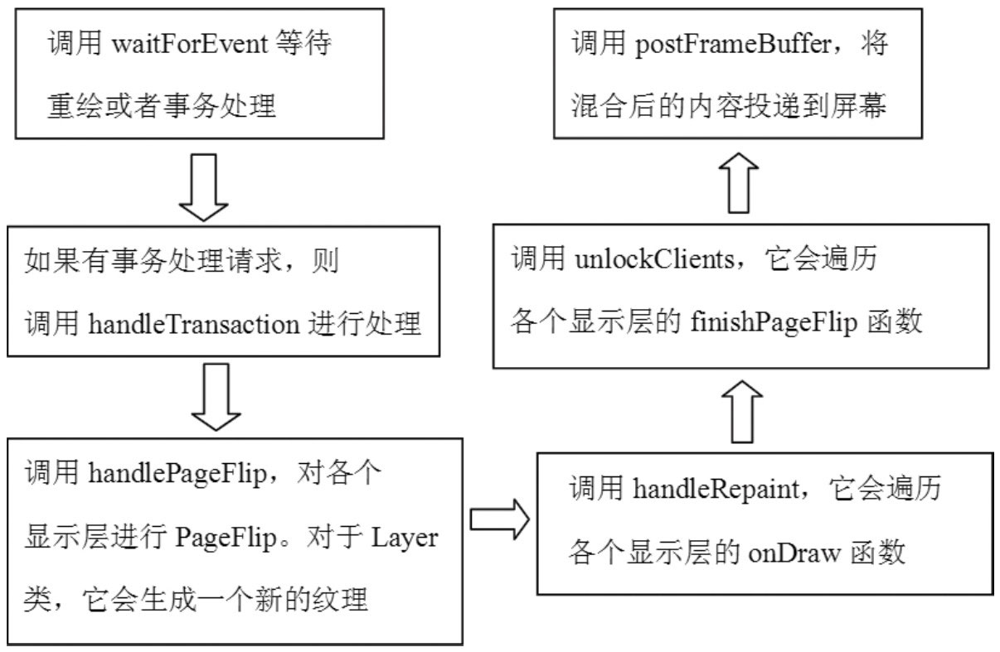

# 8.5.3 Transaction分析


Transaction是“事务”的意思。在我脑海中，关于事务的知识来自数据库。在数据库操作中，事务意味着一次可以提交多个SQL语句，然后一个commit就可让它们集中执行，而且数据库中的事务还可以回滚，即恢复到事务提交前的状态。

SurfaceFlinger为什么需要事务呢？从上面对数据库事务的描述来看，是不是意味着一次执行多个请求呢？如直接盯着SF的源码来分析，可能不太容易搞清楚事务的前因后果，我想还是用老办法，从一个例子入手吧。

在WindowManagerService.java中有一个函数之前已分析过，现在再看看，代码如下所示：

[--＞WindowManagerService.java::WinState]

```java
        Surface createSurfaceLocked() {
            Surface.openTransaction(); //开始一次transaction。
            try {
              try {
                  mSurfaceX = mFrame.left + mXOffset;
                  mSurfaceY = mFrame.top + mYOffset;
                  //设置Surface的位置。
                  mSurface.setPosition(mSurfaceX, mSurfaceY);
                  ......
                }
                } finally {
                      Surface.closeTransaction(); //关闭这次事务。
              }
```

```java
        static void Surface_openTransaction(JNIEnv＊ env, jobject clazz)
        {
            //调用SurfaceComposerClient的openGlobalTransaction函数。
            SurfaceComposerClient::openGlobalTransaction();
        }
```

```java
        void SurfaceComposerClient::openGlobalTransaction()
        {
            Mutex::Autolock _l(gLock);
            ......

            const size_t N = gActiveConnections.size();
            for (size_t i=0; i＜N; i++) {
                sp＜SurfaceComposerClient＞
                client(gActiveConnections.valueAt(i).promote());
                //gOpenTransactions存储当前提交事务请求的Client。
                if (client != 0 && gOpenTransactions.indexOf(client) ＜ 0) {
                    //Client是保存在全局变量gActiveConnections中的SurfaceComposerClient
                    //对象，调用它的openTransaction。
                    if (client-＞openTransaction() == NO_ERROR) {
                        if (gOpenTransactions.add(client) ＜ 0) {
                            client-＞closeTransaction();
                        }
                    }
                    ......
                }
            }
        }
```

这个例子很好地展示了事务的调用流程，它会依次调用：

openTransaction下面转到SurfaceComposerClient，代码如setPosition下所示：

closeTransaction[--＞SurfaceComposerClient.cpp]下面就来分析这几个函数的调用。

1.openTransaction分析看JNI对应的函数，代码如下所示：

[--＞android_View_Surface.cpp]上面是一个静态函数，内部调用了各个SurfaceComposerClient对象的openTranscation，代码如下所示：

[--＞SurfaceComposerClient.cpp]

```cpp
        status_t SurfaceComposerClient::openTransaction()
        {
            if (mStatus != NO_ERROR)
                return mStatus;
            Mutex::Autolock _l(mLock);
            mTransactionOpen++; //一个计数值，用来控制事务的提交。
            if (mPrebuiltLayerState == 0) {
                mPrebuiltLayerState = new layer_state_t;
            }
            return NO_ERROR;
        }
```

layer_state_t是用来保存Surface的一些信息的，比如位置、宽、高等信息。实际上，调用的setPosition等函数，就是为了改变这个layer_state_t中的值。

```
        status_t SurfaceComposerClient::setPosition(SurfaceID id, int32_t x, int32_t y)
        {
            layer_state_t＊ s = _lockLayerState(id); //找到对应的layer_state_t。
            if (!s) return BAD_INDEX;
            s-＞what |= ISurfaceComposer::ePositionChanged;
            s-＞x = x;
            s-＞y = y;           //上面几句修改了这块layer的参数。
            _unlockLayerState(); //该函数将unlock一个同步对象，其他没有做什么工作。
            return NO_ERROR;
        }
```

2.s[-e-t＞PoSsuitirfaocne分.c析pp]

```
        status_t SurfaceControl::setPosition(int32_t x, int32_t y) {
            const sp＜SurfaceComposerClient＞& client(mClient);
            status_t err = validate();
            if (err ＜ 0) return err;
            //调用SurfaceComposerClient的setPosition函数。
            return client-＞setPosition(mToken, x, y);
        }
```

上文说过，SFC中有一个layer_state_t对象用来保存Surface的各种信息。这里以setPosition为例来看它的使用情况。这个函数是用来改变Surface在屏幕上的位置的，代码如下所示：

[--＞android_View_Surface.cpp]

```cpp
        static void Surface_setPosition(JNIEnv＊ env, jobject clazz, jint x, jint y)
        {
            const sp＜SurfaceControl＞& surface(getSurfaceControl(env, clazz));
            if (surface == 0) return;
            status_t err = surface-＞setPosition(x, y);
        }
```

[--＞SurfaceComposerClient.cpp]setPosition修改了layer_state_t中的一些参数，那么，这个状态是什么时候传递到SurfaceFlinger中的呢？

3.closeTransaction分析相信读者此时已明白为什么叫“事务”了。原来，在openTransaction和closeTransaction中可以有很多操作，然后会由

```cpp
        void SurfaceComposerClient::closeGlobalTransaction()
        {
            ......

            const size_t N = clients.size();
            sp＜ISurfaceComposer＞ sm(getComposerService());
            //①先调用SF的openGlobalTransaction。
            sm-＞openGlobalTransaction();
            for (size_t i=0; i＜N; i++) {
                //②然后调用每个SurfaceComposerClient对象的closeTransaction。
                clients[i]-＞closeTransaction();
            }
            //③最后调用SF的closeGlobalTransaction。
            sm-＞closeGlobalTransaction();
        }
```

closeTransaction一次性地把这些修改提交到SF上，来看代码：

[--＞android_View_Surface.cpp]

```cpp
        static void Surface_closeTransaction(JNIEnv＊ env, jobject clazz)
        {
            SurfaceComposerClient::closeGlobalTransaction();
        }
```

[--＞SurfaceComposerClient.cpp]上面一共列出了三个函数，它们都是跨进程的调用，下面对其一一进行分析。

（1）SurfaceFlinger的openGlobalTransaction分析

```cpp
        status_t SurfaceComposerClient::closeTransaction()
        {
            if (mStatus != NO_ERROR)
                return mStatus;

            Mutex::Autolock _l(mLock);
            ......
            const ssize_t count = mStates.size();
            if (count) {
              //mStates是这个SurfaceComposerClient中保存的所有layer_state_t数组，也就是
            //每个Surface一个。然后调用跨进程的setState。
                mClient-＞setState(count, mStates.array());
                mStates.clear();
            }
            return NO_ERROR;
        }
```

这个函数其实很简单，略看一下就行了。

[--＞SurfaceFlinger.cpp]

```cpp
        void SurfaceFlinger::openGlobalTransaction()
        {
            android_atomic_inc(&mTransactionCount);//又是一个计数控制。
        }
```

（2）SurfaceComposerClient的closeTransaction分析代码如下所示：

[--＞SurfaceComposerClient.cpp]BClient的setState，最终会转到SF的setClientState上，代码如下所示：

```cpp
            status_t SurfaceFlinger::setClientState(ClientID cid, int32_t count,
                                  const layer_state_t＊ states)
        {
            Mutex::Autolock _l(mStateLock);
            uint32_t flags = 0;
            cid ＜＜= 16;
            for (int i=0 ; i＜count ; i++) {
                const layer_state_t& s = states[i];
                sp＜LayerBaseClient＞ layer(getLayerUser_l(s.surface | cid));
                if (layer != 0) {
                    const uint32_t what = s.what;
                    if (what & ePositionChanged) {
                        if (layer-＞setPosition(s.x, s.y))
                              //eTraversalNeeded表示需要遍历所有显示层。
                            flags |= eTraversalNeeded;
                    }
                    ....
            if (flags) {
                setTransactionFlags(flags);//这里将会触发threadLoop的事件。
            }
            return NO_ERROR;
        }
```

[--＞SurfaceFlinger.cpp]

```cpp
        uint32_t SurfaceFlinger::setTransactionFlags(uint32_t flags, nsecs_t delay)
        {
            uint32_t old = android_atomic_or(flags, &mTransactionFlags);
            if ((old & flags)==0) {
                if (delay ＞ 0) {
                    signalDelayedEvent(delay);
                } else {
                    signalEvent();  //设置完mTransactionFlags后，触发事件。
                }
            }
            return old;
        }
```

```cpp
        void SurfaceFlinger::closeGlobalTransaction()
        {
            if (android_atomic_dec(&mTransactionCount) == 1) {
            //注意下面语句的执行条件，当mTransactionCount变为零时才执行，这意味着
            //openGlobalTransaction两次的话，只有最后一个closeGlobalTransaction调用
            //才会真正地提交事务。
                signalEvent();

                Mutex::Autolock _l(mStateLock);
                //如果这次事务涉及尺寸调整，则需要等一段时间。
                while (mResizeTransationPending) {
                    status_t err = mTransactionCV.waitRelative(mStateLock, s2ns(5));
                    if (CC_UNLIKELY(err != NO_ERROR)) {
                        mResizeTransationPending = false;
                        break;
                    }
                }
            }
        }
```

（3）SurfaceFlinger的closeGlobalTransaction分析[--＞SurfaceFlinger.cpp]来看代码：

[--＞SurfaceFlinger.cpp]关于事务的目的，相信读者已经比较清楚了：

就是将一些控制操作（例如setPosition）的修改结果一次性地传递给SF进行处理。

那么，哪些操作需要通过事务来传递呢？查看Surface.h可以知道，下面这些操作需要通过事务来传递（这里只列出了几个经常用的函数）​：setPosition、setAlpha、show/hide、setSize、setFlag等。

由于这些修改不像重绘那么简单，有时它会涉及其他的显示层，例如在显示层A的位置调整后，之前被A遮住的显示层B，现在可能变得可见了。对于这种情况，所提交的事务会设置eTraversalNeeded标志，这个标志表示要遍历所有显示层进行处理。关于这一点，我们可以看看工作线程中的事务处理。

4.工作线程中的事务处理还是从代码入手分析，如下所示：

[--＞SurfaceFlinger.cpp]

```cpp
        bool SurfaceFlinger::threadLoop()
        {
            waitForEvent();
            if (LIKELY(mTransactionCount == 0)) {
              const uint32_t mask = eTransactionNeeded | eTraversalNeeded;
              uint32_t transactionFlags = getTransactionFlags(mask);
                if (LIKELY(transactionFlags)) {
                    handleTransaction(transactionFlags);
                }
            }
            ......
          }
```

getTransactionFlags函数的实现蛮有意思，不妨看看其代码，如下所示：

[--＞SurfaceFlinger.cpp]

```cpp
        uint32_t SurfaceFlinger::getTransactionFlags(uint32_t flags)
        {
            //先通过原子操作去掉mTransactionFlags中对应的位。
            //而后原子操作返回的旧值和flags进行与操作
            return android_atomic_and(～flags, &mTransactionFlags) & flags;
        }
```

getTransactionFlags所做的工作不仅仅是get那么简单，它还设置了mTransactionFlags，从这个角度来看，getTransactionFlags这个名字有点名不副实。

```
        void SurfaceFlinger::handleTransaction(uint32_t transactionFlags)
        {
            Vector＜ sp＜LayerBase＞ ＞ ditchedLayers;

            {
                Mutex::Autolock _l(mStateLock);
                //调用handleTransactionLocked函数处理。
                handleTransactionLocked(transactionFlags, ditchedLayers);
            }

            const size_t count = ditchedLayers.size();
            for (size_t i=0 ; i＜count ; i++) {
                if (ditchedLayers[i] != 0) {
                //ditch是丢弃的意思，有些显示层可能被hide了，所以这里做些收尾的工作。
                    ditchedLayers[i]-＞ditch();
                }
            }
        }
```

```cpp
        void SurfaceFlinger::handleTransactionLocked(
                uint32_t transactionFlags, Vector＜ sp＜LayerBase＞ ＞& ditchedLayers)
        {
            //这里使用了mCurrentState，它的layersSortedByZ数组存储了SF中所有的显示层。
            const LayerVector& currentLayers(mCurrentState.layersSortedByZ);
            const size_t count = currentLayers.size();

              const bool layersNeedTransaction = transactionFlags & eTraversalNeeded;
              //如果需要遍历所有显示层的话。
            if (layersNeedTransaction) {
                for (size_t i=0 ; i＜count ; i++) {
                    const sp＜LayerBase＞& layer = currentLayers[i];
                    uint32_t trFlags = layer-＞getTransactionFlags(eTransactionNeeded);
                    if (!trFlags) continue;
                    //调用各个显示层的doTransaction函数。
                    const uint32_t flags = layer-＞doTransaction(0);
                    if (flags & Layer::eVisibleRegion)
                        mVisibleRegionsDirty = true;
                }
            }
            if (transactionFlags & eTransactionNeeded) {
                if (mCurrentState.orientation != mDrawingState.orientation) {
                  //横竖屏如果发生切换，需要对应变换设置。
                    const int dpy = 0;
                    const int orientation = mCurrentState.orientation;
                    const uint32_t type = mCurrentState.orientationType;
                    GraphicPlane& plane(graphicPlane(dpy));
                    plane.setOrientation(orientation);

                    ......
                }
              /＊
              mLayersRemoved变量在显示层被移除的时候设置，例如removeLayer函数，这些函数
              也会触发handleTranscation函数的执行。
              ＊/
              if (mLayersRemoved) {
                    mLayersRemoved = false;
                    mVisibleRegionsDirty = true;
                    const LayerVector& previousLayers(mDrawingState.layersSortedByZ);
                    const size_t count = previousLayers.size();
                    for (size_t i=0 ; i＜count ; i++) {
                        const sp＜LayerBase＞& layer(previousLayers[i]);
                        if (currentLayers.indexOf( layer ) ＜ 0) {
                            ditchedLayers.add(layer);
                            mDirtyRegionRemovedLayer.orSelf(layer-＞visibleRegionScreen);
                        }
                    }
                }
                free_resources_l();
            }
            //提交事务处理，有必要进去看看。
            commitTransaction();
        }
```

接着来看最重要的handleTransaction函数，代码如下所示：

[--＞SurfaceFlinger.cpp]

```cpp
        void SurfaceFlinger::commitTransaction()
        {
            //mDrawingState将使用更新后的mCurrentState。
            mDrawingState = mCurrentState;
            mResizeTransationPending = false;
            //触发一个条件变量，这样等待在closeGlobalTransaction函数中的线程可以放心地返回了。
            mTransactionCV.broadcast();
        }
```

每个显示层对事务的具体处理，都在它们的doTransaction函数中，读者若有兴趣，可进去看看。需要说明的是，每个显示层内部也有一个状态变量，doTransaction会更新这些状态变量。

回到上面的函数，最后它将调用commitTransaction提交事务，代码如下所示：

[--＞SurfaceFlinger.cpp]8.5.4关于SurfaceFlinger的总结前面的分析让我们感受了SurfaceFlinger的风采。从整体上看，SurfaceFlinger不如AudioFlinger复杂，它的工作集中在工作线程中，下面用图8-23来总线一下SF工作线程：



图8-23SF工作线程的流程总结
