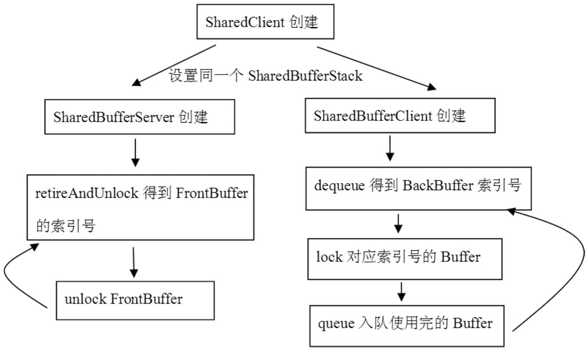

# 8.6 拓展思考

本章的拓展思考分三个部分：

介绍SharedBuerServer和SharedBuerClient的工作流程。

关于ViewRoot的一些问题的总结。

LayerBuer的工作原理分析。

8.6.1Surface系统的CB对象分析根据前文的分析可知，Surface系统中的CB，其实是指SharedBuer家族，它们是Surface系统中对生产者和消费者进行步调控制的中枢机构。先通过图8-24来观察整体的工作流程是怎样的。

图8-24SharedBuer家族的使用流程为了书写方便，我们简称：

SharedBuerServer为SBS。
