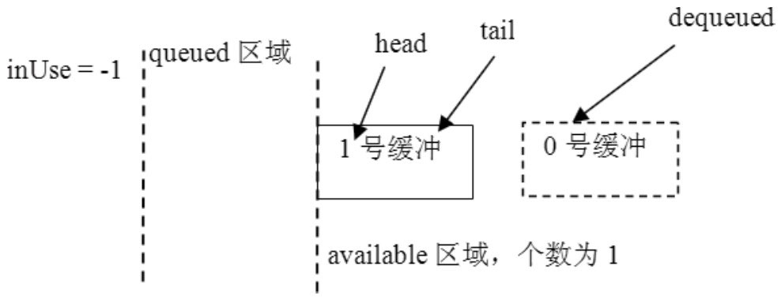
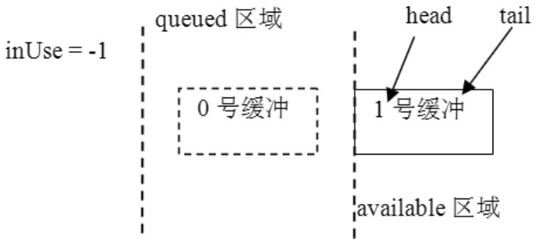
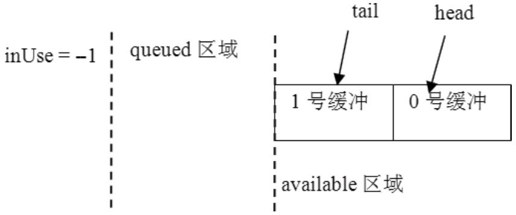

# 8.6.1 Surface系统的CB对象分析


```
        class SharedBufferStack{
          ......
          /＊
        虽然PageFlipping使用Front和Back两个Buffer就可以了，但是SBT的结构和相关算法
        是支持多个缓冲的。另外，缓冲是按照块来获取的，也就是一次获得一块缓冲，每块缓冲用
        一个编号表示（这一点在之前的分析中已经介绍过了）。
          ＊/
        int32_t head;
        int32_t available;          //当前可用的空闲缓冲个数。
        int32_t queued;             //SBC投递的脏缓冲个数。
        int32_t inUse;              //SBS当前正在使用的缓冲编号。
        ......//上面这几个参数联合SBC中的tail，我称之为控制参数。
        }
```

```
        SharedBufferServer::SharedBufferServer(SharedClient＊ sharedClient,
                int surface, int num, int32_t identity)
            : SharedBufferBase(sharedClient, surface, num, identity)
        {
            mSharedStack-＞init(identity);//这个函数将设置inUse为-1。
            //下面设置SBT中的参数，我们关注前三个。
            mSharedStack-＞head = num-1;
            mSharedStack-＞available = num;
            mSharedStack-＞queued = 0;
            //设置完后，head=2-1=1,available=2,queued=0，inUse=-1
            mSharedStack-＞reallocMask = 0;
            memset(mSharedStack-＞dirtyRegion, 0, sizeof(mSharedStack-＞dirtyRegion));
        }
```

SharedBuerClient为SBC。

SharedBuerStack为SBT。

其中SBC和SBS都是建立在同一个SBT上的，所以应先看SBT，下面的代码列出了其中几个与读写控制有关的成员变量：

[--＞SharedBuerStack.h]SBT创建好后，下面就是SBS和SBC的创建了，它们会做什么特殊工作吗？

1.SBS和SBC的创建下面分别看SBS和SBC的创建，代码如下所示：

[--＞SharedBuerStack.cpp]再看SBC的创建，代码如下所示：

```c
        int32_t SharedBufferClient::computeTail() const
        {
            SharedBufferStack& stack( ＊mSharedStack );
            int32_t newTail;
            int32_t avail;
            int32_t head;
            do {
                avail = stack.available; //available=2,head=1
                head = stack.head;
            } while (stack.available != avail);
            newTail = head - avail + 1;  //newTail=1-2+1=0
            if (newTail ＜ 0) {
                newTail += mNumBuffers;
            } else if (newTail ＞= mNumBuffers) {
                newTail -= mNumBuffers;
            }
            return newTail;              //计算得到newTail=0
        }
```

[--＞SharedBuerStack.cpp]

```cpp
        SharedBufferClient::SharedBufferClient(SharedClient＊ sharedClient,
                int surface, int num, int32_t identity)
            : SharedBufferBase(sharedClient, surface, num, identity), tail(0)
        {
            tail = computeTail(); //tail是SBC定义的变量，注意它不是SBT定义的。
        }
```

看computeTail函数的代码，如下所示：

[--＞SharedBuerStack.cpp]


```cpp
        ssize_t SharedBufferClient::dequeue()
        {
            SharedBufferStack& stack( ＊mSharedStack );
        ......
            //DequeueCondition函数对象。
            DequeueCondition condition(this);
            status_t err = waitForCondition(condition);
            //成功以后，available减1，表示当前可用的空闲buffer只有1个。
            if (android_atomic_dec(&stack.available) == 0) {
              ......
            }

            int dequeued = tail; //tail值为0，所以dequeued的值为0。
            //tail加1。如果超过2，则重新置为0，这表明tail的值在0,1间循环。
            tail = ((tail+1 ＞= mNumBuffers) ? 0 : tail+1);
            ......
            //返回的这个dequeued值为零，也就是tail加1操作前的旧值。这一点请读者务必注意。
            return dequeued;
        }
```

图8-25SBC/SBS创建后的示意图2.SBC端流程分析下面看SBC端的工作流程。

（1）dequeue分析先看SBC的dequeue函数：

[--＞SharedBuerStack.cpp]来看SBC和SBS创建后控制参数的变化，如图8-25所示：

其中DequeueCondition的操作函数很简单，代码如下所示：

```cpp
        bool SharedBufferClient::DequeueCondition::operator()() {
            return stack.available ＞ 0;//只要available大于0就算满足条件，第一次进来肯定满足。
        }
```

用图8-26来表示dequeue的结果：



图8-26dequeue结果图注意在图8-26中，0号缓冲用虚线表示，

```
        status_t SharedBufferClient::lock(int buf)
        {
            LockCondition condition(this, buf);
            status_t err = waitForCondition(condition);
            return err;
        }
```

SBC的dequeue函数的返回值用dequeued表示，它指向这个0号缓冲。正如代码中注释的那样，由于dequeued的值用的是tail的旧值，而tail是SBC定义的变量，不是SBT定义的变量，所以tail在SBS端是不可见的。这就带来了一个潜在危险，即0号缓冲来看LockCondition的（​）函数，代码如下所不能保证当前是真正空闲的，因为SBS可能示：

正在用它，怎么办？试看下面的lock。

```
        bool SharedBufferClient::LockCondition::operator()() {
            /＊
              这个条件其实就是判断编号为buf的Buffer是不是被使用了。
              buf值为0，head值为1，queued为0，inUse为-1
            ＊/
              return (buf != stack.head ||
                      (stack.queued ＞ 0 && stack.inUse != buf));
        }
```

（2）lock分析lock使用了LockCondition，其中传入的参数buf的值为0，也就是上图中的dequeue的值，代码如下所示：

[--＞SharedBuerStack.cpp]现在知道为什么SBC需要调用dequeue和lock函数了吗？原来：

dequeue只是根据本地变量tail计算一个本次应当使用的Buer编号，其实也就是在0,1之间循环。上次用0号缓冲，那么这次就用1号缓冲。

lock函数要确保这个编号的Buer没有被SF当作FrontBuer使用。

（3）queue分析Activity端在绘制完UI后，将把BackBuer投递出去以便显示。接着看上面的流程，这个BackBuer的编号是0。待Activity投递完后，才会调用signal函数触发SF消费，所以在此之前格局不会发生变化。试看投递用的queue函数，注意传入的buf参数为0，代码如下所示：

[--＞SharedBuerStack.cpp]

```cpp
        status_t SharedBufferClient::queue(int buf)
        {
            QueueUpdate update(this);
            status_t err = updateCondition( update );
            ......
            return err;
        }
        //直接看这个QueueUpdate函数对象。
        ssize_t SharedBufferClient::QueueUpdate::operator()() {
            android_atomic_inc(&stack.queued);//queued增加1，现在该值由零变为1。
            return NO_ERROR;
        }
```

至此，SBC端走完一个流程了，结果是什么？

如图8-27所示：



图8-27queue结果图0号缓冲被移到了queue的区域，可目前还没有变量指向它。假设SBC端此后没有绘制UI的需求，那么它就会沉默一段时间。

3.SBS端分析SBS的第一个函数是retireAndLock，它使用了RetireUpdate函数对象，代码如下所示：

```
        ssize_t SharedBufferServer::RetireUpdate::operator()() {
            //先取得head值，为1。
            int32_t head = stack.head;

            //inUse被设置为1。表明要使用1吗？目前的脏缓冲应该是0才对。
            android_atomic_write(head, &stack.inUse);

            int32_t queued;
            do {
                queued = stack.queued; //queued目前为1。
                if (queued == 0) {
                    return NOT_ENOUGH_DATA;
                }
              //下面这个原子操作使得stack.queued减1。
            } while (android_atomic_cmpxchg(queued, queued-1, &stack.queued));
            //while循环退出后，queued减1，又变为0。
            //head值也在0,1间循环，现在head值变为0了。
            head = ((head+1 ＞= numBuffers) ? 0 : head+1);

            //inUse被设置为0。
            android_atomic_write(head, &stack.inUse);

            // head值被设为0。
            android_atomic_write(head, &stack.head);

            // available加1，变成2。
            android_atomic_inc(&stack.available);
            return head;//返回0。
        }
```

[--＞SharedBuerStack.cpp]

```cpp
        ssize_t SharedBufferServer::retireAndLock()
        {
            RetireUpdate update(this, mNumBuffers);
            ssize_t buf = updateCondition( update );
            return buf;
        }
```

这个RetireUpdate对象的代码如下所示：

retireAndLock的结果是什么呢？看看图8-28就知道了。


图8-28retireAndLock结果图注意上面的available区域，1号缓冲右边的0号缓冲是用虚线表示的，这表示该0号缓冲实际上并不存在于available区域，但available的个数却变成2了。这样不会出错吗？当然不



```
        像下面这样的代码，如果有锁控制的话根本用不着一个while循环，因为有锁的保护，没有其他线程
        能够修改stack.queued的值，所以用while来循环判断android_atomic_cmpxchg没有什么意义。
            int32_t queued;
            do {
                queued = stack.queued;
                if (queued == 0) {
                    return NOT_ENOUGH_DATA;
                }
            } while (android_atomic_cmpxchg(queued, queued-1, &stack.queued));
```

会，因为SBC的lock函数要确保这个缓冲没有被SBS使用。

我们来看SBS端的最后一个函数，它调用了图8-29unlock结果图SBS的unlock，这个unlock使用了UnlockUpdate函数对象，就直接了解它好比较一下图8-29和图8-25，可能会发现两图了，代码如下所示：

中tail和head刚好反了，这就是PageFlip。另外，上面的函数大量使用了原子操作。原子操[--＞SharedBuerStack.cpp]作的目的就是为了避免锁的使用。值得指出的

```cpp
        ssize_t SharedBufferServer::UnlockUpdate::operator()() {
            ......
            android_atomic_write(-1, &stack.inUse);//inUse被设置为-1。
            return NO_ERROR;
        }
```

是，updateConditon函数和waitForCondition函数都使用了Mutex，也就是说，上面这些函数对象又都是在Mutex锁的保护下执行的，为什么会这样呢？先来看一段代码：

unlock后最终的结果是什么呢？如图8-29所示：

对于上面这个问题，我目前还不知道答案，但对其进行修改后，把函数对象放在锁外执行，结果在真机上运行没有出现任何异常现象。也许Google或哪位读者能给这个问题一个较好的解释。

说明为什么我对生产/消费的同步控制如此感兴趣呢？这和自己工作的经历有些关系。

因为之前曾做过一个单写多读的跨进程缓冲类，也就是一个生产者，多个消费者。为了保证正确性和一定的效率，我们在算法上曾做了很多改进，但还是大量使用了锁，所以我很好奇Google是怎么做到的，这也体现了一个高手的内功修养。要是由读者自己来实现，结果会怎样呢？
