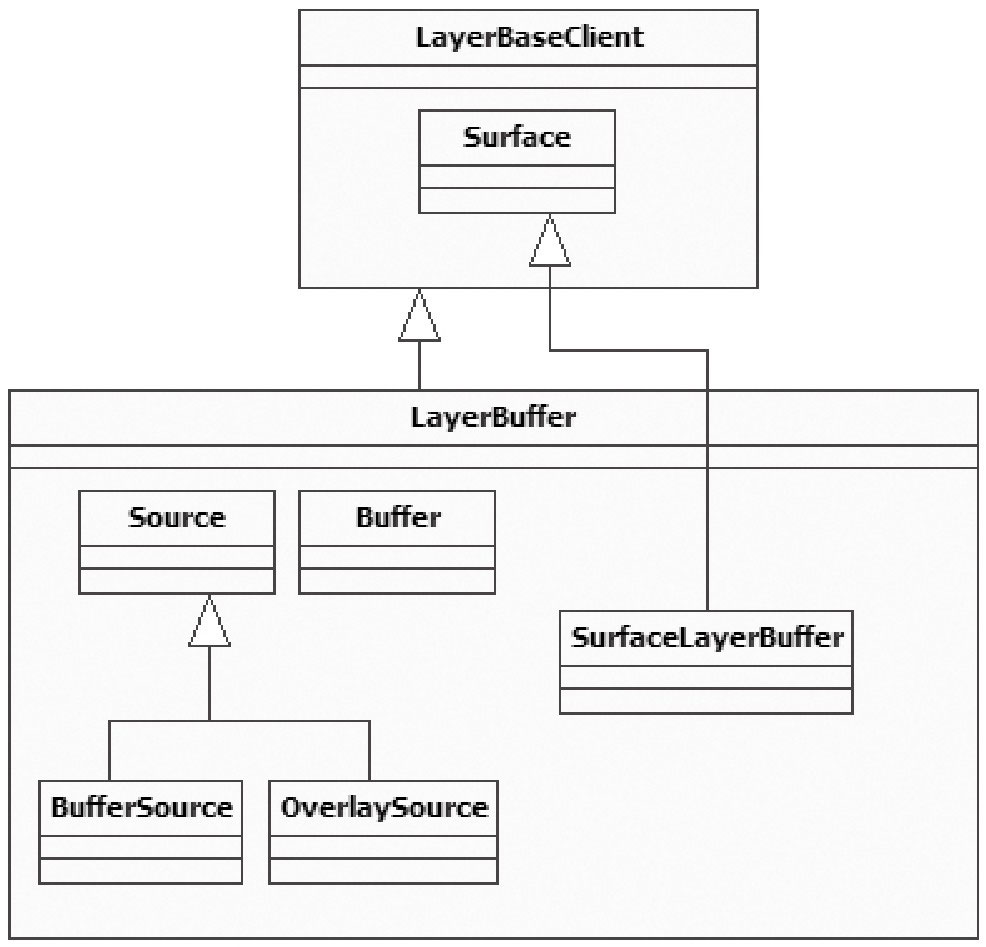
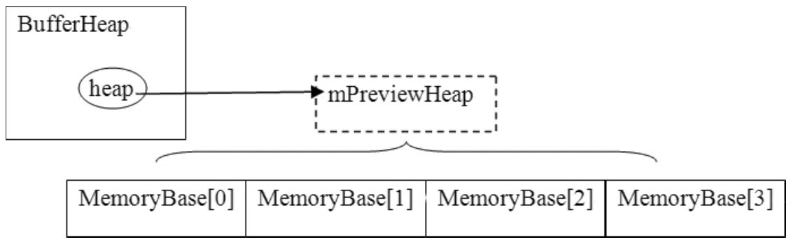
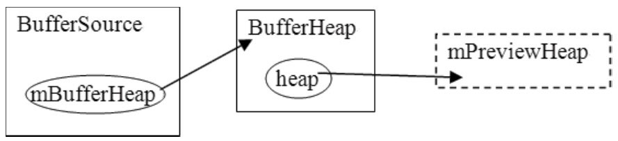
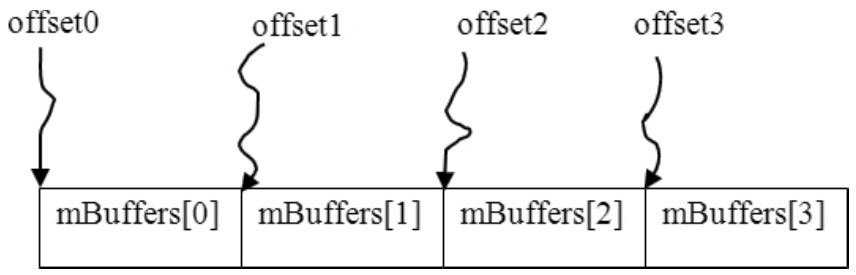

# 8.6.3 LayerBuffer分析




图8-30LayerBuer的派生关系示意图从上图中可以发现：

LayerBuer的派生关系如图8-30所示：

LayerBuer定义了一个内部类Source类，它有两个派生类BuerSource和Overlay-Source。根据它们的名字，可以猜测到Source代表数据的提供者。

LayerBuer中的mSurface其真实类型是SurfaceLayerBuer。

```
        status_t CameraService::Client::registerPreviewBuffers()
        {
            int w, h;
            CameraParameters params(mHardware-＞getParameters());
            params.getPreviewSize(&w, &h);
            /＊
            ①mHardware代表Camera设备的HAL对象。本书讨论CameraHardwareStub设备，它其实是
            一个虚拟的设备，不过其代码却具有参考价值。
            BufferHeap定义为ISurface的内部类，其实就是对IMemoryHeap的封装。
            ＊/
            ISurface::BufferHeap buffers(w, h, w, h,
                                          HAL_PIXEL_FORMAT_YCrCb_420_SP,
                                          mOrientation,
                                          0,
                                          mHardware-＞getPreviewHeap());
            //②调用SurfaceLayerBuffer的registerBuffers函数。
            status_t ret = mSurface-＞registerBuffers(buffers);
            return ret;
        }
```

LayerBuer创建好了，不过该怎么用呢？和它相关的调用流程是怎样的呢？下面来分析Camera。

2.CamerapreView分析Camera是一个单独的Service，全称是CameraService，先看CameraService的registerPreviewBuers函数。这个函数会做什么呢？代码如下所示：

[--＞CameraService.cpp]上面代码中列出了两个关键点，逐一来分析它

```cpp
        class BufferHeap {
            public:
              ......
                //使用这个构造函数。
                BufferHeap(uint32_t w, uint32_t h,
                        int32_t hor_stride, int32_t ver_stride,
                        PixelFormat format, const sp＜IMemoryHeap＞& heap);
              ......
                ～BufferHeap();

                uint32_t w;
                uint32_t h;
                int32_t hor_stride;
                int32_t ver_stride;
                PixelFormat format;
                uint32_t transform;
                uint32_t flags;
                sp＜IMemoryHeap＞ heap; //heap指向真实的存储对象。
            };
```

```cpp
        sp＜IMemoryHeap＞ CameraHardwareStub::getPreviewHeap() const
        {
            return mPreviewHeap;//返回一个成员变量，它又是在哪创建的呢？
        }
        //上面的mPreivewHeap对象由initHeapLocked函数创建，该函数在HAL对象创建的时候被调用
        void CameraHardwareStub::initHeapLocked()
        {
          ......
          /＊
        创建一个MemoryHeapBase对象，大小是mPreviewFrameSize ＊ kBufferCount,其中
          kBufferCount为4。注意这是一段连续的缓冲。
        ＊/
          mPreviewHeap = new MemoryHeapBase(mPreviewFrameSize ＊ kBufferCount);
          //mBuffer为MemoryBase数组，元素为4。
          for (int i = 0; i ＜ kBufferCount; i++) {
                mBuffers[i] = new MemoryBase(mPreviewHeap,
        i ＊ mPreviewFrameSize, mPreviewFrameSize);
            }
        }
```

们。

（1）创建BuerHeapBuerHeap是ISurface定义的一个内部类，它的声明如下所示：

[--＞ISurface.h]从上面的代码可发现，BuerHeap基本上就是封装了一个IMemoryHeap对象，根据我们对IMemoryHeap的了解，它应该包含了真实的存储对象，这个值由CameraHardwareStub对象的getPreviewHeap得到，这个函数的代码如下所示：

[--＞CameraHardwareStub.cpp]从上面这段代码中可以发现，CameraHardwareStub对象创建的用于preView的内存结构是按图8-31所示的方式来组织的：



图8-31CameraHardwareStub用于preView的内存结构图其中：

BuerHeap的heap变量指向一块MemoryHeap，这就是

```
        status_t LayerBuffer::SurfaceLayerBuffer::registerBuffers(
                const ISurface::BufferHeap& buffers)
        {
            sp＜LayerBuffer＞ owner(getOwner());
            if (owner != 0)
              //调用外部类对象的registerBuffers，所以SurfaceLayerBuffer也是一个Proxy哦。
                return owner-＞registerBuffers(buffers);
            return NO_INIT;
        }
        //外部类是LayerBuffer，调用它的registerBuffers函数。
        status_t LayerBuffer::registerBuffers(const ISurface::BufferHeap& buffers)
        {
        Mutex::Autolock _l(mLock);
        //创建数据的来源BufferSource，注意我们其实把MemoryHeap设置上去了。
            sp＜BufferSource＞ source = new BufferSource(＊this, buffers);
            status_t result = source-＞getStatus();
            if (result == NO_ERROR) {
                mSource = source;//保存这个数据源为mSource。
            }
            return result;
        }
```

mPreviewHeap。

在这块MemoryHeap上构建了4个MemoryBase。

（2）registerBuers分析BuerHeap准备好后，要调用ISurface的registerBuers函数，ISurface在SF端的真实类型是SurfaceLayerBuer，所以要直接地看它的实现，代码如下所示：

[--＞LayerBuer.cpp]BuerSource，曾在图8-30中见识过，它内部有一个成员变量mBuerHeap指向传入的buers参数，所以registerBuers过后，就得到了图8-32：



图8-32registerBuers的结果示意图请注意上图的箭头指向，不论中间有多少层封装，最终的数据存储区域还是mPreivewHeap。

3.数据的传输至此，Buer在SF和Camera两端都准备好了，那么数据是怎么从Camera传递到SF的呢？先来看数据源是怎么做的。

```
        //preview线程从Thread类派生，下面这个函数在threadLoop中循环调用。
        int CameraHardwareStub::previewThread()
        {
            mLock.lock();
            //每次进来mCurrentPreviewFrame都会加1。
            ssize_t offset = mCurrentPreviewFrame ＊ mPreviewFrameSize;

            sp＜MemoryHeapBase＞ heap = mPreviewHeap;

            FakeCamera＊ fakeCamera = mFakeCamera;//虚拟的摄像机设备。
            //从mBuffers中取一块内存，用于接收来自硬件的数据。
            sp＜MemoryBase＞ buffer = mBuffers[mCurrentPreviewFrame];

            mLock.unlock();
            if (buffer != 0) {
                int delay = (int)(1000000.0f / float(previewFrameRate));
                void ＊base = heap-＞base();//base是mPreviewHeap的起始位置。

                //下面这个frame代表buffer在mPreviewHeap中的起始位置，还记得图8-31吗？
                //四块MemoryBase的起始位置由下面这个代码计算得来。
                uint8_t ＊frame = ((uint8_t ＊)base) + offset;
                //取出一帧数据，放到对应的MemoryBase中。
                fakeCamera-＞getNextFrameAsYuv422(frame);
                //①把含有帧数据的buffer传递到上层。
                if (mMsgEnabled & CAMERA_MSG_PREVIEW_FRAME)
                    mDataCb(CAMERA_MSG_PREVIEW_FRAME, buffer, mCallbackCookie);

                //mCurrentPreviewFrame 递增，在0到3之间循环。
                mCurrentPreviewFrame = (mCurrentPreviewFrame + 1) % kBufferCount;
                usleep(delay);             //模拟真实硬件的延时。
            }

            return NO_ERROR;
        }
```

（1）数据传输分析CameraHardwareStub有一个preview线程，这个线程会做什么呢？代码如下所示：

[--＞CameraHardwareStub.cpp]读者是否明白Camerapreview的工作原理了？就是从四块内存中取一块出来接收数据，然后再把这块内存传递到上层去处理。从缓冲使用的角度来看，mBuers数组构成了一个成员个数为四的缓冲队列。preview通过mData这个回调函数，把数据传递到上层，

```cpp
        void CameraService::Client::handlePreviewData(const sp＜IMemory＞& mem)
        {
            ssize_t offset;
            size_t size;
            //注意传入的mem参数，它实际上是Camera HAL创建的mBuffers数组中的一个。
            //offset返回的是这个数组在mPreviewHeap中的偏移量。
            sp＜IMemoryHeap＞ heap = mem-＞getMemory(&offset, &size);
            if (!mUseOverlay)
            {
                Mutex::Autolock surfaceLock(mSurfaceLock);
                if (mSurface != NULL) {
                    //调用ISurface的postBuffer，注意我们传入的参数是offset。
                    mSurface-＞postBuffer(offset);
                }
        }
          .....
        }
```

而CameraService则实现了mData这个回调函数，这个回调函数最终会调用handlePreviewData，直接看handlePreviewData即可，代码如下所示：

[--＞CameraService.cpp]上面的代码是什么意思？我们到底给ISurface传什么了？答案很明显：

handlePreviewData就是传递了一个偏移量，这个偏移量是mBuers数组成员的首地址。可用图8-33来表示：



图8-33handlePreviewData示意图

```
        void LayerBuffer::BufferSource::postBuffer(ssize_t offset)
        {
            ISurface::BufferHeap buffers;
            {
                Mutex::Autolock _l(mBufferSourceLock);
                buffers = mBufferHeap;//还记得图8-32吗？
                if (buffers.heap != 0) {
                    //BufferHeap的heap变量指向MemoryHeap,下面取出它的大小。
                    const size_t memorySize = buffers.heap-＞getSize();
                    //做一下检查，判断这个offset是不是有问题。
                    if ((size_t(offset) + mBufferSize) ＞ memorySize) {
                        LOGE("LayerBuffer::BufferSource::postBuffer() "
                              "invalid buffer (offset=%d, size=%d, heap-size=%d",
                              int(offset), int(mBufferSize), int(memorySize));
                        return;
                    }
                }
            }

            sp＜Buffer＞ buffer;
            if (buffers.heap != 0) {
            //创建一个LayerBuffer::Buffer。
                buffer = new LayerBuffer::Buffer(buffers, offset, mBufferSize);
                if (buffer-＞getStatus() != NO_ERROR)
                    buffer.clear();
                setBuffer(buffer);//setBuffer？我们要看看。

                //mLayer就是外部类LayerBuffer，调用它的invalidate函数将触发SF的重绘。
                mLayer.invalidate();
            }
        }

        void LayerBuffer::BufferSource::setBuffer(
                                      const sp＜LayerBuffer::Buffer＞& buffer)
        {
          //setBuffer函数就是简单地将new出来的Buffer设置给成员变量mBuffer，这么做会有问题吗？
          Mutex::Autolock _l(mBufferSourceLock);
            mBuffer = buffer; //将新的buffer设置为mBuffer，mBuffer原来指向的那个被delete。
        }
```

有了[--图＞8L-a3y3e，rB读u者e明r.c白pp数]据传递的工作原理了吗？

下面看SurfaceLayerBuer的postBuer函数，不过它只是一个小小的代理，真正的工作由外部类LayerBuer完成，直接看它好了，代码如下所示：

[--＞LayerBuer.cpp]

```cpp
        void LayerBuffer::postBuffer(ssize_t offset)
        {
            sp＜Source＞ source(getSource());//getSource返回mSource，为BufferSource类型。
            if (source != 0)
                source-＞postBuffer(offset); //调用BufferSource的postBuffer函数。
        }
```

从数据生产者的角度看，postBuer函数将不断地new一个Buer出来，然后将它赋值给成员变量mBuer，也就是说，mBuer会不断

```
        LayerBuffer::Buffer::Buffer(const ISurface::BufferHeap& buffers,
                ssize_t offset, size_t bufferSize)
            : mBufferHeap(buffers), mSupportsCopybit(false)
        {
            //注意，这个src被定义为引用，所以修改src的信息相当于修改mNativeBuffer的信息。
            NativeBuffer& src(mNativeBuffer);
            src.crop.l = 0;
            src.crop.t = 0;
            src.crop.r = buffers.w;
            src.crop.b = buffers.h;

            src.img.w         = buffers.hor_stride ?: buffers.w;
            src.img.h         = buffers.ver_stride ?: buffers.h;
            src.img.format   = buffers.format;
            //这个base将指向对应的内存起始地址。
            src.img.base     = (void＊)(intptr_t(buffers.heap-＞base()) + offset);
            src.img.handle   = 0;
            gralloc_module_t const ＊ module = LayerBuffer::getGrallocModule();
            //做一些处理，有兴趣的读者可以去看看。
            if (module && module-＞perform) {
                int err = module-＞perform(module,
                        GRALLOC_MODULE_PERFORM_CREATE_HANDLE_FROM_BUFFER,
                        buffers.heap-＞heapID(), bufferSize,
                        offset, buffers.heap-＞base(),
                        &src.img.handle);

                mSupportsCopybit = (err == NO_ERROR);
            }
          }
```

变化。现在从缓冲的角度来思考一下这种情况的结果：

数据生产者有一个含四个成员的缓冲队列，也就是mBuers数组。

而数据消费者只有一个mBuer。

这种情况会有什么后果呢？请记住这个问题，我们到最后再来揭示。下面先看mBuer的类型Buer是什么。

（2）数据使用分析Buer被定义成LayerBuer的内部类，代码如下所示：

[--＞LayerBuer.cpp]上面是Buer的定义，其中最重要的就是这个mNativeBuer了，它实际上保存了mBuers数组成员的首地址。

```cpp
        void LayerBuffer::onDraw(const Region& clip) const
        {
            sp＜Source＞ source(getSource());
            if (LIKELY(source != 0)) {
                source-＞onDraw(clip);//source实际类型是BufferSource，我们去看看。
            } else {
                clearWithOpenGL(clip);
            }
        }
        void LayerBuffer::BufferSource::onDraw(const Region& clip) const
        {
            sp＜Buffer＞ ourBuffer(getBuffer());
            ......                    //使用这个Buffer，注意使用的时候没有锁控制。
            mLayer.drawWithOpenGL(clip, mTexture);//生成一个贴图，然后绘制它。
          }
```

下面看绘图函数，也就是LayerBuer的onDraw函数，这个函数由SF的工作线程调用，代码如下所示：

[--＞LayerBuer.cpp]其中getBuer函数返回mBuer，代码如下所示：

```cpp
        sp＜LayerBuffer::Buffer＞ LayerBuffer::BufferSource::getBuffer() const
        {
            Mutex::Autolock _l(mBufferSourceLock);
            return mBuffer;
        }
```

从上面的代码中能发现，mBuer的使用并没有锁的控制，这会导致什么问题发生呢？请再次回到前面曾强调要记住的那个问题上。此时生产者的队列有四个元素，而消费者的队列只有一个元素，它可用图8-34来表示：


图8-34数据传递的问题示意图从上图可以知道：

使用者使用mBuer，这是在SF的工作线程中做到的。假设mBuer实际指向的内存为mBuers[0]​。

数据生产者循环更新mBuers数组各个成员的数据内容，这是在另外一个线程中完成的。由于这两个线程之间没有锁同步，这就造成了当使用者还在使用mBuers[0]时，生产者又更新了mBuers[0]​。这会在屏幕上产生混杂的图像。

经过实际测试得知，如果给数据使用端加上一定延时，屏幕就会出现不连续的画面，即前一帧和后一帧的数据混杂在一起输出。

说明从代码的分析来看，这种方式确实有问题。我在真实设备上测试的结果也在一定程度上验证了这一点。通过修改LayerBuer来解决这问题的难度比较大，是否可在读写具体缓存时加上同步控制呢（例如使用mBuers[0]的时候调用一下lock，用完后调用unlock）​？这样就不用修改LayerBuer了。读者可再深入研究这个问题。
