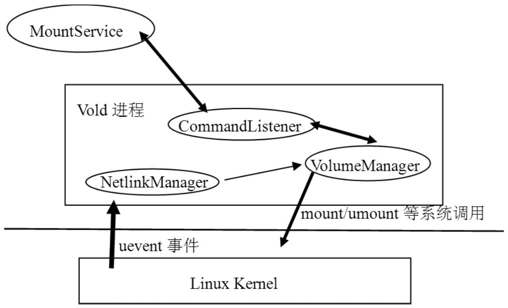

# 9.2 Vold的原理与机制分析

Vold是VolumeDaemon的缩写，它是Android平台中外部存储系统的管控中心，是一个比较重要的进程。虽然它的地位很重要，但其代码结构却远没有前面的Audio和Surface系统复杂。欣赏完Audio和Surface的大气磅礴后，再来感受一下Vold的小巧玲珑也会别有一番情趣。Vold的架构可用图9-1来表示：

图9-1Vold架构图从上图中可知：

Vold中的NetlinkManager模块（简称NM）接收来自Linux内核的uevent消息。例如SD卡的插拔等动作都会引起Kernel向NM发送uevent消息。

NM将这些消息转发给VolumeManager模块（简称VM）​。

VM会对应做一些操作，然后把相关信息通过CommandListener（简称CL）发送给MountService，MountService根据收到的消息会发送相关的处理命令给VM做进一步的处理。例如待SD卡插入后，VM会将来自NM的“DiskInsert”消息发送给MountService，而后MountService则发送“Mount”指令给Vold，指示它挂载这个SD卡。

CL模块内部封装了一个Socket用于跨进程通信。它在Vold进程中属于监听端（即服务端）​，而它的连接端（即客户端）则是MountService。它一方面接收来自MountService的控制命令（例如卸载存储卡、格式化存储卡等）​，另一方面VM和NM模块又会通过它将一些信息发送给MountService。

相比于Audio和Surface系统，Vold的架构确实比较简单，并且Vold和MountService所在的进程（这个进程其实就是system_server）

在进行进程间通信时，也没有利用Binder机制，而是直接使用了Socket，这样，在代码量和程序中类的派生关系上就会简单不少。
