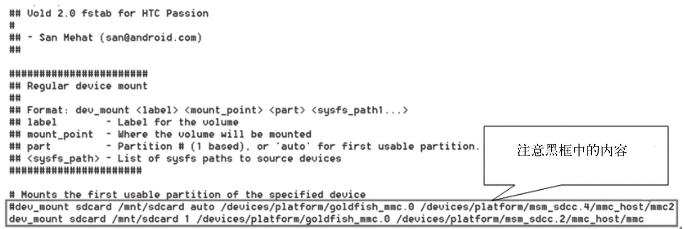
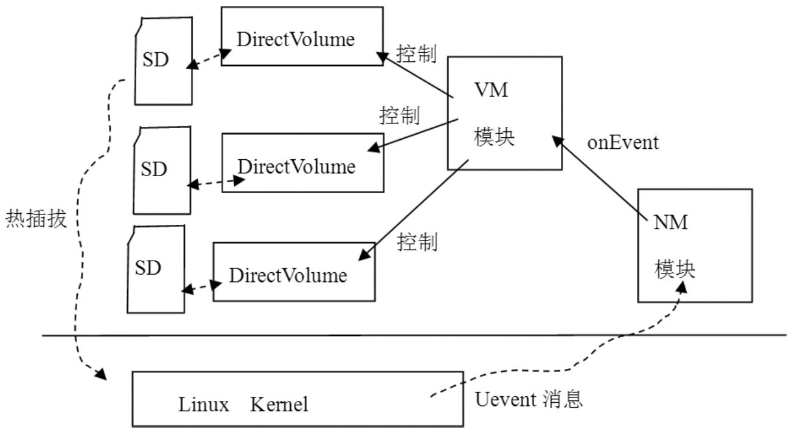

# 9.2.4 VolumeManager模块分析


所示。

[--＞VolumeManager.cpp]

```cpp
        VolumeManager ＊VolumeManager::Instance() {
            if (!sInstance)
                sInstance = new VolumeManager();
            return sInstance;
        }
```

可以看到，VM也采用了单例模式，所以全进程只会存在一个VM对象。

下面看VM的start函数，如下所示：

[--＞VolumeManager.cpp]

```cpp
        int VolumeManager::start() {
            return 0;
        }
```

```cpp
        static int process_config(VolumeManager ＊vm) {
            FILE ＊fp;
            int n = 0;
            char line[255];
            //读取/etc/vold.fstab文件。
            if (!(fp = fopen("/etc/vold.fstab", "r"))) {
                return -1;
            }

            while(fgets(line, sizeof(line), fp)) {
                char ＊next = line;
                char ＊type, ＊label, ＊mount_point;

                n++;
                line[strlen(line)-1] = '\0';

                if (line[0] == '#' || line[0] == '\0')
                    continue;

                if (!(type = strsep(&next, " \t"))) {
                    goto out_syntax;
                }
                if (!(label = strsep(&next, " \t"))) {
                    goto out_syntax;
                }
                if (!(mount_point = strsep(&next, " \t"))) {
                    goto out_syntax;
                }

                if (!strcmp(type, "dev_mount")) {
                    DirectVolume ＊dv = NULL;
                    char ＊part, ＊sysfs_path;
                    if (!(part = strsep(&next, " \t"))) {
                        ......
                        goto out_syntax;
                    }
                    if (strcmp(part, "auto") && atoi(part) == 0) {
                        goto out_syntax;
                    }

                    if (!strcmp(part, "auto")) {
                        //①构造一个DirectVolume对象。
                        dv = new DirectVolume(vm, label, mount_point, -1);
                    } else {
                        dv = new DirectVolume(vm, label, mount_point, atoi(part));
                    }

                    while((sysfs_path = strsep(&next, " \t"))) {
                        //② 添加设备路径。
                        if (dv-＞addPath(sysfs_path)) {
                            ......
                            goto out_fail;
                        }
                    }
                  //为VolumeManager对象增加一个DirectVolume对象。
                    vm-＞addVolume(dv);
                }
                ......
            }
            ......
            return -1;
        }
```

start很简单，没有任何操作。

2.process_config分析process_config函数会根据配置文件配置VM对象，其代码如下所示：

[--＞Main.cpp]从上面的代码可发现，process_config的主要功能就是解析/etc/vold.fstab。这个文件的作用和Linux系统中的fstab文件很类似，就是设置一些存储设备的挂载点，我的HTCG7手机上这个文件的内容如图9-3所示：



图9-3我手机上的vold.fstab内容从上图灰色框中的内容可知：

sdcard为volume的名字。

/mnt/sdcard表示mount的位置。

1表示使用存储卡上的第一个分区，auto表示没有分区。现在有很多定制的ROM要求SD卡上存在多个分区。

/devices/xxxx等内容表示MMC设备在sysfs中的位置。

根据G7的vold.fstab文件可以构造一个DirectVolume对象。

注意根据手机刷的ROM的不同，vold.fstab文件会有较大差异。

3.DirectVolume分析DirectVolume从Volume类派生，可把它看成是一个外部存储卡（例如一张SD卡）在代码中的代表。它封装了对外部存储卡的操作，例如加载/卸载存储卡、格式化存储卡等。

下面是process_config函数中和DirectVolume相关的地方：

一个是创建DirectVolume。

另一个是调用DirectVolume的

```
        DirectVolume::DirectVolume(VolumeManager ＊vm, const char ＊label,
                                    const char ＊mount_point, int partIdx) :
                      Volume(vm, label, mount_point) {//初始化基类。
            /＊
              注意其中的参数：
              label为”sdcard”,mount_point为”/mnt/sdcard”,partIdx为1
            ＊/
            mPartIdx = partIdx;
            //PathCollection定义为typedef android::List＜char ＊＞ PathCollection
            //其实就是一个字符串list。
            mPaths = new PathCollection();
            for (int i = 0; i ＜ MAX_PARTITIONS; i++)
                mPartMinors[i] = -1;
            mPendingPartMap = 0;
            mDiskMajor = -1;  //存储设备的主设备号。
            mDiskMinor = -1;  //存储设备的次设备号，一个存储设备将由主次两个设备号标识。
            mDiskNumParts = 0;
            //设置状态为NoMedia
            setState(Volume::State_NoMedia);
        }
        //再来看addPath函数，它主要目的是添加设备在sysfs中的路径，G7的vold.fstab上有两个路
        //径，见图9-3中的最后一行。
        int DirectVolume::addPath(const char ＊path) {
            mPaths-＞push_back(strdup(path));
            return 0;
        }
```

addpath函数。

它们的代码如下所示：

[--＞DirectVolume.cpp]这里简单介绍一下addPath的作用。addPath会把和某个存储卡接口相关的设备路径与这个DirectVolume绑定到一起，并且这个设备路径和Uevent中的DEVPATH是对应的，这样就可以根据Uevent的DEVPATH找到是哪个存储卡的DirectVolume发生了变动。当然手机上目前只有一个存储卡接口，所以Vold也只有一个DirectVolume。

4.NM和VM交互在分析NM模块的数据处理时发现，NM模块接收到Uevent事件后，会调用VM模块进行处理，下面来看这块的内容。

先回顾一下NM调用VM模块的地方，代码如下所示：

[--＞NetlinkHandler.cpp]

```cpp
        void NetlinkHandler::onEvent(NetlinkEvent ＊evt) {
            VolumeManager ＊vm = VolumeManager::Instance();
            const char ＊subsys = evt-＞getSubsystem();
            ......
            if (!strcmp(subsys,“block”)) {
                vm-＞handleBlockEvent(evt); //调用VM的handleBlockEvent。
            } else if (!strcmp(subsys, "switch")) {
                vm-＞handleSwitchEvent(evt);//调用VM的handleSwitchEvent。
            }
            ......
        }
```

在上面的代码中，如果Uevent是block子系统，则调用handleBlockEvent；如果是

```
        void VolumeManager::handleBlockEvent(NetlinkEvent ＊evt) {
            const char ＊devpath = evt-＞findParam("DEVPATH");

            /＊
            前面在process_config中构造的DirectVolume对象保存在了mVolumes中，它的定义如下：
            typedef android::List＜Volume ＊＞ VolumeCollection，也是一个列表。
            注意它保存的是Volume指针，而我们的DirectVolume是从Volume派生的。
            ＊/
            VolumeCollection::iterator it;
            bool hit = false;
            for (it = mVolumes-＞begin(); it != mVolumes-＞end(); ++it) {
                //调用每个Volume的handleBlockEvent事件，就我的G7手机而言，实际上将调用
                //DirectVolume的handleBlockEvent函数。
                if (!(＊it)-＞handleBlockEvent(evt)) {
                    hit = true;
                    break;
                }
            }
        }
```

switch，则调用handleSwitchEvent。

handleSwitchEvent主要处理SD卡挂载磁盘的通知，比较简单。这里只分析handleBlockEvent事件。代码如下所示：

[--＞VolumeManager.cpp]

```cpp
        int DirectVolume::handleBlockEvent(NetlinkEvent ＊evt) {
            const char ＊dp = evt-＞findParam("DEVPATH");

            PathCollection::iterator   it;
            //将Uevent的DEVPATH和addPath添加的路径进行对比，判断属不属于自己管理的范围。
            for (it = mPaths-＞begin(); it != mPaths-＞end(); ++it) {
                if (!strncmp(dp, ＊it, strlen(＊it))) {
                    int action = evt-＞getAction();
                    const char ＊devtype = evt-＞findParam("DEVTYPE");

                    if (action == NetlinkEvent::NlActionAdd) {
                        int major = atoi(evt-＞findParam("MAJOR"));
                        int minor = atoi(evt-＞findParam("MINOR"));
                        char nodepath[255];

                        snprintf(nodepath,
                                  sizeof(nodepath), "/dev/block/vold/%d:%d",
                                  major, minor);
                          //创建设备节点。
                        if (createDeviceNode(nodepath, major, minor)) {
                            ......
                        }
                        if (!strcmp(devtype, "disk")) {
                            handleDiskAdded(dp, evt);//添加一个磁盘。
                        } else {
                            /＊
                            对于有分区的SD卡，先收到上面的“disk”消息，然后每个分区就会收到
                            一个分区添加消息。
                            ＊/
                            handlePartitionAdded(dp, evt);
                        }
                    } else if (action == NetlinkEvent::NlActionRemove) {
                        ......
                    } else if (action == NetlinkEvent::NlActionChange) {
                        ......
                    }
                    ......
                    return 0;
                }
            }
            errno = ENODEV;
            return -1;
        }
```

NM收到Uevent消息后，DirectVolume也将应声而动，它的handleBlockEvent的处理是：

[--＞DirectVolume.cpp]关于DirectVolume针对不同Uevent的具体处理方式，后面将通过一个SD卡插入案例来分析。

5.关于VM模块的总结从前面的代码分析可知，VM模块的主要功能是管理Android系统中的外部存储设备。图9-4描述了VM模块的功能：



图9-4VM模块的职责通过对上图和前面代码的分析可知：

SD卡的变动（例如热插拔）将导致Kernel发送Uevent消息给NM模块。

NM模块调用VM模块处理这些Uevent消息。

VM模块遍历它所持有的Volume对象，Volume对象根据addPath添加的DEVPATH和Uevent消息中的DEVPATH来判断自己是否可以处理这个消息。

至于Volume到底如何处理Uevent消息，将通过一个实例来分析。
