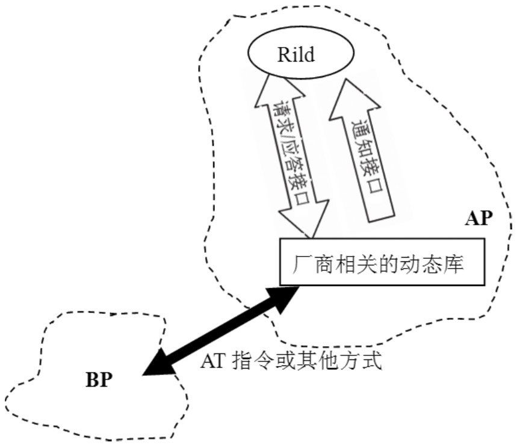

# 9.3 Rild的原理与机制分析

这里先回顾一下智能手机的架构。目前，很多智能手机的硬件架构都是两个处理器：一个处理器用来运行操作系统，上面可以跑应用程序，这个处理器称作ApplicationProcessor，简称AP；另一个处理器负责和射频无线通信相关的工作，叫BasebandProcessor，简称BP。AP和BP芯片之间采用串口进行通信，通信协议使用的是AT指令。

说明什么是AT指令呢？AT指令最早用在Modem上，后来几大手机厂商如摩托罗拉、爱立信、诺基亚等为GSM通信又设计了一整套AT指令。AT指令的格式比较简单，是一个以AT开头，后跟字母和数字表示具体功能的字符串。要了解具体的AT指令，可参考相关的规范或手机厂商提供的手册，这里就不再多说了。

在Android系统中，Rild运行在AP上，它是AP和BP在软件层面上通信的中枢，也就是说，AP上的应用程序将通过Rild发送AT指令给BP，而BP的信息通过Rild传送给AP上的应用程序。

下面介绍一下在Rild代码中常会碰到的两个词语：

第一个solicitedResponse，即经过请求的回复。它代表的应用场景是AP发送一个AT请求指令给BP进行处理，处理后，BP会对应回复一个AT指令告知处理结果。这个回复指令是针对之前的那个请求指令的，此乃一问一答式，所以叫solicitedResponse。

第二个unsolicitedResponse，即未经请求的回复。很多时候，BP主动给AP发送AT指令，这种指令一般是BP通知AP当前发生的一些事情，例如一个电话打了过来，或者网络信号中断等。从AP的角度来看，这种指令并非由它发送的请求所引起，所以称之为unsolicitedResponse。

上面这两个词语，实际指明了AP和BP的两种交互类型：

AP发送请求给BP，BP响应并回复AP。

BP发送通知给AP。

这两种类型对软件而言有什么意义呢？先来看Rild在软件架构方面遇到的挑战：

有很多把AP和BP集成在一块芯片上的智能手机，它们之间的通信可能就不是AT指令了。

即使AP和BP通信使用的是AT指令，不同的手机厂商在AT指令上也会有很大的不同，而且这些都属于商业秘密，所以手机厂商不可能共享源码，它只能给出二进制的库。

Rild是怎么解决这个问题的呢？结合前面提到的AP/BP交互的两种类型，大体可以勾画出图9-7来：

图9-7Rild解决问题的方法从上图中可以看出：

Rild会动态加载厂商相关的动态库，这个动态库加载在Linux平台上则使用dlopen系统调用。

Rild和动态库之间通过接口进行通信，也就是说Rild输出接口供动态库使用，而动态库也输出对应的接口供Rild使用。

AP和BP交互的工作由动态库去完成。

注意Rild和动态库运行在同一个进程上，为了方便理解，可把这两个东西分离开来。

根据上面的分析可知，对Rild的分析包括两部分：

对Rild本身的分析。

对动态库的分析。Android提供了一个用作参考的动态库叫libReference_ril.so，这个库实现了一些标准的AT指令。另外，它的代码结构也颇具参考价值，所以我们的动态库分析就以它为主。

分析Rild时，为了书写方便，我们将这个动态库简称为RefRil库。
