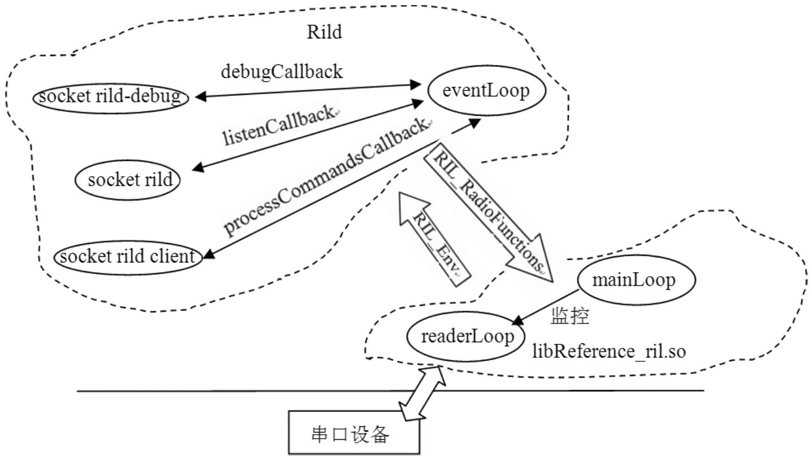

# 9.3.5 关于Rild main函数的总结

前面所有的内容都是在main函数中处理的，下面给出main函数执行后的结果，如图9-8所示：

图9-8Rildmain函数执行后的结果示意图其中：

Rild和RefRil库的交互通过RIL_Env和RIL_RadioFunctions这两个结构体来完成。

Rild的eventLoop处理任务。对于来自客户端的任务，eventLoop调用的处理函数是processCommandsCaback。

RefRil库的readerLoop用来从串口设备中读取数据。

RefRil库中的mainLoop用来监视readerLoop。

上图画出的模块都是静态的，前面提到的异步请求/处理的工作方式并不能体现出来。那么来分析一个实例，看看这些模块之间是如何配合与联动的。
