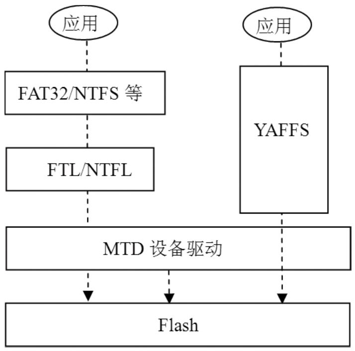
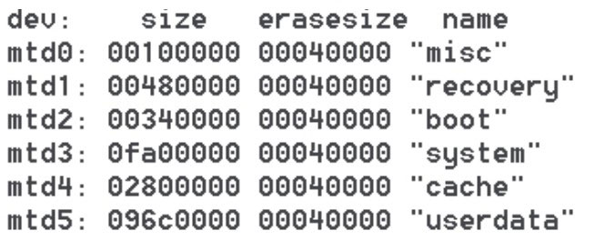

# 9.4.1 嵌入式系统的存储知识介绍

9.4.1嵌入式系统的存储知识介绍用adbshe登录到我的G7手机上，然后用mount查看信息后，会得到如图9-9所示的结果：

图9-9mount命令的执行结果其中，可以发现系统的几个重要分区，例如/system对应的设备是mtdblock3，那么mtdblock是什么呢？

1.MTD的介绍Linux系统提供了MTD（MemoryTechnologyDevice，内存技术设备）系统来建（立Tra针n对sMlaFTtilaDosn将h设L文a备y件e的r系）统统将一与逻、底辑抽层块象的地的F址接las对口h存，应也储到就Fla是sh器说存进，储行有器了了的隔M物离T，理D，这地样就址应可上用以，层不以就用便无考系须虑统考不能虑同真把FFllaasshh实设当的作备硬普带件通情来的况的磁了盘差。处异理了，，可这称这一一点层和为FFBTDL（（FFrlaasmheTBruanselratiDoenvicLea）ye的r）​。作用F很las类h转似换。下层图中的mtdblock表示MTD块设备。

面的示看意Lin图u如xM图T9D-1的1所系示统：层次图，如图9-10所示有。了MTD后，就不用关心Flash是NOR还是

NAND了。另外，我们从图9-10“mount命令的执行结果”中还可看见mount指定的文件系统中有一个yas2，它又是什么呢？

2.Flash文件系统图9-11FTL和NFTL先来说说Flash的特性。常见的文件系统（例如FAT32、NTFS、Ext2等）是无法直接用在从上图中可以看到：

Flash设备上的，因为无法重复地在Flash的同如果想使用FAT32或NTFS文件系统，一块存储图位9-置10上L做in写ux入M操TD作系（统必层须次事图先擦除该必须通过FTL或NTFL进行转换，其中FTL块后才能写入）​。为了能够在Flash设备上使从上图中可以看出：

针对NORFlash，而NTFL针对NAND用这些文件系统，必须透过一个层转换层Flash。

尽管有了FTL，但毕竟多了一层处理，这样对I/O效率的影响较大，所以人们开发了专门针对Flash的文件系统，其中YAFFS就是应用比较广泛的一种。

YAFFS是YetAnotherFlashFileSystem的简称，目前有YAFFS和YAFFS2两个版本。这两个版本的主要区别是，YAFFS2可支持大容量的NADNFlash，而YAFFS只支持页的大小为512字节的NANDFlash。YAFFS使用OOB（OutOfBind）来组织文件的结构信息，所以在Vold代码中，可以见到OOB相关的字样。

说明关于嵌入式存储方面的知识就介绍到这里。有兴趣深入了解的读者可阅读有关驱动开发方面的书籍。

3.Androidmtd设备介绍这里以我的HTCG7手机为例，分析Android系统中MTD设备的使用情况。

通过adbcat/proc/mtd，得到图9-12所示的MTD设备的使用情况：

图9-12G7MTD设备的使用情况这几个设备对应存储空间的大小和作用如下：

MTD0，主要用于存储开机画面。此开机画面在Android系统启动前运行，由Bootloader调用，大小为1MB。

MTD1，存储恢复模式的镜像，大小为4.5MB。

MTD2，存储kernel镜像，大小为3.25MB。

MTD3，存储system镜像，该分区挂载在/system目录下，大小为250MB。

MTD4，缓冲临时文件，该分区挂载在/cache目录下，大小为40MB。

MTD5，存储用户安装的软件和一些数据，我的G7把这个设备挂载在/mnt/asec/mtddata目录下，大小为150.75MB。

注意上面的设备和挂载点与具体的机器及所刷的ROM有关。
