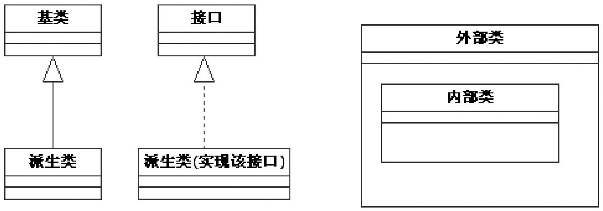

# 前言

虽然前言位于书的最前面，但往往是最后才完成的。至今，本书的撰写工作算是基本完成了，在书稿付梓之前，心中却有些许忐忑和不安，因为拙著可能会存在Bug。为此，我先为书中可能存在的Bug将给大家带来的麻烦致以真诚的歉意。另外，如果大家发现本书存在纰漏或有必要进一步探讨的地方，请发邮件给我，我会尽快回复。非常乐意与大家交流。

本书主要内容全书一共10章，其中一些重要章节中还设置了“拓展思考”部分。这10章的主要内容是：

第1章介绍了阅读本书所需要做的一些准备工作，包括对Android整个系统架构的认识，以及Android开发环境和源码阅读环境的搭建等。注意，本书分析的源码是Android2.2。

第2章通过Android源码中的一处实例深入地介绍了JNI技术。

第3章围绕init进程，介绍了如何解析init.rc以启动Zygote和属性服务（propertyservice）的工作原理。

第4章剖析了zygote和system_server进程的工作原理。本章的拓展思考部分讨论了Andorid的启动速度、虚拟机heapsize的大小调整问题以及“看门狗”的工作原理。

第5章讲解了Android源码中常用的类，如sp、wp、RefBase、Thread类、同步类、Java中的Handler类以及Looper类。这些类都是Android中最常用和最基本的，只有掌握这些类的知识，才能在分析后续的代码时游刃有余。

第6章以MediaServer为切入点，对Binder进行了较为全面的分析。本章拓展思考部分讨论了与Binder有关的三个问题，它们分别是Binder和线程的关系、死亡通知以及匿名Service。笔者希望，通过本章的学习，大家能更深入地认识Binder的本质。

第7章阐述了Audio系统中的三位重要成员AudioTrack、AudioFlinger和AudioPolicyService的工作原理。本章拓展思考部分分析了AudioFlinger中DuplicatingThread的工作原理，并且和读者一道探讨了单元测试、ALSA、Desktopcheck等问题。通过对本章的学习，相信读者会对Audio系统有更深的理解。

第8章以Surface系统为主，分析了Activity和Surface的关系、Surface和SurfaceFlinger的关系以及SurfaceFlinger的工作原理。本章的拓展思考部分分析了Surface系统中数据传输控制对象的工作原理、有关ViewRoot的一些疑问，最后讲解了LayerBuer的工作流程。

这是全书中难度较大的一章，建议大家反复阅读和思考，这样才能进一步深入理解Surface系统。

第9章分析了Vold和Rild，其中Vold负责Android平台中外部存储设备的管理，而Rild负责与射频通信有关的工作。本章的拓展思考部分介绍了嵌入式系统中与存储有关的知识，还探讨了Rild和Phone设计优化方面的问题。

第10章分析了多媒体系统中MediaScanner的工作原理。在本章的拓展思考部分，笔者提出了几个问题，旨在激发读者深入思考和学习Android的欲望。

本书特色笔者认为，本书最大的特点在于，较全面、系统、深入地讲解了Android系统中的几大重要组成部分的工作原理，旨在通过直接剖析源代码的方式，引领读者一步步深入于诸如Binder、Zygote、Audio、Surface、Vold、Rild等模块的内部，去理解它们是如何实现的，以及如何工作的。笔者根据研究Android代码的心得，在本书中尝试性地采用了精简流程、逐个击破的方法进行讲解，希望这样做能帮助读者更快、更准确地把握各模块的工作流程及其本质。本书大部分章节中都专门撰写了“拓展思路”的内容，希望这部分内容能激发读者对Android代码进行深入研究的热情。

本书面向的读者（1）Android应用开发工程师对于Android应用开发工程师而言，本书中关于Binder，以及sp、wp、Handler和Looper等常用类的分析或许能帮助你迅速适应Android平台上的开发工作。

（2）Android系统开发工程师Android系统开发工程师常常需要深入理解系统的运转过程，而本书所涉及的内容可能正是他们在工作和学习中最想了解的。那些对具体模块（如Audio系统和Surface系统）感兴趣的读者也可以直接阅读相关章节的内容。

这里有必要提醒一下，要阅读此书，应具有C++的基本知识，因为本书的大部分内容都集中在了Native层。

如何阅读本书本书是在分析Android源码的基础上展开的，而源码文件所在的路径一般都很长，例如，文件AndroidRuntime.cpp的真实路径就是framework/base/core/jni/AndroidRuntime.cpp。为了书写方便起见，我们在各章节开头把该章所涉及的源码路径全部都列出来了，而在具体分析源码时，则只列出该源码的文件名。下面就是一个示例：

[--＞AndroidRuntime.cpp]//这里是源码分析和一些注释。

如有一些需要特别说明的地方，则会用下面的格式表示：

[--＞AndroidRuntime.cpp::特别说明]特别说明可帮助读者找到源码中的对应位置。

另外，本书在描述类之间的关系以及在函数调用流程上使用了UML的静态类图以及序列图。UML是一个强大的工具，但它的建模规范过于烦琐，为更简单清晰地描述事情的本质，本书并未完全遵循UML的建模规范。这里仅举一例，如图1所示：

图1UML示例图如上图所示：

画在外部类内部的方框用于表示内部类。

接口和普通类用同一种框图表示。

本书所使用的UML图都比较简单，读者大可不必花费时间专门学习UML。

本书的编写顺序，其实应该是6、5、4、7、8、9、10、2、3、1章，但出于逻辑连贯性的考虑，还是建议读者按本书的顺序阅读。其中，第2、5、6章分别讲述了JNI、Android常用类以及Binder系统，这些都是基础知识，我们有必要完全掌握。其他部分的内容都是针对单个模块的，例如Zygote、Audio、Surface、MediaScanner等，读者可各取所需，分别对其进行研究。
