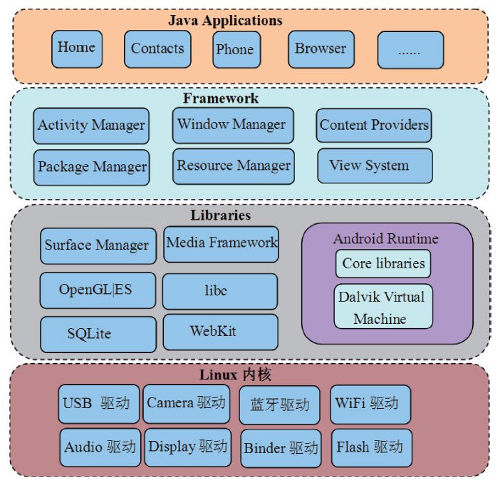

# 1.1 Android系统架构

Android是Google公司推出的一款手机开发平台。该平台本身是基于Linux内核的，图1-1展示了这个系统的架构。

图1-1Android系统架构从图1-1可知，Android系统大体可分为四层，从下往上依次如下。

❑Linux内核层，目前Android4.4（代号为KitKat）基于Linux内核3.4版本。

❑Libraries层，这一层提供动态库（也叫共享库）​、Android运行时库、Dalvik虚拟机等。从编程语言方面来说，这一层大部分都是用C或C++写的，所以也可以简单地把它看成是Native层。

❑Libraries层之上是Framework层，这一层大部分用Java语言编写。它是Android平台上Java世界的基石。

❑Framework层之上是Applications层，和用户直接交互的就是这些应用程序，它们都是用Java开发的。
