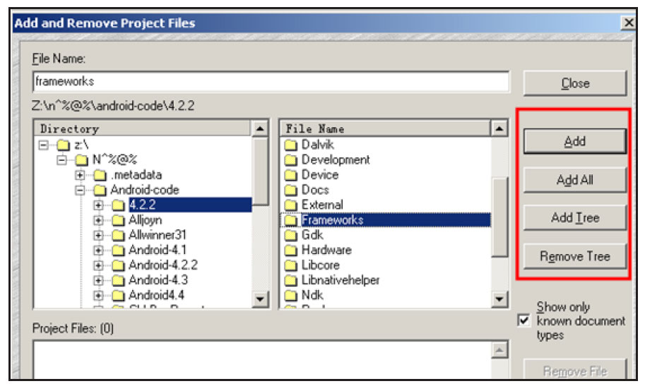

# 1.2.1 Source Insight的使用

SourceInsight是阅读源码的必备工具，是一个Windows下的软件，在Linux平台上可通过wine安装。下面介绍一下如何在SourceInsight中导入源码。

使用SourceInsight时，需要新建一个源码工程，通过菜单项Project→NewProject，可指定源码的目录。

提示如果把Android所有源代码都加到工程中，将导致SourceInsight运行速度非常慢。

实际上，只需要将当前分析的源码目录加到工程即可。例如，新建一个SourceInsight工程后，只把源码/framework/base目录加进去了。另外，当一个目录下的源码分析完后，可以通过Project→AddandRemoveProjectFiles选项把无须分析的目录从工程中去掉。

上述步骤如图1-2所示。

图1-2添加或删除工程中的目录从图1-2右边的框可知，SourceInsight支持动态添加或删除目录。通过这种方式可极大减少SourceInsight的工作负担。

提示一般首先把framework/base下的目录加到工程，以后如有需要，再把其他目录加进来。另外，关于SourceInsight其他使用技巧，可参考《深入理解Android：卷Ⅰ》第1章。
