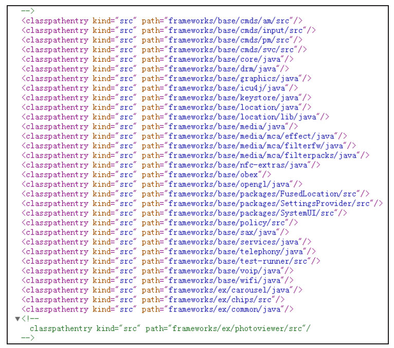
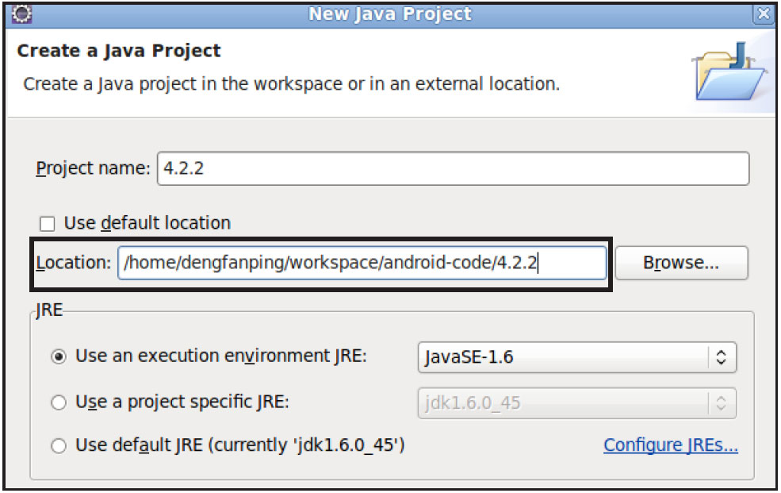
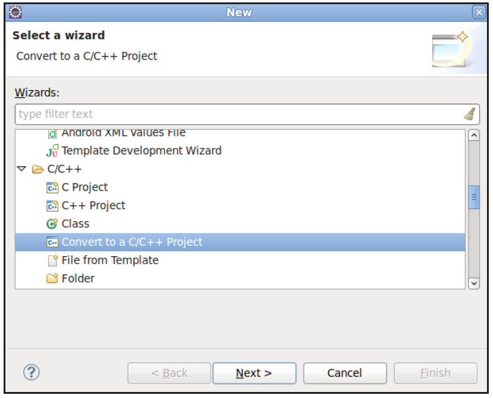
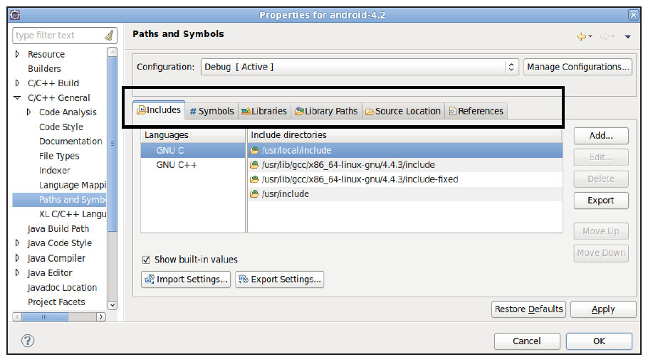
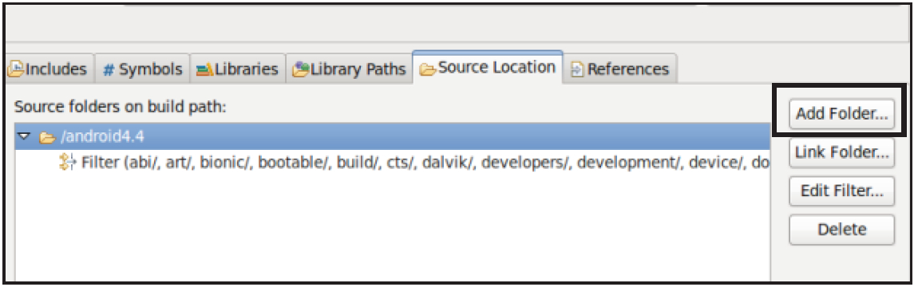
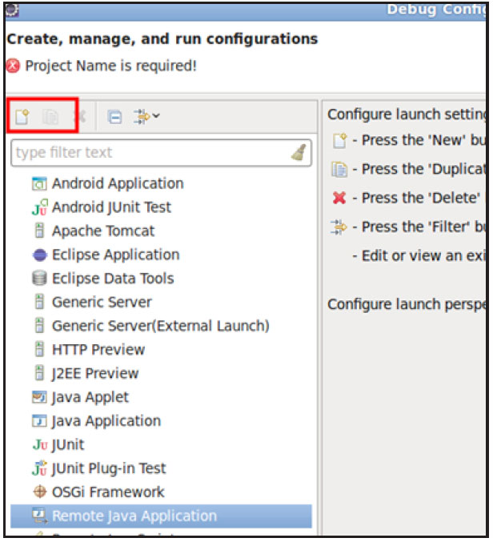
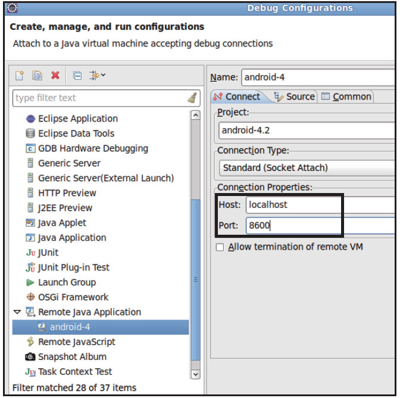

# 1.2.2 Eclipse的使用

笔者一般使用SourceInsight来查看Native代码，而Android推荐的集成开发工具Eclipse既能查看Java代码和Native代码，也能调试系统核心进程。

1.导入AndroidFrameworkJava源码注意，这一步必须编译整个Android源码才可以实施，步骤如下。

1）将Android源码目录/development/ide/eclipse/.classpath复制到Android源码根目录。

2）打开Android源码根目录下的.classpath文件。该文件是供Eclipse使用的，其中保存的是源码目录中各个模块的路径。

由于我们只关心Framework相关的模块，因此可以把一些不是Framework的目录从该文件中注释掉。同时，去掉不必要的模块也可加快Android源码导入速度。图1-3所示为该文件的部分内容。

图1-3.classpath文件内容然后，单击Eclipse菜单栏New→JavaProject，弹出如图1-4所示的对话框。设置Location为Android4.2源码所在路径。

图1-4导入Android源码由于Android4.2源码文件较多，导入过程会持续较长一段时间。

提示导入源码前一定要取消Eclipse的自动编译选项（通过菜单栏Project→BuildProjectAutomaticay设置）​。另外，源码导入完毕后，千万不要清理（clean）这个工程。清理会删除之前源码编译所生成的文件，导致后续又要重新编译Android系统了。

本书的共享资源中提供了一个已经配置好的.classpath文件，供读者下载并使用。

2.导入AndroidNative代码本节介绍如何在Eclipse中导入AndroidNative代码，其步骤如下所示。

导入AndroidFramework中的Java文件后，首先切换到C/C++视图（通过单击菜单栏Window→OpenPerspective→选择C/C++）​。

单击菜单栏New→C/C++，然后选择ConverttoaC/C++project，如图1-5所示。

按照图1-5操作之后，之前的Java工程就被转

成C++工程。不过读者仍需要完成以下几个步骤。

1）通过Properties→C/C++General→Pathsandsymbols，打开该工程的路径和符号设置对话。如图1-6所示。

图1-5转换成C++工程2）在图1-6上边的框中选择Includes页面，

然后单击下方框中的ImportSettings，选择4.2源码/development/ide/eclipse/android-include-paths.xml以导入路径配置。

图1-6路径和符号设置3）同上，选择图1-6中的Symbols页面，然配置好路径和符号文件后，可进一步通过图1-后通过下方的ImportSettings导入4.2源6中的SourceLocation页面选择此次需要导码/development/ide/eclipse/android-入的C++文件，如图1-7所示。

symbols.xml文件。

图1-7过滤C++文件通过图1-7中AddFolder选项，可以选择哪些目录下的C++文件被过滤掉。笔者目前仅导入了frameworks目录下的Native代码。

当所有文件都导入完毕后，读者通过右击C++工程，然后选择Index→Rebuild来重新生成Native代码的索引。

通过上述方法就能导入Android中的Native代码了。

3.调试SystemServer调试SystemServer的步骤如下。

1）首先编译Android源码工程。编译过程中会有很多警告，如果有错误，大部分原因是.classpath文件将不需要的模块包含进来，可根据Eclipse的提示做相应处理。笔者配置的几台机器基本都是一次配置就成功了。

2）在Android源码工程上单击右键，依次单击DebugAs→DebugConfigurations，弹出如图1-8所示的对话框，然后从左边找到RemoteJavaApplication一栏。

3）单击图1-8中黑框所示的新建按钮，按图1-9中的内容设置该对话框。

图1-8Debug配置

图1-9RemoteJavaApplication配置如图1-9所示，需要选择Remote调试端口号为8600，Host类型为localhost。8600是SystemServer进程的调试端口号。Eclipse一旦连接到该端口，即可通过JDWP协议来调试SystemServer。

提示读者可阅读《深入理解Android：卷Ⅱ》第1章了解更多使用Eclipse的建议。
