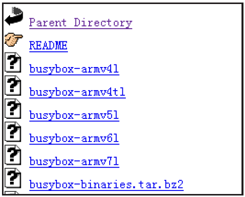
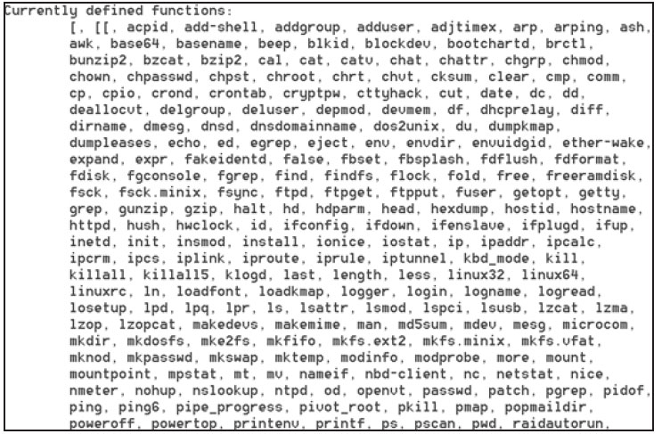

# 1.2.3 BusyBox的使用


BusyBox，号称Linux平台上的“瑞士军刀”​，它提供了很多常用的工具，例如grep、find等。这些工具在标准Linux上都有，但Android系统却去掉了其中的大多数工具。这导致了我们在调试程序、研究Android系统时步履维艰，所以需要在手机上安装BusyBox。

1.下载BusyBox可从网站hp://www.busybox.net/downloads/binaries/1.21.1/下载已编译好的BusyBox，如图1-10所示。



图1-10BusyBox下载注意，该网站已经根据不同平台编译好对应的BusyBox，可根据自己手机的情况下载对应的文件。笔者下载了支持GalaxyNote2的busybox-armv7l。

提升：armv7表示ARM指令集为v7，目前ARMCortex-A8/A9系列的CPU支持该指令集。

2.安装和使用BusyBox下载完BusyBox后，需使用adbpush命令将它安装到手机上。如：

```
adb push busybox /system/xbin        #为了避免冲突，笔者push到了/system/xbin目录下
cd /system/xbin                      #进入对应目录
chmod 755 busybox                    #更改busybox权限为可执行
busybox –-install .                  #安装busybox
grep               #执行busybox提供的grep命令，或者busybox xxx执行xxx命令也行
```

BusyBox安装完，如果执行busybox命令，就会打印如图1-11所示的输出。



图1-11BusyBox提供的工具从上图中可看出，BusyBox提供了不少的工具，这样，我们在研究Android系统时就如虎添翼了。

提示本书共享资源中提供了busybox-armv7l的下载。
