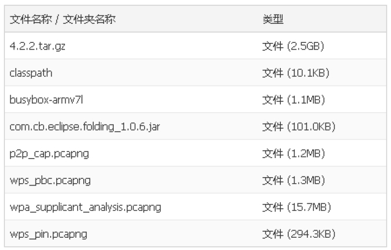

# 1.3 本书资源下载说明

为了减轻国内读者无法从Android官网下载源码的烦恼，笔者在115网盘上分享了本书所使用的Android源码及其他一些资源，如图1-12所示。

图1-12本书资源图1-12中所示：

❑4.2.2.tar.gz为4.2.2源码压缩包。请读者特别注意，本书对wpa_supplicant的分析使用的是Android4.1源码中的wpa_supplicant，故笔者在external目录中将4.1版本中的wpa_supplicant代码复制到wpa_supplicant_8_4.1中。

❑classpath为AndroidJava配置文件，使用时请将它改名为".classpath"。

❑busybox-armv7l是BusyBox。

❑com.cb.eclipse.folding_1.0.6.jar是一个Eclipse的插件，名叫CoeeByteJava，它可以折叠代码段以方便阅读。

最后四个文件为笔者研究Wi-Fi时，利用Wi-Fi数据截获工具AirPcap保存的相关协议数据包，其中p2p_cap为测试P2P时保存的数据包，wps_pbc和wps_pin为测试WSCPBC和PIN时保存的数据包，wpa_supplicant_analysis为测试STA加入AP时所保存的数据包。没有AirPcap工具的读者可通过Wireshark工具直接导入这些数据以更直观的方式来分析Wi-Fi。该资源的下载地址是hp://115.com/lb/5lbdugrdt4r。另外，请读者务必关注笔者的博客blog.csdn.net/innost以获取更新信息。
