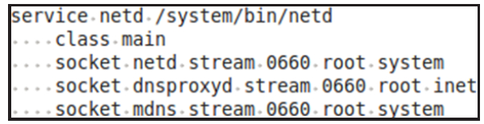

# 2.2 Netd工作流程


Netd进程由init进程根据init.rc的对应配置项而启动，其配置项如图2-1所示。

由图2-1可知，Netd启动时将创建三个TCP监听socket，其名称分别为netd、dnsproxyd和mdns。



图2-1Netd启动配置参数根据本章后续分析，读者将会看到以下内容。

❑Framework层中的NetworkManagementService和Nsd-Service将分别和netd及mdns监听socket建立链接并交互。

❑每一个调用和域名解析相关的socketAPI（如getaddrinfo或gethostbyname等）的进程都会借由dnsproxyd监听socket与netd建立链接。

下面开始分析Netd进程。

```
int main() {
    CommandListener *cl;
    NetlinkManager *nm;
    DnsProxyListener *dpl;
    MDnsSdListener *mdnsl;
    ALOGI("Netd 1.0 starting");
    // 为Netd进程屏蔽SIGPIPE信号
    blockSigpipe();
    // ①创建NetlinkManager
    nm = NetlinkManager::Instance();
    // ②创建CommandListener，它将创建名为"netd"的监听socket
    cl = new CommandListener();
    // 设置NetlinkManager的消息发送者（Broadcaster）为CommandListener。
    nm-＞setBroadcaster((SocketListener *) cl);
    // 启动NetlinkManager
    nm-＞start();
    ......
    // 注意下面这行代码，它为本Netd设置环境变量ANDROID_DNS_MODE为"local"，其作用将在2.2.4节介绍
    setenv("ANDROID_DNS_MODE", "local", 1);
    // ③创建DnsProxyListener，它将创建名为"dnsproxyd"的监听socket
    dpl = new DnsProxyListener();
    dpl-＞startListener();
    // ④创建MDnsSdListener并启动监听，它将创建名为"mdns"的监听socket
    mdnsl = new MDnsSdListener();
    mdnsl-＞startListener();
    cl-＞startListener();
    while(1) {
        sleep(1000);
    }
    exit(0);
}
```
