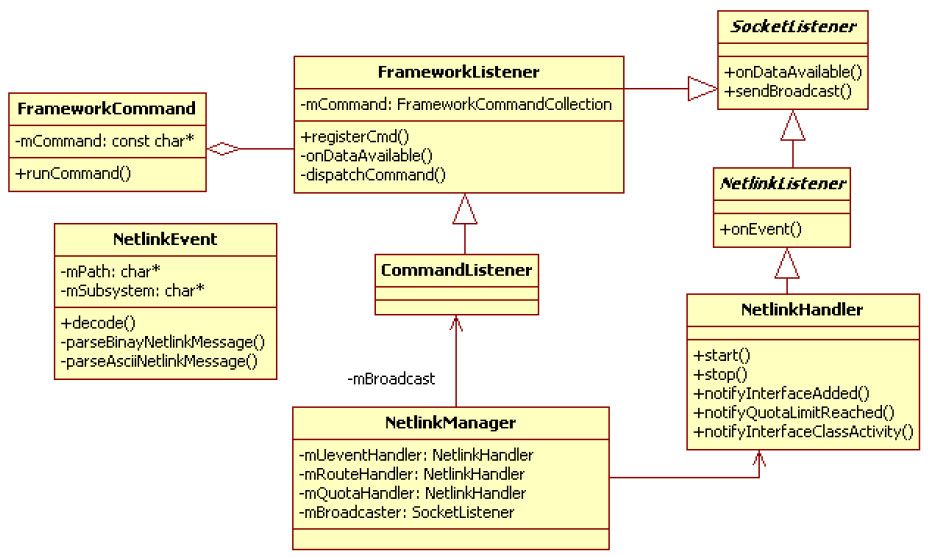
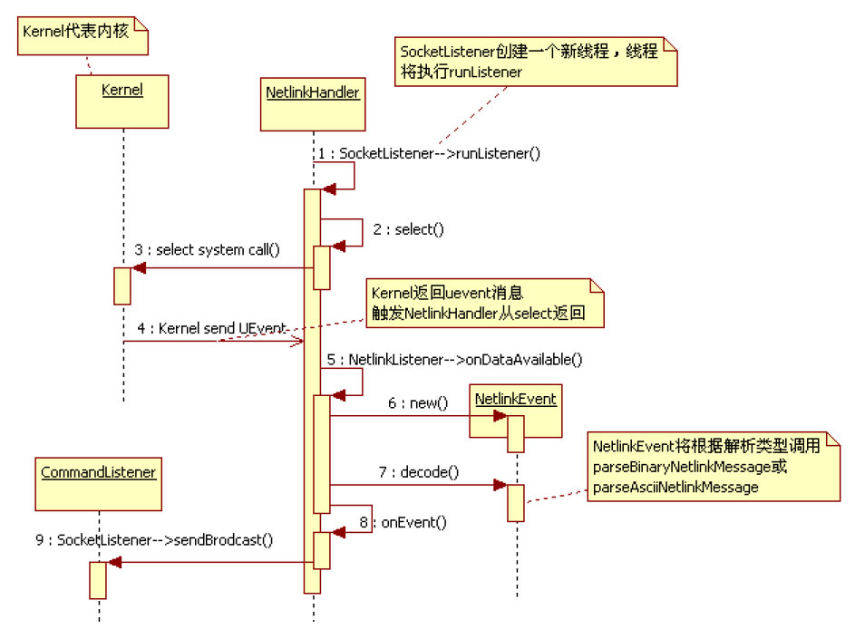

# 2.2.2 NetlinkManager分析


NetlinkManager（以后简称NM）主要负责接收并解析来自Kernel的UEvent消息。其核心代码在start函数中，如下所示。

[--＞NetlinkManager.cpp：​：start]NM的start函数主要是向Kernel注册三个用于接收UEvent事件的socket，这三个[1]​[2]UEvent分别对应于以下内容。

❑NETLINK_KOBJECT_UEVENT：代表kobject事件，由于这些事件包含的信息由ASCII字符串表达，故上述代码中使用了NETLINK_FOMRAT_ASCII。它表示将采用字符串解析的方法去解析接收到的UEvent消息。kobject一般用来通知内核中某个模块的加载或卸载。对于NM来说，其关注的是/sys/class/net下相应模块的加载或卸载消息。

❑NETLINK_ROUTE：代表Kernel中routing或link改变时对应的消息。NETLINK_ROUTE包含很多子项，上述代码中使用了RTMGRP_LINK项。二者结合起来使用，表示NM希望收到网络链路断开或接通时对应的UEvent消息（笔者在UbuntuPC上测试过，当网卡上拔掉或插入网线时，会触发这些UEvent消息的发送）​。由于对应UEvent消息内部封装了nlmsghdr等相关结构体，故上述代码使用了NETLINK_FORMAT_BINARY来指示解析UEvent消息时将使用二进制的解析方法。

❑NETLINK_NFLOG：和2.3.6节介绍的带宽控制有关。Netd中的带宽控制可以设置一个预警值，当网络数据超过一定字节数就会触发Kernel发送一个警告。该功能属于iptables的扩展项，但由于iptables的文档更新速度较慢（这也是很多开源项目的一大弊端）​，笔者一直未能找到相关的正式说明。值得指出的是，上述代码中有关NETLINK_NFLOG相关socket的设置并非所有Kernel版本都支持。

同时，NFLOG_QUOTA_GROUP的值是直接定义在NetlinkManager.cpp中的，而非和其他类似系统定义一样定义在系统头文件中，这也表明NFLOG_QUOTA_GROUP的功能比较新。

提示读者可通过在Linux终端中执行manPF_LINK得到有关NETLINK的详细说明。

上述start函数将调用setupSocket创建用于接收UEvent消息的socket以及一个解析对象NetlinkHandler。setupSocket代码本身比较简单，此处就不展开分析。

下面来看NM及其家族成员，它们之间的关系如图2-2所示。



图2-2NM家族成员由图2-2可知：

❑NetlinkHandler和CommandListener均间接从SocketListener派生。其中，NetlinkHandler收到的socket消息将通过onEvent回调处理。

❑结合前文所述，NetlinkManager分别注册了三个用于接收UEvent的socket，其对应的NetlinkHandler分别是mUeventHandler、mRouteHandler和mQuotaHandler。

❑NetlinkHandler接收到的UEvent消息会转换成一个NetlinkEvent对象。NetlinkEvent对象封装了对UEvent消息的解析方法。对于NETLINK_FOMRAT_ASCII类型，其parseAscNetlinkMessage函数会被调用，而对于NETLINK_FORMAT_BINARY类型，其parseBinaryNetlinkMessage函数会被调用。

❑NM处理流程的输入为一个解析后的NetlinkEvent对象。NM完成相应工作后，其处理结果将经由mBroadcaster对象传递给

```
void NetlinkHandler::onEvent(NetlinkEvent *evt) {
    const char *subsys = evt-＞getSubsystem();
    ......
    // 处理对应NETLINK_KOBJECT_UEVENT和NETLINK_ROUTE的信息
    if (!strcmp(subsys, "net")) {
        int action = evt-＞getAction();
        const char *iface = evt-＞findParam("INTERFACE");        // 查找消息中携带的网络设备名
        if (action == evt-＞NlActionAdd) {
            notifyInterfaceAdded(iface);// 添加NIC（Network Interface Card）的消息
        } else if (action == evt-＞NlActionRemove) {
            notifyInterfaceRemoved(iface);              // NIC被移除的消息
        } else if (action == evt-＞NlActionChange) {
            evt-＞dump();
            notifyInterfaceChanged("nana", true);       // NIC变化消息
        } else if (action == evt-＞NlActionLinkUp) {// 下面两个消息来自NETLINK_ROUTE
            notifyInterfaceLinkChanged(iface, true);    // 链路启用（类似插网线）
        } else if (action == evt-＞NlActionLinkDown) {
            notifyInterfaceLinkChanged(iface, false);   // 链路断开（类似拔网线）
        }
    } else if (!strcmp(subsys, "qlog")) {               // 对应NETLINK_NFLOG
        const char *alertName = evt-＞findParam("ALERT_NAME");
        const char *iface = evt-＞findParam("INTERFACE");
        notifyQuotaLimitReached(alertName, iface);// 当数据量超过预警值，则会收到该通知
    } else if (!strcmp(subsys, "xt_idletimer")) {
        // 这和后文的idletimer有关，用于跟踪某个NIC的工作状态，即"idle"或"active"
        // 检测时间按秒计算
        int action = evt-＞getAction();
        const char *label = evt-＞findParam("LABEL");
        const char *state = evt-＞findParam("STATE");
        if (label == NULL) {
            label = evt-＞findParam("INTERFACE");
        }
        if (state)
            notifyInterfaceClassActivity(label, !strcmp("active", state));
    }
    ......
}
```

Framework层的接收者，也就是NetworkManagementService。

❑CommandListener从FrameworkListener派生，而FrameworkListener内部有一个数组mCommands，用来存储注册到FrameworkListener中的命令处理对象。

下面简单了解NetlinkHandler的onEvent函数，由于其内部已针对不同属性的NetlinkEvent进行了分类处理，故浏览这段代码能对前文所述不同UEvent消息的作用加深理解。

[--＞NetlinkHandler.cpp：​：onEvent]由上边代码可知，NETLINK_KOBJECT_UEVENT和NETLINK_ROUTE主要反映网络设备的事件和状态，包括NIC的添加、删除和修改，以及链路的连接状态等。NETLINK_NFLOG用于反映设置的log是否超过配额。另外，上边代码中还处理了xt_idletimer的uevent消息，它和后文介绍的IdleTimerCmd有关，主要用来监视网络设备的收发工作状态。当对应设备工作或空闲时间超过设置的监控时间后，Kernel将会发送携带其状态（idle或active）的UEvent消息。

图2-3所示为NetlinkHandler的工作流程。



图2-3NM工作流程由图2-3可知，NM创建NetlinkHandler后，工作便转交给NetlinkHandler来完成，而每个NetlinkHandler对象均会单独创建一个线程用于接收socket消息。当Kernel发送UEvent消息后，NetlinkHandler便从select调用中返回，然后调用其onDataAvailable函数，该函数内部会创建一个NetlinkEvent对象。NetlinkEvent对象根据socket创建时指定的解析类型去解析来自Kernel的UEvent消息。最终NetlinkHandler的onEvent将被调用，不同的UEvent消息将在此函数中进行分类处理。NetlinkHandler最终将处理结果经由NM内部变量mBroadcaster转发给NetworkManagementService。

提醒请读者结合上文所述流程自行研读相关代码。
