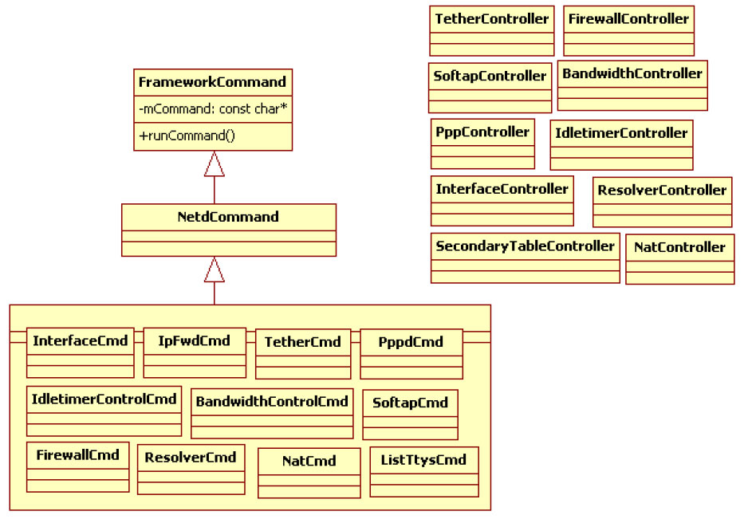
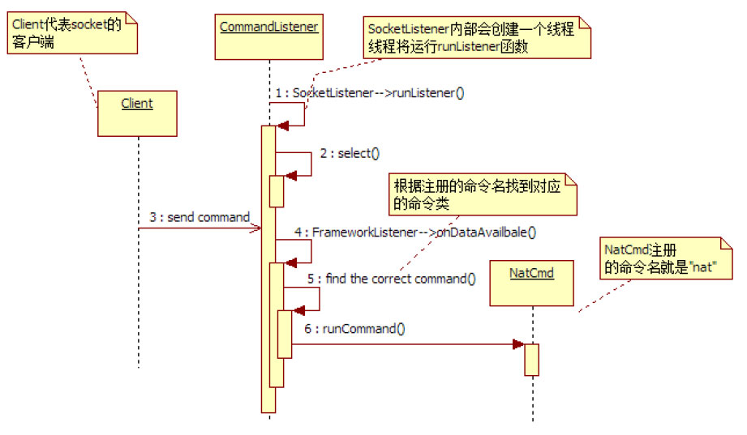

# 2.2.3 CommandListener分析


Netd中第二个重要成员是CommandListener（以后简称CL）​，其主要作用是接收来自Framework层NetworkManageService的命令。从角色来看，CL仅是一个Listener。它在收到命令后，只是将它们转交给对应的命令处理对象去处理。CL内部定义了许多命令，而这些命令都有较深的背景知识。本节以分析CL的工作流程为主，而相关的命令处理则放到后文分析。

图2-4所示为CL中的Command对象及对应的Controer对象。



图2-4CL中的命令及控制类由图2-4可知，CL定义了11个和网络相关的Command类。这些类均从NetdCommand派生（注意，为保持绘图简洁，这11个Command的派生关系由1个派生箭头表

```
CommandListener::CommandListener() :
                 FrameworkListener("netd", true) {
    registerCmd(new InterfaceCmd()); // 注册11个命令类对象
    registerCmd(new IpFwdCmd());
    registerCmd(new TetherCmd());
    registerCmd(new NatCmd());
    registerCmd(new ListTtysCmd());
    registerCmd(new PppdCmd());
    registerCmd(new SoftapCmd());
    registerCmd(new BandwidthControlCmd());
    registerCmd(new IdletimerControlCmd());
    registerCmd(new ResolverCmd());
    registerCmd(new FirewallCmd());
    // 创建对应的控制类对象
    if (!sSecondaryTableCtrl)
        sSecondaryTableCtrl = new SecondaryTableController();
    if (!sTetherCtrl)
        sTetherCtrl = new TetherController();
    if (!sNatCtrl)
        sNatCtrl = new NatController(sSecondaryTableCtrl);
    if (!sPppCtrl)
        sPppCtrl = new PppController();
    if (!sSoftapCtrl)
        sSoftapCtrl = new SoftapController();
    if (!sBandwidthCtrl)
        sBandwidthCtrl = new BandwidthController();
    if (!sIdletimerCtrl)
        sIdletimerCtrl = new IdletimerController();
    if (!sResolverCtrl)
        sResolverCtrl = new ResolverController();
    if (!sFirewallCtrl)
        sFirewallCtrl = new FirewallController();
    if (!sInterfaceCtrl)
        sInterfaceCtrl = new InterfaceController();
    // 其他重要工作，后文再分析
}
```

达）​。CL还定义了10个控制类，这些控制类将和命令类共同完成相应的命令处理工作。

结合图2-2中对NM家族成员的介绍，CL创建时，需要注册自己支持的命令类。这部分代码在其构造函数中实现，代码如下所示。

[--＞CommandListener：​：

CommandListener构造函数]由于CL的间接基类也是SocketListener，所以其工作流程和NetlinkHandler类似。图2-5给出了CL的工作流程。



图2-5CL的工作流程图2-5中，假设Client端发送的命令名是"nat"，当CL收到这个命令后，首先会从其构造函数中注册的那些命令对象中找到对应该名字（即nat）的命令对象，其结果就是图中的NatCmd对象。而该命令最终的处理工作将由此NatCmd对象的runCommand函数完成。
