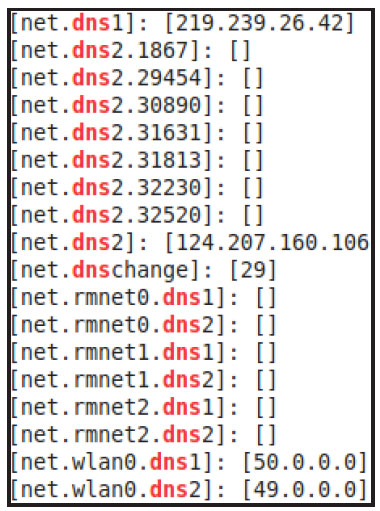
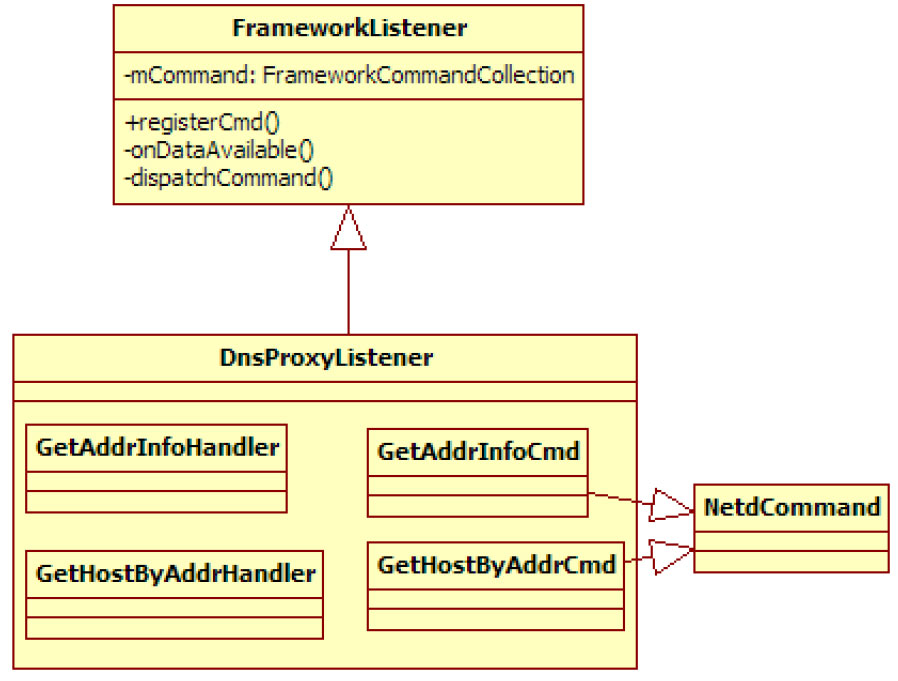
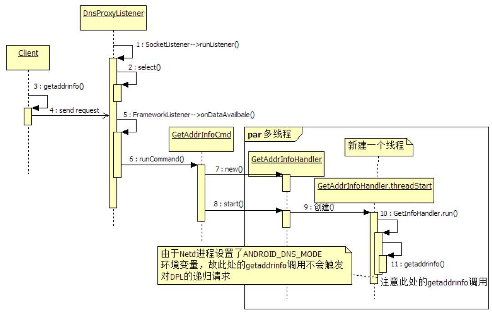

# 2.2.4 DnsProxyListener分析


DnsProxyListener和Android系统中的DNS管理有关。什么是DNS呢？Android系统中DNS又有什么特点呢？来看下文。

[3]1.AndroidDNS简介DNS（DomainNameSystem，域名系统）

主要作用是在域名和IP地址之间建立一种映射。简单来说，DNS的功能类似于电话簿，它可将人名映射到相应的电话号码。在DNS中，人名就是域名，电话号码就是IP地址。域名系统的管理由DNS服务器来完成。全球范围内的DNS服务器共同构成了一个分布式的域名-IP数据库。

对使用域名来发起网络操作的网络程序来说，其域名解析工作主要分两步。

1）将域名转换成IP。由于域名和IP的转换关系存储在DNS服务器上，所以该网络程序要向DNS服务器发起请求，以获取域名对应的IP地址。

2）DNS服务器根据DNS解析规则解析并得到该域名对应的IP地址，然后返回给客户端。在DNS中，每一个域名和IP的对应关系称为一条记录。客户端一般会缓存这条记录以备后续之用。

提醒DNS解析规则比较复杂，感兴趣的读者可研究DNS的相关协议。

对软件开发者来说，常用的域名解析socketAPI有两个。

❑getaddrinfo：根据指定的host名或service名得到对应的IP地址（由结构体addrinfo表达）​。

❑getnameinfo：根据指定的IP地址（由结构体sockaddr表达）得到对应的host或service的名称。

Android中，这两个函数均由BionicC实现。

其代码实现基于NetBSD的解析库（resolverlibrary）​，并经过一些修改。这些修改如下。

❑没有实现name-server-switch功能。这是为了保持BionicC库的轻便性而做的裁剪。

❑DNS服务器的配置文件由/etc/resolv.conf变成/system/etc/resolv.conf。在Android系统中，/etc目录实际上为/system/etc目录的链接。resolv.conf存储的是DNS服务器的IP地址。

❑系统属性中保存了一些DNS服务器的地址，它们通过诸如"net.dns1"或"net.dns2"之类的属性来表达。这些属性由dhcpd进程或其他系统模块负责维护。

❑每个进程还可以设置进程特定的DNS服务器地址，它们通过诸如"net.dns1.＜pid＞"或"net.dns2.＜pid＞"的系统属性来表达。

❑不同的网络设备也有对应的DNS服务器地址，例如通过wlan接口发起的网络操作，其对应的DNS服务器由系统属性"net.wlan.dns1"表示。

图2-6所示为三星GalaxyNote2中有关dns的信息。由图可知，系统中有些进程有自己特定的DNS服务器。不同网络设备也设置了对应的DNS服务器地址。



图2-6net.dns设置2.getaddrinfo函数分析本节介绍Android中getaddrinfo的实现，我们将只关注Android对其做的改动。

[--＞getaddrinfo.c：​：getaddrinfo]

```c
int  getaddrinfo(const char *hostname, const char *servname,
    const struct addrinfo *hints, struct addrinfo **res)
{
      ......// getaddrinfo的正常处理
    // Android平台的特殊定制
    if (android_getaddrinfo_proxy(hostname, servname, hints, res) == 0) {
        return 0;
    }
    ......// 如果上述函数处理失败，则继续getaddrinfo的正常处理
    return error
}
```

由上述代码可知，Android平台中的getaddrinfo会调用其定制的android_getaddrinfo_proxy函数完成一些特殊操作，该函数的实现如下所示。

```java
static int android_getaddrinfo_proxy(const char *hostname, const char *servname,
            const struct addrinfo *hints, struct addrinfo **res)
{
    ......
    // 取ANDROID_DNS_MODE环境变量。只有Netd进程设置了它
    const char* cache_mode = getenv("ANDROID_DNS_MODE");
    ......
    // 由于Netd进程设置了此环境变量，故Netd进程调用getaddrinfo将不会采用这套定制的方法
    if (cache_mode != NULL && strcmp(cache_mode, "local") == 0) {
        return -1;
    }
    // 获取本进程对应的DNS地址
    snprintf(propname, sizeof(propname), "net.dns1.%d", getpid());
    if (__system_property_get(propname, propvalue) ＞ 0) {
        return -1;
    }
    // 建立和Netd中DnsProxyListener的连接，将请求转发给它去执行
    sock = socket(AF_UNIX, SOCK_STREAM, 0);
    if (sock ＜ 0) {
        return -1;
    }
    ......
    strlcpy(proxy_addr.sun_path, "/dev/socket/dnsproxyd",
          sizeof(proxy_addr.sun_path));
    ......// 发送请求，处理回复等
    return -1;
}
```

[--＞getaddrinfo.c：​：

android_getaddrinfo_proxy]由上述代码可知：

❑当Netd进程调用getaddrinfo时，由于其设置了ANDROID_DNS_MODE环境变量，所以该函数会继续原来的流程。

❑当非Netd进程调用getaddrinfo函数时，首先会开展android_getaddrinfo_proxy中的工作，即判断该进程是否有定制的DNS服务器，如果没有它将和位于Netd进程中的dnsproxyd监听socket建立连接，然后把请求发给DnsProxyListener去执行。

3.DnsProxyListener命令下面介绍DnsProxyListener（以后简称DPL）​，图2-7所示为其家族成员示意图。



图2-7DPL家族成员由图2-7可知，DPL仅定义了两个命令。

❑GetAddrInfoCmd：和BionicC库的getaddrinfo函数对应。

❑GetHostByAddrCmd：和BionicC库的gethostbyaddr函数对应。

这个两条命令的处理比较简单，此处不展开详细的代码。为方便读者理解，我们将给出调用序列图，如图2-8所示。

如图2-8所示，GetAddrInfoHandler最终的处理还是交由BionicC的getaddrinfo函数来完成。根据前文所述，由于Netd进程设置了ANDROID_DNS_MODE环境变量，故Netd调用的getaddrinfo将走正常的流程。这个正常流程就是Netd进程将向指定的DNS服务器发起请求以解析域名。

Android系统中，通过这种方式来管理DNS的好处是，所有解析后得到的DNS记录都将缓存在Netd进程中，从而使这些信息成为一个公共的资源，最大程度做到信息共享。



图2-8GetAddrInfoCmd处理流程
