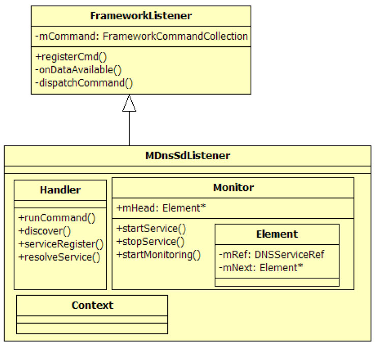

# 2.2.5 MDnsSdListener分析


MDnsSd是MulticastDNSServiceDiscovery的简称，它和Apple公司的Bonjour技术有关，故本节将先介绍AppleBonjour技术。

[4]​[5]​[6]1.AppleBonjour技术Bonjour是法语中的Heo之意。它是Apple公司为基于组播域名服务（multicastDNS）

的开放性零配置网络标准所起的名字。使用Bonjour的设备在网络中自动组播它们自己的服务信息并监听其他设备的服务信息，设备之间就像在打招呼，这也是该技术命名为Bonjour的原因。Bonjour使得局域网中的系统和服务即使在没有网络管理员的情况下也很容易被找到。

举一个简单的例子，在局域网中，如果要进行打印服务，就必须先知道打印服务器的IP地址。此IP地址一般由IT部门的人负责分配，然后还得全员发邮件以公示此地址。有了Bonjour以后，打印服务器自己会依据零配置网络标准在局域网内部找到一个可用的IP并注册一个打印服务，例如"printservice"。当客户端需要打印服务时，会先搜索网络内部的打印服务器。由于不知道打印服务器的IP地址，客户端只能根据诸如"printservice"的名字去查找打印机。在Bonjour的帮助下，客户端最终能找到这台注册了"printservice"名字的打印机，并获得它的IP地址以及端口号。

从Bonjour角度来看，该技术主要解决了三个问题。

❑Addressing：即为主机分配IP。Bonjour的Addressing处理比较简单，即每个主机在网络内部的地址可选范围内找一个IP，然后查看下网络内部是否有其他主机再用。如果该IP没有被分配的话，它将使用此IP。

❑Naming：Naming解决的是host和IP地址的对应关系。Bonjour采用的是MultipleDNS技术，即DNS查询消息将通过UDP组播方式发送。一旦网络内部某个机器发现查询的机器名和自己设置的一样，就回复这条请求。

此外，Bonjour还拓展了MDNS的用途，即除了能查找host外，还支持对service的查找。

不过，Bonjour的Naming有一个限制，即网络内部不能有重名的host或service。

❑ServiceDiscovery：SD基于Naming工作，它使得应用程序能查找到网络内部的服务，并解析该服务对应的IP地址和端口号。应用程序一旦得到服务的IP地址和端口号，就可以直接和该服务建立交互关系。

Bonjour技术在MacOS以及iTunes、iPhone上都得到了广泛应用。为了进一步推广，Apple通过开源工程mdnsresponder将其发布。在Windows平台上，它将生成一个后台程序mdnsresponder。在Android平台上（或者说支持POSIX的Linux平台）它是一个名为mdnsd的程序。不过，不论是mdnsresponder还是mdnsd，应用开发者要做的仅仅是利用Bonjour的API向它们发起服务注册、服务查询和服务解析等请求并接收来自它们的处理结果。

下面介绍BonjourAPI中使用最多的三个函数，它们分别用来服务注册、服务查询和服务解析。理解这三个函数的功能也是理解MDnsSdListener的基础。

使用BonjourAPI必须包含如下的头文件和动态库，并连接到：

```
#include ＜dns_sd.h＞                          // 必须包含此头文件
libmdnssd.so                                    // 链接到此so
```

Bonjour中，服务注册的API为

```
DNSServiceErrorType DNSSD_API DNSServiceRegister
(
    DNSServiceRef               *sdRef,
    DNSServiceFlags             flags,
    uint32_t                    interfaceIndex,
    const char                  *name,            /* may be NULL */
    const char                  *regtype,
    const char                  *domain,          /* may be NULL */
    const char                  *host,            /* may be NULL */
    uint16_t                    port,             /* In network byte order */
    uint16_t                    txtLen,
    const void                  *txtRecord,       /* may be NULL */
    DNSServiceRegisterReply     callBack,         /* may be NULL */
    void                        *context          /* may be NULL */
);
```

DNSServiceRegister，原型如下。

该函数的解释如下。

❑sdRef代表一个未初始化的DNSService实体，其类型DNSServiceRef是指针。该参数最终由DNSServiceRegister函数分配内存并初始化。

❑flags表示当网络内部有重名服务时的冲突处理。默认是按顺序修改服务名。例如要注册的服务名为"printer"，当检测到重名冲突时，就可改名为"printer（1）"。

❑interfaceIndex表示该服务输出到主机的哪些网络接口上。值-1表示仅对本机支持，也就是该服务的用在loop接口上。

❑name表示服务名，如果为空就取机器名。

❑regtype表示服务类型，用字符串表达。

Bonjour要求格式为“_服务名._传输协议”​，例如"_ftp._tcp"。目前传输协议仅支持TCP和UDP。

❑domian和host一般都为空。

❑port表示该服务的端口。如果为0，Bonjour会自动分配一个。

❑txtLen以及txtRecord字符串用来描述该服务。一般都设置为空。

❑caBack表示设置回调函数。该服务注册的请求结果都会通过它回调给客户端。

❑context表示上下文指针，由应用程序设置。

当客户端需要搜索网络内部特定服务时，需要使用DNSServiceBrowserAPI，其原型如下。

```
DNSServiceErrorType DNSSD_API DNSServiceBrowse
(
    DNSServiceRef               *sdRef,
    DNSServiceFlags             flags,
    uint32_t                    interfaceIndex,
    const char                  *regtype,
    const char                  *domain,         /* may be NULL */
    DNSServiceBrowseReply       callBack,
    void                        *context         /* may be NULL */
);
```

其中，sdref、interfaceIndex、regtype、domain以及context含义与DNSServiceRegister一样。flags在本函数中

```
DNSServiceErrorType DNSSD_API DNSServiceResolve
(
    DNSServiceRef               *sdRef,
    DNSServiceFlags             flags,
    uint32_t                    interfaceIndex,
    const char                  *name,
    const char                  *regtype,
    const char                  *domain,
    DNSServiceResolveReply      callBack,
    void                        *context        /* may be NULL */
);
```

没有作用。caBack为DNSServiceBrowser处理结果的回调通知接口。

其中，name、regtype和domain都从DNSServiceBrowse函数的处理结果中获得。

当客户端想获得指定服务的IP和端口号时，需caBack用于通知DNSServiceResolve的处理要使用DNSServiceResolveAPI，其原型如结果。该回调函数将返回服务的IP地址和端口下。

号。

2.MDnsSdListener详解MDnsSdListener对应的Framework层服务为NsdService（Nsd为NetworkServiceDiscovery的缩写）​，它是Android4.1新增的一个Framework层Service。该服务的实现比较简单，故本书不详细讨论。感兴趣的读者不妨首先阅读SDK中关于NsdService的相关文档。

提示SDK中有一个基于Nsd技术开发的NsdChat例程，读者也可先学习它的实现。相关文档位置为hp://developer.android.com/training/connect-devices-wirelessly/nsd.html。

图2-9所示为MDnsSdListener家族成员示意图。



图2-9MDnsSdListener家族成员由图2-9可知：

❑MDnsSdListener的内部类Monitor用于和mdnsd后台进程通信，它将调用前面提到的BonjourAPI。

❑Monitor内部针对每个DNSService都会建立一个Element对象，该对象通过Monitor的mHead指针保存在一个list中。

❑Handler是MDnsSdListener注册的Command。

下面简单介绍MDnsSdListener的运行过程，主要工作可分成三步。

1）Netd创建MDnsSdListener对象，其内部会创建Monitor对象，而Monitor对象将启动一个线程用于和mdnsd通信，并接收来自Handler的请求。

2）NsdService启动完毕后将向MDnsSdListener发送"start-service"命令。

```
MDnsSdListener::Monitor::Monitor() {
    mHead = NULL;
    pthread_mutex_init(&mHeadMutex, NULL);
    // 创建两个socket，用于接收MDnsSdListener对象的指令
    socketpair(AF_LOCAL, SOCK_STREAM, 0, mCtrlSocketPair);
    // 创建线程，线程函数是threadStart，其内部会调用run
    pthread_create(&mThread, NULL, MDnsSdListener::Monitor::threadStart, this);
}
```

```
int MDnsSdListener::Monitor::startService() {
    int result = 0;
    char property_value[PROPERTY_VALUE_MAX];
    pthread_mutex_lock(&mHeadMutex);
    /*
    MDNS_SERVICE_STATUS是一个字符串，值为"init.svc.mdnsd"，在init.rc配置文件中，mdnsd是一个
    service，而"init.svc.mdnsd"将记录mdnsd进程的运行状态。
    */
    property_get(MDNS_SERVICE_STATUS, property_value, "");
    if (strcmp("running", property_value) != 0) {
         // 如果mdnsd的状态不为"running"，则通过设置"ctl.start"命令启动mdnsd
          property_set("ctl.start", MDNS_SERVICE_NAME);
        // 如果mdnsd成功启动，则属性值变成"running"
        wait_for_property(MDNS_SERVICE_STATUS, "running", 5);
        result = -1;
    } else {
        result = 0;
    }
    pthread_mutex_unlock(&mHeadMutex);
    return result;
}
```

3）NsdService响应应用程序的请求，向MDnsSdListener发送其他命令，例如"discovery"等。Monitor将最终处理这些Monitor的threadStart线程将调用其run函请求。

数，该函数通过po方式侦听包括先来看第一步，当MDnsSdListener构造时，mCtrlSocketPair在内的socket信息。这部分会创建一个Monitor对象，代码如下所示。

代码属于基本的Linuxsocket编程，本书不开展深入讨论。

[--＞MDnsSdListener.cpp：​：Monitor：

Monitor]当NsdService发送"start-service"命令后，Handler的runCommand将执行Monitor的startService函数，代码如下所示。

[--＞MDnsSdListener.cpp：​：Monitor：

startService]

```cpp
void MDnsSdListener::Handler::serviceRegister(SocketClient *cli, int requestId,
        const char *interfaceName, const char *serviceName, const char *serviceType,
        const char *domain, const char *host, int port, int txtLen, void *txtRecord) {
    Context *context = new Context(requestId, mListener);
    DNSServiceRef *ref = mMonitor-＞allocateServiceRef(requestId, context);
    port = htons(port);
    ......
    DNSServiceFlags nativeFlags = 0;
    int interfaceInt = ifaceNameToI(interfaceName);
  // 调用Bonjour API DNSServiceRegister，并注册回调函数MDnsSdListenerRegisterCallback
    DNSServiceErrorType result = DNSServiceRegister(ref, interfaceInt,
              nativeFlags, serviceName, serviceType, domain, host, port,
               txtLen, txtRecord, &MDnsSdListenerRegisterCallback, context);
    if (result != kDNSServiceErr_NoError) {
        ......// 错误处理
    }
    // 通知Monitor对象进行rescan，请读者自行研究该函数
    mMonitor-＞startMonitoring(requestId);
    cli-＞sendMsg(ResponseCode::CommandOkay, "serviceRegister started", false);
    return;
}
```

startService的实现比较有趣，充分利用了init的属性控制以启动mdnsd进程。

当NsdService发送注册服务请求时，Handler的serviceRegister函数将被调用，代码如下所示。

[--＞MDnsSdListener.cpp：​：Handler：

serviceRegister]

```cpp
void MDnsSdListenerRegisterCallback(DNSServiceRef sdRef, DNSServiceFlags flags,
       DNSServiceErrorType errorCode, const char *serviceName, const char *regType,
       const char *domain, void *inContext) {
    MDnsSdListener::Context *context =
                einterpret_cast＜MDnsSdListener::Context *＞(inContext);
    char *msg;
    int refNumber = context-＞mRefNumber;
    if (errorCode != kDNSServiceErr_NoError) {
        ......// 错误处理
    } else {
        char *quotedServiceName = SocketClient::quoteArg(serviceName);
        asprintf(&msg, "%d %s", refNumber, quotedServiceName);
        free(quotedServiceName);
      // 将处理结果返回给NsdService
        context-＞mListener-＞sendBroadcast(ResponseCode::ServiceRegistrationSucceeded,
                                      msg,false);
    }
    free(msg);
}
```

DNSServiceRegister内部将把请求发送给mdnsd去处理，处理的结果通过MDnsSdListener-RegisterCaback返回，该函数代码如下所示。

[--＞MDnsSdListener.cpp：​：

MDnsSdListenerRegisterCaback]提示Netd的工作流程相关代码相对简单，处理流程也比较固定。

1）NM接收Kernel的UEvent消息，然后转发给Framework层的客户端。

2）CL、DPL以及MDnsSdListener接收来自客户端的请求并处理它们。

对Android中DNS的管理以及AppleBonjour技术感兴趣的读者不妨阅读章末列出的参考资料以加深理解。
