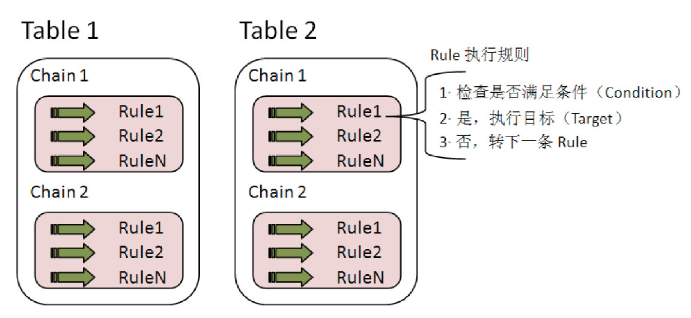
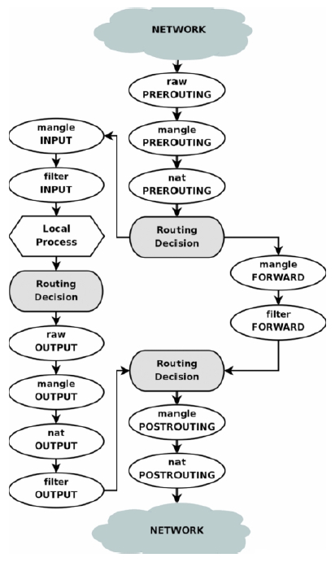
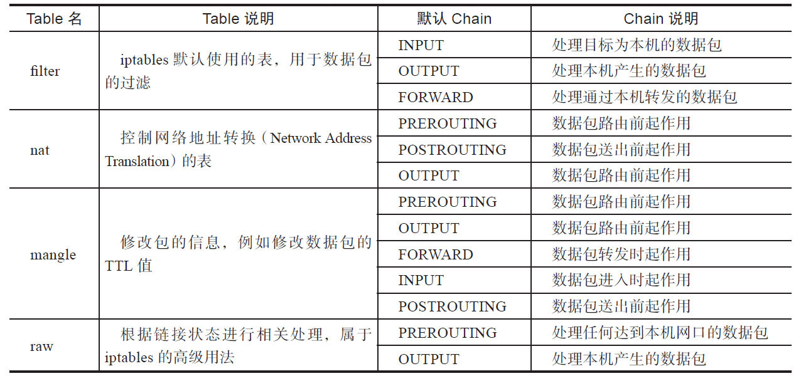
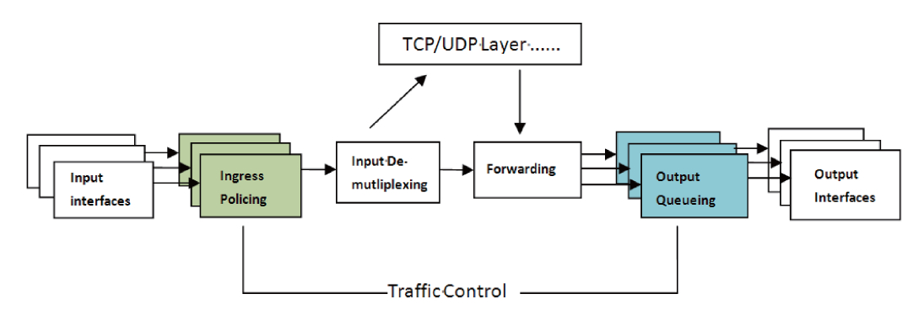
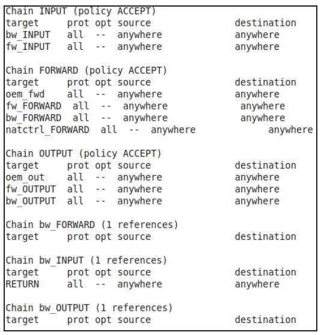
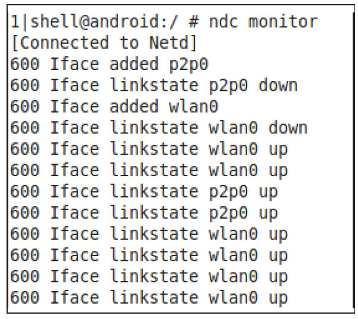

# 2.3.1 iptables、tc和ip命令


网络管理和控制一直是一项比较复杂和专业的工作，由于Linux系统中原本就有一些强大的网络管理工具，故Netd也毫不犹豫充分利用了它们。目前Netd中最依赖三个网络管控工具，即iptables、tc和ip。

[7]​[8]​[9]1.iptables命令iptables是Linux系统中最重要的网络管控工具。它与Kernel中的netfilter模块配合工作，其主要功能是为netfilter设置一些过滤（filter）或网络地址转换（NAT）的规则。

当Kernel收到网络数据包后，将会依据iptables设置的规则进行相应的操作。举个最简单的例子，可以利用iptables设置这样一条防火墙规则：丢弃来自IP地址为192.168.1.108的所有数据包。

（1）iptables原理iptables的语法比较复杂，但工作原理较易理解。清楚iptables的前提是理解它的表（Table）​、链（Chain）和规则（Rule）​。

三者关系如图2-10所示。



图2-10iptables三要素关系由图2-10可知：

❑iptables内部（其实是Kernel的netfilter模块）维护着四个Table，分别是filter、nat、mangle和raw，它们对应着不同的功能，稍后将详细介绍它们的作用。

❑Table中定义了Chain。一个Table可以支持多个Chain，Chain实际上是Rule的集合，每个Table都有默认的Chain。例如filter表默认的Chain有INPUT、OUTPUT、FORWARD。

用户可以自定义Chain，也可修改Chain中的Rule。稍后将介绍不同Table中默认Chain方面的知识。

❑Rule就是iptables工作的规则。首先，系统将检查要处理的数据包是否满足Rule设置的条件，如果满足则执行Rule中设置的目标（Target）​，否则继续执行Chain中的下一条Rule。

由前述内容可知，iptables中的Table和Chain是理解iptables工作的关键。表2-1总结了iptables中默认Table及Chain的相关内容。



表2-1iptables默认Table及Chain



由表2-1可知，有些Table的默认Chain具有相同的名字，导致我们理解起来有些困难。为此，读者必须结合图2-11所示的iptables数据包处理流程图来理解前述内容。由图可知，不同Table和Chain在此处理流程中起着不同的作用。

图2-11iptables数据包处理流程（2）iptablesTarget和常用参数iptables中的Rule有四个默认定义的Target，如下。

❑ACCEPT：接收数据包。

```
-t：指定table。如果不带此参数，则默认为filter表。
-A，--append chain rule-specification：在指定Chain的末尾添加一条Rule，rule-specification指明该Rule的内容。
-D，--delete chain rule-specification：删除指定Chain中满足rule-specification的那条Rule。
-I，--insert chain[rule num]rule-specification：为指定Chain插入一条Rule，位置由rule num指定。如果没有该参数，则默认加到Chain的头部。
-N：创建一条新Chain。
-L，--list：显示指定Table的Chain和Rule的信息。
```

```
-i：指定接收数据包的网卡名，如eth0、eth1等。
-o：指定发出数据包的网卡名。
-p：指定协议，如tcp、udp等。
-s，--source address[/mask]：指定数据包的源IP地址。
-j，--jump target：跳转到指定目标，如ACCEPT、DROP等。
```

❑DROP：直接丢弃数据包。没有任何信息会反馈给数据源端。

❑RETURN：返回到调用Chain，略过后续的Rule处理。

❑QUEUE：数据返回到用户空间去处理。

提示iptables的扩展Target还支持REJECT。相比DROP而言，REJECT会发送反馈信息给数据源端，如主机不可达之类R（uleic-msppe-chifiocsta-tiuonnre描ac述h该abRleu）le的的匹信配息条。件目以及目标动作，它也有一些参数来指明这些信前只有INPUT、OUTPUT、FORWARD以息。

及被这三个链调用的自定义链支持REJECT。

iptables有很多参数，此处先介绍一些常用参数。

以前文提到的设置防火墙为例，其对应的iptables设置参数如下。

```
iptables -t filter -A INPUT -s 192.168.1.108 -j DROP
```

如果仅拦截协议为tcp的数据包，则相应参数如下。

```
iptables -t filter -A INPUT -p tcp -s 192.168.1.108 -j DROP
```

另外，iptables仅支持IPv4，如果需针对IPv6进行相应设置，则要使用ip6tables工具。

提示iptables的用法非常灵活，如果没有长期的使用经验，将很难理解它们的真正作用。

[10]​[11]​[12]​[13]2.tc命令TC是TrafficControl的缩写。在Linux系统中，流量控制是通过建立数据包队列（Queue）​，并控制各个队列中数据包的发送方式来实现的。Linux流量控制的基本原理如图2-12所示，该图描述了Linux系统中网络数据的处理流程。



图2-12网络数据处理流程由图2-12可知：

❑接收包从输入接口（InputInterface）进来后，将经过输入流量限制（IngressPolicing）以丢弃不符合规定的数据包。而符合规定的数据包则交给输入多路选择器（InputDe-Multiplexing）进行判断选择。

❑输入多路选择器的选择结果是，如果数据包的目的是本机，将该包送给上层处理，否则需要将数据包交到转发块（ForwardingBlock）去处理。转发块同时也接收来自本机上层（TCP、UDP等）产生的包。

❑转发块通过查看路由表，决定处理包的下一跳目的地。然后，转发块对数据包进行排列整合以便将它们送到对应的输出接口（OutputInterface）​。

一般而言，我们只能限制本机网卡往外发送的数据包，而不能限制网卡接收的数据包。

Linux中的流量控制就是在数据包通过输出接口时，通过改变发送次序等方式来实现控制传输速率的。

提示也可通过IFB设备在输入接口进行流量控制。相关内容见2.3.3节。

在具体实现中，系统会建立许多队列及对应的队列规则（queuingdiscipline，简称qdisc）​。目前系统包括的qdisc分为两类。

无分类的队列规则（Classlessqdisc）：该规则对进入网卡的数据包不加区分，统一对待。使用这种规定的处理能够对数据包重新编排、延迟或丢弃。简而言之，这种类型是针对整个网卡的流量进行调整。常用的qdisc如下。

❑fifo（FirstInFirstOut，先进先出队列）​：最简单的控制。

❑SFQ（StochasticFairnessQueuing，随机公平队列）​：对发送会话进行重排，这样每个发送会话都可以公平地发送数据）​。

❑RED（RandomEarlyDetection，前向随机丢包）​：用于模拟流量接近带宽限制时丢包的情况。

❑TBF（TokenBucketFilter，令牌桶过滤器）​：可较好地使得流量减低到预设值。适合高带宽的环境。这类qdisc使用的流量控制手段主要是排序、限速和丢包。

分类的队列规定（Classfuqdisc）：它对进入网络设备的数据包根据不同的需求以分类的方式区分对待。数据包进入一个分类的队列后，它就需要被送到某一个类中进行分类处理。对数据包进行分类的工具是过滤器（filter）​。过滤器会返回一个决定，qdisc根据该决定把数据包送入相应的类进行排队。一个类可以包含多个子类，每个子类可再次使用它们的过滤器进行进一步的分类。当所有分类都处理完后，数据包才进入该类对应的队列排队。

简单言之，如果要利用tc进行流量控制，其主要工作将包含建立队列、建立分类和建立过滤器三个方面，一般的步骤如下。

1）针对网络物理设备（如以太网卡eth0）绑定一个队列QDisc；

2）在该队列上建立分类class；

3）为每一分类建立一个基于路由的过滤器filter；

4）最后与过滤器相配合，建立特定的路由表。

提示tc命令所涉及的流量控制方面的知识相当复杂，感兴趣的读者可根据章末列出的参考资料做进一步的深入研究。

[14]3.ip命令ip命令是Linux系统中另一个强大的网络管理工具，主要功能如下。

❑可替代ifconfig命令。即通过ip工具可管理系统中的网络接口，包括配置并查看网络接口情况、使能或禁止指定网络接口。

❑可替代route命令。即ip工具支持设置主机路由、网络路由、网关参数等。

❑可替代arp命令。即ip工具支持查看、修改和管理系统的ARP缓存等。

ip命令的语法为：

```
ip [OPTIONS] OBJECT [COMMAND [ARGUMENTS]]
```

例如为网络设备进行配置的ip命令语法如下：

```
ip addr [ add | del ] IFADDR dev STRING
//接口eth0赋予地址192.168.0.1，掩码是255.255.255.0（24代表掩码中1的个数）
//广播地址是192.168.0.255
ip addr add 192.168.0.1/24 broadcast 192.168.0.255 label eth0 dev eth0
```

提示本节对Linux系统中常用的三个网络管理工具iptables、tc和ip命令进行了一些简单介绍。其中，iptables用于管理数据包过滤、NAT等方面的工作。tc用于流量控制，其背后涉及的知识较为复杂。ip命令可替代ifconfig、route和arp等命令。ip命令的路

```
CommandListener::CommandListener() :
              FrameworkListener("netd", true) {
    ......// 创建命令和命令控制对象
    // 初始化iptables中的各个Table及相应Chain和Rules
    // createChildChains第一个参数用于指明针对IPv4还是IPv6
    createChildChains(V4V6, "filter", "INPUT", FILTER_INPUT);
    createChildChains(V4V6, "filter", "FORWARD", FILTER_FORWARD);
    createChildChains(V4V6, "filter", "OUTPUT", FILTER_OUTPUT);
    createChildChains(V4V6, "raw", "PREROUTING", RAW_PREROUTING);
    createChildChains(V4V6, "mangle", "POSTROUTING", MANGLE_POSTROUTING);
    createChildChains(V4, "nat", "PREROUTING", NAT_PREROUTING);
    createChildChains(V4, "nat", "POSTROUTING", NAT_POSTROUTING);
    // 4.2以后，Netd允许OEM厂商可自定义一些规则
    // 这些规则在/system/bin/oem-iptables-init.sh文件中保存
    setupOemIptablesHook();
    // 初始化iptables中的一些chain，以及初始化路由表
    sFirewallCtrl-＞setupIptablesHooks();
    sNatCtrl-＞setupIptablesHooks();
    sBandwidthCtrl-＞setupIptablesHooks();
    sIdletimerCtrl-＞setupIptablesHooks();
    // 初始时，Netd将禁止带宽控制功能
    sBandwidthCtrl-＞enableBandwidthControl(false);
```

由控制示例将在2.3.3节介绍。

2.3.2CommandListener构造函数和测试工具ndc本节将介绍CL的构造函数以及Netd的测试工具ndc。

1.CL构造函数在前文的2.2.3节中已经介绍了CL构造函数的前半部分，下面接着介绍CL构造函数的后半部分，代码如下所示。

[--＞CommandListener：​：

CommandListener构造函数]由上述代码可知，CL构造函数的后半部分工作主要是利用iptables等工具创建较多的Chain和Rule，以及对某些命令控制对象进行初始化。

本节将重点关注iptables执行后的效果。图2-13所示为CL构造后，iptable中filter表内所创建的Chain和Rule。

图2-13中列出的是filter表中部分Chain的截图，其中，target是目标名，prot是protocol之意，opt是选项，source和destination分别表示数据包的源和目标地址。

❑bw_INPUT、bw_OUTPUT和bw_FORWARDChain用于带宽（Bandwidth）控制。

❑fw_INPUT、fw_OUTPUT和fw_FORWARD用于防火墙（Firewa）控制。

❑natctrl_FORWARD用于网络地址转换（NAT）控制。

❑oem_fwd、oem_out用于OEM厂商自定义的控制。



图2-13CL创建后filter表的内容2.ndc测试工具ndc是Android为Netd提供的一个测试工具。

其主要功能有：

❑监视Netd中发生的事情。

❑支持通过命令行发送命令给Netd去执行。

相信读者很轻松就能想到ndc的实现原理，其实它就是连接上位于netd进程中的"netd"监听socket，然后从Netd接收信息或发送命令给Netd。

图2-14为使用ndcmonitor选项监控GalaxyNote2打开Wi-Fi功能时得到的输出。



图2-14ndcmonitor执行结果利用ndc来监视Netd的工作状况是一个简单高效的方法。另外，还可利用ndc来测试CommandListener中所支持的各种命令。这对于网络相关模块的HAL层开发者来说无疑是一个很大的帮助。为了方便读者理解，本节下

```
int CommandListener::InterfaceCmd::runCommand(SocketClient *cli,
                                             int argc, char **argv) {
    if (argc ＜ 2) {// 先做参数检查
        cli-＞sendMsg(ResponseCode::CommandSyntaxError, "Missing argument", false);
        return 0;
    }
   // 然后分别处理自己支持的各种命令选项
    if (!strcmp(argv[1], "list")) {
    ......// 处理"list"选项
    } else if (!strcmp(argv[1], "readrxcounter")) {
    ......// 处理"readrxcounter"选项
    }
    ......// 处理其他选项
}
```

文也将利用ndc来展示命令执行的结果。

在正式介绍CL中的命令对象之前，先介绍这些命令对象处理的通用流程。

如图2-4所示，命令对象的真正控制函数是runCommand，而绝大部分命令的runCommand函数都有类似如下的代码结构（此处以InterfaceCmd为例）​。

由上述InteraceCmd的处理函数可知，[--＞CommandListener.cpp：​：

runCommand的处理流程如下。

InterfaceCmd：runCommand]1）首先参数检查，一般是检查参数个数是否正确。

2）然后根据不同的选项进行对应的处理。

提示接下来分析CL中各个命令，由于其中涉及较多的知识，因此单独增加“背景知识介绍”小节以帮助读者更好地理解它们。
