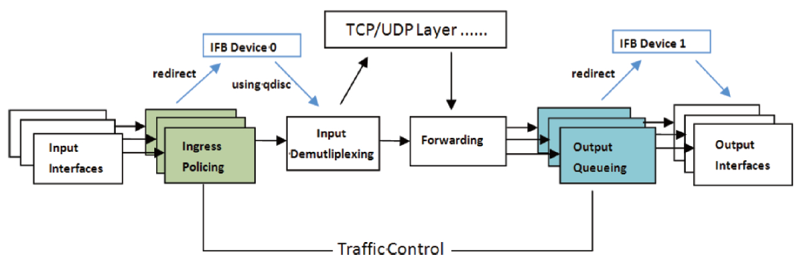
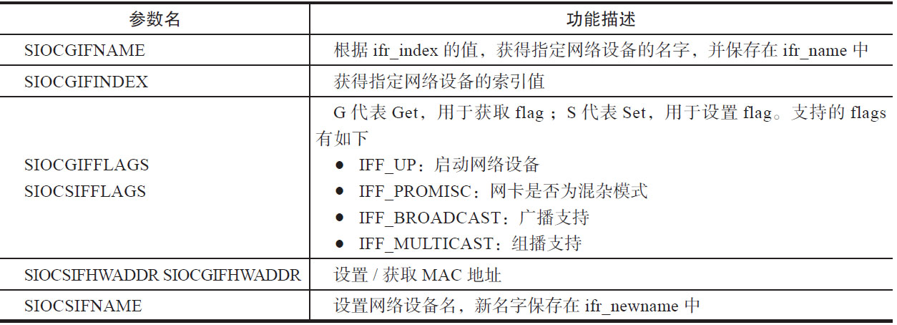
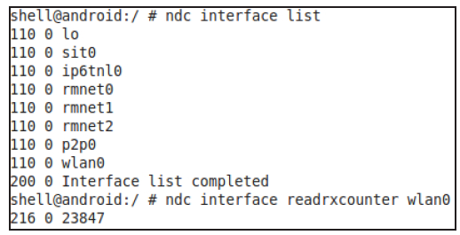
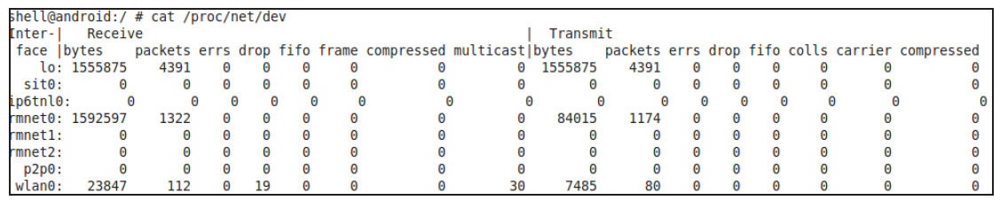

# 2.3.3 InterfaceCmd命令


InterfaceCmd用来管理和控制系统中的网络设备，其支持较多的控制选项。另外，InterfaceCmd除了和控制对象InterfaceControer交互外，还会和ThrottleControer、SecondaryTableControer交互。

InterfaceCmd涉及较多的背景知识，本节先集中介绍这部分内容。

1.背景知识介绍InterfaceCmd涉及三个重要知识点，分别是IFB设备、Netdevice编程和Linux策略路由管理。

[13]（1）IFB设备IFB（IntermediateFunctionalBlock）是IMQ（InterMediateQueuing）的替代者，二者都是Linux为更好地完成流量控制而实现的虚拟设备。相比IMQ而言，IFB的实现代码更少，对SMP（多核）系统支持的也更好。

为什么需要IFB设备呢？2.3.1节介绍tc命令的时候提到，Linux中丰富的流量控制手段和规则都是针对出口流量的，即大多数排队规则（qdisc）都是用于输出方向的。而输入方向主要是入口流量限制，只有一个排队规则，即ingressqdisc。有没有办法让输入流量也能像输出流量那样得到更多的控制呢？

于是，系统新增了一种方式，用于重定向incomingpackets。通过ingressqdisc把输入方向的数据包重定向到虚拟设备IFB，而在IFB的输出方向配置多种qdisc，就可以达到对输入方向的流量做队列调度的目的。

图2-15所示为加上IFB后整个流量控制示意图。系统中一共有两个IFB设备，IFBDevice0用于输入流量控制，IFBDevice1用于输出流量控制。



图2-15增加IFB设备后的流量控制[15]（2）Netdevice编程Netdevice是Linux平台中用于直接针对底层网络设备编程的一套接口，其使用方法很简单，就是利用socket句柄和ioctl函数来操作

```
#include ＜net/if.h＞
struct ifreq {
   char ifr_name[IFNAMSIZ];              // 指定要操作的NIC名
   union {// 一个联合体，可以设置各种参数
        struct sockaddr ifr_addr;        // 网卡地址
        struct sockaddr ifr_dstaddr;
        struct sockaddr ifr_broadaddr;   // 组播地址
        struct sockaddr ifr_netmask;     // 网络掩码
        struct sockaddr ifr_hwaddr;      // MAC地址
        short           ifr_flags;
        int             ifr_ifindex;
        int             ifr_metric;
        int             ifr_mtu;
        struct ifmap    ifr_map;
        char            ifr_slave[IFNAMSIZ];
        char            ifr_newname[IFNAMSIZ];
        char            *ifr_data;
        };
};
```

指定的网络设备。常用的数据结构如下所示。

```
int ifc_up(const char *name)
{
    // 要启动"ifb0"设备，name设置为"ifb0"
    int ret = ifc_set_flags(name, IFF_UP, 0);   // 设置IFF_UP参数
    return ret;
}
```

```
int ifc_init(void)                            // ifc是interface control的缩写
{
    int ret;
    if (ifc_ctl_sock == -1) {                   // 创建一个socket句柄
        ifc_ctl_sock = socket(AF_INET, SOCK_DGRAM, 0);
        ......// 错误处理
    }
    ret = ifc_ctl_sock ＜ 0 ? -1 : 0;
    return ret;
}
```

Netdevice支持一些特殊的ioctl参数，表2-2展示了几个常见的参数。

表2-2Netdeviceioctl参数说明



关于Netdevice的详细信息，读者可通过mannetdevice获得。Android为Netdevice编程提如果供要了启一动些某更个为N简IC单（的如A"PifIb，0"它设们备被）​，封装需在调libnetutils中，统称为ifc_utils，下面介绍其用ifc_up函数，其代码如下所示。

中的三个常用API。

[--＞ifc_utils.c：​：ifc_up]使用ifc_utils之前，需调用ifc_init进行初始化，其代码如下所示。

[--＞ifc_utils.c：​：ifc_init]

```c
static int ifc_set_flags(const char *name, unsigned set, unsigned clr)
{
    struct ifreq ifr;
    ifc_init_ifr(name, &ifr);       // 初始化ifr参数，把name复制到其ifr_name字符数组中
    // 先获取该NIC以前的flag信息
    if(ioctl(ifc_ctl_sock, SIOCGIFFLAGS, &ifr) ＜ 0) return -1;
    // 将新的flag加入到原有的flags中
    ifr.ifr_flags = (ifr.ifr_flags & (~clr)) | set;
    return ioctl(ifc_ctl_sock, SIOCSIFFLAGS, &ifr);// 将组合后的flag传递给Kernel
}
```

if相c比_u直p函接数使将用通Ne过td调ev用icifec来_s说et，_flAagnsd函ro数id并封传装递的IifFcF__uUtilPs来更启加动直对观应和的易设用备。，建if议c_s有et需_fl要ag的s的读代者码使如用下ifc所_u示til。s对NIC进行操作。

[--＞ifc_utils.c：​：ifc[1_s6e]​[t1_fl7]ags]（3）Linux策略路由策略路由是指系统依据网络管理员定下的一些策略对IP包进行的路由选择。例如网管可设置这样的策略：​“所有来自网A的包，选择X路径，其他选择Y路径”​，或者“所有TOS（TypeOfService，IP协议头的一部分）为A的包选择路径F，其他选择路径K”​。

从Kernel2.1开始，Linux采用了策略性路由机制。相比传统路由算法，策略路由主要引入了多路由表及规则的概念。

传统路由算法仅使用一张路由表。但在某些情况下，系统需要使用多个路由表。例如，一个子网通过一个路由器与外界相连。而该路由器与外界有两条线路相连，其中一条的速度较快，另一条的速度较慢。对于子网内的大多数用户来说，由于对速度没有特殊要求，可以让他们用速度较慢的路由；但是子网内有一些特殊用户对速度的要求较苛刻，他们需要使用速度较快的路由。很明显，仅使用一张路由表是无法实现上述要求的。而如果根据源地址或其他参数，对不同的用户使用不同的路由表，就可以实现这项要求。

传统Linux下配置路由的工具是route，而实现策略性路由配置的工具是iproute2工具包，常用的命令就是ip命令。

Linux最多可以支持255张路由表，其中有4张表是内置的。

❑表255：本地路由表（localtable）​。本地接口地址，广播地址和NAT地址都放在这个表中。该路由表由系统自动维护，管理员不能直接修改。

❑表254：主路由表（maintable）​。如果没有指明路由所属的表，所有的路由都默认都放在这个表里，一般来说，传统路由工具命令（如route）所添加的路由都会加到这个表中。一般是普通的路由。

❑表253：默认路由表（defaulttable）​。一般来说默认的路由都放在这张表，但是如果特别指明，该表也可以存储所有的网关路由。

❑表0：默认保留。

2.3.1节简单介绍了ip命令，ip命令的一些具体用法如下。

```c
// ①查看路由表的内容命令
ip route list table table_number
// ②对于路由的操作包括change、del、add、append、replace、monitor
// 向主路由表（main table）即表254添加一条路由，路由的内容是设置192.168.0.4成为网关
ip route add 0/0 via 192.168.0.4 table main
// 向路由表1添加一条路由，子网192.168.3.0（子网掩码是255.255.255.0）的网关是192.168.0.3
ip route add 192.168.3.0/24 via 192.168.0.3 table 1
```

在多路由表的路由体系里，所有的路由操作（如添加路由等）都需要指明要操作的路由表。如果没有指明路由表，系统默认该操作是针对主路由表（表254）开展的。而在单表体系里，路由操作无须指明路由表。

至此，分别介绍了IFB、Netdevice和Linux路由策略等背景知识。在接下来的分析中，读者将看到它们在InterfaceCmd中的应用。

2.InterfaceCmd命令选项InterfaceCmd支持较多命令选项，笔者将它们粗略地分为6类。

（1）NIC设备信息管理选项此类选项包括以下内容。

❑list：列举系统当前的网络设备。这是通过枚举/sys/class/net目录下的文件名而来。该目录下的文件（其实是一个设备文件）代表一



个具体的网络设备，例如eth0、lo等。/sys目录是Linux设备文件系统（sysfs）的挂载点，用于Linux统一设备管理之用。

❑read图rx2c-o1u7nlitsetr和和reraedardxtcxocuonutenrt结er果：这两个选项分别用于读取系统所有网络设备的接收图2-17展示了在GalaxyNote2中用ndc执行字节数和发送字节数等统计信息。它们都是通interfacelist和readrxcounter选项后的结过读取/proc/net/dev下的对应文件来实现果。其中最后一行，216为readrxcounter选的。

项对应的返回码，0为错误码，23847为图wla2n-106设所备示的为接G收a字lax节y数N。ot比e较2对图应2-文16件最的后内一容行。wl该an文0的件接显收示字了节系数统可所知有，网二络者设完备全的一收致发。字节数、包数、错误及丢包等各种统计信息。

（2）输入和输出流量控制选项



InterfaceCmd支持对指定网络设备设置流量阈值，其中包括如下。

图2-16/proc/net/dev文件内容❑gehrottle：throttle是节流之意，用于流量控制。该选项支持读取发送和接收阈值。不

```
#htb是Classful类qdisc的一种，属于tc命令中较为复杂的一种用法
tc qdisc add dev wlan0 root handle 1: htb default 1 r2q 1000
tc class add dev wlan0 parent 1: classid 1:1 htb rate 200kbit
#利用ifc_utils启动IFB0设备
tc qdisc add dev ifb0 root handle 1: htb default 1 r2q 1000
tc class add dev ifb0 parent 1: classid 1:1 htb rate 100kbit
tc qdisc add dev wlan0 ingress
tc filter add dev wlan0 parent ffff: protocol ip prio 10 u32 match \
  u32 0 0 flowid 1:1 action mirred egress redirect dev ifb0
```

过目前代码中这两个值都将返回0。

❑sehrottle：该选项的参数为sehrottleinterfacerx_kbpstx_kbps，用于控制网卡输入和输出流量。

由上述sehrottle的实现可知，其要完成的功能很简单（就是想对wlan0设备施加输入和输sehrottle的实现比较复杂，核心代码在出流量控制）​，但实现过程却比较复杂，使用ThrottleControer类的setInterfaceThrottle了tc命令的很多高级选项。

函数中。这部分代码充分利用了tc命令。以sehrottlewlan0100200为例，调用的命提示本书非专业的Linux网络管理书籍，故令顺序如下。

此处仅向读者展示这些命令。对其背后原理感兴趣的读者，不妨阅读本章参考资料中列出的书籍。

（3）Route控制选项InterfaceCmd支持路由控制，选项名为"route"。它支持对Route的添加、修改和

```
  ......// 略去部分代码
if (!strcmp(argv[1], "route")) {
     int prefix_length = 0;
     ......// 参数检测
     if (!strcmp(argv[2], "add")) {
         if (!strcmp(argv[4], "default")) {// 调用ifc_add_route为指定NIC设备添加路由
             ifc_add_route(argv[3], argv[5], prefix_length, argv[7]);
           }......// 错误处理
         } else if (!strcmp(argv[4], "secondary")) {// 对多路由表进行操作
                 return sSecondaryTableCtrl-＞addRoute(cli, argv[3], argv[5],
                               prefix_length, argv[7]);
             }......// 错误处理
     }
     ......// 处理删除、修改等
}
```

删除。另外还支持对多路由表的配置。相关代码如下所示。

[--＞CommandListener：​：

由上述代码可知：

InterfaceCmd：runCommand]❑当添加的是默认路由时，直接调用ifc_add_route函数为指定设备添加一个路由。该功能的实现利用了多种ifc_utils的ifc_add_route函数（也就是基于Netdevice封装的API）​，对应的IOCTL参数为SIOCADDRT。请读者自行研究该函数的实现。

❑如果是针对多路由表的"secondary"，则使用SecondaryTableCtrontroer的addRoute函数来添加路由。该函数中，SecondaryTableCtrl首先会计算一个Table索引，然后利用ip命令将路由添加到对应的

```
int SecondaryTableController::modifyRoute(SocketClient *cli,
        const char *action, char *iface,
        char *dest, int prefix, char *gateway, int tableIndex) {
    char *cmd;
    if (strcmp("::", gateway) == 0) {
         asprintf(&cmd, "%s route %s %s/%d dev %s table %d",
                IP_PATH, action, dest, prefix, iface,
                tableIndex+BASE_TABLE_NUMBER);
    } else {
        // 调用ip route命令的参数
        asprintf(&cmd, "%s route %s %s/%d via %s dev %s table %d",
                IP_PATH, action, dest, prefix, gateway,
                iface, tableIndex+BASE_TABLE_NUMBER);
    }
    if (runAndFree(cli, cmd)) {
        ......// 错误处理
        return -1;
    }
    // SecondaryTableControl对各个Table表的使用都有计数控制。请读者自行阅读相关代码
    ......// 略去相关代码
    modifyRuleCount(tableIndex, action);
    cli-＞sendMsg(ResponseCode::CommandOkay, "Route modified", false);
    return 0;
}
```

```c
ip route add 192.168.0.100/24 via 192.168.0.1 dev wlan0 table 78 #使用路由表78
```

Table中。

addRoute的核心是调用modifyRoute，其代码如下所示。

[--＞SecondaryTableControer.cpp：​：

modifyRoute]上述代码中，以wlan0为例，对应的ip命令情况如下。

（4）Driver控制选项该选项的名为"driver"，由InterfaceControer加载/system/lib/libnetcmd.so对Kernel中的Driver进行控制。而针对Driver操作的API由InterfaceControer的interfaceCmd来完成。

[--＞InterfaceControer.cpp]

```cpp
char if_cmd_lib_file_name[] = "/system/lib/libnetcmdiface.so";
char set_cmd_func_name[] = "net_iface_send_command";
char set_cmd_init_func_name[] = "net_iface_send_command_init";
char set_cmd_fini_func_name[] = "net_iface_send_command_fini";
```

InterfaceControer构造时会加载libnetcmdinface.so，然后获取上面三个函数的指针。这三个函数用于直接向驱动发送命令。由于代码中没有任何说明，而且也没有地方用到它，故读者仅简单了解即可。

提示笔者认为libnetcmdiface的目的应该是支持某些网络设备生产厂商（如Broadcom）特有的一些命令选项。由于厂商的这些特殊选项不通用，它们不能向其他命令选项一样在代码中被列举出来。

另外，根据本书审稿专家的反馈，在实际产品中不存在libnetcmdiface.so文件。对博通公司的芯片而言，其私有命令的代码在hardware/broadcom/wlan/bcmhdh/wpa_supplicant_8_lib中，对应的库文件为lib_driver_cmd_bcmdhd.so。

（5）IFC设备控制选项IFC设备控制选项主要是利用ifc_utilsAPI对设备进行管理和控制，例如获取某个设备的配置信息、启动某个设备、配置某个设备的MTU等。主要利用上文介绍的IFC接口对设备进行控制，例如启动、设置MTU等。本节仅给出利用getcfg选项查询wlan0网络设备配置情况的示意图，如图2-18所示。

图2-18getcfgwlan0结果图2-18显示了GalaxyNote2打开Wi-Fi后wlan0设备的配置信息，其中：

❑90：18：7c：69：88：e2为该设备的MAC地址。

❑192.168.1.101和24为IP地址以及子网掩码（255.255.255.0）​。

❑up、broadcast、running和multicast表示该设备当前已经启动并正在运行，并支持广播和组播。

[18]（6）IPv6控制选项InterfaceCmd支持两个IPv6选项。

❑ipv6privacyextensions：用于控制网卡使用临时IPv6地址的情况。该功能需要要3.0以上的kernel控制方法就是向/proc/sys/net/ipv6/网卡名/conf/use_tempaddr写入对应的值。值为0表示不允许IPv6临时地址，值为2表示优先使用临时IP地址，值为1则表示优先使用非临时IP地址。

❑ipv6：用于启动或禁止网卡的IPv6支持。

往/proc/sys/net/ipv6/网卡名/conf/disable_ipv6中写入0或1即可。

2.3.4IpFwd和FirewaCmd命令本节将介绍IpFwd和FirewaCmd两个命令。

1.IpFwd命令IpFwd命令比较简单，主要是控制内核ipforward功能，其支持三个选项。

❑status：用于判断ipforward功能是否开启。

❑enable和disable：分别用于启动和禁止ipforward功能。

上述功能借助TetherControer控制对象来完成，其内部代码非常简单，就是通过读写/proc/sys/net/ipv4/ip_forward文件来实现对内核ipforward功能的管理。
