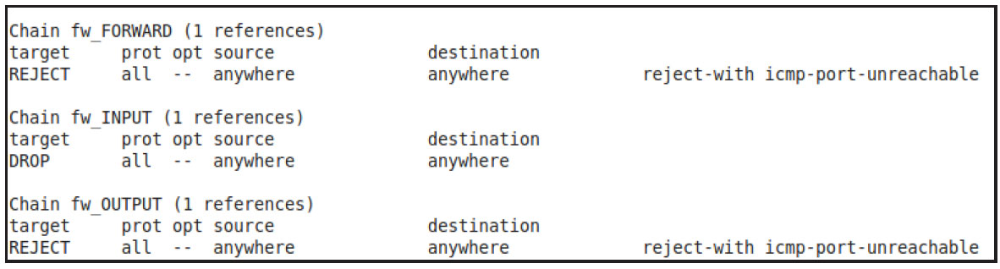
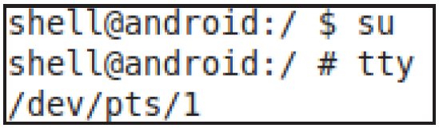

# 2.3.4 IpFwd和FirewallCmd命令


提示读者可上网搜索/proc/sys/net/ipv4目录下其他文件的作用。

2.FirewaCmd命令FirewaCmd用于防火墙控制。它支持以下命令选项。

❑enable和is_enabled：用于启动防火墙和判断防火墙是否已经启动。

❑set_interface_rule：针对单个或多个NIC设备设置防火墙规则。

❑set_egress_source_rule和set_egress_dest_rule：基于源IP和目标IP地址设置防火墙。

❑set_uid_rule：根据uid设置单个进程的防

```
int FirewallController::enableFirewall(void) {
    int res = 0;
    // 先清空fw_INPUT/fw_OUTPUT/fw_FORWARD链中的规则
    disableFirewall();
    // 启动防火墙就是设置Filter表中fw_INPUT/fw_OUTPUT/fw_FORWARD的目标为DROP和REJECT
    res |= execIptables(V4V6, "-A", LOCAL_INPUT, "-j", "DROP", NULL);
    res |= execIptables(V4V6, "-A", LOCAL_OUTPUT, "-j", "REJECT", NULL);
    res |= execIptables(V4V6, "-A", LOCAL_FORWARD, "-j", "REJECT", NULL);
    return res;
}
```

火墙。

下面重点介绍防火墙功能的启动以及如果针对单个进程的设置防火墙规则。

（1）启动防火墙本节介绍enable和set_uid_rule。其中，enable将调用FirewaCtroner的enableFireWa函数，代码如下所示。

[--＞FirewaControer.cpp：​：

enableFirewa]由上述代码可知，当启动防火墙时，filter表中三个用于防火墙控制的Chain的目标都改为DROP或REJECT，这样系统就无法收发网络数据包。图2-19所示为笔者在Ubuntu机器上设置的规则。



图2-19enable防火墙图2-19所示是利用Ubuntu机器模拟enableFirewa函数后的结果。防火墙启动后，机器就无法连接网络了。

读者可能好奇，为什么enableFirewa的破坏作用如此之大？这是因为防火墙设置一般有两种方法。

❑先允许整个系统都能上网，然后再单独设置防火墙规则以禁止某些模块连接网络。

❑先禁止整个系统上网，然后再单独设置防火墙规则以允许某些模块能连接网络。

由此可知，Android采用了第二种更为严厉的方式来设置防火墙。接下来的工作就需要设置各种防火墙规则以允许某些程序能够上网了。

本节讨论如何为单个进程设置防火墙规则。

提示采用Ubuntu来测试enableFirewa，

```
int FirewallController::setUidRule(int uid, FirewallRule rule) {
    char uidStr[16];
    sprintf(uidStr, "%d", uid);
    const char* op;
    if (rule == ALLOW) {
        op = "-I";
    } else {
        op = "-D";
    }
    int res = 0;
    res |= execIptables(V4V6, op, LOCAL_INPUT,"-m", "owner",\n"--uid-owner", uidStr,"-j", "RETURN", NULL);
    res |= execIptables(V4V6, op, LOCAL_OUTPUT, "-m", "owner",\n"--uid-owner", uidStr,"-j", "RETURN", NULL);
    return res;
}
```

因为模拟器和主机也使用socket通信，一旦启动防火墙，主机就无法再使用adbshe来控制模拟器了。

（2）设置进程防火墙本节介绍的针对单个应用程序设置其防火墙规则，是大部分软件管家禁止某些应用程序上网的通用方法。代码在setUidRule函数中，如下所示。

该函数很简单，就是调用正确的iptables命令，它们分别如下。

[--＞FirewaControer.cpp：​：setUidRule]

```cpp
iptables -I FORWARD_INPUT -m owner --uid-owner uid -j RETURN
iptables -I FORWARD_OUTPUT -m owner --uid-owner uid -j RETURN
```

这里要特别指出的是，目前Android只能根据uid来区分进程。由于Android平台允许不同应用程序共享同一个uid。多个应用程序共享同一个uid的情况下，如果用户禁止了其中一个应用程序（软件管家的防火墙控制允许用户选择是否禁止某个应用程序上网）​，则连带其他的相关程序都不能上网，虽然用户并没有选择禁止其他应用程序。

提示笔者测试了360安全卫士，当出现上述关联情况时，它能提醒用户哪些关联程序也会被一并禁止上网。

2.3.5ListTtysCmd和PppdCmd命令ListTTysCmd和PppdCmd比较简单，但也涉及两个重要的背景知识。

1.背景知识介绍本节介绍的两个背景知识点是TTY和ptmx编程，以及PPP和pppd。

[19]​[20]（1）TTY和ptmx编程TTY是Linux系统（更确切地说是UNIX）中终端设备的统称，该词源于TeleTYpewriter（电传打字机）​，是一个通过串行线用打印机键盘通过阅读和发送信息的设备。不过随着计算机技术的发展，这类设备早就被键盘和显示器替代了。

从现在的情况来看，Linux系统中的TTY设备包含许多类型的设备，它们大体可分为以下三种。

❑串行端口终端：这类设备一般命名为/dev/ySn，n为索引号，例如yS0、yS1等。它们类似于Windows系统的COM0、COM1等，代表串行端口。当某个应用往yS0写入数据时，另一个应用就能从yS0读到对应的数据。

❑伪终端（psuedoterminal）：这类设备成对出现，其中一个是master设备，另一个是slave设备。二者的关系类似管道（Pipe）​，当一个程序往slave设备写数据时，另外一个打开master设备的程序就能读到数据。以前（UNIX98scheme之前）主从设备命名方式为/dev/ptyp0和/dev/yp0。

现在master设备命名为/dev/ptmx，而slave设备则对应/dev/pts/目录下的文件名。

❑控制台终端：这类设备命名从/dev/yN（N从1～64）和/dev/console。/dev/y0代表当前使用的终端，而/dev/console一般指向这个终端。例如初始化时登录系统用的是/dev/y2，那么/dev/y0指

```
主从两端要包含头文件：一般是在两个有亲缘关系的父子进程中使用
#include＜stdlib.h＞
主端需要打开/dev/ptmx设备，得到一个文件描述符
从端在使用这个文件描述符前，需要调用grantpt以获取权限，然后调用unlockpt解锁
从端通过ptsname获得从端设备文件名
从端打开由ptsname得到的从端设备
```

向/dev/y2，如果切换到/dev/y1，则/dev/y0就指向/dev/y1了。

通过adbshe登录手机时，其实使用的都是伪终端。图2-20所示为笔者用adbshe登录GalaxyNote2后用y命令打印的输出。



图2-20y命令对程序员来说，Linux提供了针对伪终端的编程接口。伪终端在概念上和管道没有太大区别，但是在实际操作时有一些特殊API需要调用。

```
int logwrap(int argc, const char* argv[])
{
    pid_t pid;
    int parent_ptty;
    int child_ptty;
    char child_devname[64];
    // 父进程打开/dev/ptmx
    parent_ptty = open("/dev/ptmx", O_RDWR);
    ......
    // 父进程解锁/dev/ptmx。ptsname_r将得到从端设备的名字，例如/dev/pts/1
    if (grantpt(parent_ptty) || unlockpt(parent_ptty) ||
           ptsname_r(parent_ptty, child_devname, sizeof(child_devname))) {
         // ptsname_r是ptsname的可重入（Reentrant，可用于多线程环境）版本
         ......// 错误处理
    }
    pid = fork();
    if (pid ＜ 0) {
     ......// 错误处理
    } else if (pid == 0) {
        // 子进程打开从端设备
        child_ptty = open(child_devname, O_RDWR);
        // 关闭从父进程那继承到的主设备文件
        close(parent_ptty);
        dup2(child_ptty, 1);// 重定向标准输入、输出、错误输出到伪终端的从设备
        dup2(child_ptty, 2);
        close(child_ptty);
        child(argc, argv);                      // 执行child函数
    } else {
        int rc = parent(argv[0], parent_ptty);  // 父进程执行parent函数
        close(parent_ptty);
        return rc;
    }
    return 0;
}
```

Netd中的logwrap将使用伪终端在父子进程中传递log信息。代码如下所示。

[--＞logwrap.c]为什么Netd要使用这种一般很少用的ptmx伪终端呢？结合代码中的注释，笔者认为原因有以下两个。

❑后文会介绍，Netd将fork很多子进程以执行各种任务，而这些进程的代码一般都直接来自于已有的开源代码。它们没有采用Android的ALOG宏来记录日志。所以，采用这种I/O重定向方法，这些进程的输出将全部传递到Netd进程中来。而Netd进程是可以使用ALOG宏来打印输出的。上述代码中的parent函数将一直读取/dev/ptmx的内容，然后通过ALOG宏输出。

❑使用伪终端来承担父子进程通信重任（还可以使用别的进程间通信手段例如socketpair、pipe等）的另一个原因是伪终端不会缓存数据。例如一旦子进程往从设备中写入数据（借助I/O重定向，当子进程往标准输出中写数据时，其实是往从设备中写数据）​，父进程就能读到它们。

[21]​[22]​[23]​[24]（2）PPP和pppdPPP（Point-to-PointProtocol，点对点协议）是为在同等单元之间传输数据包这样的简单链路设计的链路层协议。这种链路提供全双工操作，并按照顺序传递数据包。设计目的主要是通过拨号或专线方式建立点对点连接发送数据，使其成为各种主机、网桥和路由器之间简单连接的一种共通的解决方案。

PPP提供了一整套方案来解决链路建立、维护、拆除、上层协议协商、认证等问题，它主要包含以下几个部分。

❑链路控制协议（LinkControlProtocol，LCP）：负责创建、维护或终止一次物理连接。

❑网络控制协议（NetworkControlProtocol，NCP）：包含一簇协议，负责解决物理连接上运行什么网络协议，以及解决上层网络协议发生的问题。

❑认证协议：最常用的包括口令验证协议（PasswordAuthenticationProtocol，PAP）和挑战握手验证协议（Chaenge-HandshakeAuthenticationProtocol，CHAP）​。使用时，客户端会将自己的身份发送给远端的接入服务器。期间将使用认证协议避免第三方窃取数据或冒充远程客户接管与客户端的连接。

pppd（PPPDaemon的缩写）是运行PPP协议的后台进程。它和Kernel中的PPP驱动联动，以完成在直连线路（DSL、拨号网络）上建立IP通信链路的工作。读者可简单认为有了pppd，就可以在直连线路上传输IP数据包（类似以前我国大部分家庭用Modem和电话线上网）​。

2.ListTTysCmd和PppdCmd命令分析这两个命令非常简单，ListTtysCmd用于枚举系统中所有的y设备，这是通过列举/sys/class/y目录中以y开头的文件名来完成的。

PppdCmd仅有aach和detach两个选项。其中，aach用于启动pppd进程，而detach用于杀死pppd进程。代码在PppControer的aachPppd和detachPppd函数中，请读者自行阅读。

PppControer启动pppd时传递的启动参数如下所示。

```c
pppd -detach  \#启动后转成后台进程
devname\ #使用devname这个设备上链接到另一端的设备
115200\  #波特率设置为115200
iplocal：ipremote  \  #设置本地和远端IP
ms-dns  d1  \#为运行在windows的程序配置dns地址，第一个是主dns的地址
ms-dns   d2  \#第二个是从dns的地址
lcp-max-configure 99999  #这里设置LCP config request最大个数为99999
```

配置并启动pppd后，手机就相当于一个Modem了，是不是很神奇呢？

2.3.6BandwidthControlCmd和IdletimerControlCmd命令本节介绍BandwidthControlCmd（简称bwcc）和IdletimerControlCmd（简称icc）​。这两个命令都利用了iptables的扩展模块，所以相应功能基本上完全是靠iptables来实现的。

1.BandwidthControlCmd命令bwcc用于Android系统中的带宽控制。目前4.2系统中的带宽控制可针对设备、某个应用。另外还可以设置预警值，当带宽使用超过该值时会收到相应的通知（见2.2.2节中的NETLINK_NFQLOG）​。

和流量控制类似，带宽控制的实现也是利用
