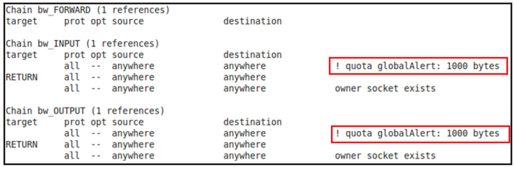
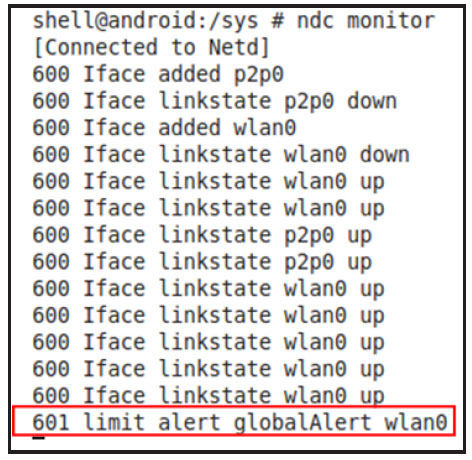

# 2.3.6 BandwidthControlCmd和IdletimerControlCmd命令


iptables。它利用了iptables中扩展模块libxt_quota2的功能，属于iptables的高级用法。这些内容对于非从事网络管理专业工作的人来说难度相当大。考虑到这个因素，本节将把bwcc当做一个黑盒，仅介绍其提供的各项功能。想深入研究的读者可在此基础上结合参考资料进一步了解。

bwcc提供的选项如下。

❑enable和disable：开启或关闭带宽控制。

❑removequota、getquota、getiquota、setquota、setquotas、removequotas、removeiquota：删除、查询和添加带宽配额。选项中的'i'针对一个或多个interface。选项中的's'代表该选项可携带多个interface参数。

❑addnaughtyapps和removenaughtyapps：以uid为目标，开启或关闭单个进程的带宽控制。

❑setglobalalert、removeglobalalert、setsharedalert、removesharedalert、setinterfacealert、removeinterfacealert：

预警值添加/删除有关。可以设置全局（即所有网络接口，例如Wi-Fi、3G等）带宽预警值，或者单个设备（如仅针对wlan0）的带宽预警值。

❑geetherstats：获取绑定（Tether）设备的数据统计。后文将介绍Tether的相关知识点。

图2-21所示为利用ndc命令为GalaxyNote2setglobalalert后的结果。图中为bwcc设置了全局配额是1000字节，当使用测试机下载数据超过1000字节时，将得到如图2-22所示的警告消息。



图2-21bwccsetglobalalert结果



图2-22ndcmonitor得到的警告消息图2-22所示最后一行打印了来自Kernel的qlogUEvent消息，以通知在wlan0设备上数据流量已超过配额。

提示bwcc应该是Netd中难度最大的模块了，其难点是如何利用iptables进行带宽控制。相比其内部实现而言，掌握bwcc的功能对绝大多数Android开发者来说也许更加实用。

2.IdletimerControlCmd命令icc利用了iptables另一个扩展模块libxt_idletimer，其对应的iptables命令格式如下。

```
iptables -t raw -A idletimer -i nic -j IDLETIMER --timeout --label lable --send_nl_msg 1
```

其中，各个参数的含义如下。

❑timeout：超时时间，单位是秒。

❑label：用来标示该rule的唯一名字。

❑send_nl_msg：如果超时，则通过/sys/net/xt_idletimer触发UEvent消息（回顾2.2.2节中关于"xt_idletimer"UEvent消息的介绍）​。

提示奇怪的是，笔者在模拟器和GalaxyNote2上利用ndc测试icc命令均不能添加超时规则。而同样的命令放到Ubuntu12.04上却工作正常（但Ubuntu上的iptable却不支持--send_nl_msg选项）​。

看来这个新颖的功能在目前的系统中支持得还不够好。
